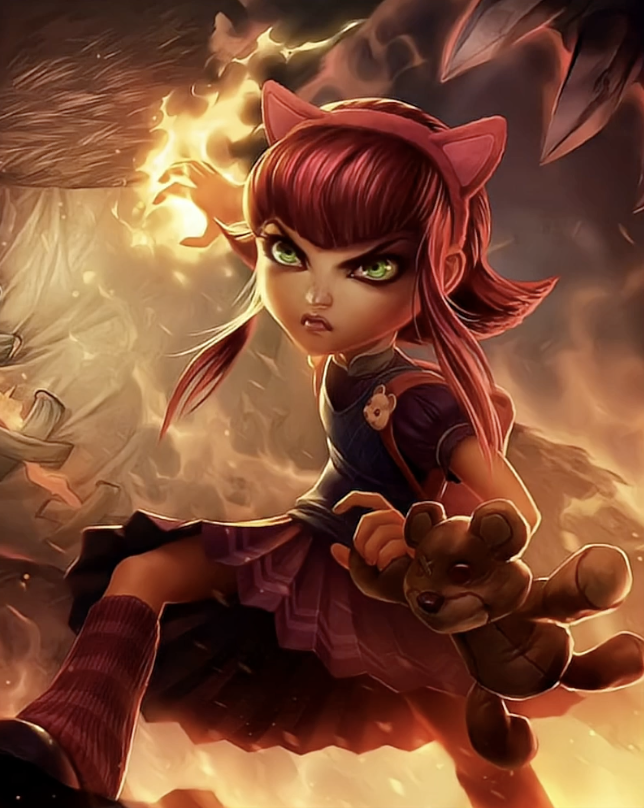
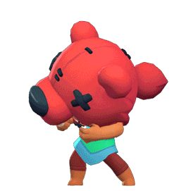
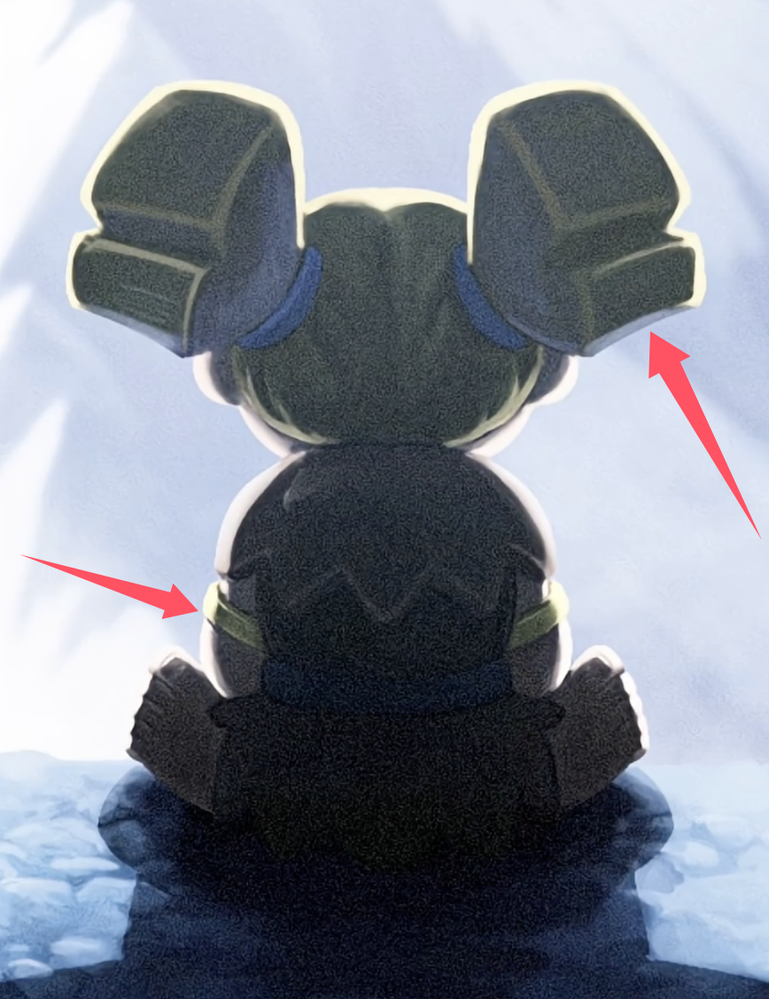

皇室战争这几天的下赛季预热，信息量开始有点大了。

先是狂战士坐在山洞口，配文“她受够了”。然后是野蛮人精锐在镜子前秀肌肉，配文“一如既往，尽显精锐风范”。接着官方又丢了一张金色斧子的图，文案是“旋转赢取”。

单看每一张图，都像是在玩梗。三张连起来看，就很像在预告 8 月主题季的新 **精英** 和 **觉醒**。

当然了，目前这些都还是预热图，不是正式公告。下面我们来汇总一下，权当是来玩一下猜谜游戏。

## 狂战士大概率是精英

第一张图最明显。

小人坐在山洞口，背后是雪山，头发轮廓和坐姿都很像狂战士。这个其实不算难猜，因为狂战士本来就有“山里来的小个子狂暴战士”那种味道。

更关键的是地上的影子。

这个影子太大了，明显不是普通投影。它看起来像某种怪物形态，或者一个会被召唤出来的大单位。所以现在比较常见的说法有三个：

- 狂战士自己变身。
- 狂战士召唤一个怪物。
- 其实不是狂战士，而是在暗示觉醒戈仑石人。

譬如撸啊撸里的安妮？

又譬如荒野乱斗里的妮塔？

我个人还是更倾向前两个，尤其是 **狂战士精英**。

原因很简单：如果把图片放大、提亮，会看到狂战士身上有一圈金色轮廓，手上也像是有金环。皇室战争现在的精英预热，经常会用这种金色视觉符号。再加上“她受够了”这句文案，本身就很像在暗示主动爆发。

如果真是精英狂战士，那技能大概不会只是加一点伤害。更有可能是短时间暴走、变身，或者把影子里的那个东西叫出来。换句话说，她可能不再只是 2 费小单位，而是带一个需要玩家主动释放的节奏点。

## 我大精锐要觉醒了？

第二张图乍一看很像官方继续玩梗。

野蛮人精锐一直是皇室战争里最有梗的卡之一。之前官方还发过“世界杯金凉鞋奖”的图，所以这张健身房照，第一反应确实像是在接着玩精锐肌肉梗。

但仔细看镜子里左边那个倒影，就不太对劲了。

镜子里的护腕是紫色的，和觉醒野蛮人的护腕很像。再看武器，似乎也不是普通野蛮人精锐手里的剑，更像一根长矛，或者某种被改过的武器。

这就很像在暗示：**野蛮人精锐要觉醒了。**

这就很令人期待了，毕竟精锐可是等压利器呐，哈哈哈。不知道官方会不会偷懒直接把混沌模式的长矛搬过来呢？

当然，也有一个绕不开的可能：镜子本身就是重点。

皇室战争官方很会误导玩家。如果最后不是野蛮人精锐觉醒，而是 **镜像觉醒**，也不是完全说不通。只是从画面里的紫色护腕和武器变化来看，目前野蛮人精锐觉醒的指向更强。

## 这把斧子到底是谁的？

第三张图就更有意思了。

一把发着金光的斧子，配文“旋转赢取”。看到“旋转”和“斧子”，很多人第一时间会想到女武神。女武神的招牌动作就是旋转攻击，而且斧子也对得上。

也有人会想到屠夫。毕竟屠夫也是斧子相关单位，而且“扔出去再回来”的武器机制，本来就很适合做新效果。

但是我觉得女武神和屠夫可能性不大啊。

原因是皇室战争一个赛季通常不会塞太多新东西。现在前两张图已经很像一个精英、一个觉醒了，再来一个女武神精英，节奏上有点太满。除非 8 月赛季是一个特别大的主题季，否则更合理的解释是：这把斧子可能是前面某个线索的一部分，譬如是小雨姐的新武器？或者小雨姐召唤怪物的武器？

## 目前最合理的猜测

如果只按这三张图来猜，我会这样排：

第一，**狂战士精英**。山洞、背影、金色轮廓、巨大影子，这几个点加起来太像精英预热了。

第二，**野蛮人精锐觉醒**。镜子里的紫色护腕非常关键，而且官方文案也在刻意强调“精锐”。

第三，**斧子图不是单独第三张新卡，而是同一组预热里的补充线索**。譬如是小雨姐的武器或者其召唤物的武器。

最有意思的是，如果狂战士精英和野蛮人精锐觉醒同时来，8 月主题季估计是近战主题了。再结合前面已经公布的 8 月平衡性调整，官方明显在为下赛季重整环境。

## 结论

现在我最相信的版本是：**下赛季一个精英给狂战士，一个觉醒给野蛮人精锐。**

斧子图看起来像第三条线索，但我更愿意把它当成前两条预热的一部分。毕竟一赛季通常就是一个主精英、一个主觉醒，官方连续发图，不一定代表每张图都对应一张新卡。

接下来几天重点看官方还会不会继续发武器、护腕、技能按钮或者紫色觉醒特效。只要出现其中一个，这次 8 月主题季的答案应该就差不多了。

参考来源：

- 皇室战争官方 X 账号近期预热图：[Clash Royale on X](https://x.com/ClashRoyale)
- 相关阅读：[狂战士要爆了？皇室战争官方新图疑似预告 8 月新精英或觉醒](/posts/clashroyale/2026-07-24/berserker-august-season-teaser/)
