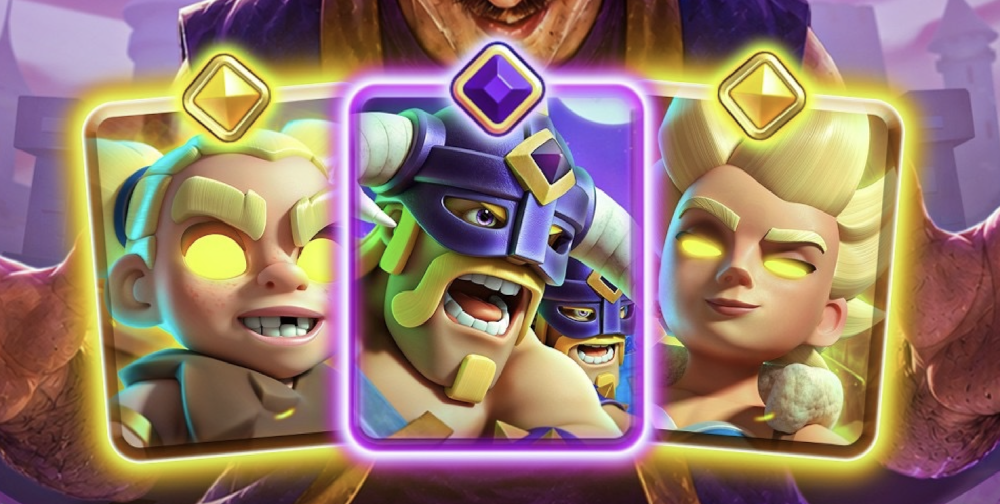
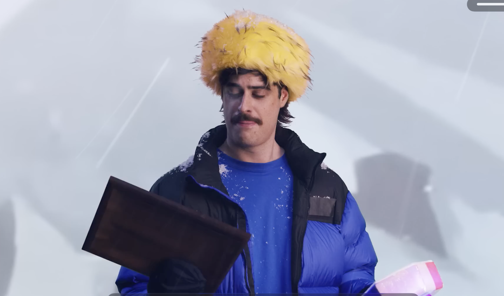
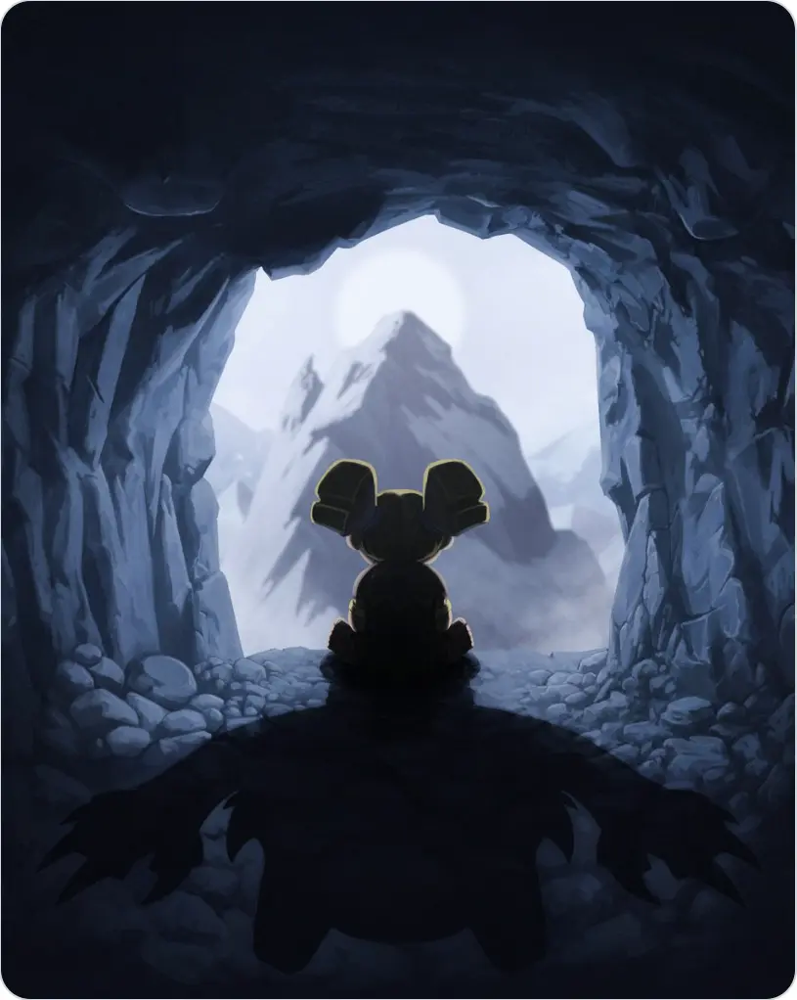
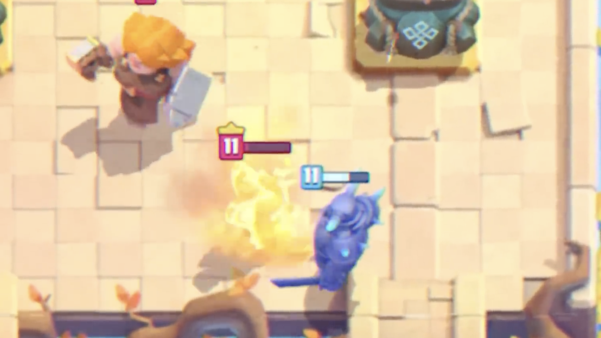
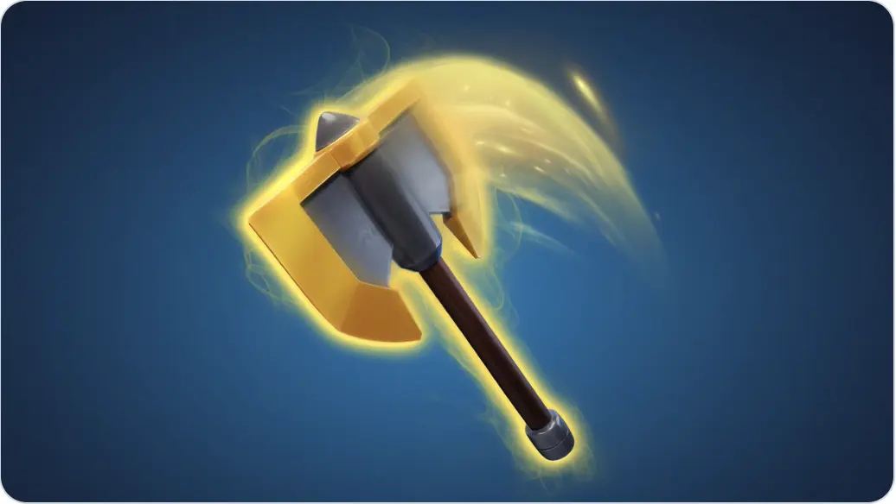
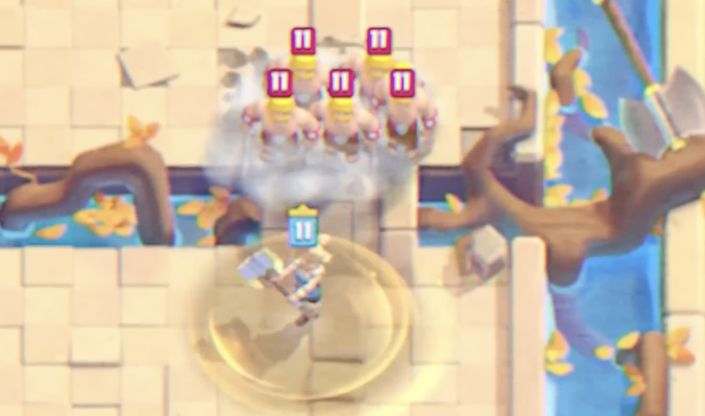
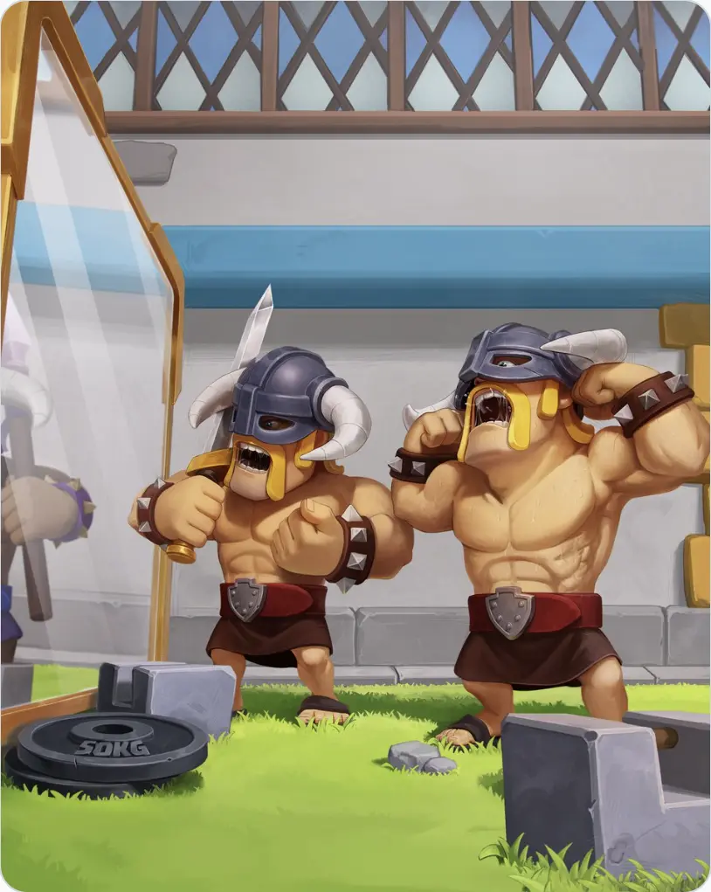
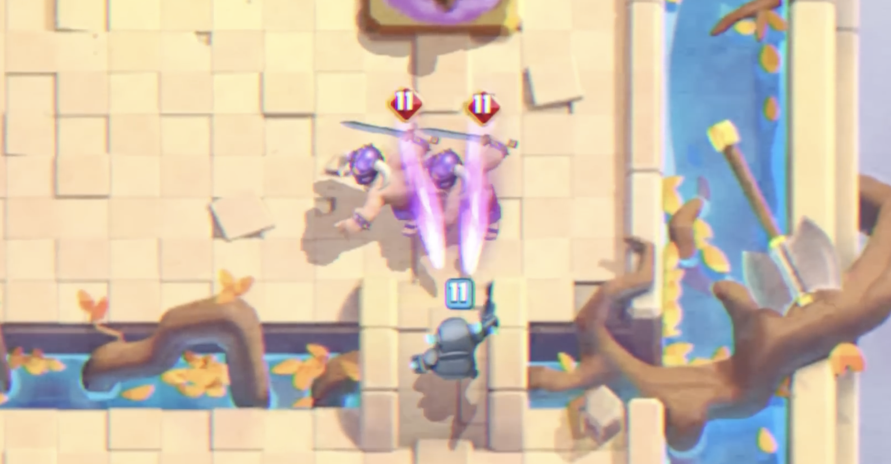
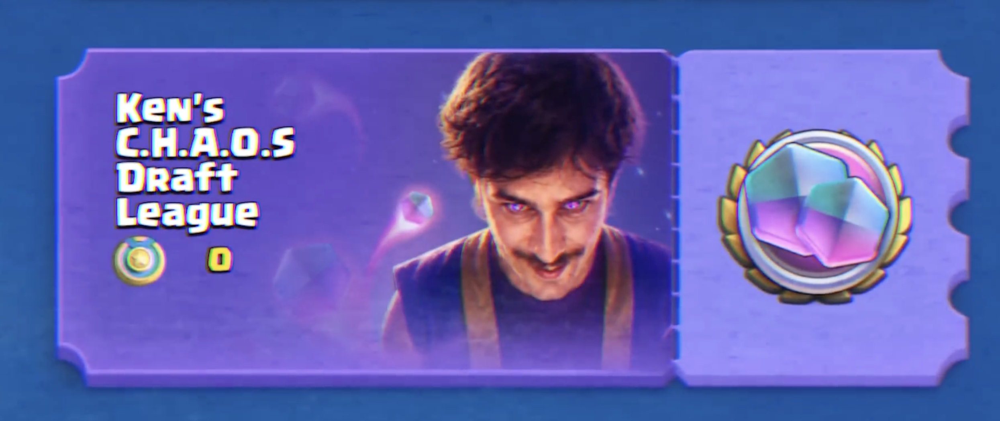

皇室战争今天这期 TV Royale，把前几天的预热图答案基本都揭开了。

我们之前猜的方向大体没跑偏：8 月赛季会有 **两位精英、一张觉醒**。两位精英是 **精英狂战士** 和 **精英瓦基丽武神**，觉醒卡是 **觉醒野蛮人精锐**。唯一万万没想到的是竟然真的有精英瓦基里啊，看来是取消了 17 级不好圈了，得快出猛出多出精英大人啊！

这期 TV 还迎来了一位嘉宾，是 Ken 回来了。老玩家应该对他不陌生，他以前是皇室战争非常有名的 YouTube 创作者，后来很长时间没有继续做皇室内容。这次不只是回到 TV Royale 里客串，下赛季的 K.H.A.O.S 混沌玩法也直接和他绑定。

## 精英狂战士：山洞里的怪物真出来了

前几天官方发的山洞图，现在回头看就很直白了。

Ken 在 TV Royale 里走进那个山洞，找的就是小狂战。这个场景也很眼熟，之前符文巨人出场时，小狂战就在后面的山洞里。官方这次等于是把前面的伏笔接上了。

精英狂战士的技能重点有三条：

- 进入完全狂暴模式。
- 化身为守护灵兽，攻速提高
- 技能期间生命值不会掉到 1 以下，也就是不会被消灭。

看上去是不是很眼熟？这不是撸啊撸的蛮王么？

不过 TV 里没有说技能到底要花多少圣水，也没有说持续多久。狂战士本体只有 2 费，如果技能便宜、持续时间又长，估计又会出很多抽象速转卡组。

## 精英瓦基丽武神：这次真是旋风斩

第二位精英是瓦基丽武神。

之前那张金色斧子图，很多人第一反应就是女武神，现在答案也对上了。TV Royale 里的精英瓦基丽武神造型变化很大，看起来更像一个暗黑风格的旋风战士。

她的技能也很直接：开技能之后移动速度提升，发现敌方单位就会旋转冲过去，在身边造成范围伤害。打完一个目标，还会继续找下一个目标。

普通女武神强在近身范围解场，但她最大的问题是摸不到远一点的目标。精英瓦基丽武神等于是把这个短板补上了：只要场上有单位，她就能靠旋风斩不断贴过去。

当然她不是无敌的。TV 里明确提到，瓦基丽武神在旋风攻击时仍然会受到伤害，也可能被消灭。如果没有新的可冲刺目标，她就不会一直追人，而是停在原地转。

所以她强不强，最后还是看技能费用、持续时间、冲刺距离和目标选择。单看演示，我觉得她的威胁感甚至比精英狂战士更高。

## 觉醒野蛮人精锐：混沌模式技能搬进来了

第三张是大家非常熟悉，也非常容易让人血压变化的卡：野蛮人精锐。

前几天那张镜子图里，倒影的紫色护腕已经很像觉醒标记了。TV Royale 这次确认，确实是觉醒野蛮人精锐。

它的机制和之前猜得差不多：觉醒精锐不只会冲向皇家塔，还会向军队和皇家塔扔出带怒气的标枪，在地上留下狂暴尾迹，然后沿着尾迹冲锋。

这就不是单纯“跑得更快、伤害更高”的觉醒了。它会改变精锐的进场方式，也会让对手更难用普通拉扯处理。

如果标枪能稳定打到后排，或者狂暴尾迹能让后续冲锋更快，觉醒精锐会非常烦。好消息是 TV 里也没有公布完整数值，现在还不能直接判断它会不会超标。

## 免费获取

这次获取方式还算舒服。

TV Royale 明确说，**精英瓦基丽武神将通过皇室令牌获取**。这基本符合现在新精英的常规节奏。

更重要的是：**精英狂战士和觉醒野蛮人精锐可以免费获得。**

其中精英狂战士会出现在 Ken 的混沌试炼选卡联赛奖励里。觉醒野蛮人精锐则需要玩家去 Ken 的商店看看。也就是说，下赛季就算不买令牌，也有机会拿到两张很重要的新内容。

## 混沌模式的新玩法

8 月不是普通主题季，官方自己都在 TV 里说了：这不是主题季，而是一片混乱。

下赛季会有 **Ken 的混沌试炼选卡联赛**。规则大概是：你先选 4 张卡，另外 4 张受对手选择影响，和常规选卡模式有点像；选卡结束后，还能选择自己的第一个随机事件，然后进入混沌对局。

这个联赛会有两周天梯赛季，奖励里包含免费的精英狂战士。

除了这个核心玩法，还会有几种混沌试炼模式上线：

- 卡牌三选一
- 仅限史诗卡
- 突然死亡
- 无限圣水

另外，自定义锦标赛和友谊战也会加入混沌试炼模式。这个改动挺适合做内容，也适合部落和朋友之间整活。以前混沌模式更多像赛季活动，这次官方明显想把它做成一个更完整的玩法框架。

## 下赛季会怎么影响环境？

如果只看 TV 展示，8 月环境大概率会偏近战、偏压迫。

精英狂战士有“不死到 1 血”的技能窗口，很适合反打和桥头压迫。精英瓦基丽武神能追着单位旋转，可能会让很多铺场和中小型后排很难受。觉醒野蛮人精锐又是典型的进攻型觉醒，一旦对手没处理好，可能直接被一波冲穿。

但现在还不能急着说哪张一定超标。

精英卡最关键的是技能费用和冷却，觉醒卡最关键的是循环条件和数值。TV Royale 主要展示机制，不会把所有平衡参数讲完。等正式更新说明出来，再判断哪些卡组值得练，会更稳。

我现在比较关心三件事：

- 精英狂战士技能要几费，持续多久。
- 精英瓦基丽武神的冲刺距离和索敌规则有多宽。
- 觉醒野蛮人精锐的标枪伤害、狂暴尾迹持续时间，以及能不能稳定打后排。

这些数字出来之后，下赛季环境大概就能看清了。

## 小结

这期 TV Royale 最大的信息不是“又有新卡”，而是官方把 8 月赛季的方向说得很清楚了：**近战部队加强存在感，K.H.A.O.S 混沌玩法继续扩张，免费奖励也给得比较实在。**

前几天的预热图，现在基本都对上了。山洞里的影子是精英狂战士，金色斧子是精英瓦基丽武神，镜子里的紫色护腕是觉醒野蛮人精锐。

接下来就等正式赛季公告和具体数值。如果技能费用不夸张，这个赛季应该会很好玩；如果数值给太猛，那 8 月竞技场可能真的要变成混沌现场。

参考来源：

- 皇室战争官方 TV Royale：《Welcome to K.H.A.O.S》
- 皇室战争官方频道：[Clash Royale YouTube](https://www.youtube.com/@ClashRoyale)
- 相关阅读：[狂战士精英？野蛮人精锐觉醒？还有一把金斧子！](/posts/clashroyale/2026-07-26/august-season-elite-evolution-teaser/)
