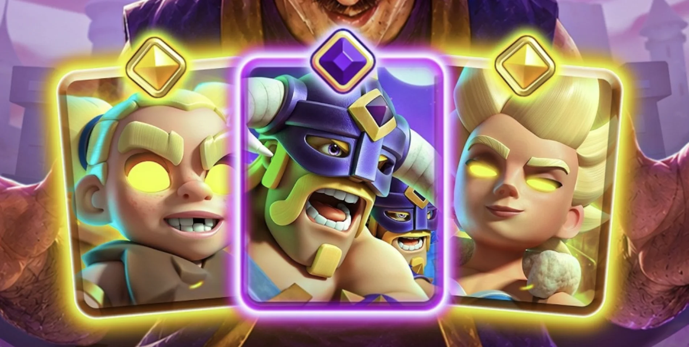
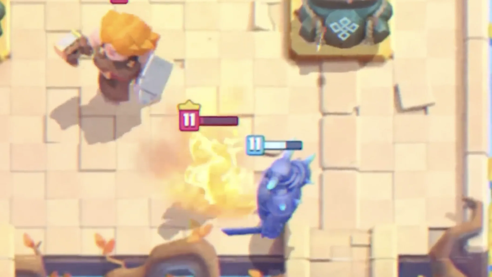
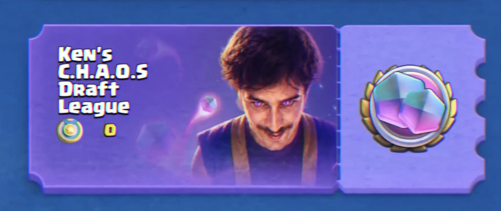

 **精英狂战士**是皇室战争 8 月赛季的精英卡牌之一。

前几天皇室 TV 中透露的信息是：她会变身，攻速会变快，技能期间血量不会低于 1。今天就来看一下精英小雨姐更完整的信息，技能费用、持续时间、伤害和一些隐藏的细节。

当然，这些资料来自开发服和先行体验，正式上线前仍然可能调整。

## 精英狂战士

精英狂战士是狂战士的精英形态。

精英形态的基础属性和普通狂战士一样，多出来的是一个主动技能，按下技能以后进入暴走状态。

精英狂战士的技能英文名是 **Savage Survival**。中文正式名还要等游戏内翻译，这里先按机制来理解：她会进入狂暴状态，释放体内的守护灵兽。

目前开发服数值大概是这样：

| 项目    |   技能前 |   技能中 |
| ----- | ----: | ----: |
| 技能费用  |     - |  3 圣水 |
| 单次伤害  |   102 |   167 |
| 对塔伤害  |   102 |    41 |
| 攻击间隔  | 0.6 秒 | 0.2 秒 |
| 移动速度  |     快 |    超快 |
| 技能总持续 |     - |   4 秒 |
| 最低血量  |  正常死亡 | 不低于 1 |

简单说就是：**她开技能以后，会变得很快、砍得很快，而且短时间内不会死。**

但这里有两个细节。

第一个细节是前摇。技能虽然写 4 秒，但开技能时大约有 1.45 秒的施法动作，这段时间她不能攻击，也不能移动。真正能疯狂输出的窗口，大概只有 2.5 到 2.6 秒。

第二个细节是塔伤。她开技能后单次伤害从 102 提到 167，但对塔伤害会被砍到 41。也就是说，技能不是给你无脑拆塔用的。

RoyaleAPI 算了一组很直观的对比：如果精英狂战士已经贴到塔，5 秒内不开技能大概能打出 816 塔伤；开技能反而大概是 737。除非你需要靠锁 1 血保命，否则单纯为了打塔开技能，并不划算。

## 她真正强在哪里？

精英狂战士强在单位交换。

开技能以后，她对单位的单次伤害是 167，攻击间隔 0.2 秒。按照有效输出窗口来算，如果一直砍同一个目标，最多能打 12 下，对单位总伤害大约 2004。

这个数字很夸张。2004 点伤害差不多是 2.5 下皮卡超人的平砍，也接近半个巨人的血量。

更麻烦的是，她技能期间最低血量锁 1。对手可以继续打她，但打不死她。法术、范围伤害、浪人的招架伤害这类伤害，到了 1 血线都会被挡住。

所以她最强的场景，不是一个人冲塔，而是：

- 对面下了大单位，你开技能硬砍。
- 她残血反打，靠锁 1 血多砍几刀。
- 桥头配合其他单位压上去，让对手必须立刻交控制或拉扯。
- 防守成功以后剩 1 血还没死，继续带出一波反击。

这种卡最烦的地方就在这里。她看起来快死了，但技能一开还能再撑几秒，对手不能简单靠“小法术补一下”解决。

## 但她不是无敌按钮

精英狂战士的技能强，但限制也很多。

首先，3 费不便宜。普通狂战士本体才 2 费，你为了开技能还要再花 3 费。每次见面都按技能，肯定不现实。

其次，前摇很长。1.45 秒在皇室战争里不短，如果她开技能前就被拉走、控住、或者目标已经死了，这个技能会很尴尬。

第三，她打人快，不代表清杂毛一定快。RoyaleAPI 提到一个细节：打同一个目标和连续换目标，这里涉及到抬手攻速和普通攻击速度，在游戏引擎里不是一回事。比如她打骷髅军团时，实际攻击间隔可能接近 0.35 秒，一次技能窗口大概只能打 7 下，不是理论上的 12 下。

第四，她只是“不死到 1 血”，不是完全免疫。她仍然会被锁定、被控制、被减速，也会受到电磁巨人的反伤影响。资料里还提到，**觉醒哥布林牢笼可以把她拉进去解决掉，这个交互是不是觉醒牢笼被削的原因之一呢**？哈哈哈哈～

所以精英狂战士的技能使用非常看时机。她是一个短时间爆发工具，吃时机，也吃保护。

## 应该怎么用？

我觉得精英狂战士最舒服的用法，不是硬当进攻核心，而是当一张高压交换卡。

防守端，她可以处理很多中高血量单位。对面打出野猪、巨人、皮卡、皇家巨人这类节奏点时，你可以先让她接住，然后在关键血线开技能，把对面主力单位快速砍掉。

进攻端，她适合配合前排或桥头压力。比如前面有东西吸引火力，她在旁边开技能冲进去，逼对手交控制、建筑或者小单位围堵。

但不要每次摸到塔就急着开技能。她开技能后的塔伤被压得很低，如果只是想偷塔血，很多时候不如让她正常砍。技能更适合用来保命、打单位、抢反打节奏。

她可能会出现在两类卡组里：

- **速转压力卡组**：利用 2 费本体过牌和桥头压迫，技能只在关键回合开。
- **反打型卡组**：防守时开技能吃掉对面核心单位，剩下部队再反推。

至于能不能成为主流，要等 8 月平衡性调整一起落地。下赛季还有精英瓦基丽武神、觉醒野蛮人精锐，以及一大批平衡改动，环境不会只围着她一张卡转。

## 怎么获得？

精英狂战士会通过 **Ken 的 混沌选卡联赛** 免费获得。

精英狂战士预计 2026 年 8 月 3 日上线，获取方式是 8 月限时活动免费奖励，或者花 200 精英币直接解锁。

普通玩家我建议先别急着用精英币。既然活动能免费拿，就先把活动打完。除非你是特别想第一时间体验，或者有比赛/内容创作需求，不然 200 精英币可以先省下来。

## 值得练吗？

值得拿，值得试，但先别无脑投资。

她的机制肯定有意思：3 费技能、0.2 秒攻速、最低 1 血，这些东西凑在一起，实战画面一定很好看。她也很可能在新赛季前几天到处出现，因为大家都会想试一试这个“不死狂战士”到底有多夸张。

但从数值看，官方也给了不少限制：3 费技能、前摇、塔伤削减、打杂毛效率下降、仍然吃控制。她不像一张简单粗暴的拆塔卡，更像一张需要算时机的卡。

我现在的判断是：**精英狂战士强度不会低，但上手门槛也不会太低。**

会用的人可以靠她打出很漂亮的防守反击；乱按技能的人，很可能只是多花 3 费看她原地吼一下。

8 月赛季上线后，重点可以先观察三件事：她和符文巨人这种增伤单位有没有稳定组合，她在速转里会不会太容易刷出压力，以及官方会不会在正式服前继续改技能伤害或持续时间。

参考来源：

- [RoyaleAPI：Hero Berserker - August 2026](https://royaleapi.com/blog/hero-berserker-august-2026)
- [kabutom：ヒーローバーサーカー介绍](https://note.com/kabutom/n/n48fa2e42f2d0)
- [Clash Royale Dicas：Berserker Heroica 机制介绍](https://www.clashroyaledicas.com/2026/07/sneak-peek-berserker-heroica.html)
