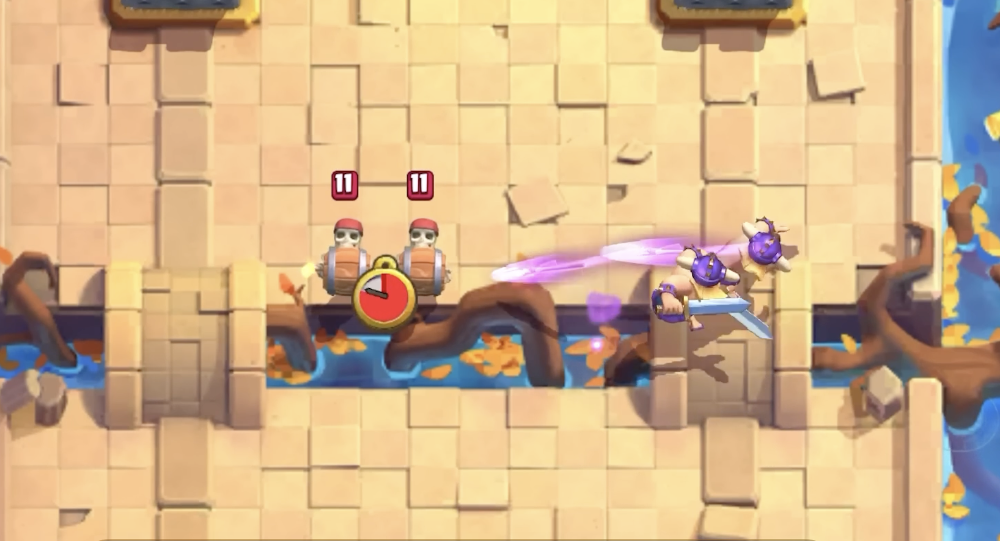
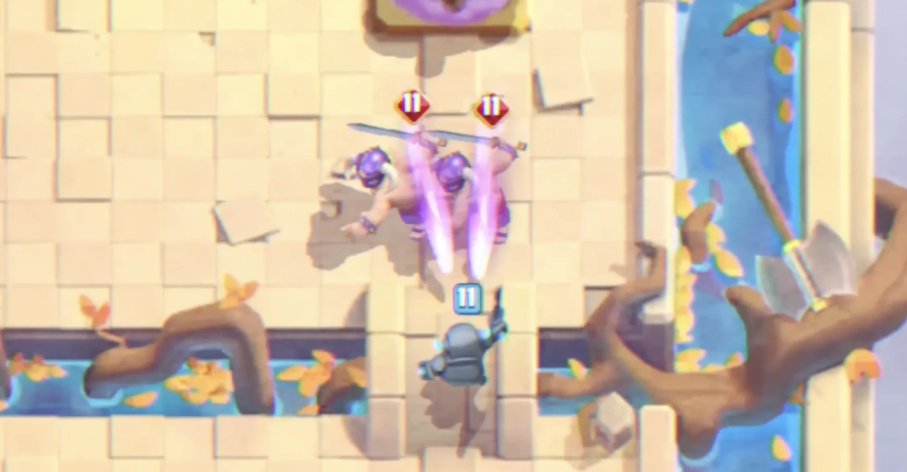
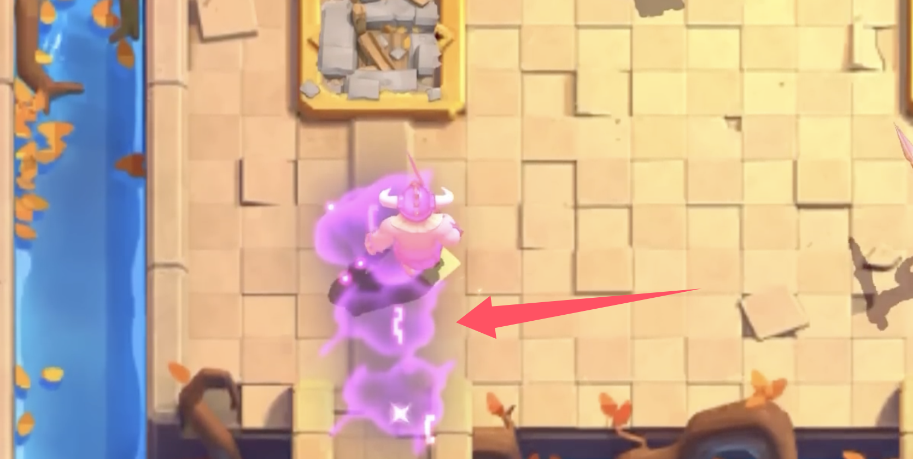
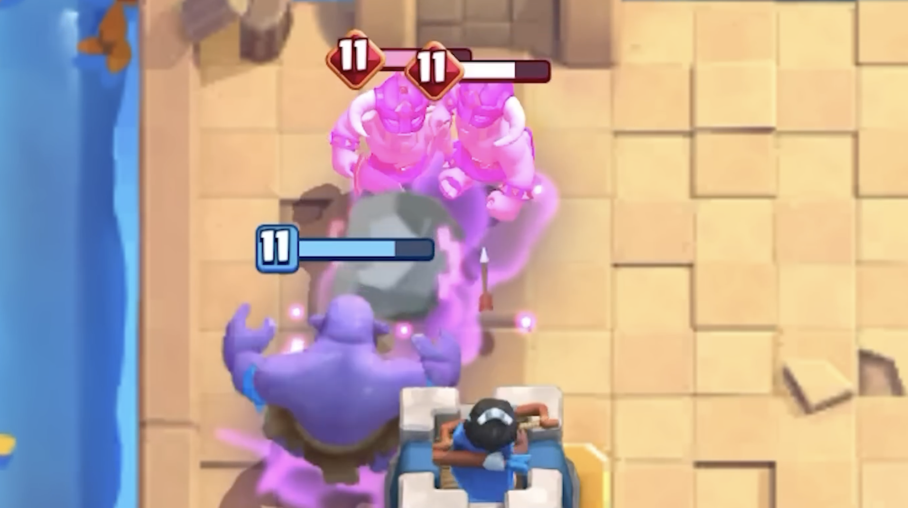

皇室战争 8 月赛季的精英觉醒，本来最值得我期待的，应该就是 **觉醒野蛮人精锐**。

但是老实说，其实有点让我失望——觉醒精锐的能力，几乎就是把混沌模式的长矛技能平移了过来，给精锐加了一个远程起手能力。

## 狂暴标枪

觉醒野蛮人精锐的属性没有直接加强，他们的觉醒技能是狂暴标枪。

当目标距离合适时，觉醒精锐会先向远处目标扔标枪。标枪命中后会造成伤害，还会在地上留下狂暴区域，让友方单位获得狂暴加成。

简单说，以前野蛮人精锐最大的问题是手短摸不到人。对手只要建筑、骷髅、小单位拉扯得好，精锐经常还没碰到塔就被处理掉。

觉醒以后，它们在冲过去的路上就能先出手。这个变化比单纯加一点伤害更麻烦，因为对手不能再只按普通精锐的距离去防守、去拉扯。

## 狂暴标枪怎么触发？

这里有个关键条件：**目标必须在 3.5 到 5 格之间。**

如果敌方单位离得太近，觉醒精锐不会继续扔标枪，而是回到普通近战模式。说白了就是，目标在有效距离内，就扔标枪；目标进了近战范围，就直接砍。

目前的关键数值是：

| 项目        |              数值 |
| --------- | --------------: |
| 卡牌费用      |            6 圣水 |
| 觉醒循环      |             1 轮 |
| 标枪触发距离    |       3.5 到 5 格 |
| 每个精锐标枪冷却  |             5 秒 |
| 标枪伤害，11 级 |             284 |
| 标枪伤害，16 级 |             453 |
| 狂暴区域持续    |           3.5 秒 |
| 狂暴加成      | 攻速、移速、生成速度 +30% |

11 级 284 点标枪伤害，比复仇滚木的 268 伤害高一点，所以可以一枪带走不少脆皮：各种豆子、哥布林、吹箭哥布林、公主这类单位。但弓箭手、烟花炮手这类中等血量后排，一枪不会死。

如果两只精锐的距离都比较合适，各自扔出标枪，对面的拉扯单位就很难受了。以前可以晚一点下拉扯单位，现在可能要更早交牌，而且还要把控好距离，否则标枪打出来，后面精锐再吃到狂暴冲上来，就很难处理了。

## 狂暴路径

除了扔出的标枪伤害，更麻烦的是标枪路径的地上的狂暴效果。

狂暴标枪会在命中点产生一个小范围狂暴区域，同时飞行路径上也会留下狂暴效果。这个狂暴不是伤害法术，不会像狂暴法术或樵夫死亡狂暴那样落地造成伤害，它只是给友军施加狂暴效果。

加成就是常见狂暴效果：

- 攻击速度 +30%
- 移动速度 +30%
- 生成速度 +30%

更重要的是，这个加成不只给野蛮人精锐。只要己方部队踩进去，都能吃到狂暴。

所以精锐觉醒很适合和桥头突进、快速跟进单位一起用。比如精锐先扔标枪铺出一条狂暴路，后面的单位跟着往前冲，对手面对的就不只是两只精锐，而是一整波狂暴部队。

## 获取方式

觉醒野蛮人精锐会通过 8 月赛季的 **Ken's Shop** 免费获取。对普通玩家来说这是好事，至少不用一上来就氪觉醒碎片。但对天梯环境来说，免费也意味着以后他们的出场率会很高，对于比较怕莽夫的卡组怕是会有点折磨。

本身野蛮人精锐强度就不差，虽然有小费或者杂毛拉扯的情况下，他们大概率是送 6 费。但是看现在他们的觉醒技能，明显是在补了短板。众所周知，补上了短板的觉醒卡牌（譬如初代觉醒烟花箭雨不死，初代觉醒法师逆天护盾）一般都会比较 op，不知道这次精锐会不会重回环境呢？

## 实战技巧

觉醒精锐以后最舒服的用法，应该就是把握下牌的时机，让它们在接敌前先扔出标枪。

进攻时，你可以把它当成一张更有前压能力的冲锋卡。对手如果用小单位或后排卡提前挡，标枪可能先把这些单位打残，甚至直接秒掉脆皮。之后狂暴路径出来，精锐继续往前冲。

防守反击时，它也会更烦。普通精锐防守成功后，往往要靠剩余血量硬跑到对面半场。觉醒版本多了标枪和狂暴，就算没摸到塔，也可能先给对面单位或塔打一枪。

但这张卡也有明显弱点。

首先，近身后不会扔标枪。对手如果能把单位直接塞到精锐脸上，它们还是普通近战，基本和没觉醒没什么区别。

其次，它仍然怕控制和有效拉扯。建筑、冰冻、击退、减速、空军单位，都可能让精锐的冲刺价值下降。怒气标枪只能打地面目标，这点也限制了它处理空中单位的能力。

第三，6 费还是很贵。觉醒循环虽然只有 1 轮，但每次下精锐都是一次投资。如果被对手低费解了，亏费会很明显。

## 环境问题

目测觉醒精锐对环境会有影响，而且上线初期存在感肯定不低。

它的机制会逼玩家重新适应防守距离。以前防精锐，很多人习惯在它过桥后再下单位拉扯；现在你如果下得太晚，可能先吃标枪和狂暴路径。

下面这些卡组有可能会带上觉醒精锐：

- **桥头三冲卡组**：利用觉醒精锐逼对手提前交防守。
- **推进卡组**：搭配冲锋、冲塔或高攻速单位，吃怒气路径加成。
- **反打卡组**：防守后靠觉醒精锐和残余单位一起反推。

但我觉得应该也不至于会被滥用。

a原因也很简单：触发距离有条件，标枪有 5 秒冷却，近身后还是普通精锐，6 费被解掉也很伤。它应该很强，但强度更依赖进场位置和跟进节奏。

不过考虑到中低端环境以及玩家对莽夫卡牌的热爱，再加上免费获取的因素，估计天梯会比较热闹....

## 值得拿吗？

当然值得。

免费觉醒没什么好犹豫的，能拿一定拿。就算你平时不玩野蛮人精锐，也建议把 Ken's Shop 的相关奖励拿完。觉醒精锐的机制不只是给精锐玩家用，它还会影响你怎么防别人。

真正要不要专门练，就看你喜不喜欢主动压迫型卡组。喜欢桥头、反打、快速进攻的玩家，觉醒精锐很可能会很顺手；更喜欢慢速运营、法术消耗或空军体系的玩家，可以先观察几天。

我的初步判断是：**觉醒野蛮人精锐不会只是整活卡，它至少会在 8 月赛季前期成为环境重点。**

但它到底是“强卡”，还是“大家试两天就冷下来”，还要看正式上线后的数据，以及玩家能不能找到稳定卡组。

参考来源：

- [Clash Royale Dicas：Tudo Sobre a Evolução dos Bárbaros de Elite](https://www.clashroyaledicas.com/2026/07/tudo-sobre-barbaros-de-elite-evo.html)
- [RoyaleAPI：Elite Barbarians Evolution - August 2026](https://royaleapi.com/blog/elite-barbarians-evolution-august-2026?lang=en)
- [Ian77：Elite Barbarians Evolution has BROKEN Stats](https://www.youtube.com/watch?v=YdKCklEcYx4)
- [RoyaleAPI：Evo Elite Barbarians - August 2026 Season 86](https://www.youtube.com/watch?v=444orSqXxaI)
