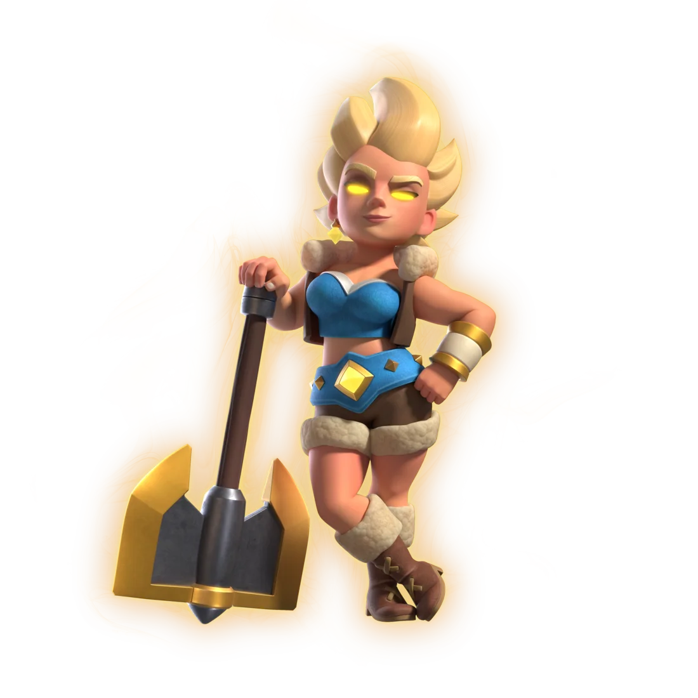

8 月赛季的两张精英里，精英狂战士已经很强大了，**精英女武神** 可能更夸张。

众所周知，弥补了短板的觉醒/精英往往都强大的可怕。普通女武神其实已经是一张很好的地面范围解场卡，缺点是手短，只能贴脸放或者等别人过来贴脸。

精英女武神的技能刚好补了这件事：她会自己转过去。

接下来看一下精英女武神的详细信息。

## 精英女武神

精英女武神的基础属性和普通女武神一样：近战、范围攻击、适合清地面小单位和中等血量单位。

她的技能英文名是 **Wild Whirlwind**。暂时可以翻译为“狂野旋风”： 3 费圣水，让女武神冲向附近目标，进入持续旋转攻击状态。

## 技能详解

精英女武神开技能后，会先进入准备冲刺的状态，移动速度从中等直接提到很快。

当她附近 **5.5 格** 内有目标时，就会进入旋风阶段。进入旋风阶段后，她的移动速度进一步提升到超快，并且开始连续旋转攻击。

这个阶段最多持续 **3.5 秒**。注意，前面“跑过去”的时间不算在 3.5 秒里。也就是说，如果她先追了一段路，再开始转，真正旋风阶段仍然能转满自己的持续时间。

旋风阶段里，她会每 **0.25 秒** 造成一次范围伤害，范围半径是 **2.5 格**。普通女武神平砍范围大约是 2 格，所以开技能后范围会更宽一点。

开发服 11 级数据大概是：

| 状态 | 伤害 | 间隔 | DPS |
|---|---:|---:|---:|
| 普通攻击 | 266 | 1.5 秒 | 177 |
| 旋风对塔 | 49 | 0.25 秒 | 196 |
| 旋风对卡牌 | 97 | 0.25 秒 | 388 |

单跳伤害 97看起来不高，但超快的旋转攻速对单位的 DPS 是 388，已经是普通攻击的两倍多。

如果旋风阶段从头转满，她最多可以打出 **14 次** 伤害。按 RoyaleAPI 的统计，完整旋风对单位总伤害约 **1358**，对塔总伤害约 **686**。如果她需要先冲刺过去，实际大概会少几跳，约 **11 次**，对单位总伤害约 **1067**，对塔约 **539**。

## 开启技能自带减伤

精英女武神在旋风阶段会获得 **15% 减伤**。

普通女武神站在前排位置，很多时候只吃一部分火力。精英女武神开技能冲进人堆，可能同时被多个单位锁定。转得好，是一波清场；转歪了，就是 3 费把自己送进去挨打。

还有一些特殊交互也值得注意。旋风阶段不像普通攻击那样容易被中断。即使她被冰冻法术冻住、被哥布林牢笼困住，或者被符文巨人抛起来，旋风阶段仍然可能继续转到时间结束。

## 旋风索敌机制

精英女武神最大的变化，是她可以主动转进人堆。

普通女武神很怕远程后排站得太远，手短、移动慢，导致她走不到法师、火枪手、烟花炮手身边，就只能慢慢挨打。

精英形态开技能以后，她会冲向附近目标，并且在旋风阶段继续贴着单位转。这个有点像黄金骑士技能，会连续的锁定视野范围内的敌人。她的锁定逻辑非常奇葩，具体来说就是，她优先找她发现的最远目标。

## 获取方式

精英女武神是 8 月赛季的主精英，她会出现在皇室令牌中。4 选一包括：

- 精英女武神
- 6 个觉醒万能碎片
- 15 张传奇万能卡
- 150 张史诗万能卡

另外，新精英上线后也会进入可领取池，玩家可以花 **200 精英币** 直接解锁。

## 值得优先拿吗？

我个人觉得精英女武神是下月三张精英/觉醒中，最强力的一张。

开启技能之后，扩大攻击范围、自带减伤、增加移速，增加数值的精英，你还要什么飞机？非常逆天啊！

而且除了数值上变强，精英技能还直接改变了女武神的攻击方式，弥补了普通女武神移速慢手短的短板。

用的好的话，精英女武神应该是一张上限很高的卡牌。

