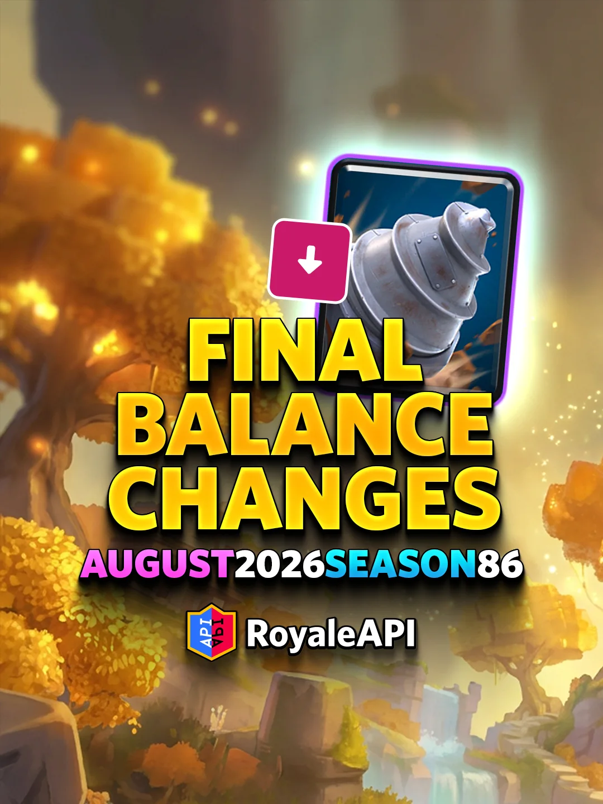
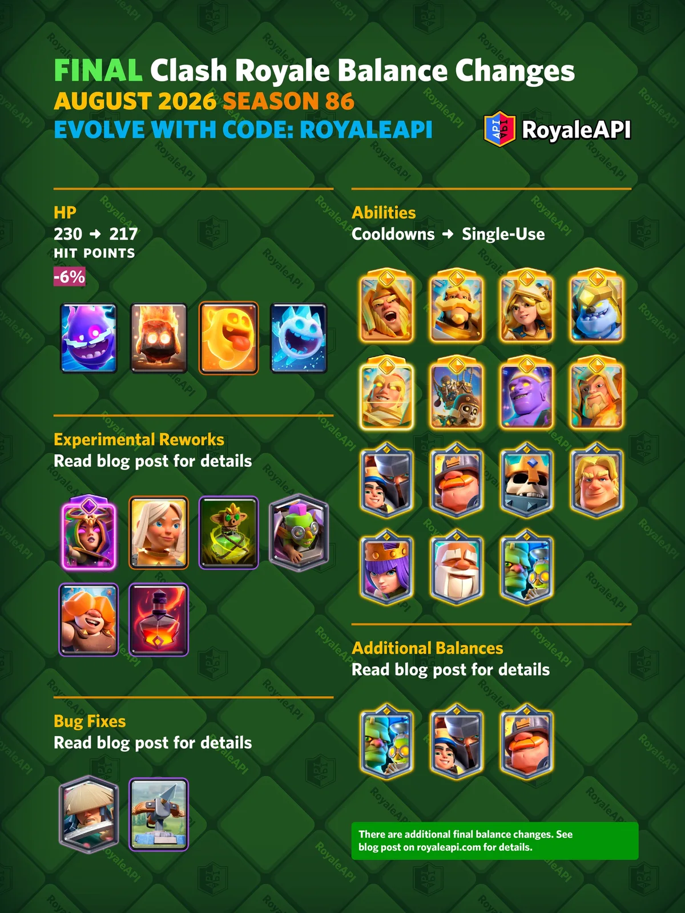
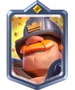
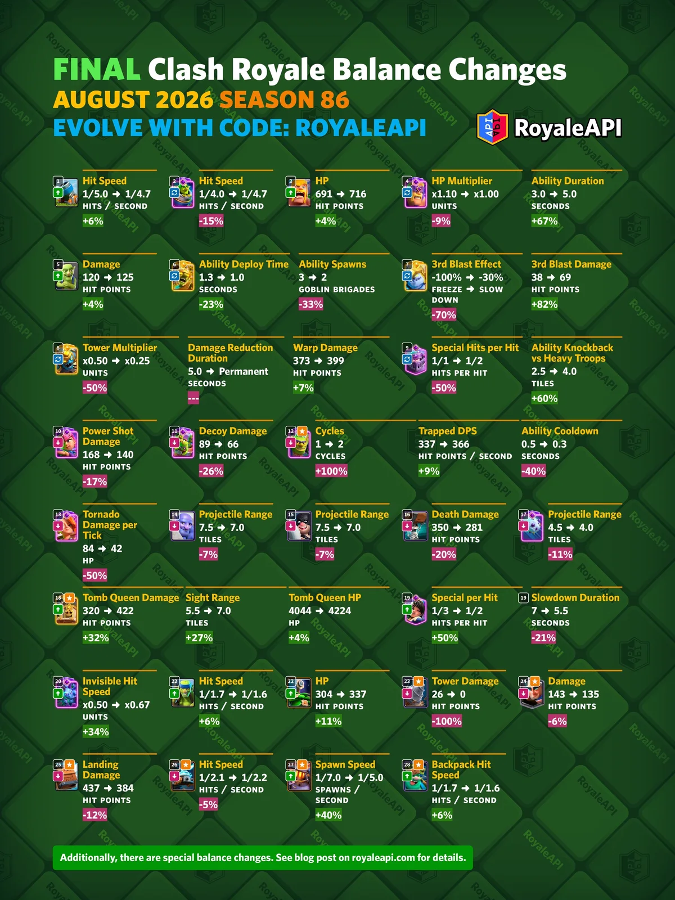
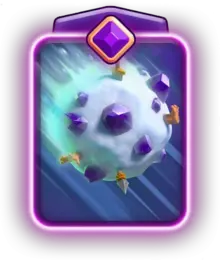
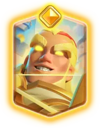

皇室战争 8 月最终平衡性调整公布了。

这次是第 86 赛季超大的一次平衡性调整，**一共 40 张卡牌会改**。本次调整会在 **2026 年 8 月 3 日第 86 赛季开启后不久上线**。

## 特殊改动

这部分是会改变机制和玩法的特殊调整。包括四精灵削弱、精英与英雄技能改动、实验性重做，以及部分问题修复。

## 为什么会有特殊改动？

这次特殊改动的目标，是调整对战环境，同时给一些被冷落很久的卡重新找位置。

简单说，官方想处理三类问题：

- 过于泛用的低费卡牌，比如四豆子。
- 机制太复杂或上限不好控制的精英/英雄技能。
- 过去因为机制问题调整起来很麻烦的卡牌，比如战斗天使、女巫觉醒、虚空。

所以这次平衡会比普通赛季更大，也更容易影响卡组结构。

## 四精灵削弱

最终版四精灵选择的是 **削生命值**，不是削移动速度。

| 卡牌 | 调整项 | 调整前 | 调整后 |
|---|---|---:|---:|
| 火精灵 | 生命值 | 230 | 217 |
| 冰精灵 | 生命值 | 230 | 217 |
| 治疗精灵 | 生命值 | 230 | 217 |
| 电击精灵 | 生命值 | 230 | 217 |

这四张卡都是从 **230 血降到 217 血**。影响很直接：以后它们会被被弓箭手、火枪手、投弹兵、特斯拉电磁塔等单位一发解决。

削血比削移速更激进（我个人比较支持），以前挡一下后排的攻击的拉扯方式全部废掉，但会减少裸下白嫖和万能防守的程度。

## 精英与英雄

这一组的调整分部分：先移除技能冷却，再给几张偏弱英雄卡补偿。

### 移除技能冷却（削弱）

这次会影响 **8 张精英卡** 和 **7 张冠军卡**。除了刺客首领这种技能本来就围绕连续释放设计的卡，其他技能都会变成 **单次部署只能使用一次**。

刺客首领是例外，不在这次移除冷却范围里：

这个改动听起来很大，但实战里要分情况看。大部分卡在一次部署里本来就不一定能按第二次技能，所以是轻削弱；但弓箭女皇、圣骑、蓝胖等卡牌，反打之后的第二次技能经常能改变局面，这部分上限以后没了。

### 英雄卡加强

英雄卡现在要和精英、觉醒抢特殊卡位，整体竞争压力很大。最终版给了小王子、哥布林斯坦和威猛矿工一些补偿。

#### 小王子（加强）

| 调整项 | 调整前 | 调整后 |
|---|---:|---:|
| 移动时攻速蓄力保留 | 0 秒 | 0.3 秒 |
| 护卫近战伤害 | 217 | 232 |

小王子现在移动时可以保留 0.3 秒蓄力攻速，换目标和小幅移动时不会那么容易断节奏。护卫伤害也小幅提高。

这不是让小王子回到巅峰版本的加强，更像是一次性技能后的补偿。

#### 哥布林斯坦（重做，最终版新增）

| 调整项 | 调整前 | 调整后 |
|---|---:|---:|
| 博士伤害 | 92 | 135 |
| 技能每秒伤害 | 214 | 188 |

哥布林斯坦最终版新增了技能每秒伤害削弱。

博士本体伤害提高 47%，但技能每秒伤害下降 12%。这等于是把一部分强度从技能里挪回本体。它以后打单位会更疼，但技能爆发没有策划版本看起来那么夸张。

#### 威猛矿工（加强）

| 调整项 | 调整前 | 调整后 |
|---|---:|---:|
| 初始伤害 | 40 | 43 |

威猛矿工初始伤害提高 8%，现在所有等级都能两下打掉骷髅，防守小单位会更有效率一点。

## 实验性重做

这部分是实验性重做。官方也说了，如果效果不好，之后可能回调。

## 无限治疗问题

这一组主要处理“无限回血”问题。女巫觉醒和战斗天使过去最烦人的地方，都不是数值，而是治疗机制导致越拖越难处理。

#### 觉醒女巫（重做，最终版新增）

| 调整项 | 调整前 | 调整后 |
|---|---:|---:|
| 每个骷髅治疗量 | 53 | 153 |
| 最大生命值 | 1040 | 1451 |
| 过量治疗倍率 | x1.24 | x1.73 |
| 可触发治疗的骷髅 | 无限 | 初始 4 个 |

最终版把治疗量和最大生命值给得更高，但限制也更明确：只有初始 4 个骷髅能触发治疗。

所以她会有一波很强的回血窗口，但不能靠后续不断召骷髅无限奶。对手终于不用打那种“怎么打都还在回血”的女巫觉醒了。

#### 战斗天使（重做，最终版新增）

| 调整项 | 调整前 | 调整后 |
|---|---:|---:|
| 伤害 | 148 | 268 |
| 攻击间隔 | 1.5 秒 | 2.0 秒 |
| 每秒伤害 | 99 | 134 |
| 每秒治疗 | 67 | 50 |
| 治疗半径 | 4.0 格 | 3.0 格 |
| 治疗面积 | 50.3 格 | 28.3 格 |
| 自我治疗 | 可以 | 不可以 |
| 治疗其他战斗天使 | 可以 | 不可以 |

战斗天使这次是真的换了定位。

她单下伤害高了很多，但攻击慢了，治疗弱了，治疗范围小了，而且不再治疗自己。以前那种自己边打边奶、一直赖场的玩法基本结束。

以后她更像“带治疗的近战输出”，不是自带回血的前排。

### 虚空（重做）

| 调整项 | 调整前 | 调整后 |
|---|---:|---:|
| 圣水费用 | 3 | 5 |
| 攻击间隔 | 1.0 秒 | 1.2 秒 |
| 单目标伤害 | 340 | 696 |
| 2-4 目标伤害 | 161 | 294 |
| 5+ 目标伤害 | 76 | 153 |
| 单目标塔伤 | 48 | 97 |
| 2-4 目标塔伤 | 25 | 51 |
| 5+ 目标塔伤 | 17 | 35 |

虚空从 3 费变成 5 费，定位变了。

以前它是灵活补刀法术，现在更像专门处理高血量远程单位的 5 费法术，比如巨石投手、飞斧屠夫、猎人。伤害涨得很大，但费用也变高，不能再随手丢。

### 哥布林诅咒（加强）

| 调整项 | 调整前 | 调整后 |
|---|---:|---:|
| 减速 | 0% | 15% |

哥布林诅咒加了 15% 减速。

失去增伤以后，这张卡存在感一直不高。现在加减速，至少能更像一张控制法术，配合防守会舒服一些，但是变化不大。

### 哥布林机甲（重做，最终版新增）

| 调整项 | 调整前 | 调整后 |
|---|---:|---:|
| 火箭攻击间隔 | 3.5 秒 | 5.0 秒 |
| 火箭每秒伤害 | 87 | 61 |
| 火箭速度 | 250 | 350 |
| 近战伤害 | 212 | 232 |
| 生命值 | 2150 | 2265 |

哥布林机器最终版新增了生命值加强。

火箭打得更慢，远程骚扰能力下降；本体近战和生命值提高。官方明显想让它少当远程烦人单位，多承担一点前排和近战价值。

### 符文巨人（加强）

| 调整项 | 调整前 | 调整后 |
|---|---:|---:|
| 生命值 | 2662 | 2816 |
| 附魔施法停顿 | 1.0 秒 | 0 秒 |
| 自爆单位附魔 | 可以 | 不再附魔 |

符文巨人附魔时不再停住，这个很关键。

以前她经常因为附魔停一下，自己被支援单位甩在后面。现在可以边走边附魔，节奏会顺很多。不能附魔自爆单位，也能避免把增益浪费在精灵、攻城炸弹人这类单位身上。

### 野蛮人小屋？

野蛮人小屋没有进入这次最终平衡。

官方说法是，大他们没忘记小屋玩家，但这次还没排进去。喜欢小屋的玩家只能再等等。

## 问题修复

### 浪人

| 调整项 | 调整前 | 调整后 |
|---|---:|---:|
| 首次攻击时间 | 0.3 秒 | 0.4 秒 |

浪人主要是修交互。

以前他对冲锋黑暗王子时，可能同一帧打出招架伤害和近战伤害，导致黑王护盾判定不稳定。现在首次攻击时间调整到 0.4 秒，避免这个问题。

另外，浪人的招架不再打断金甲骑士冲刺。

### 连弩

| 调整项 | 调整前 | 调整后 |
|---|---:|---:|
| 攻击间隔 | 0.3 秒 | 0.4 秒 |
| 单发伤害 | 43 | 58 |
| 每秒伤害 | 143 | 145 |
| 弹道速度 | 1400 | 1600 |

连弩射得慢一点，单发更疼，弹道更快，整体每秒伤害小涨 1.4%。

这个调整是为了解决极限射程下浪费攻击的问题：目标已经死了，连弩还要鞭尸多射一发。实装后连弩手感可能会变，但不一定是削弱。

## 常规改动

下面是正常的平衡调整。

## 特殊形态重做

这部分主要处理“普通形态”和“特殊形态”的关系。很多卡的普通版偏弱，觉醒或精英版又太强，官方这次想把差距拉回来一点。

### 哥布林与精英哥布林（重做）

| 调整项 | 调整前 | 调整后 |
|---|---:|---:|
| 伤害 | 120 | 125 |

| 调整项 | 调整前 | 调整后 |
|---|---:|---:|
| 伤害 | 120 | 125 |
| 部署时间 | 1.3 秒 | 1.0 秒 |
| 技能召唤 | 3 队哥布林旅 | 2 队哥布林旅 |

哥布林本体伤害小幅提高。这会影响很多哥布林系卡牌。

精英哥布林也提高伤害和部署速度，但技能召唤数量减少。感觉精英刀哥似乎有点废了。

### 觉醒哥布林飞桶（重做）

| 调整项 | 调整前 | 调整后 |
|---|---:|---:|
| 普通哥布林伤害 | 120 | 125 |
| 假哥布林伤害 | 89 | 66 |

觉醒哥布林飞桶吃到了哥布林本体伤害加强，但假哥布林伤害被削。

这会减少“骗防成功以后假桶也打很多伤害”的压力。

### 迫击炮与觉醒迫击炮（重做）

| 调整项 | 调整前 | 调整后 |
|---|---:|---:|
| 攻击间隔 | 5.0 秒 | 4.7 秒 |

| 调整项 | 调整前 | 调整后 |
|---|---:|---:|
| 攻击间隔 | 4.0 秒 | 4.7 秒 |
| 哥布林伤害 | 120 | 125 |

普通迫击炮变快，是加强。

觉醒迫击炮攻速变慢，和普通迫击炮统一到 4.7 秒。觉醒版附带哥布林伤害提高，但整体更像回调。

### 野蛮人与觉醒野蛮人（重做）

| 调整项 | 调整前 | 调整后 |
|---|---:|---:|
| 生命值 | 691 | 716 |

| 调整项 | 调整前 | 调整后 |
|---|---:|---:|
| 生命值 | 691 | 716 |
| 生命倍率 | x1.10 | x1.00 |
| 技能持续 | 3.0 秒 | 5.0 秒 |

普通野蛮人加血。

觉醒野蛮人也跟着加血，但额外生命倍率被移除，所以实际相对变脆；技能持续从 3 秒到 5 秒，给了更长的爆发窗口。

## 其他重做

### 精英寒冰戈仑（重做）

| 调整项 | 调整前 | 调整后 |
|---|---:|---:|
| 第三次爆炸效果 | 冰冻 100% | 减速 30% |
| 第三次爆炸伤害 | 38 | 69 |

精英寒冰戈仑第三次爆炸不再冰冻，而是减速。

控制弱了，但伤害提高。官方主要是想削掉它和野猪骑士这类卡配合时过于压迫的冰冻效果。

### 精英重甲亡灵（重做）

| 调整项 | 调整前 | 调整后 |
|---|---:|---:|
| 对塔伤害倍率 | x0.50 | x0.25 |
| 对塔倍率持续 | 5.0 秒 | 永久 |
| 传送伤害 | 373 | 399 |

精英重甲亡灵以后更偏向打单位，不是用技能拆塔。

传送伤害提高，但对塔伤害倍率被压得更低，而且永久生效。

## 削弱卡牌

### 觉醒超级骑士（削弱）

| 调整项 | 调整前 | 调整后 |
|---|---:|---:|
| 特殊攻击频率 | 每 1 次攻击 | 每 2 次攻击 |
| 重型单位击退 | 2.5 格 | 4.0 格 |

觉醒超级骑士不再每下都上勾拳，特殊攻击频率砍半。

重型单位击退更远，但核心还是削特殊攻击频率。整体是削弱。

### 觉醒弓箭手（削弱）

| 调整项 | 调整前 | 调整后 |
|---|---:|---:|
| 强力箭伤害 | 168 | 140 |

觉醒弓箭手爆发伤害下降。远距离秒后排和压血能力会弱一些。

### 觉醒哥布林牢笼（削弱，最终版新增）

| 调整项 | 调整前 | 调整后 |
|---|---:|---:|
| 觉醒循环 | 1 | 2 |
| 困住目标每秒伤害 | 337 | 366 |
| 技能间隔 | 0.5 秒 | 0.3 秒 |

觉醒哥布林牢笼循环从 1 到 2，这是主要削弱。

作为补偿，它困住目标后的每秒伤害更高，抓下一个单位也更快。但从“多久能刷出觉醒”来看，强度肯定下降。

### 觉醒女武神（削弱）

| 调整项 | 调整前 | 调整后 |
|---|---:|---:|
| 飓风伤害 | 84 | 42 |
| 飓风塔伤 | 25 | 12 |

觉醒女武神的飓风伤害直接砍半。

她仍然能吸人，但吸过来顺便打的伤害低很多。防守和反打压迫感都会下降。

### 巨石投手（削弱）

| 调整项 | 调整前 | 调整后 |
|---|---:|---:|
| 弹道射程 | 7.5 格 | 7.0 格 |

巨石投手弹道短一点，主要是避免桥后意外刮到公主塔。

### 飞斧屠夫（削弱）

| 调整项 | 调整前 | 调整后 |
|---|---:|---:|
| 弹道射程 | 7.5 格 | 7.0 格 |

飞斧屠夫和巨石投手一样，都是砍弹道边界，减少桥后意外蹭塔。

### 攻城炸弹人（削弱）

| 调整项 | 调整前 | 调整后 |
|---|---:|---:|
| 死亡伤害 | 350 | 281 |

攻城炸弹人死亡伤害下降 20%。

以前它就算没摸到塔，也经常靠死亡伤害处理单位赚费。现在这部分会弱一些。

### 觉醒大雪球（削弱）

| 调整项 | 调整前 | 调整后 |
|---|---:|---:|
| 弹道射程 | 4.5 格 | 4.0 格 |

觉醒大雪球射程缩短，远距离滚到更多目标的机会会少一点。

## 加强卡牌

### 精英墓碑（加强，最终版新增）

| 调整项 | 调整前 | 调整后 |
|---|---:|---:|
| 墓碑女王伤害 | 320 | 422 |
| 墓碑女王视野 | 5.5 格 | 7.0 格 |
| 墓碑女王生命值 | 4044 | 4224 |

精英墓碑加强很明显。

伤害、血量都提高。视野变大有点微妙，因为胜利条件更容易被拉扯，但官方显然是想让墓碑女王更容易进入环境。

### 觉醒亡灵大军（加强）

| 调整项 | 调整前 | 调整后 |
|---|---:|---:|
| 隐身期间攻速倍率 | x0.50 | x0.67 |

觉醒亡灵大军隐身期间不再被拖得那么慢，输出会顺一点。

### 觉醒公主（加强）

| 调整项 | 调整前 | 调整后 |
|---|---:|---:|
| 特殊攻击频率 | 1/3 | 1/2 |
| 减速持续 | 7.0 秒 | 5.5 秒 |

觉醒公主特殊攻击更频繁，但减速时间缩短。

综合看是加强。特殊箭从 3 下 1 次变成 2 下 1 次，存在感会高不少。

### 投矛哥布林（加强）

| 调整项 | 调整前 | 调整后 |
|---|---:|---:|
| 攻击间隔 | 1.7 秒 | 1.6 秒 |

投矛哥布林攻速提高 6%。

这也会影响哥布林巨人背包里的投矛哥布林，以及相关召唤单位。

### 可疑灌木（加强）

| 调整项 | 调整前 | 调整后 |
|---|---:|---:|
| 灌木哥布林生命值 | 304 | 337 |

可疑灌木里跳出来的哥布林血量提高 11%。

这张卡之前被削得更容易预测，现在补一点本体价值。

## 最终版新增调整

最终版新增了 6 组调整，前瞻版里没有这些内容。

### 哥布林钻机（削弱，最终版新增）

| 调整项 | 调整前 | 调整后 |
|---|---:|---:|
| 登场塔伤 | 26 | 0 |

哥布林钻机不再保证落地蹭塔伤。

以后钻机更依赖钻出来的哥布林打伤害，不能再靠落地白赚一点塔血。

### 神箭游侠（削弱，最终版新增）

| 调整项 | 调整前 | 调整后 |
|---|---:|---:|
| 伤害 | 143 | 135 |

神箭游侠伤害降低 6%。

这会影响他穿线消耗和处理后排的能力。

精英神箭游侠也会跟随本体伤害变化。

### 皇家速递（削弱，最终版新增）

| 调整项 | 调整前 | 调整后 |
|---|---:|---:|
| 落地伤害 | 437 | 384 |

皇家速递落地伤害降低 12%。

以后它砸下来处理中血量单位没那么狠。

### 电磁车小队（削弱，最终版新增）

| 调整项 | 调整前 | 调整后 |
|---|---:|---:|
| 攻击间隔 | 2.1 秒 | 2.2 秒 |

电磁小车攻速小削，控制频率会慢一点。

### 烈焰熔炉（重做，最终版新增）

| 调整项 | 调整前 | 调整后 |
|---|---:|---:|
| 火精灵生命值 | 230 | 217 |
| 生成间隔 | 7.0 秒 | 5.5 秒 |

烈焰熔炉受到火精灵削血影响，所以官方补了生成速度。

火精灵更容易被解掉，但熔炉出得更快。它到底是增强还是削弱，要看实战里能不能补回被一发解的损失。

觉醒烈焰熔炉也会受到火精灵生命值变化影响。

### 哥布林巨人（加强，最终版新增）

| 调整项 | 调整前 | 调整后 |
|---|---:|---:|
| 背包投矛攻击间隔 | 1.7 秒 | 1.6 秒 |

哥布林巨人背后的投矛哥布林跟随投矛哥布林本体一起加强。

觉醒哥布林巨人和死亡召唤相关的投矛哥布林也会一起受影响。

## 简单总结

这次最终平衡比普通赛季大很多，短期内天梯会很乱。

同时8 月还有精英狂战士、精英女武神和觉醒野蛮人精锐一起上线。新卡、新觉醒、最大的平衡性调整撞在同一个赛季，好戏即将上演！

参考来源：

- [RoyaleAPI：Final Balance Changes for August 2026 (Season 86)](https://royaleapi.com/blog/season-86-balance-final-august-2026)
- [皇室战争第 86 赛季 K.H.A.O.S 完整前瞻](/posts/clashroyale/2026/07/season-86-khaos-guide/)
- [皇室战争8月平衡性调整前瞻版](/posts/clashroyale/2026/07/august-balance-changes-26/)
