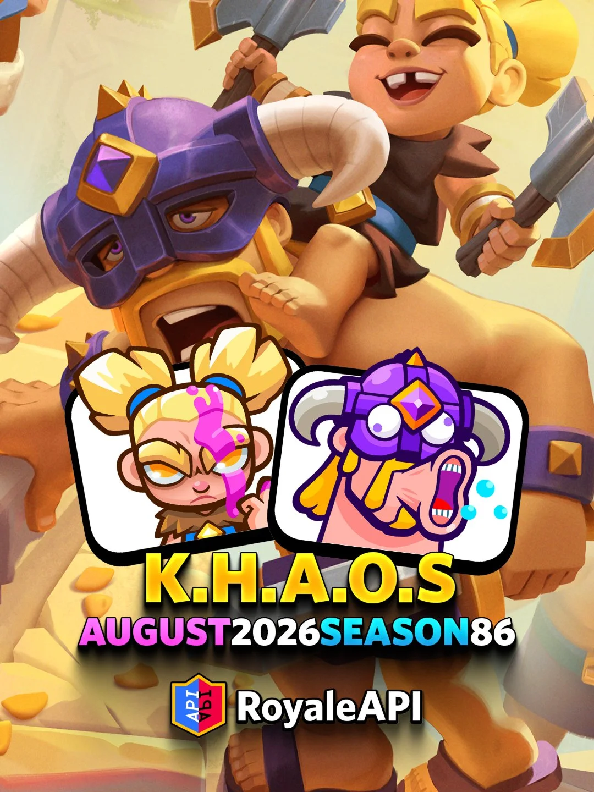
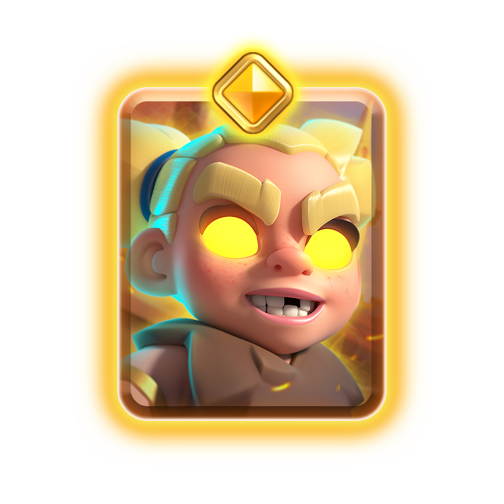
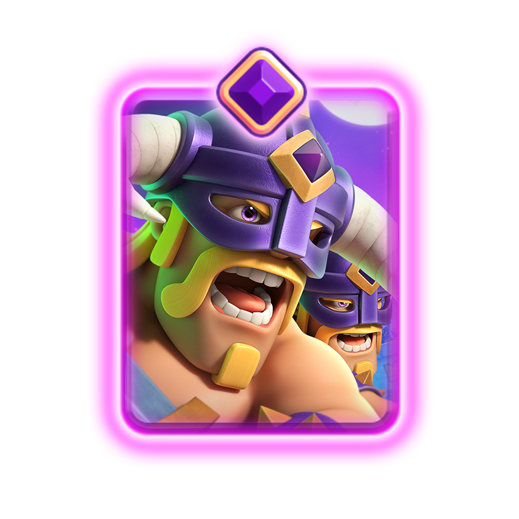
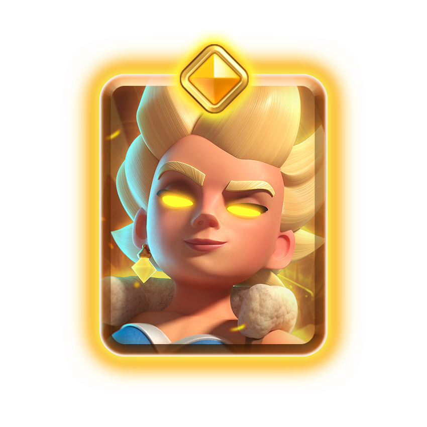
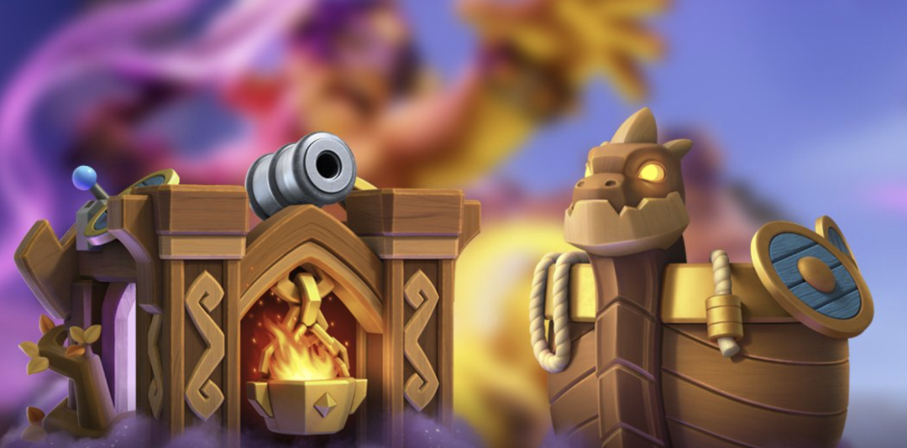
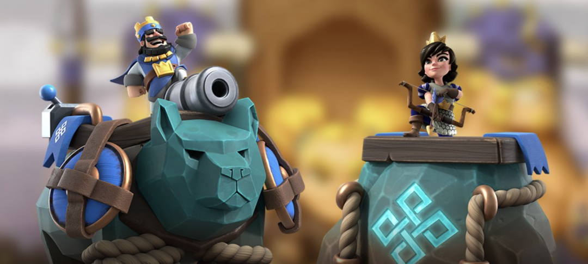
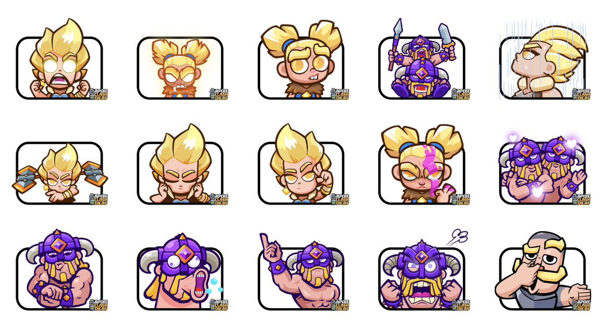
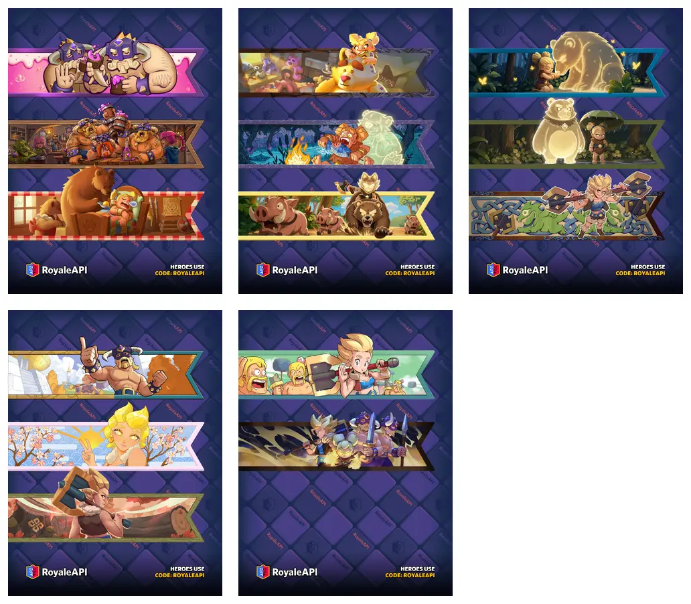
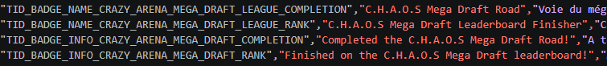
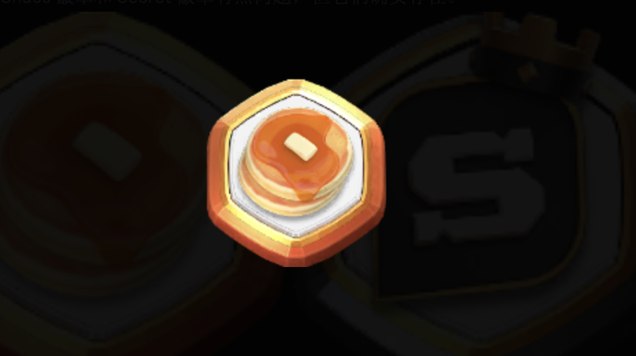

皇室战争 8 月赛季的主题已经确认：**Season 86：混沌**。

赛季时间是 **2026 年 8 月 3 日到 9 月 7 日**，一共 5 周。这个月的内容包括：两张精英、一张觉醒、维京主题视觉、两款塔楼皮肤、一大批表情和战旗，还有整个月围绕混沌模式展开的活动。

## 精英狂战士

精英狂战士是 8 月第一张新精英。

她的技能需要 3 圣水，开启后进入短时间狂暴状态，攻速提升，并且技能期间生命值不会低于 1。

获取方式上，她会通过 8 月限时活动免费获得，也可以用 200 精英币解锁。

详细机制看这篇：[皇室战争精英狂战士登场～3费锁血开大、最强AD来了!](/posts/clashroyale/2026/07/hero-berserker-guide/)

## 觉醒野蛮人精锐

觉醒野蛮人精锐也是 8 月免费内容之一。

它的觉醒技能是远程狂暴标枪。目标在 3.5 到 5 格之间时，觉醒精锐会先扔标枪，命中后留下狂暴路径，让友方单位获得攻速、移速和生成速度加成。

详细机制看这篇：[觉醒野蛮人精锐登场！远程标枪加狂暴路径，免费获取，莽夫时代又要来临？](/posts/clashroyale/2026/07/evo-elite-barbarians-guide/)

## 精英女武神

精英女武神是本赛季皇室令牌主打内容。

她的技能同样是 3 圣水，一次性。开技能后会向附近目标冲刺，并进入旋风阶段，持续造成范围伤害。和普通女武神相比，她最大的变化是不用等敌人贴脸，而是可以主动转过去。

她会出现在高级皇室令牌第一个里程碑，也可以用 200 精英币解锁。到底选她，还是选 6 个觉醒万能碎片，要看你账号现在更缺什么。

详细机制看这篇：[精英女武神登场！超级赛亚人变身～无敌索命旋风斩～](/posts/clashroyale/2026/07/hero-valkyrie-guide/)

## 加载屏幕

8 月加载屏幕是标准的维京风格。

画面里，精英女武神、狂战士和野蛮人精锐一起往巨大的金色树走。这棵树很容易让人联想到北欧神话里的世界树。

## 塔楼皮肤

8 月有两款塔楼皮肤。

第一款是维京船/海兽风格，这款塔楼皮肤可以从皇室令牌中获取。

第二款是符文石碑风格，目前获取方式未定。

这两款都很贴合本赛季主题。一个偏维京出航，一个偏符文遗迹。

## 表情

这个赛季表情很多，主角基本集中在精英女武神、精英狂战士和觉醒野蛮人精锐。

## 战旗

战旗这次也很多。基本都是维京、狂战士、女武神和精锐主题战旗。

## 强化卡牌

8 月强化卡牌是这四张：

- 符文巨人
- 狂战士
- 女武神
- 野蛮人精锐

这四张都和赛季内容有关。狂战士、女武神、野蛮人精锐不用多说，正好对应两张精英和一张觉醒。至于符文巨人，结合其他几张卡牌，其实这些都和北欧神话有关系，这个话题回头单开一篇文章来八卦一下。

## 赛季活动日历

8 月最主要的关键词还是 混沌，具体的赛季日程如下。

| 时间                  | 内容              | 类型     |
| ------------------- | --------------- | ------ |
| 8 月 3 日 - 9 月 7 日   | 赛季 86混沌         | 主题季    |
| 8 月 3 日 - 8 月 17 日  | 混沌模式选卡联赛        | 选卡联赛   |
| 8 月 3 日 - 9 月 7 日   | 狂战士解锁活动         | 里程碑活动  |
| 8 月 3 日 - 9 月 7 日   | 混沌代币活动          | 里程碑活动  |
| 8 月 3 日 - 8 月 10 日  | Ken's Shop      | 限时商店   |
| 8 月 17 日 - 8 月 24 日 | 混沌模式：仅限史诗       | 赛季活动   |
| 8 月 17 日 - 9 月 7 日  | 混沌模式：三选一        | 赛季活动   |
| 8 月 24 日 - 8 月 29 日 | 混沌模式： 超级选卡全球锦标赛 | 全球锦标赛  |
| 8 月 24 日 - 8 月 31 日 | 混沌模式： 突然死亡      | 赛季活动   |
| 8 月 31 日 - 9 月 7 日  | 混沌模式：无限圣水       | 赛季活动   |
| 9 月 1 日 - 11 月 2 日  | 合合奇兵赛季 11       | 合合奇兵赛季 |

这里最值得注意的是：

第一，混沌模式选卡联赛是前两周主活动，也就是皇室 TV里 Ken 重点介绍的混沌选卡玩法。你先选 4 张卡，另外 4 张受对手选择影响，选完后还会进入随机事件阶段。

第二，**狂战士解锁活动和混沌代币活动活动贯穿整个赛季**。精英狂战士和觉醒野蛮人精锐都和这些免费活动有关，所以新赛季开始后，第一件事最好先看活动页和 Ken's Shop。

第三，**8 月 24 日的全球锦标赛是混沌模式超级选卡全球锦标赛**。这不是普通超级选卡，而是把混沌规则加进选卡里。这次全球锦标赛是 5 败淘汰、15 胜拿满奖励，并且有排名。

从之前热心网友获得的本地文件来看，混沌超选应该是有徽章，但是长什么样子、有几个、是否实装目前未知。

至于创作者 KEN 的煎饼徽章，目前也是个谜，是否对普通玩家开放、如何获取目前也未知。

不过，记得持续关注，有进一步的消息会第一时间更新。

## 总结

8 月这个混沌赛季，内容着实不少。

重点的精英狂战士、精英女武神和觉醒野蛮人精锐。一个锁 1 血爆发，一个旋风索敌，一个远程狂暴标枪。三张莽夫卡牌，一定会在下赛季天梯掀起腥风血雨。

从玩法来看，混沌模式是下个月真正的核心。从赛季初的混沌模式选卡联赛，到后面的仅限史诗、突然死亡、无限圣水，再到混沌超级选卡全球锦标赛，整个 8 月的活动基本都围绕着混沌模式展开。

**非常欣慰，国服的娱乐模式疯皇大乱斗出海到国际服竟然成了能够主导、并贯穿整个赛季的核心游戏模式。脑洞和娱乐这块，真的还要看国内的创造力啊！看看国际服，这 10 年除了合合奇兵，还想出了哪些新模式新玩法呢？**

最后，新赛季开始后，建议先做三件事：
- 看免费活动怎么拿精英狂战士和觉醒野蛮人精锐
- 看自己的卡组是否值得为了精英女武神氪令牌或者直接精英币兑换
- 最后再留意一下 8 月 3 日的平衡调整的最终版本。

那么，各位挑战者，你，准备好了么？

参考来源：

- [RoyaleAPI：Season 86 K.H.A.O.S (August 2026)](https://royaleapi.com/blog/season-86-august-2026-season-info)
- [kabutom：シーズン情報「K.H.A.O.S」Season 86](https://note.com/kabutom/n/n4279a8ebd581)
- [Clash Royale Dicas：Prévia da 86ª Temporada K.H.A.O.S](https://www.clashroyaledicas.com/2026/07/novidades-temporada-86.html)
