皇室战争 8 月赛季的主题叫 **K.H.A.O.S 混沌试炼** 。

不过从赛季图、强化卡牌到塔楼皮肤，这一季最明显的感觉其实是北欧神话。

女武神、狂战士、符文巨人，刚好都是这次的强化卡牌。旁边还有野蛮人精锐、符文塔楼皮肤，以及启动界面里的世界树。

这些元素，都在往北欧神话和维京文化上靠。

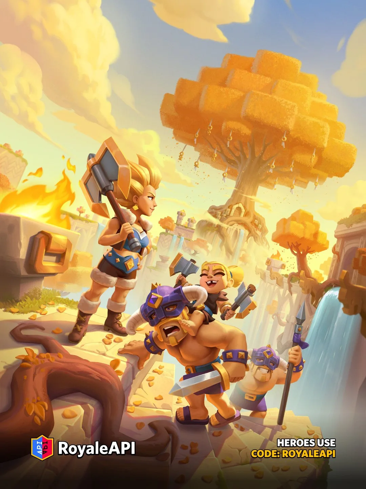

今天来八卦一下，简单整理一下这些卡牌和造型背后的文化来源。

## 这三张卡不是随便选的

先看强化卡牌。

第 86 赛季强化的卡里，最显眼的这三张红头发：

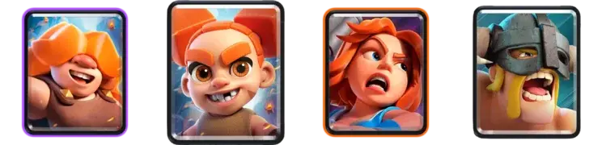

- 女武神
- 狂战士
- 符文巨人

其实，这三张卡都能连到北欧神话或者北欧文化。

女武神是神话里的战乙女。狂战士来自北欧传说里的狂暴战士。符文巨人的符文，指向古代日耳曼文字，也指向现代奇幻作品里常见的那套神秘符号。

三张一起强化，再配上本赛季的美术风格，就很难说是巧合了。

## 女武神：战场上引领亡魂的女神

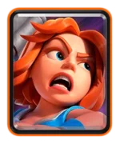

先说女武神。

女武神的英文是 **Valkyrie**。在北欧神话里，她们不是普通女战士，而是和奥丁、战场、英灵殿联系在一起的存在。她们会在战场上挑选战死的勇士，引领英雄灵魂前往英灵殿。

所以女武神这个词本身就带着战场、死亡、荣耀这些含义。

皇室战争里的女武神虽然是卡通形象，但拿大斧子、站进人堆里转圈，简单，粗暴，也很Valkyrie。

很多人第一次知道女武神，可能不是从北欧神话原典开始，而是从漫威《雷神》里的瓦基里开始。

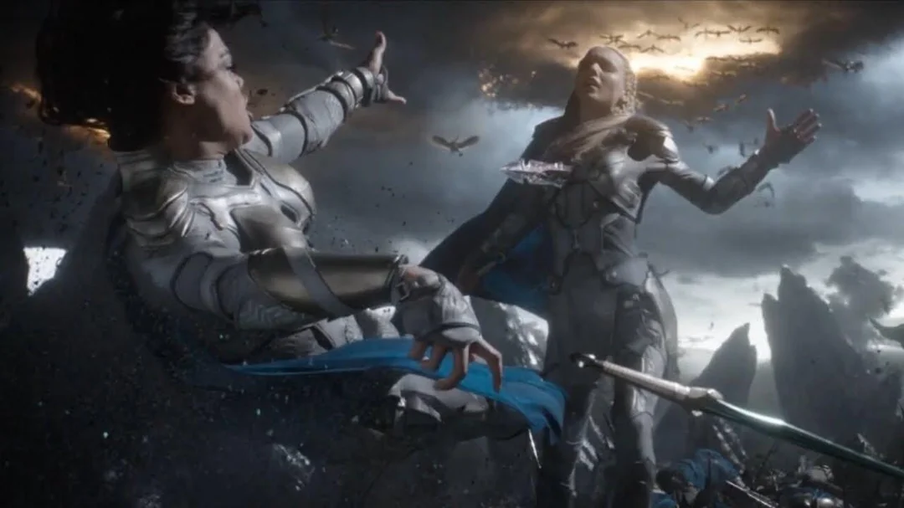

漫威电影里的瓦基里，和皇室战争里的女武神当然不是同一个角色。但源头是一回事：北欧神话里的 Valkyrie 概念进入现代流行文化以后，衍生出了很多版本。

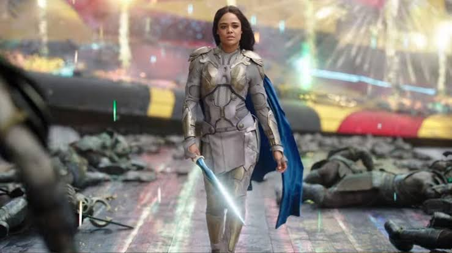

漫威里的瓦基里，皇室战争里的女武神，还有很多游戏里的“战乙女”，其实脱离不了北欧神话——奥丁、战死者、英灵殿、。

## 狂战士：进入狂暴状态的北欧战士

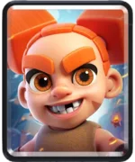

狂战士的英文是 **Berserker**，这个词在游戏里太常见了。

它的源头也和北欧文化有关。

狂战士（Berserker），音译：“巴萨卡”，是北欧神话和维京人传说的一种战士。在发怒时，可以进入无我的狂暴状态，被称为“狂战士之怒”（Berserker Rage），可以不着铠甲就迎向敌人进行战斗。 这一特征导致了英语单词的“狂暴（Berserk）”诞生。

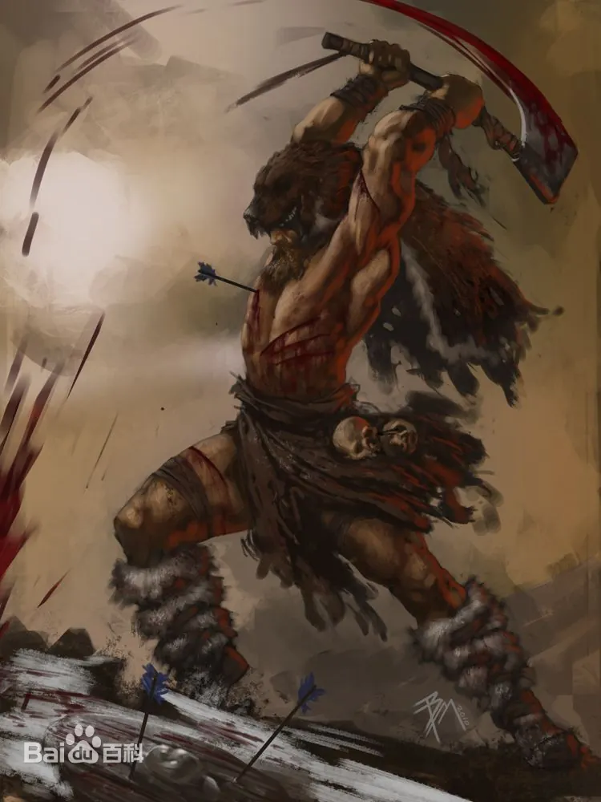

Berserker的意思被认为指“身披熊皮者”，由Ber（熊）与Serk（衣衫）组成，因为相传他们仅披着熊皮便冲锋陷阵，后来意思转变成为具有异常力量的勇猛斗士。另外，有传说提到相关的名词，例如披着狼皮战斗的“Úlfhéðnar”（或作ulfheðinn，意为穿着狼皮的战士）与披着野猪皮的“Svinfylking”。 

传说，狂战士平时力量虽和一般战士无异，但是在危急时能够进入无我的狂暴状态，突然涌出如恶狼般的勇猛力量，在战场上大发神威。

再来看看精英狂战士的技能，看起来就很对味了。精英狂战士开技能后进入狂暴状态，攻速提升，而且技能期间生命值不会低于 1。

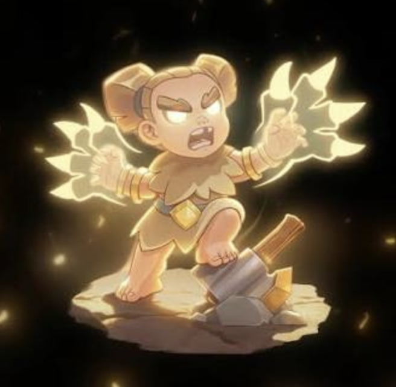

以前普通狂战士只是一个小单位，到了精英形态，她才真的像个狂战士。

## 符文巨人：符文不是普通装饰

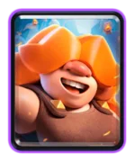

符文巨人的英文是 **Rune Giant**。

**Rune Giant**（符文巨人）并不是严格意义上的正统北欧神话原典角色，它主要出自现代奇幻游戏与桌游中对北欧神话元素的二次创作与衍生。在真正的北欧神话里，巨人统称为约顿（Jötunn），主要分为霜巨人、火巨人与山巨人，并没有专属的“符文巨人”分类。

这里重点看 Rune，也就是符文。

符文原本是日耳曼人及北欧维京人使用的古代文字与神秘符号，和北欧、盎格鲁-撒克逊、古日耳曼文化都有关系。传说主神奥丁（Odin）倒吊在世界树九天九夜才参悟出符文的秘密。

到了现代奇幻作品里，符文经常变成一种“古老魔法文字”。刻在石头上，刻在武器上，刻在遗迹里，看起来就像能启动某种远古力量。

所以符文巨人其实更像是皇室战争受到北欧神话启发，塑造出来的一种身上刻有符文、拥有强化武器或魔法之力的特殊巨人群体——她不是只会往前走的大肉盾，还会给附近单位附魔，让队伍获得额外效果。

## 野蛮人精锐不是神话角色

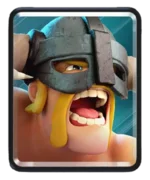

最后看野蛮人精锐。

严格说，它不是北欧神话里的具体角色。

但它一看就有很浓重的维京味道——金发、肌肉、标志性的角盔、近战武器，还有那种一往直前的野蛮气质。

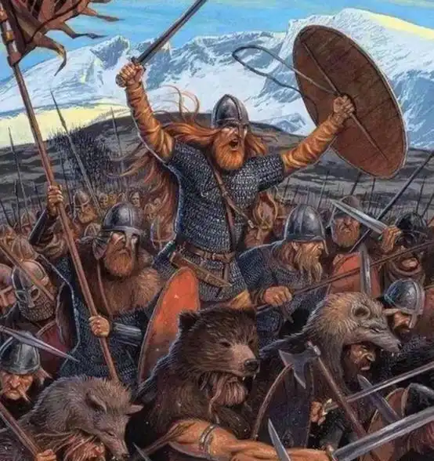

第 86 赛季觉醒野蛮人精锐以后，又加了远程标枪和狂暴路径，这个形象就更像冲进战场的维京猛男了。

这里有个小知识：现实历史里的维京战士，并不真的普遍戴角盔。角盔更多是后来戏剧、歌剧、插画和流行文化里慢慢固定下来的维京想象。

所以 8 月赛季把野蛮人精锐也放进强化卡牌里，倒并不突兀。它不是神话人物，但站在女武神、狂战士、符文巨人旁边，也还算是很搭。

## 世界树、符文塔

这一季除了卡牌，美术也在往北欧方向走。

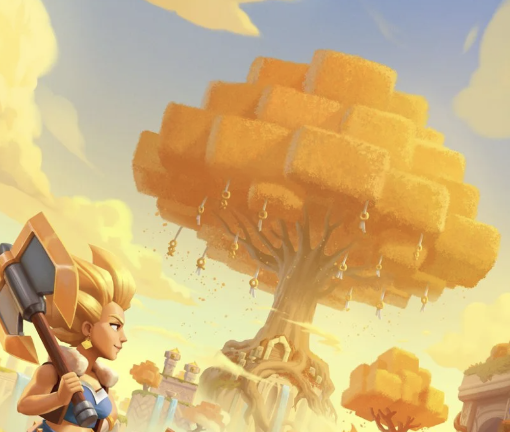

第 86 赛季的启动界面里，能看到类似世界树的构图。北欧神话里的世界树一般指 **Yggdrasil**，它连接不同世界，是北欧神话宇宙观里很重要的东西。

维京符文塔楼皮肤也是同一套思路。包括塔楼、包括竞技场，都是无处不在的神秘符文。

## 为什么 Supercell 很爱这些元素？

Supercell 是芬兰公司。严格说，芬兰文化和传统北欧神话不是一回事。芬兰有自己的史诗和神话系统，比如《卡勒瓦拉》。

但从地域、流行文化和现代游戏表达来看，北欧神话、维京、符文、战乙女、狂战士这些元素，对 Supercell 来说肯定不陌生。

这套东西似乎也挺适合皇室战争。

皇室战争有中世纪的风格——它像童话王国 + 竞技场 + 夸张卡通的混合体。北欧神话和维京文化倒也能提供一批好用的符号。

女武神对应战场和斧子，狂战士对应狂暴和最后一搏，符文对应古老魔法和附魔。世界树负责把神话背景铺开，野蛮人精锐在这里更多则是维京风格的一种补充。

其实，细心深扒，游戏除了游玩，还有其他的乐趣。
