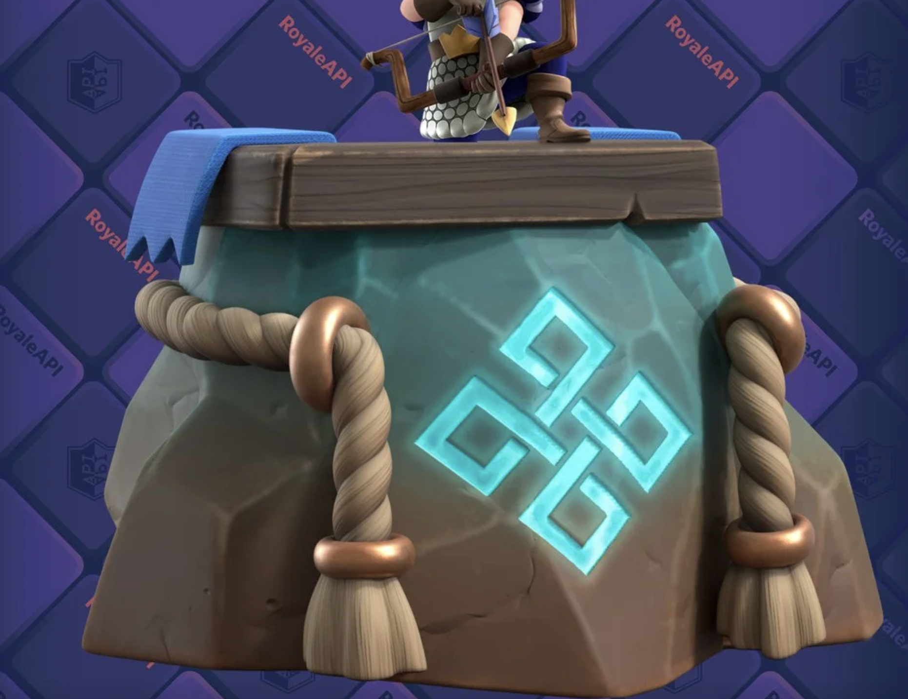

皇室战争 8 月赛季的主题叫 K.H.A.O.S 混沌试炼。

不过从赛季图、强化卡牌到塔楼皮肤，这一季最明显的味道不是“混沌”，而是北欧神话和维京风格。

女武神、狂战士、符文巨人，刚好都是这次的强化卡牌。旁边还有野蛮人精锐、符文塔楼皮肤，以及启动界面里的世界树。

这些元素放在一起，很难不让人想到北欧神话、维京战士和现代奇幻作品里的那套符号。

这篇文章不考据到论文级别，只整理玩家最容易感知到的几个来源：女武神、狂战士、符文巨人、野蛮人精锐、世界树和符文塔。

## 这三张卡不是随便选的

先看强化卡牌。

第 86 赛季强化的卡里，最显眼的这三张红头发：

- 女武神
- 狂战士
- 符文巨人

这三张卡都能连到北欧神话或北欧文化。

女武神是神话里的战乙女。狂战士来自北欧传说里的狂暴战士。符文巨人的符文，则指向古代日耳曼文字，也指向现代奇幻作品里常见的神秘符号。

三张一起强化，再配上本赛季的美术风格，就很难说是巧合了。

## 女武神：战场上引领亡魂的女神

先说女武神。

女武神的英文是 **Valkyrie**。在北欧神话里，她们不是普通女战士，而是和奥丁、战场、英灵殿联系在一起的存在。她们会在战场上挑选战死的勇士，引领英雄灵魂前往英灵殿。

所以女武神这个词本身就带着战场、死亡和荣耀这些含义。

皇室战争里的女武神当然是卡通化处理，但大斧、近战、人堆里转圈，这几个关键词放在一起，确实很 Valkyrie。

很多人第一次知道女武神，可能不是从北欧神话原典开始，而是从漫威《雷神》里的瓦基里开始。

漫威电影里的瓦基里，和皇室战争里的女武神当然不是同一个角色。但源头是一回事：北欧神话里的 Valkyrie 概念进入现代流行文化以后，衍生出了很多版本。

漫威里的瓦基里、皇室战争里的女武神，还有很多游戏里的“战乙女”，源头都绕不开北欧神话里的奥丁、战死者和英灵殿。

## 狂战士：进入狂暴状态的北欧战士

狂战士的英文是 **Berserker**，这个词在游戏里太常见了。

它的源头也和北欧文化有关。

狂战士（Berserker）常被音译为“巴萨卡”，指北欧传说中能够进入狂暴状态作战的战士。现代英语里的 berserk，也和这个词有关。

Berserker 常被解释为“身披熊皮者”，大致来自熊与衣衫的组合。传说里也有披着狼皮战斗的 Úlfhéðnar，以及与野猪阵形相关的 Svinfylking。到了现代游戏里，这些复杂来源通常会被压缩成一个更直接的形象：失去理智、越打越凶、最后一口气也要砍出去。

再来看看精英狂战士的技能，看起来就很对味了。精英狂战士开技能后进入狂暴状态，攻速提升，而且技能期间生命值不会低于 1。

普通狂战士只是一个小单位。到了精英形态，技能把“狂暴”和“最后一搏”这两件事补上了，她才真正像个狂战士。

## 符文巨人：符文不是普通装饰

符文巨人的英文是 **Rune Giant**。

Rune Giant 并不是严格意义上的北欧神话原典角色，更像是现代奇幻作品对北欧元素的再加工。真正的北欧神话里有约顿（Jötunn）这样的巨人族群，但没有一个专门叫“符文巨人”的固定分类。

这里重点看 Rune，也就是符文。

符文原本是日耳曼人及北欧维京人使用的古代文字与神秘符号，和北欧、盎格鲁-撒克逊、古日耳曼文化都有关系。传说主神奥丁（Odin）倒吊在世界树九天九夜才参悟出符文的秘密。

到了现代奇幻作品里，符文经常变成一种“古老魔法文字”。刻在石头上，刻在武器上，刻在遗迹里，看起来就像能启动某种远古力量。

所以符文巨人更像是皇室战争借用了北欧神话和现代奇幻里的符文意象，做出来的一种“身上刻着符文、能给队伍附魔”的巨人。她不是只会往前走的大肉盾，还会让附近单位获得额外效果。

## 野蛮人精锐不是神话角色

最后看野蛮人精锐。

严格说，它不是北欧神话里的具体角色。

但它一看就有很浓的维京味道：金发、肌肉、角盔、近战武器，还有那种一往直前的野蛮气质。

第 86 赛季觉醒野蛮人精锐以后，又加了远程标枪和狂暴路径，这个形象就更像冲进战场的维京猛男了。

这里有个小知识：现实历史里的维京战士，并不普遍戴角盔。角盔更多是后来戏剧、歌剧、插画和流行文化里慢慢固定下来的维京想象。

所以 8 月赛季把野蛮人精锐也放进强化卡牌里，倒并不突兀。它不是神话人物，但站在女武神、狂战士、符文巨人旁边，也还算是很搭。

## 世界树、符文塔

这一季除了卡牌，美术也在往北欧方向走。

第 86 赛季的启动界面里，能看到类似世界树的构图。北欧神话里的世界树一般指 Yggdrasil，它连接不同世界，是北欧神话宇宙观里很重要的意象。

维京符文塔楼皮肤也是同一套思路。塔楼、竞技场和装饰图案里到处都是符文，目的很直接：让你一眼知道这不是普通王国赛季，而是“北欧风”的皇室战争。

## 为什么 Supercell 很爱这些元素？

Supercell 是芬兰公司。严格说，芬兰文化和传统北欧神话不是一回事。芬兰有自己的史诗和神话系统，比如《卡勒瓦拉》。

但从地域、流行文化和现代游戏表达来看，北欧神话、维京、符文、战乙女、狂战士这些元素，对 Supercell 来说肯定不陌生。

这套东西似乎也挺适合皇室战争。

皇室战争本来就有中世纪童话、竞技场和夸张卡通混在一起的气质。北欧神话和维京文化刚好能提供一批好用的符号。

女武神对应战场和斧子，狂战士对应狂暴和最后一搏，符文对应古老魔法和附魔。世界树负责把神话背景铺开，野蛮人精锐则补上维京战士的视觉印象。

所以这一季的强化卡牌并不是随便摆在一起。它们背后有一条很清楚的视觉线索：把皇室战争里原本就偏“野蛮”和“战士”的卡牌，重新包装成一套北欧神话风格。

打游戏当然是为了赢，但偶尔顺着这些设计细节往下挖，也挺有意思。
