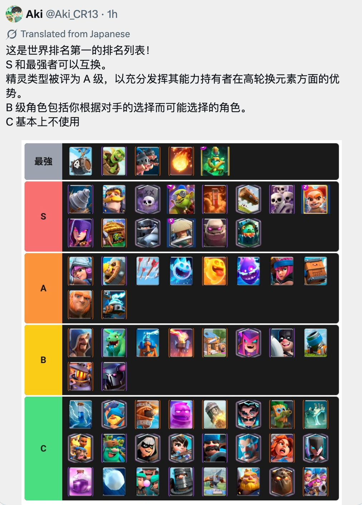

这次混沌超级选卡锦标赛，确实不负“混沌”二字。

本来超级选卡就是选卡的博弈以及实战的考验，现在加上混沌模式卡牌词条的随机性，运气成分大大增加。你看到一堆带混沌效果的卡，第一反应往往是挑最猛、最离谱的那张。选完一看，自己没有稳定进攻，没有法术，防空也稀碎，开局两分钟了还在想这套牌到底怎么赢。

混沌模式确实有运气成分，但它不是完全靠运气。越是这种随机牌池，越要回到卡组构筑的最基本的原则——选卡卡池有些什么卡？你选出来的卡组靠什么核心进攻？最怕什么，能不能处理对面已经选出来的东西？只要这三个问题解决，胜率就会比乱选高很多。

废话不多说，我们先来看一下本来排名第一的玩家 AK13 的推荐 TieList（现在 31 胜止步第四）。

## 法术优先级最高

其实不管是普通超选还是混沌超选，法术几乎都是第一优先级。

混沌选卡里，稳定的法术太重要了。因为会有很多卡牌因为词条的原因，比一般模式 op 很多。火球的好处就很多了，不管是分裂攻击还是飓风火球，都是混沌模式下的大杀器。

如果火球和毒药只出现一张，通常可以直接拿。

如果火球和毒药同时出现，我也会更偏火球。毒药更吃持续压制和站场，火球处理问题更干脆更快速更及时，尤其锦标赛里很多人会拿烟花炮手、火枪手、女巫，火球的容错会更舒服。

没有火球和毒药，就尽量补滚木、万箭齐发、箭雨这一类便宜法术。不要等到最后才想起来自己没有法术，或者法术被对手全都拿完，那基本上这句就歇菜了。

## 强势进攻牌及时拿

强度榜里最高档和 S 档的很多卡，都围绕一个思路，强势词条。

皇家野猪、哥布林飞桶、墓园、哥布林钻机、骷髅气球、石头人这一类牌，在混沌选卡里都非常枪手。原因很简单，它们有直接且强大的词条。

拿了骨球，不管是分裂骨球还是大头骨球，都是对方很头疼的东西。

拿了皇家野猪，随便哪个词条都很实用。

拿了飞桶，一旦出了哥布林硬汉，这局基本就赢了一半。

拿了石头人，不管是分裂石头人还是反弹，那都是大杀器。

至于超远程的爆破手，召唤各种骷髅的墓园，召唤飞行员的骷髅海，随便拿一个都是能改变战局的存在。

这些强势卡牌，有些可能都不是核心，但对不起，在混沌模式里，拿到合适的词条，他们就是核心，甚至胜似核心。

## 坦克的处理

你可以没有特别完美的进攻，但不能完全处理不了大单位。超级骑士、大皮卡、狂战士、骑士、石头人这些东西，一旦对面拿到且选择了合适的词条，譬如直接击飞的超骑。你手里也必须有合适的应对坦克的卡牌，譬如超骑、浪人、大皮卡，甚至是地狱塔和煤气龙等等。

所以，看到对面先拿了大单位，你后面要主动找克制关系。

对面有石头人、大皮卡，地狱塔、地狱飞龙、亡灵系、建筑都要优先考虑。

对面有超级骑士，骑士、大皮卡、地狱塔、或者浪人会很关键。

## 强势的后排

烟花炮手、女巫、火枪手、烈焰法师、飞龙宝宝、暗夜女巫这些牌，在混沌模式里都很强势。

混沌模式它们确实强，尤其是对面没有合适法术的时候，后排拿到合适的词条（譬如火枪和爆破手的超远程、火球法师），速转一下很容易就滚雪球滚起来推过去。

但是，一套牌里最好只保留一到两个主力后排。

一个负责稳定输出。

一个负责范围或者特殊功能。

剩下的位置留给小费、建筑、法术、拉扯牌。混沌局其实也怕啥都有，但是打起来转不动。你牌再强，强势词条的卡牌转不到手里也没用。

## 选卡时要看对面

混沌超级选卡和普通超选最大的共同点，是对面拿了什么你能看见。

这就意味着你不能只按自己的喜好选。对面已经拿了墓园，你还把毒药放过去，后面就别怪自己难受。对面已经没有稳定防空，你看到气球、飞龙宝宝、亡灵大军这类牌，就要立刻意识到这是机会。

超选有时候不只是组一套正常牌，更多时候是在抓对面的空档。对面没有防空，你补空中威胁。对面没有小法术，你拿骷髅军团、飞桶、哥布林团伙。对面没有建筑，你拿野猪、皇家野猪、攻城炸弹人。

还有一种情况也很常见。

一张牌你未必特别想用，但它刚好是对面某张牌的关键答案。这个时候拿走它卡住对方的卡组，有时比拿一张自己喜欢的强卡更赚。超级选卡的乐趣就在这里，很多胜负其实在选牌阶段已经埋好了。

## 至少拿两个核心

这次混沌模式很容易出现离谱局。你只靠单一路线，有时会被对面刚好克死。

所以尽量让牌组里至少有两个核心。皇家野猪可以当主线，时不时扔个骨球也不是坏处，万一这俩随便拿个词条都很好用。

攻击的主核心要清楚，但不能只有一根线。混沌锦标赛打到后面，对手会越来越会防，你得给自己留一点变化。

## 最后几手补短板

前面几手决定方向，后面几手决定这套牌到底合理不合理。最后选牌时，先检查牌组有没有稳定进攻、法术、防空，以及处理大单位或者小费人海的办法。

缺什么补什么。不要最后一手看到一张很强的卡就手痒。很多时候，一张不起眼的滚木、冰雪精灵、建筑，比一张强力卡牌更有用。

如果你的牌组已经很重，最后就补低费。

如果你的牌组进攻很强，最后就补防守。

如果你的牌组全是地面，最后一定补防空。

## 可以按这个顺序选

我的建议顺序大概是这样。先抢火球、毒药这类稳定法术，再拿一张明确进攻牌，比如皇家野猪、飞桶、墓园、钻机、石头人。随后补一张能站场的防守牌，骑士、超级骑士、大皮卡、狂战士、浪人这一类都可以看牌池决定。再往后补防空和后排输出，比如火枪手、女巫、飞龙宝宝、爆破手。中后段再看对面短板，补建筑、小法术、拉扯牌或者第二进攻点。

这套顺序不保证每局都赢，但能减少那种进游戏被对手克死的情况。

这次模式的本质其实很简单，拿到 15 胜虽然要运气，但是选卡好了几乎赢了一半。

别选八张好牌。

选一套能赢的牌。