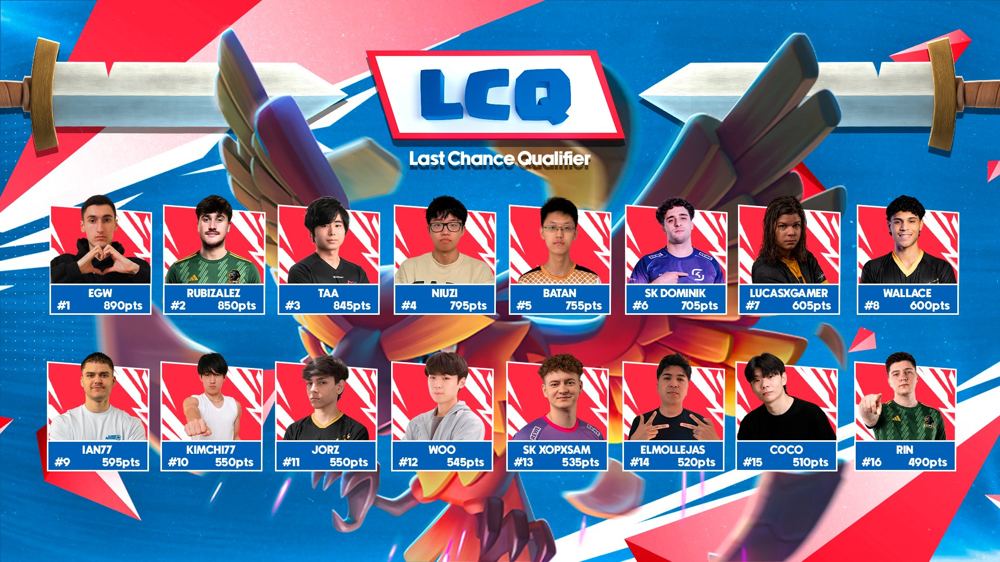
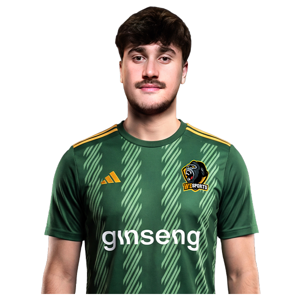
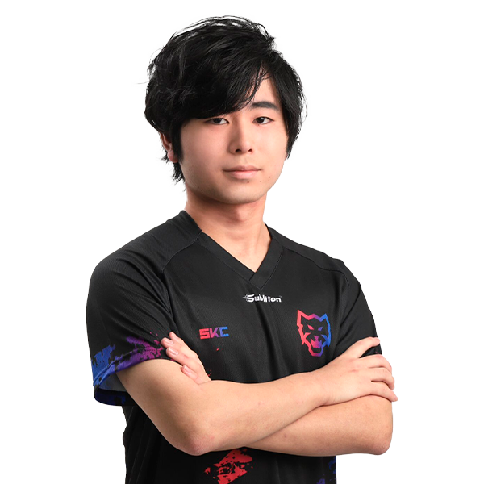
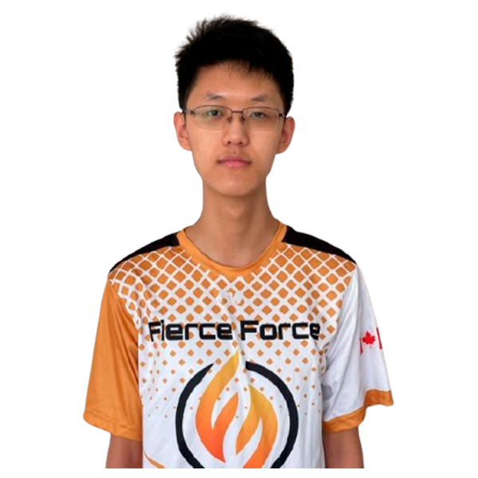
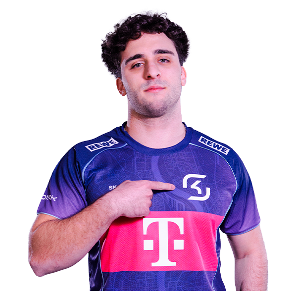
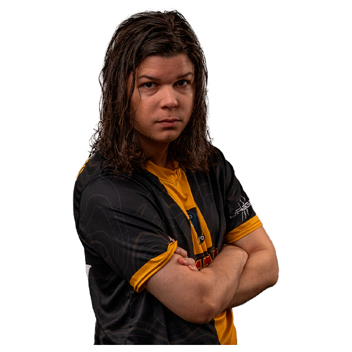
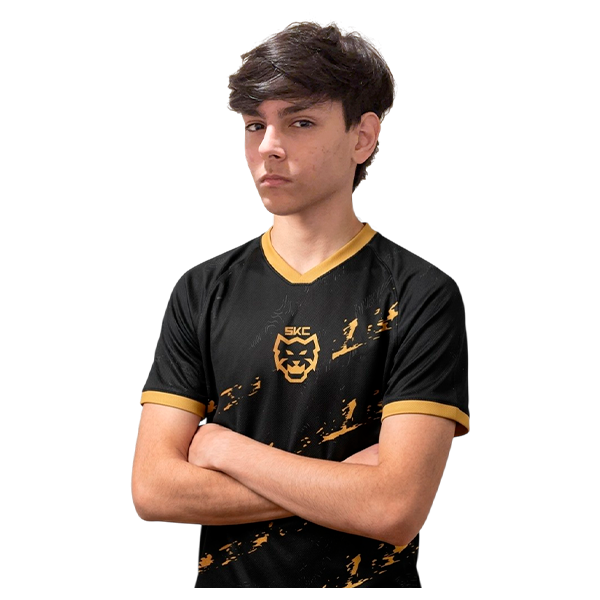
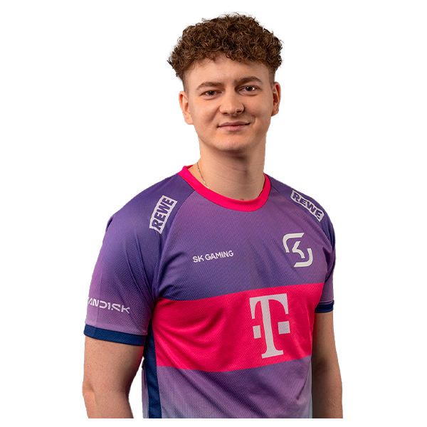
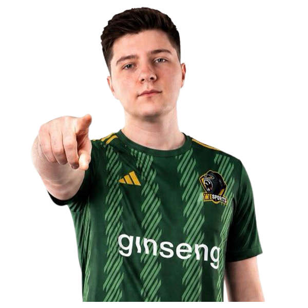

经过 5 个月竞争激烈的皇室战争赛事，CRL26 上海世界总决赛只剩下 **最后 1 个席位**。

现在，一切都来到了最终资格赛。

CRL26 最终资格赛由 CRL积分排行榜第 9 到第 24 名的 16 位选手参加。他们会在一场不容有失的双败淘汰赛中争夺最后机会，最终冠军将拿到世界总决赛最后一张门票。

## 晋级选手

以下是将争夺最后一个世界总决赛席位的 16 名选手。

**1. EGW，890 分**

EGW 是一位很值得关注的选手，以不太常规的卡组和赛后庆祝动作出名。他此前距离直接晋级世界总决赛只差一场胜利。

**2. Rubizales，850 分**

Rubizales 是皇室战争赛事里的老牌强者，成绩履历很扎实，也很擅长在高压赛事里发挥。

**3. Taa，845 分**

Taa 今年开局非常强，前三个月都打进了月度决赛。错过直接晋级世界总决赛以后，他会在最终资格赛里再争取一次机会。

**4. Niuzi，795 分**

Niuzi 是一位稳定性很好的选手，5 月月度决赛里也打出了相当不错的成绩。

**5. Batan，755 分**

Batan 是 CRL26 里冒出来的新秀之一，连续几站比赛都打出了很亮眼的表现。

**6. SK Dominik，705 分**

SK Dominik 刚刚打出一次令人印象深刻的亚军成绩，他会带着这股势头进入最终资格赛。

**7. LucasxGamer，605 分**

LucasxGamer 在 CRL 里有很长的参赛历史。2024 年世界总决赛拿到季军以后，他这次要尝试重回国际舞台。

**8. Wallace，600 分**

Wallace 是很多观众喜欢的选手。他赛季前半段的状态比后半段更强，这次会在压力最大的时候争取反弹。

**9. Ian77，595 分**

Ian77 也是观众非常熟悉的选手。他有好几次距离月度决赛只差一场胜利，现在要冲击自己连续第二次世界总决赛之旅。

**10. Kimchi77，550 分**

Kimchi77 是赛场上的新面孔。今年 4 月月度决赛，他以第 5 名的成绩打出了一个很好的开局。

**11. Jorz，550 分**

Jorz 也是 CRL26 新人。7 月他打出突破表现，拿到第 5 名，而且风格非常激进。

**12. Woo，545 分**

Woo 在 6 月月度决赛拿到第 7 名，这个成绩帮助他获得了最终资格赛名额。

**13. SK Xopxsam，535 分**

SK Xopxsam 是长期征战 CRL 的老将，他希望在自己的 CRL 履历上继续写下新的一笔。

**14. ElMollejas，520 分**

ElMollejas 是 4 月月度决赛季军。现在他回来了，并且已经准备好争夺最后一个世界总决赛席位。

**15. Coco，515 分**

Coco 凭借 8 月月度决赛的稳定表现，最终保住了自己的最终资格赛资格。

**16. Rin，490 分**

Rin 依靠 6 月月度决赛的不错发挥拿到 LCQ 资格。这一次，他希望能以挑战者身份给大家带来惊喜。

## 在哪里观看

准备好了吗？CRL26 最终资格赛将在 **2026 年 9 月 5 日到 9 月 6 日** 举行，开赛时间为 **14 点 UTC**。

换成北京时间，就是 **9 月 5 日 22 点** 和 **9 月 6 日 22 点**。

你可以在皇室战争官方 **YouTube** 和 **Twitch** 频道观看每一场比赛，届时，本蜜各平台的直播间也会同步转播。最终，我们会看到谁能拿到通往上海世界总决赛的最后一张门票。

别错过这场最终资格赛。

