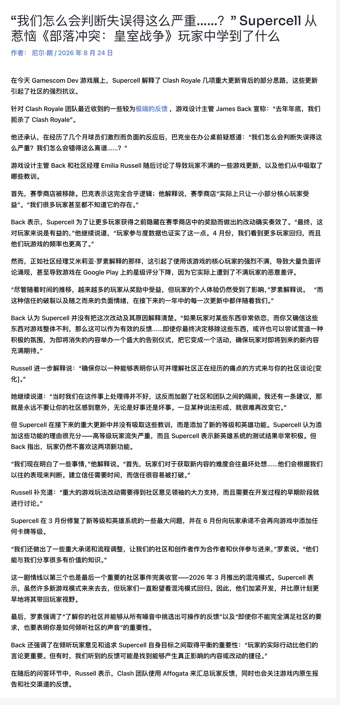

我一直觉得，超级细胞，是一家傲慢的公司。

这里说的傲慢，不是骂街那种傲慢。它偶尔会听玩家的，也会改进，甚至有时候是推到重来那种改。但它很少低头，很少用那种明确的姿态出来说，对不起，这次我们做错了。

所以最近 Mobilegamer.biz 发的这篇报道，也依然是熟悉的味道。

皇室战争团队在科隆游戏展前接受采访，聊了去年几次失败的大更新。游戏设计负责人 James Back自己亲口承认，他的大意是，**去年年底，团队把皇室战争给“杀死”了**。

这里 Po 一下报道的翻译原文：

团队把皇室战争杀死了，这句话分量很重。

不过，整篇报道看下来，团队承认了误判，整篇都在复盘，都在解释当时为什么会那样想。策划团队很擅长这些，它会承认自己没做好，会承认沟通失败，会承认玩家信任受损。

**但是向玩家表示歉意？对不起，不存在的。**

皇室战争历史上，这种公开场合级别的认错不多。我印象里，皇室战争十周年视频中， 策划 Seth 回头谈部落战2，承认那是一次很糟糕的更新，再加上这次 James Back 说去年年底他们把皇室战争搞砸了，这应该就是我印象里的唯二两次。

所以这次还是值得聊一下。

### 官方这次到底说了什么

报道里主要复盘了几个节点。赛季商店被移除，精英系统和 16 级相关更新，还有后面团队怎么重新理解玩家反馈。

### 移除赛季商店

第一个先说赛季商店。

James Back 的解释是，赛季商店在他们看来并不是一个服务大多数玩家的系统。它更多被一小部分核心玩家使用，很多玩家甚至不知道它存在。据此，官方后来移除了赛季商店，把商店中的奖励换到更多活动和其它入口里，从数据看，确实有更多玩家拿到了奖励，参与度也变高了。

但玩家为什么会骂？

因为赛季商店给人的感觉很明确。你每天打上几盘攒攒代币，然后自己决定换什么。想换魔法物品就换魔法物品，想换碎片就换碎片，至少选择权在自己手里。

但是奖励分散到活动中后，你拿到的是随机奖励，是系统定死的，对于大部分还需要养成的玩家来说，其实并不如以前具有选择权的赛季商店。

### 精英和16级

第二个大问题，是精英系统和 16 级。

官方的说法是，高等级玩家在流失，他们需要新的成长目标。测试时精英系统反馈不错，所以团队认为这是一个可行方向。

这套逻辑其实在手游里很常见，一个游戏上线足够长时间之后，满级玩家没什么追求了，付费和活跃都会降低。官方给这批人新的目标，在其他的游戏里都是基操。

问题在于，皇室战争是一款竞技游戏。等级是有数值差距的，在别的游戏里提升等级可能无关紧要，在皇室战争里会直接变成对局等压。而且大家已经追了很多年的卡等，突然又被往后推了一级，这种感觉很伤。

精英系统也有类似问题。

精英卡牌看起来更有趣，因为它有主动技能，也会带来玩法变化。但它也更容易打破原来的对局经验。很多精英卡的技能都已经改变了原有的卡牌交互，技能一开，可能直接影响战局。

普通玩家第一次试玩，可能觉得还不错。老玩家和高分段玩家会更快看到问题。他们会想到突然死亡阶段，会想到大型单位后排会不会被一拳处理，会想到某张卡一旦变成了精英，原来的克制关系会发生什么样的变化。

这也是我觉得官方以后真要长点心的地方。像精英、等级这种大系统，不适合临上线前才让社区知道。你可以不把所有内容都公开，但至少要更早让一批真正懂对局的人看到方向。所谓当局者迷，职业选手、高分玩家、长期创作者，他们不一定能给出完美答案，但他们确实能看到很多官方自己没发现的细节问题。

### 沟通要及时

这次采访里，官方还反复提到了沟通。

James Back 认为，如果玩家特别依赖某个系统，而团队又确信那个系统对游戏整体不健康，那么这本身就是有用反馈。哪怕最后还是要移除，也应该把话讲清楚，给这个系统一个体面的结束，让玩家知道旧东西为什么走，新东西又能带来什么。

Emilia Russell 也提到，团队当时没有很好地让社区感受到他们理解玩家的痛点，结果加深了团队和社区之间的距离。她还说，不要让社区被突然袭击，好的坏的都一样。

这点我一开始也觉得有点奇怪，意外的惊喜不是更好么？

但仔细想想，还真是这样。比如 8 月这次涉及到几乎 40 多张卡牌的大平衡性调整，官方提前几个月就说会有一轮比较大的调整。玩家知道它要来，创作者也有时间整理建议，社区至少有个心理预期。

但是如果之前没有告知，突然做了这样一个几乎都快要动到底层交互的平衡性调整（譬如几个豆子和塔的交互），那玩家一定会猜，是不是流水出问题了？是不是被骂怕了？就算改的不错，怕是也得被骂的够呛。

所以沟通不能只靠补丁说明。有时候还是需要提前，提前要让玩家知道为什么改，也要给愿意认真反馈的人留出参与空间。

### 玩家说什么和玩家做什么

采访最后还有一个很有意思的观点。James Back 提到，他们会看玩家做什么，而不只是听玩家说什么。

这句话其实很多游戏的团队都说过，**玩家很擅长吐槽，但玩家给出的解决方案未必适合真正上线**。

这句话是有道理的。

玩家确实不一定会给出最好的方案。有人会说以前的 1479 等级最好，有人会说没有觉醒最好，也会有人要求精英全部重做。问题是怀旧皇室不是没搞过，从 royaleapi 的统计数据来看，玩的人是少的可怜，只是因为经典皇室是他们嘴上的白月光。如果一切都按社区的意思去做，估计皇室战争也得到头了。

但是不可否认，玩家指出问题的能力很强。大量玩家同时骂一个东西，那说明那个地方一定有问题。更何况皇室战争社区里有很多职业玩家、高水平玩家和创作者，他们不是只会抱怨，他们也对游戏有很深的理解。

**虽然雅典式民主不可取，但是当做意见和建议的来源是完全可行的。**

这次官方也承认，玩家和创作者的知识很有价值，后续会更早把他们当作合作对象。我认为，这个方向是对的。

### 混沌模式

报道里还提到混沌模式。

很多新模式在皇室战争里都是昙花一现。

但是混沌模式是非常特别的一个模式，因为玩家确实想让它回归。官方也听到了这个声音，把它继续打磨了一下，本月以混沌模式 2.0的方式进行了回归。8月，混沌模式贯穿了整个赛季，各种细化的模式，甚至还有天梯以及全球锦标赛。

这是第一次，一个娱乐模式占据了整个赛季的主场。

玩家喜欢什么，官方看到数据和反馈，然后把它做得更好。好玩的模式、还行的奖励、能和朋友一起玩的乐趣，这些东西都是玩家留存的理由。

尤其是皇室战争这种老游戏，它不缺基础玩法，它最怕的是没有创新，没有新鲜血液，没有蓬勃向上继续发展的动力。

多说一句题外话，混沌模式完全是国内开发团队疯皇大乱斗出口转内销，在这里必须给国内开发团队点个赞！反观鸡服，10年搞出哪些像样的娱乐模式了？

### 说在最后

这次采访吧，官方承认去年那几轮更新重创了游戏，也承认玩家现在不信任他们，是因为他们自己的作死历史记录，这当然比以前 ceo那种居功自傲，画大饼式的演讲好的多。

但是，信任这东西，掉下去很快，想要重新建立却是一个漫长的过程。

玩家不会因为一篇采访就吃了定心丸，大家最后还是看更新，看后续精英怎么出，看会不会为了营收 KPI 而继续OP 式推新卡和新精英，看官方承诺的“不再增加新卡牌等级”能不能算数。

最近皇室战争确实有一些比较积极的动作。8月大平衡做得我还算满意，赛季中紧急性平衡调整也来了（虽然远未调整到位），天梯上 PY 交易的问题官方也开始处理，混沌模式这种玩家喜欢的娱乐模式居然也能贯穿赛季，整体的方向看起来比去年好了不少。

但是，皇室战争拉回玩家重新建立信任，靠一次认错和道歉不够。它需要连续几个月，甚至更长时间，用一轮一轮更新证明自己真的听懂了。

更准确地说，它这次甚至没有道歉。

它只是终于把问题说出来了。

参考来源

[Mobilegamer.biz 关于皇室战争团队采访的报道](https://mobilegamer.biz/how-did-we-misjudge-this-so-badly-what-supercell-learned-from-its-fierce-clash-royale-community/)
