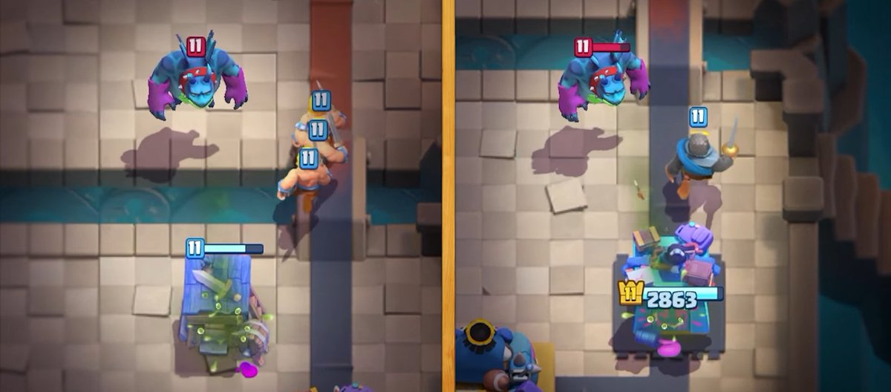
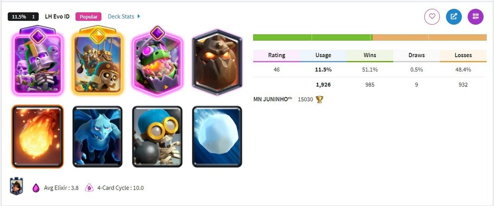
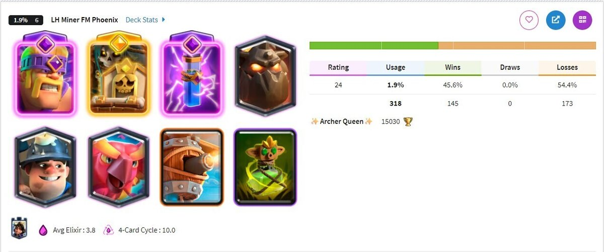
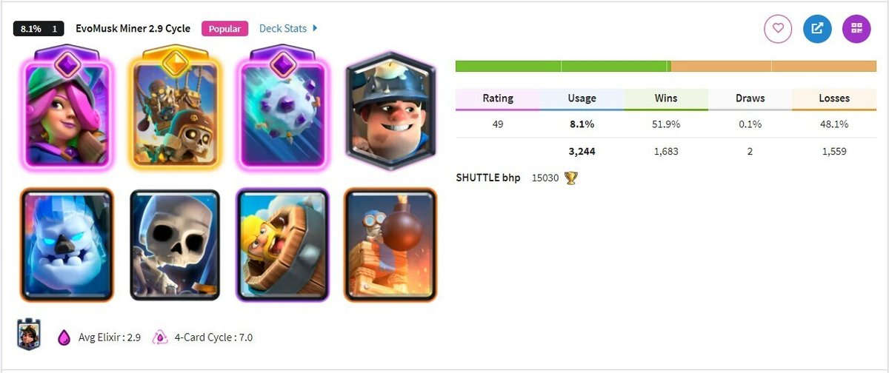
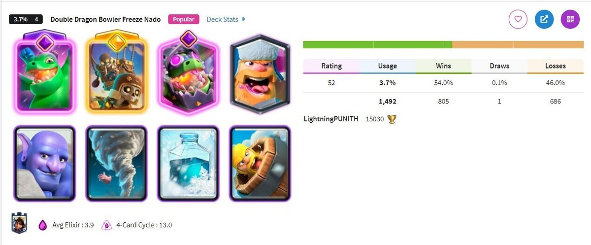
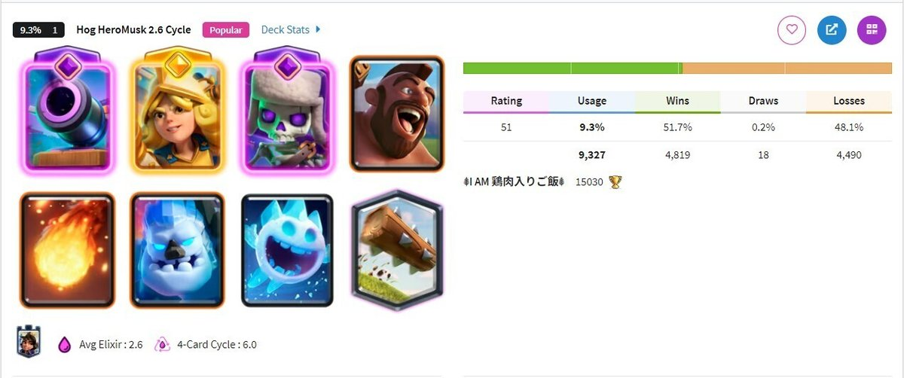
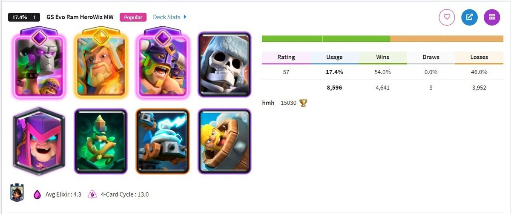

皇室战争 9 月赛季的新卡已经确定，是 **亡灵巨人**。

这张卡第一眼不会让人觉得特别夸张。它没有精英技能，没有觉醒循环，也没有那种一出场就让人血压上来的动画。简单讲，它就是一只会飞的巨人，4 费，只打建筑，站在空中远程吐毒。

但这张卡越看越不对劲。

因为皇室战争以前没有这种位置。天狗很肉，但 7 费很重。气球爆发高，但摸不到塔就容易亏。亡灵巨人夹在中间，费用低，血量够，输出还不算低。它不一定会一上线就把环境打穿，但它很可能逼很多卡组重新考虑一件事。

你到底有没有稳定的对空和建筑。

## 先看基础信息

亡灵巨人是 9 月第 87 赛季的新卡，也是皇室战争 2026 年推出的第二张普通新卡。按照目前资料，它是稀有卡，费用 4 圣水，属于飞行单位，只会攻击建筑和公主塔。

官方卡牌描述里提到，它是在制造毒素的实验中意外形成的怪东西，会从空中锁定建筑，并在远处吐出毒液。这个设定倒是很符合亡灵一家的味道，有点恶心，但辨识度很高。

目前开发服里的核心数值如下，以 11 级锦标赛标准为准，正式上线前仍然可能调整。

| 项目 | 数值 |
|---|---|
| 费用 | 4 圣水 |
| 稀有度 | 稀有 |
| 类型 | 飞行单位 |
| 目标 | 建筑 |
| 生命值 | 1817 |
| 单次伤害 | 189 |
| 攻击速度 | 1.5 秒 |
| 每秒伤害 | 126 |
| 移动速度 | 中等 |
| 视野范围 | 6.5 |
| 射程 | 4 |
| 质量 | 15 |

光看这张基础表，可能还没那么直观。亡灵巨人的麻烦，要放进同类卡里看。

## 1817 点生命值是什么概念

先拿中型地面单位做个对照。

| 卡牌 | 生命值 |
|---|---|
| 骑士 | 1766 |
| 亡灵巨人 | 1817 |
| 绿林小哥 | 1832 |
| 女武神 | 1907 |

亡灵巨人的生命值比骑士还高一点，接近绿林小哥和女武神。单独看这不算离谱，问题是它会飞。地面单位摸不到它，很多防守牌天然少了一半作用。

再把它放到飞行单位里看。

| 卡牌 | 生命值 |
|---|---|
| 地狱飞龙 | 1295 |
| 气球兵 | 1676 |
| 亡灵巨人 | 1817 |
| 熔岩猎犬 | 3581 |

这就比较扎眼了。亡灵巨人比气球兵还肉，约等于半只熔岩猎犬。雷电法术和火箭单独都打不死它，虚空如果三段完整命中可以处理，但实战里经常会被旁边单位分伤。

所以这不是随手一张法术就能清掉的 4 费牌。防守方最好有建筑拉走它，或者准备足够稳的对空输出。

## 和天狗正面对比

亡灵巨人最容易被拿来和天狗、气球比较。

天狗是传统空军坦克，费用 7，血量高，主要价值是吸收伤害和带后排。气球是爆发型建筑目标，一下特别痛，只要摸到塔就赚。亡灵巨人看上去夹在中间，但使用思路不会完全像这两张卡。

RoyaleAPI 把亡灵巨人和熔岩猎犬放在一起做了对比，这张表很关键。

| 项目 | 熔岩猎犬 | 亡灵巨人 |
|---|---|---|
| 费用 | 7 | 4 |
| 目标 | 建筑 | 建筑 |
| 生命值 | 3581 | 1817 |
| 移动速度 | 慢 | 中等 |
| 视野范围 | 5.5 | 6.5 |
| 质量 | 5 | 15 |
| 半径 | 0.75 | 0.75 |
| 射程 | 3.5 | 4 |
| 单次伤害 | 53 | 189 |
| 攻击速度 | 1.3 秒 | 1.5 秒 |
| 每秒伤害 | 41 | 126 |

这张表能看出几个很实际的差别。

亡灵巨人的视野范围更大，所以更容易被建筑勾走。只要防守方带建筑，亡灵巨人摸塔效率会明显下降。

它移动速度更快，射程也更远。对面没建筑的时候，它到塔前开吐的速度会比天狗更直接，不需要等半天铺一大波。

再看输出。天狗本体 DPS 只有 41，更多是在给后排扛伤害。亡灵巨人 DPS 126，已经是自己能打塔血的主攻牌。RoyaleAPI 测试里，如果公主塔没人管它，亡灵巨人倒下前大概能打 7 下，总伤害 1323，差不多是公主塔 40% 的血量。

4 费卡能做到这一点，不能只当小玩具看。

## 输出接近谁

再看一张输出对照表。

| 卡牌 | 单次伤害 | 攻击速度 | 每秒伤害 |
|---|---|---|---|
| 熔岩猎犬 | 53 | 1.3 秒 | 41 |
| 亡灵巨人 | 189 | 1.5 秒 | 126 |
| 飞行器 | 171 | 1.1 秒 | 155 |
| 皇家巨人 | 307 | 1.8 秒 | 171 |
| 气球兵 | 640 | 2 秒 | 320 |

亡灵巨人肯定没有气球兵那种一锤定音的爆发，也没有皇家巨人那种远距离架炮的压制感。它更像一张肉很多的飞行器，能站住，然后一下一下把塔血磨掉。

这也是我觉得它最容易被低估的地方。

大家习惯把建筑目标牌分成两类。天狗这种大肉盾，气球这种爆发核。亡灵巨人换了一个思路，它更像一张高循环空中主攻。单波看起来没那么吓人，但 4 费能反复下，反复逼你交建筑和对空。

一场比赛里它不一定需要打出一次大爆发。它只要每次摸两下，防守方就会很烦。

## 飞行、远程、建筑目标，这三个词放一起很烦

亡灵巨人的强度，很大一部分来自它的三个标签。

它会飞，所以地面单位碰不到它。你用骑士、女武神、迷你皮卡这些卡去守，完全没用。

它只打建筑，所以不会被普通地面单位拉走。对面如果没有建筑，亡灵巨人会直奔公主塔。

它还是远程攻击，射程 4。这意味着它不一定非要贴脸才能输出。只要走到射程，它就开始吐毒。

这三个特点叠在一起，就会让防守要求变得很具体。你需要空中输出，需要建筑，或者需要能稳定处理空中单位的法术和技能。

如果你的卡组本来就怕气球、天狗，那亡灵巨人上线以后大概率也会让你头疼。

## 最容易吃亏的是没有建筑的卡组

从目前资料看，稳定的建筑拉扯是亡灵巨人最怕的防守方式。

RoyaleAPI 提到，它的视野范围比天狗更高，达到 6.5。视野范围更大，意味着建筑更容易把它吸过去。这个设定应该就是留给防守方的主要解法。

问题是，现在很多卡组并不带建筑。

如果你没有加农炮、地狱塔、电塔、墓碑这种稳定拉扯点，就只能靠空中火力硬解。可亡灵巨人血量又不低，雷电法术和火箭单独都打不死它。虚空如果完整打满三段，伤害能到 2088，倒是可以处理掉，但这也要求你抓得准，而且不能被其它单位分伤。

kabutom 的先行体验里提到，能一对一比较干净处理亡灵巨人的单位并不多，像亡灵大军、觉醒猎人、精英法师这类才比较稳。

这就说明一个问题。亡灵巨人如果流行，环境里建筑使用率和对空单位都会变多。

## 它的隐藏强点是“不容易被推走”

亡灵巨人名字里带巨人，血量却不像真巨人。普通巨人 11 级有 3968 血，亡灵巨人只有 1817，差距很明显。

但它确实有一个很“巨人”的地方，就是重量。

简单说，它对很多击退效果有很强抗性。普通雪球、火球、飞斧屠夫类击退，对它不太好使。它会继续往建筑和公主塔走。

能动它的主要是飓风、觉醒雪球、精英法师、精英巨人这类更强控制。

这点很关键。很多时候我们防建筑目标单位，会靠雪球、火球、击退去拖时间。亡灵巨人如果不吃这套，它就会逼你交更硬的答案。

kabutom 还提到，飓风可以移动亡灵巨人，但单靠一张飓风大概率没法轻松激活国王塔。这个细节很有意思。它说明亡灵巨人不是完全不能控，但控它没那么省心。

## 卡组方向别只盯着天狗

亡灵巨人上线以后，最有意思的部分应该是卡组开发。kabutom 文章里给了几组很有参考价值的思路图，我觉得可以分成三条路看。

这些只是开发服和先行阶段的判断，不代表正式服第一周就一定这么打。但思路本身很有用，至少能说明大家会从哪里开始试。

### 天狗位

第一条路很自然，把亡灵巨人塞进天狗体系的位置。

这条路的好处是空军组件现成。飞龙宝宝、飞行器、亡灵、骷髅飞龙、矿工、法术，这些东西本来就适合围绕空中主攻去打。

但亡灵巨人不能照搬天狗那套。天狗 7 费，血量够厚，可以沉底慢慢组织一波。亡灵巨人只有 4 费，血量只有天狗一半左右，走得还更快。它更适合小波次压迫，不适合把全部家当都压在一波里。

这类卡组如果成立，会更像轻型天狗。少一点大推进，多一点反复试探。对面建筑交早了，下一波就换路或者挂矿工。对面防空交掉了，就补飞行器和小亡灵继续磨。

### 气球位

第二条路是拿亡灵巨人去替气球位。

这条路要换脑子。气球兵摸到塔，一下就是大事。亡灵巨人没有这个爆发，它不能靠一次连接直接把塔打残。

它的价值更像持续占塔仇恨。亡灵巨人在前面吸引公主塔和防守牌，矿工、毒药、飞行器或者其它小单位在旁边拿伤害。它摸塔赚，不摸塔也能逼对面交牌。

所以亡灵巨人配矿工毒药，我觉得会是新赛季很值得看的方向。矿工能挖对空单位，也能跟着亡灵巨人一起蹭塔。毒药能压火枪手、弓箭手、亡灵大军这类防守牌。只要循环速度够快，对面很容易一直被迫回答。

### 4费和5费主攻替代位

第三条路更像黑马。亡灵巨人不一定只进传统空军卡组，也可能替代一些 4 费或 5 费主攻。

原因很简单，它对没有建筑的卡组压力太直接。现在不少卡组为了进攻强度和循环，会放弃建筑。遇到野猪、皇家猪、矿工这些东西还能靠地面单位和法术周转一下，遇到亡灵巨人就麻烦了。地面单位拉不走它，普通法术又不够干净。

这种情况下，亡灵巨人可以成为一张很讨厌的换路牌。你前面刚把建筑交掉，它后面 4 费再来一只。它不需要每波都赚很多，只要稳定蹭血，压力就会累积。

我个人更看好这条路。因为新卡刚上线时，大家最容易先把它塞进老体系。能打出强度的卡组，往往要等一批玩家把旧思路拆开，再慢慢试出来。

## 它怕什么

亡灵巨人怕的东西也很清楚。

第一是建筑。

视野范围 6.5，让它更容易被建筑拉走。只要建筑放得好，亡灵巨人就要先处理建筑，摸塔效率会下降很多。

第二是稳定对空。

亡灵大军、猎人、精英法师、火枪手、飞行器、弓箭手这类卡都可能成为它的主要解法。尤其是能高爆发处理空中单位的卡，会很吃香。

第三是虚空。

虚空三段打满可以处理亡灵巨人。问题是实战里对面不一定让你舒服地打满，尤其亡灵巨人旁边如果还有其它单位，虚空伤害就会被分散。

第四是节奏。

亡灵巨人虽然 4 费，但它不是防守神卡。它只打建筑，守地面单位基本帮不上忙。如果你卡组里把它当主攻，防守体系就要重新搭。否则一旦前期乱下，被对面地面推进打穿也很正常。

## 值不值得练

如果你资源比较紧，我建议先拿到卡，先别急着把万能卡全砸进去。

原因很简单，新卡上线前后的强度波动通常会比较大。亡灵巨人目前看起来不弱，但它不像精英狂战士那种一眼超模的压迫感。它更吃环境，也更吃卡组开发。

如果新赛季大家都不带建筑，亡灵巨人可能会很舒服。可一旦环境里建筑变多，对空也变多，它的强度就会被压下来。

不过这张卡肯定值得关注。

因为它填的是一个以前几乎没有的空位。4 费飞行远程建筑目标，既能当主攻，又能当轻推进的压力点。就算它第一周没有立刻统治环境，后面也很可能随着卡组开发慢慢找到位置。

## 升级成本和获取方式

亡灵巨人会在 9 月赛季上线。

目前资料显示，它可以通过新一轮 Album Event 免费获取，其中大奖包含 1000 张亡灵巨人卡牌。赛季结束后，它预计会进入奖杯之路 5 阶竞技场，也就是 1300 杯后解锁，再从宝箱等常规渠道获取。

如果要把亡灵巨人从初始一路升满，RoyaleAPI 给出的总成本是 4786 张卡和 365600 金币。如果不靠宝箱慢慢攒，直接用宝石购买这些卡，成本是 10480 宝石。

升级需求大致如下。

| 等级 | 卡牌 | 金币 |
|---|---|---|
| 3 | 1 | 0 |
| 4 | 1 | 50 |
| 5 | 4 | 150 |
| 6 | 10 | 400 |
| 7 | 20 | 1000 |
| 8 | 50 | 2000 |
| 9 | 100 | 4000 |
| 10 | 200 | 8000 |
| 11 | 300 | 15000 |
| 12 | 400 | 25000 |
| 13 | 550 | 40000 |
| 14 | 750 | 60000 |
| 15 | 1000 | 90000 |
| 16 | 1400 | 120000 |
| 合计 | 4786 | 365600 |

它的卡牌专精也会同步开放。根据资料，任务包括赢得对战、造成伤害，以及攻击建筑，完成后主要奖励金币。

## 最后聊聊强度预期

我对亡灵巨人的第一印象，是它不会像某些精英卡那样一上线就把人打到血压拉满，但它很可能会偷偷改变环境。

它逼大家重新考虑两个问题。

你的卡组有没有建筑。

你的对空够不够稳定。

如果这两个答案都不太好，亡灵巨人会让你守得很难受。它不需要一下打爆你，只要反复摸塔、逼你多交牌，节奏慢慢就歪了。

所以我的初步评价会给到中上。

它未必是超模卡，但开发空间很大。尤其是高循环亡灵巨人、矿工毒药亡灵巨人、轻量空军体系，这几条路线都值得新赛季重点观察。

当然，正式上线前数值仍然可能调整。等 9 月赛季开了以后，我会继续看实战环境，到时候再给大家补一版卡组和对局体验。

参考资料

[RoyaleAPI 亡灵巨人资料](https://royaleapi.com/blog/minion-giant-september-2026)

[kabutom 亡灵巨人先行体验](https://note.com/kabutom/n/nc98b5b88ef57)
