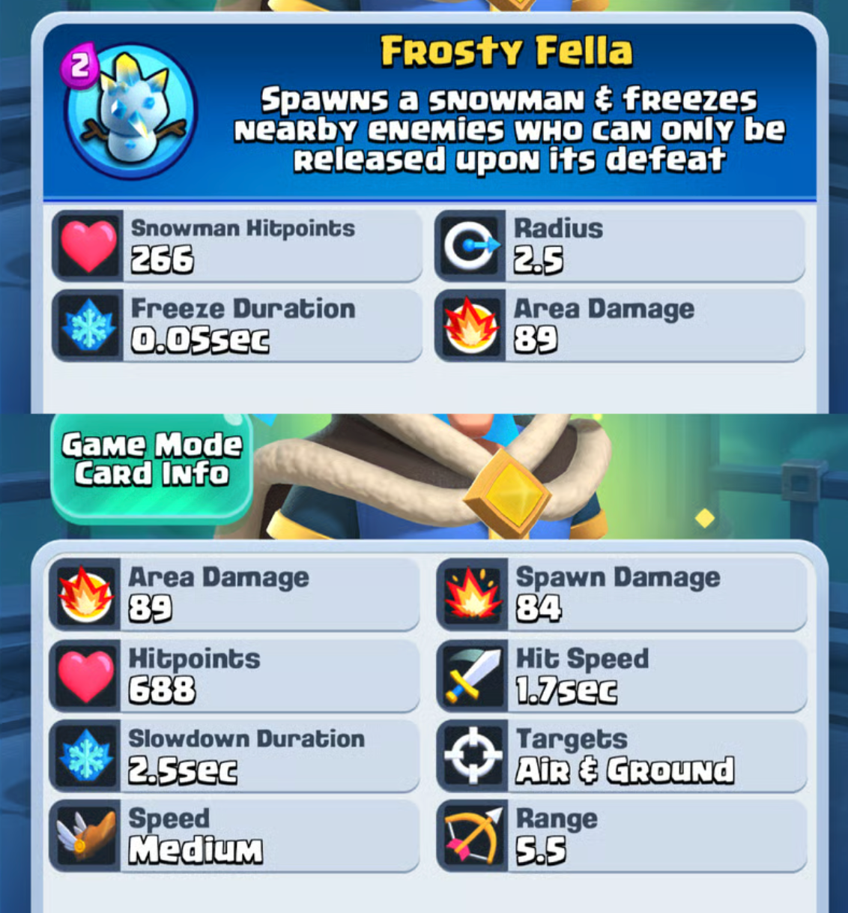
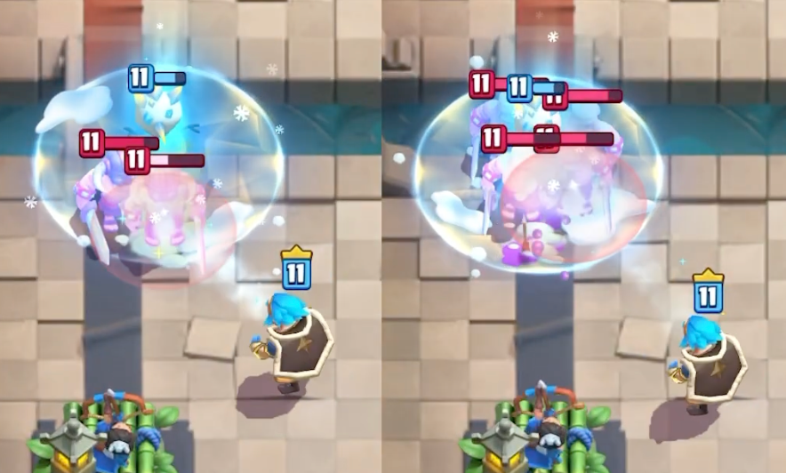
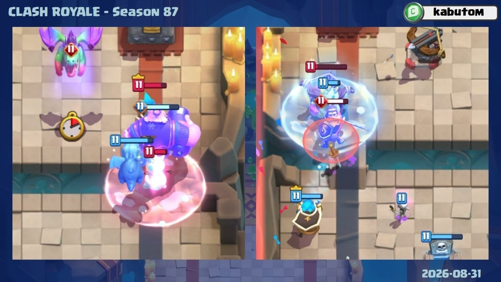
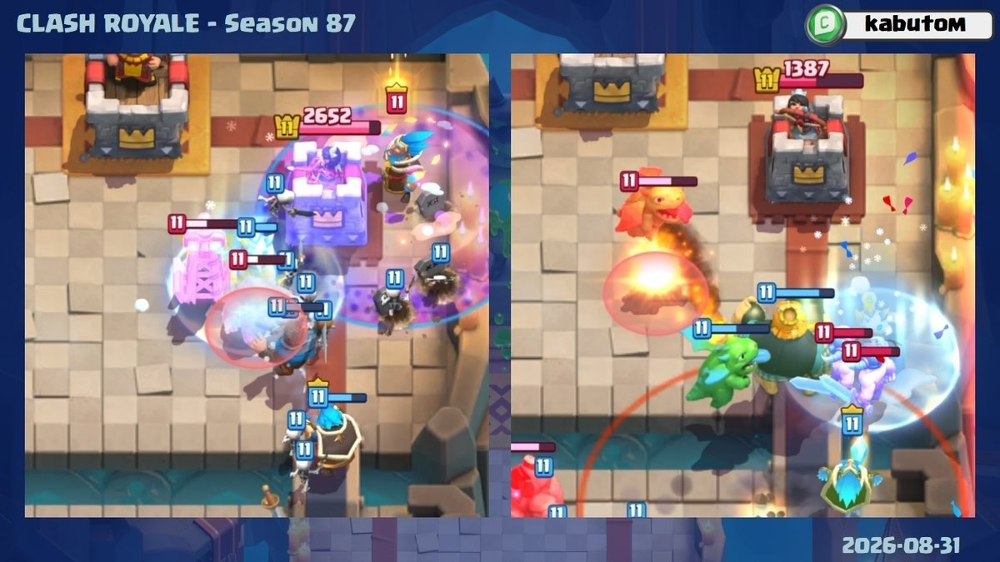
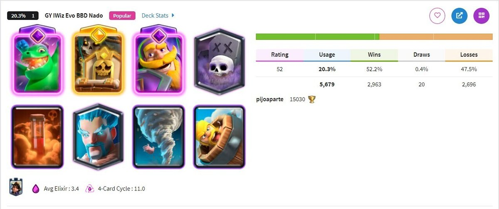
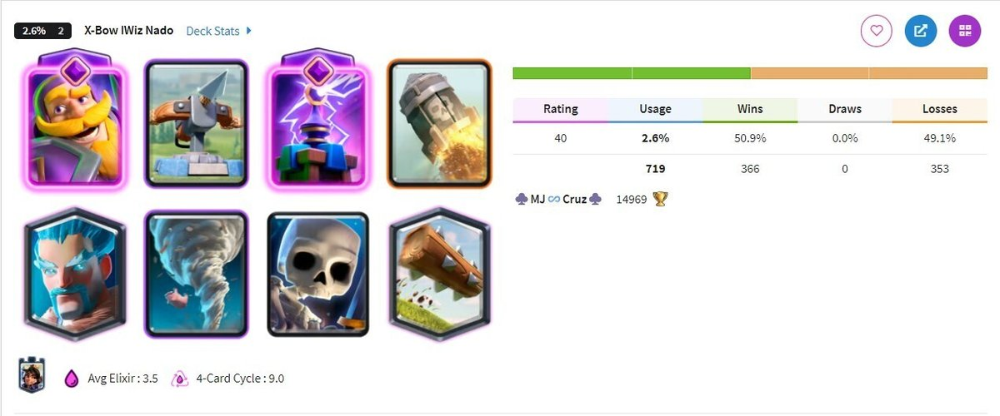
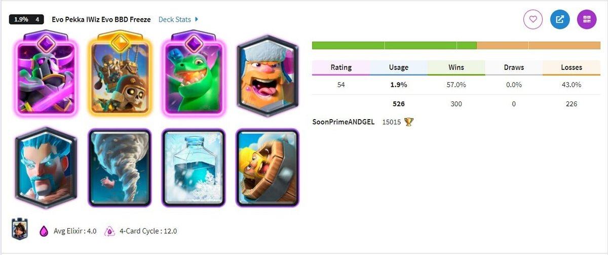
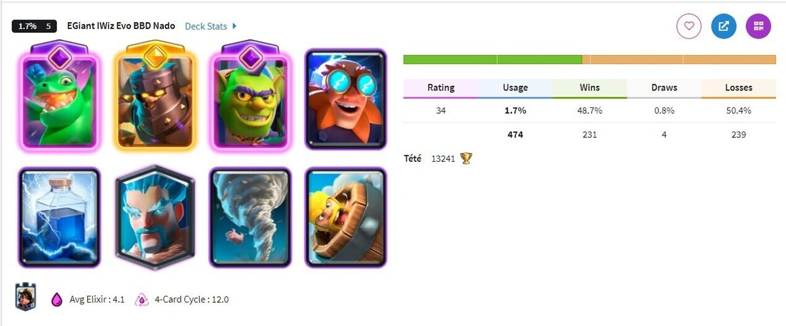
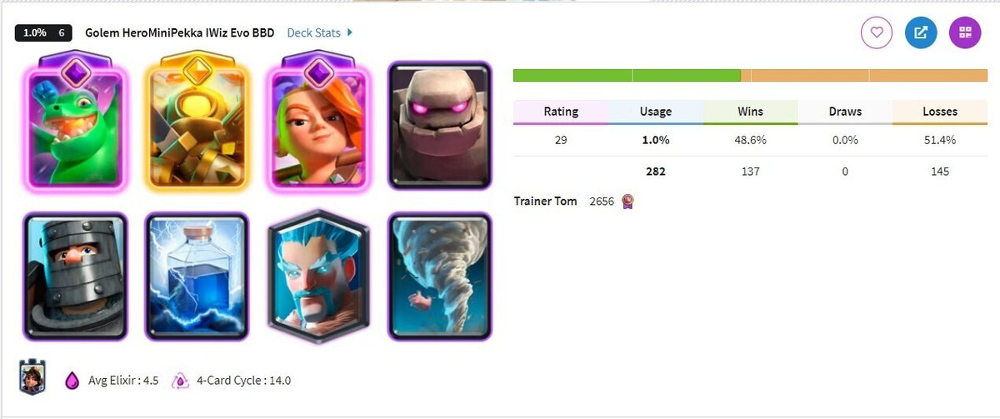

皇室战争 9 月赛季除了新卡 **亡灵巨人**，还有一张新精英卡牌，**精英冰法**。

精英冰法会包含在下赛季的皇室令牌中，如果你本来就要氪金的话，可以顺手绑定一下创作者代码 xiaomi 支持一下，这对我非常有帮助，感谢感谢！

## 基础信息

精英冰法和之前几张精英一样，本体基础属性不变。

按照 11 级锦标赛标准，寒冰法师本体数值大概如下。

| 项目 | 数值 |
|---|---|
| 本体费用 | 3 圣水 |
| 稀有度 | 传奇 |
| 类型 | 地面单位 |
| 目标 | 空中和地面 |
| 生命值 | 688 |
| 范围伤害 | 89 |
| 登场伤害 | 84 |
| 攻击间隔 | 1.7 秒 |
| 每秒伤害 | 52 |
| 攻击距离 | 5.5 |
| 减速持续 | 2.5 秒 |
| 减速幅度 | 30% |

精英冰法的技能英文名是 **Frosty Fella**。暂时可以理解成“冰霜伙伴”或者“雪人伙伴”。技能费用 2 圣水，会召唤一个雪人，并冻结附近敌人。

| 技能项目 | 数值 |
|---|---|
| 技能费用 | 2 圣水 |
| 雪人生命值 | 266 |
| 冻结范围 | 2.5 格 |
| 范围伤害 | 89 |
| 对塔伤害 | 38 |
| 最长冻结时间 | 7 秒 |

这个数据看起来是不是很离谱？冰冻时间 7 秒？！！！别慌，让我们仔细看一下机制。

## 技能触发模式

精英冰法技能并非按下技能按钮以后，立刻冻住全场。

它更像提前给冰法上了一个待触发状态。你可以先花 2 圣水按技能，然后冰法之后第一次攻击到敌人，雪人就会出现在冰法攻击的地方。

雪人会生成在目标身后 1 格的位置。随后以雪人为中心，2.5 格范围内的敌人会受到伤害并进入冻结。

所以这个技能有点奇怪。你能提前按，也能等关键时刻再按。但它最后冻住谁，取决于冰法下一次打到谁。目标如果提前死了，雪人不会立刻生成，会等下一个有效目标。

这就带来时机的问题。你提前按技能，可以提前花费圣水蓄势待发，可冰法如果还没打出那一下就死了，2 圣水也没了（这个目前我也不确定如果没 A 出来就死了会不会返还圣水）。

所以技能释放的时机，实际很吃手感。

## 技能效果

精英冰法技能强，不只是因为它能冻人。

雪人本身是一个单位，生命值 266，会站在原地。冻结效果会一直持续到雪人消失，最长 7 秒。如果雪人被打掉，冻结提前结束。如果被冻住的敌人都没了，雪人会在 2 秒后自己消失。

问题是，266 生命值刚好很微妙。滚木 11 级伤害 268，可以直接清掉满血雪人。其它小法术和溅射也可能把雪人打掉。精英冰法想打出满 7 秒冻结，需要队友保护雪人，或者让雪人生成在对面不好碰的位置。

再和几张控制牌比一下。

| 卡牌或技能  | 费用         | 控制时间   | 范围    | 备注         |
| ------ | ---------- | ------ | ----- | ---------- |
| 精英冰法技能 | 本体 3 加技能 2 | 最长 7 秒 | 2.5 格 | 雪人存在时持续冻结  |
| 冰冻法术   | 4          | 4 秒    | 3 格   | 直接指定位置     |
| 雪球     | 2          | 减速 3 秒 | 2.5 格 | 带击退        |
| 藤蔓     | 3          | 束缚 2 秒 | 2.5 格 | 最多影响 3 个目标 |

冰冻法术的优势是直接、范围稍大、想冻哪里就冻哪里。精英冰法技能的优势是费用低，而且理论持续时间更长。

另外，雪人刚进入竞技场的时候，还会造成一次范围伤害。这个伤害可以直接秒掉骷髅和蝙蝠，但是秒不掉哥布林和亡灵。

## 防守定位

精英冰法最直观的用法，肯定是防守。

普通冰法本来就适合防守。冰法配飓风，再接飞龙宝宝、墓碑这铁三角，在初始版本龙骑墓里的强大大家有目共睹。精英冰法来了以后，这套铁三角会更烦。

比如对面皇家巨人要进塔，你用冰法挂减速，再开技能召唤雪人，把皇家巨人和旁边护卫一起冻住。7 秒时间足够后排补伤害，也足够建筑继续拉扯。

再比如对面弩卡组在桥头架弩，旁边还有骑士、电塔、弓箭手保护。精英冰法如果冻到一片，防守方可以趁这个时间把桥头全部清掉。

当然，冰法自己伤害还是低。只靠精英冰法一张卡是不行的，很多东西冻住了也打不死。它需要范围伤害，需要其他卡牌补刀。

## 进攻定位

精英冰法作为进攻方，应该也会有施展手脚的时候。

墓园玩家应该会很喜欢这张卡。精英冰法进塔，技能一开，把公主塔附近的防守单位和塔一起冻住，2 费冰冻啊。以前墓园带冰冻是 4 费法术，现在精英冰法2 费就能搞出来一个比冰冻法术持续时间还长的效果。

重型推进卡组也可以尝试一下冰法。精英冰法跟在坦克后面，技能冻住防守牌，前排就能多活一段时间。

## 卡组方向

精英冰法第一时间想到的，肯定是原本就带寒冰法的卡组。本来这类卡组控制就强，精英冰法会带来额外一次的关键控制。

### 墓园和冰法弩

这俩应该是以前带冰法的代表卡组了吧。

这俩卡组，如果换上精英冰法，控制能力会进一步加强。当然依然要求建筑位置、飓风拉扯和反打节奏，但我相信有精英冰法的加入，防守上限会变得更高。

### 双重冰冻

原本带冰冻法术的卡组，也有机会把精英冰法塞进去。

比如皮卡球或者其他的冰球卡组。冰冻法术直接冻公主塔和防守卡，精英冰法技能负责第二段控制。如果阴谋得逞，对面估计得在塔下罚站很久很久。

### 推进卡组

第三类是推进卡组。

这种我觉得高老师肯定会试的，配合飓风再冰法开个技能，推进质量就会明显上去。虽然冰法和石头并不是特别搭吧～

## 最后

我个人感觉，精英冰法强度比亡灵巨人更高。

亡灵巨人还需要玩家开发卡组，需要看环境里建筑和对空多不多。精英冰法不一样，很多成熟卡组直接冰法精英化就完事了。墓园、自闭弩、家驹、冰球、重型推进，这些体系本来都有带冰法的成型构建，拿来主义保证没错。

它的技能上限很高。2 费，最长 7 秒冻结，范围还带一点伤害。只要雪人不被立刻打掉，一波防守或者一波进攻都可能被改写。

9 月赛季如果你喜欢墓园、弩、皇家巨人或者慢速控制卡组，精英冰法肯定要玩玩。

大概率，下赛季会出现很多互相冻来冻去的场面。

所以，你，觉得精英冰法如何呢？评论区见！
