皇室战争 9 月新赛季已经官宣，主题是 **亡灵学院**。

赛季时间是 **2026 年 9 月 7 日到 10 月 5 日**，一共 4 周。本赛季除了精英冰法、新卡亡灵巨人之外，还有一系列的活动展开。

## 精英冰法

精英冰法是 9 月的主打精英。

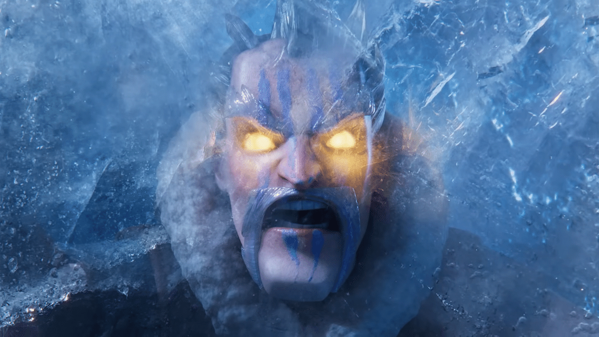

它的本体属性和普通寒冰法师一样， 3 费，范围伤害，空地都能打，普通攻击会给敌军挂减速，精英技能是雪人伙伴。

按下技能后，精英冰法不会马上把全场冻住。它会进入待触发状态，之后攻击到一个被减速的目标，雪人才会在目标身后生成。雪人周围 2.5 格内的敌军会被冻结，最长持续 7 秒。对面想解除冻结，就得先把雪人打掉。

这机制一看就是给控制卡组准备的。墓园、自闭弩、皇家巨人、气球冰冻、重型推进都能试试。

精英冰法会出现在高级皇室令牌第一个里程碑里，也可以用 200 精英币直接解锁。

详细机制看这篇。

[皇室战争精英冰法来了，2费雪人最高冻7秒，控制玩家要过年了？](/posts/clashroyale/2026/08/hero-ice-wizard-guide/)

## 亡灵巨人

9 月的新普通卡是亡灵巨人。

这是一张 4 圣水稀有卡，飞行单位，只打建筑和公主塔，站在空中远程吐毒。它的定位很少见，像是低费空中主攻，费用比天狗低，血量又比气球兵高。

它最烦的地方在于防守，你要么有建筑拉走它，要么有稳定对空。地面单位碰不到它，普通法术也不一定够。

亡灵巨人可以通过本赛季的学院恶作剧相册活动免费解锁。官方也提醒过，和之前的新卡一样，亡灵巨人在本赛季不会进入宝箱，要等下个赛季以后才会通过常规宝箱产出。

详细评测看这篇。

[皇室战争新卡亡灵巨人评测，4费飞行建筑目标会改变空军卡组吗](/posts/clashroyale/2026/08/minion-giant-guide/)

## 学院恶作剧相册活动

本赛季的相册活动叫 **Academy Antics**，时间是 **9 月 7 日到 10 月 5 日**。

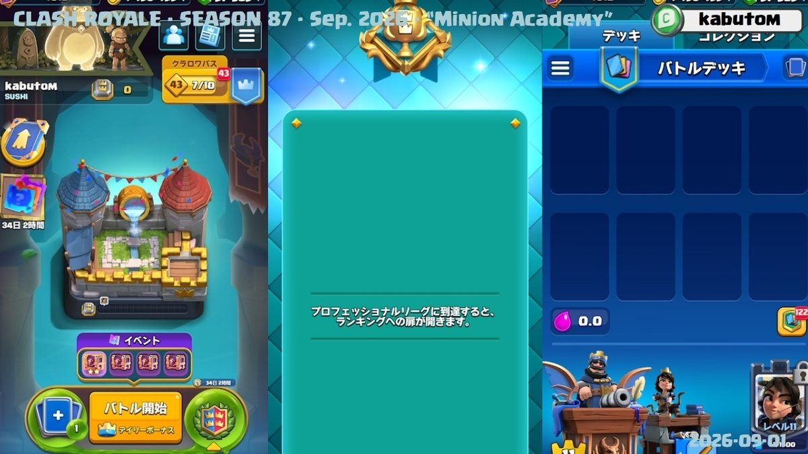

这次相册讲的是亡灵巨人在亡灵学院第一年的故事。玩法还是收集碎片，补齐场景，拿奖励。官方公告里写得比较明确，整本相册做完，一共可以获得 **1750 张亡灵巨人卡牌**，另外还有表情和塔楼皮肤。

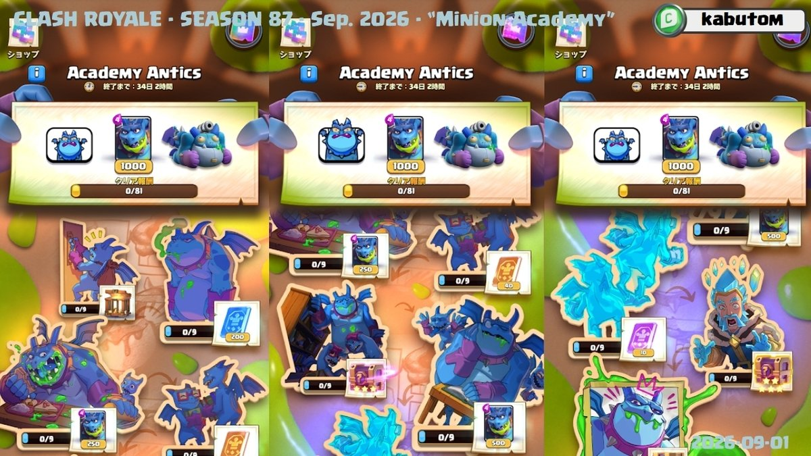

碎片仍然分普通、稀有、史诗、传奇。日常对战每天最多能拿 3 个，也可以通过活动和商店获得。重复片段可以换成新片段，活动最后一周，日常奖励给的碎片会变成稀有片段，主要是帮大家补图鉴缺口。

这个活动从 3 阶竞技场开始开放。想白嫖亡灵巨人的玩家，千万不要错过相册活动。

## 竞技2v2回归

9 月的竞技联赛是 **2v2 League**，时间是 **9 月 7 日到 9 月 21 日**。

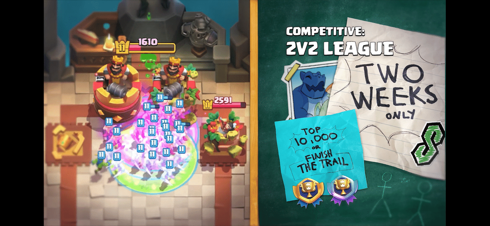

这个活动只开两周。奖励重点是徽章，官方说最多可以拿 2 个。一个来自完成联赛路线，另一个来自排行榜前 10000 名。

2v2 回归我觉得挺好。现在皇室战争平时的娱乐模式不少，但能让队友抗压力背锅的模式不多，2v2 刚好能填补这个缺口。

当然，2v2 成也队友，败也队友。你好好的进去打着，队友突然在桥头或者国王塔裸下火箭，这种事情谁都见过。要冲排名的话，最好还是找熟人组队。

## 公主对弈全球锦标赛

本赛季全球锦标赛是 **Princess Gambit**，时间是 **9 月 21 日到 9 月 26 日**。

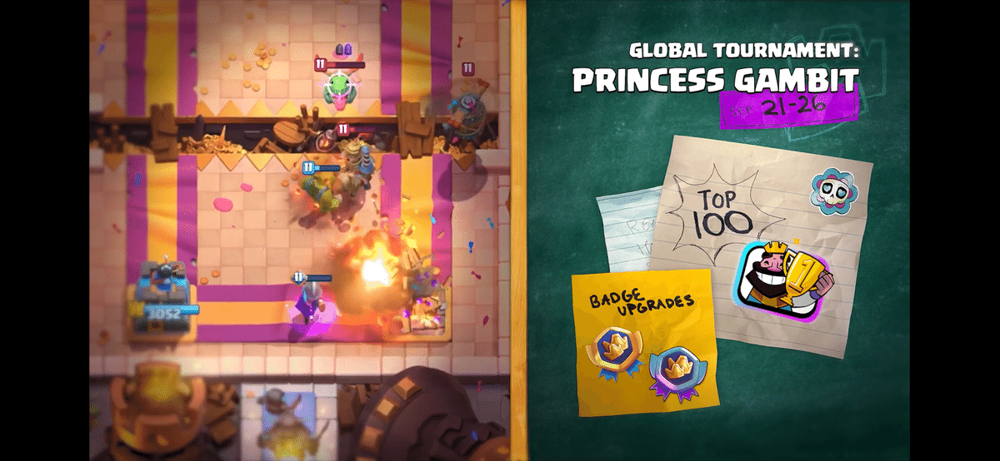

这个模式之前已经出现过。简单说，地图上没有国王塔，只剩两座公主塔，比赛是突然死亡。双方使用一套 40 张卡的轮换卡池，开局能看到本局可用卡牌和形态。

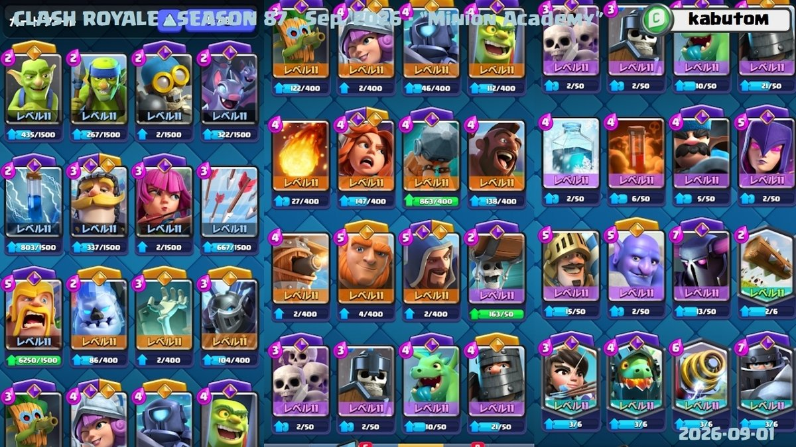

卡牌等级会限制在 11 级，但觉醒和精英是否可用，还是看你自己的收藏。这个设定对账号养成有要求，低收藏玩家会稍微吃亏。

奖励方面，官方提到了专属徽章，以及前 10000 名排行榜徽章。据创作者透露，前 100 名还有全球锦标赛表情。想冲榜的玩家，这个模式需要提前练习。没有国王塔以后，很多平时习惯的防守拉扯会失效，公主塔的压力来得更快。

## 皇室转盘

9 月还有一个全新限时模式，**Royale Shuffle**。我先叫它皇室转盘。

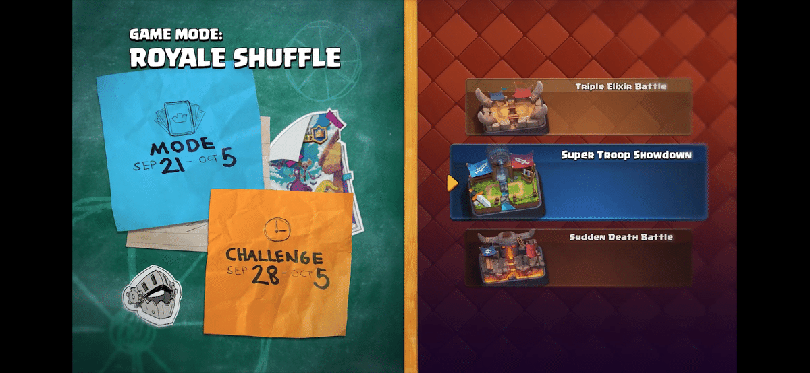

时间是 **9 月 21 日到 10 月 5 日**，挑战版本是 **9 月 28 日到 10 月 5 日**。挑战奖励是战旗框和战旗装饰。

这个模式的规则很简单，随机模式，随机卡组。你匹配进去以后，转盘决定这局到底打什么。官方列出来的模式包括这些。

| 模式 |
|---|
| 三倍圣水 |
| 超级部队对决 |
| 突然死亡 |
| 狂暴战斗 |
| 宝库攻防 |
| 雪球轰炸 |
| 超级武僧 |
| 黑暗模式 |
| 四卡对战 |
| 迫击炮争夺战 |
| 龙蛋争夺战 |
| 全员觉醒 |

这个模式好像是借鉴了荒野乱斗的某种模式（我不太确定，知道的同学可以留言区说一下）？娱乐性拉满，你永远都不知道下一局到底打什么～

## 部落教室社区活动

官方还预告了一个 **Clashroom Community Event**（部落教室？），时间是 **9 月 22 日到 9 月 26 日**。

这个活动听起来很贴亡灵学院主题。官方说会用游戏里的生物、物理、历史来做小课堂，还会有三位老师带大家学习，然后通过答题之类的方式拿奖励。

具体玩法还没完全公布，官方会在活动临近时再说。这个更像赛季中间的社区互动，奖励情况暂且未知。

## 新竞技场和加载屏幕

这次的新竞技场很有亡灵学院味道。

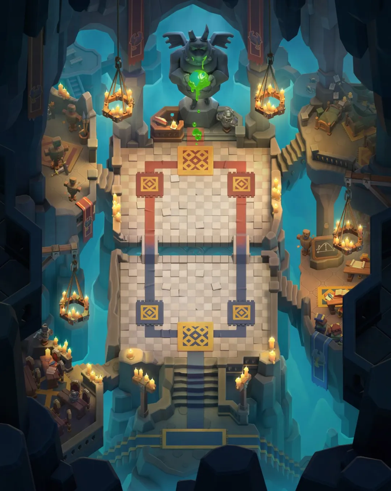

画面像一个地下神殿，也像一个秘密实验室。中间供着巨大的亡灵雕像，两边有蓝绿色光和石质结构。和 8 月维京赛季那种大树、符文、斧头史诗的感觉完全是两个极端。

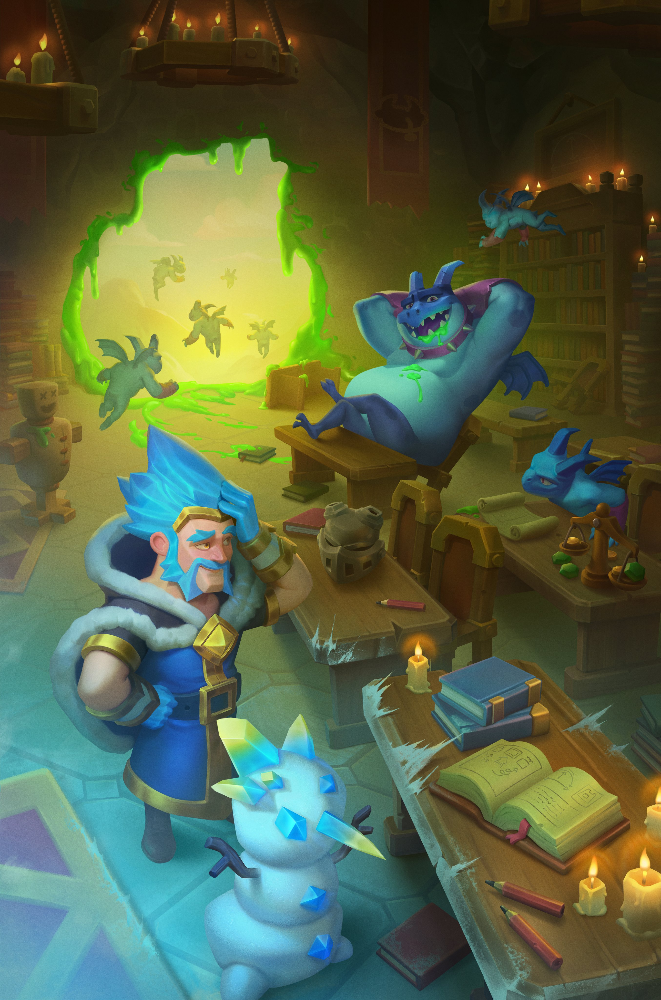

加载屏幕也很有意思。冰法像个被学生折磨到头疼的老师，亡灵巨人则像班里最不省心的那个学生。嗯，很贴近亡灵学院那个意思，只不过为什么老师会是冰法呢？

## 塔楼皮肤

9 月有两款塔楼皮肤。

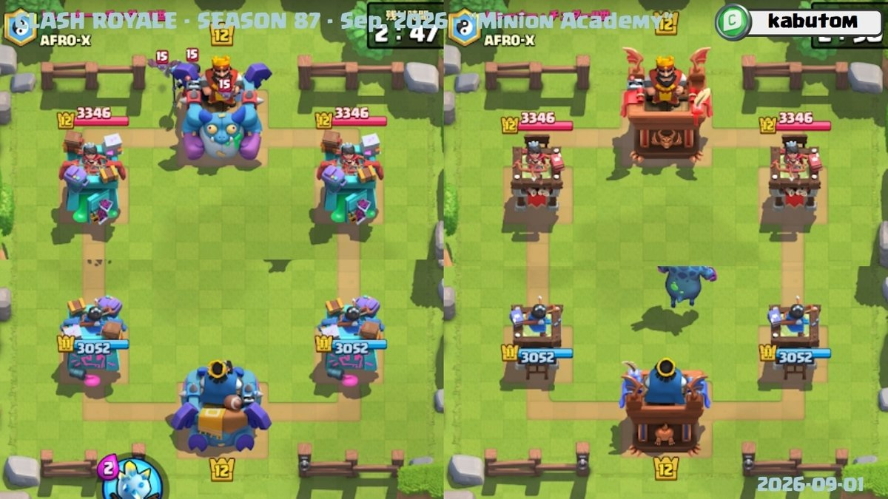

第一款是来自相册活动。它和亡灵巨人关系很近，整体是绿色毒液和亡灵学院风格。

第二款来自钻石皇室令牌。它更像学院建筑或者研究设施，配精英冰法和亡灵学院主题很合适。

## 表情

本赛季新表情一共 11 个。

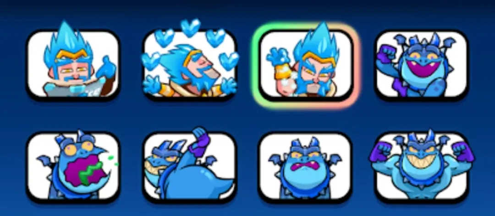

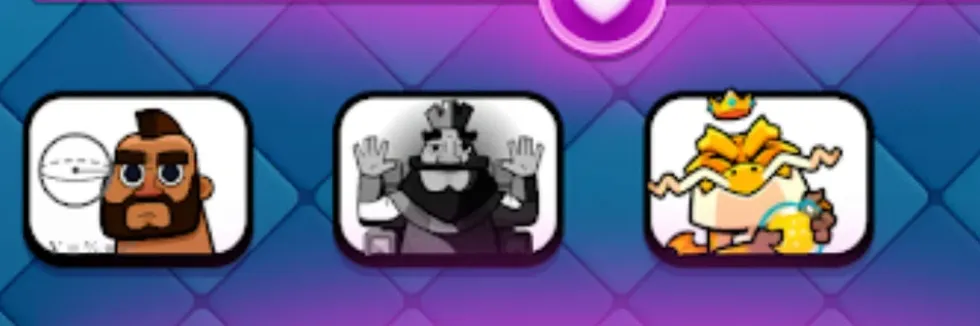

主角基本就是精英冰法、亡灵巨人、野猪骑士、国王和合合奇兵里的圣水龙。亡灵巨人这几个表情很放飞，有打嗝、吐毒、拍屁股、举手放屁之类的动作，很难评～

目前能确定或先行资料里提到的获取方式大概如下。

| 表情 | 获取方式 |
|---|---|
| 精英冰法浏览 | 社区活动 |
| 精英冰法跳舞 | 暂未确定 |
| 精英冰法撒盐雪 | 钻石皇室令牌 |
| 亡灵巨人手臂放屁 | 阶梯活动 |
| 亡灵巨人打嗝 | 皇冠争夺 |
| 亡灵巨人拍屁股 | 暂未确定 |
| 亡灵巨人吐毒 | 相册活动 |
| 亡灵巨人不合格 | 天梯联赛 2 |
| 野猪骑士困惑 | 暂未确定 |
| 国王 Absolute Cinema | 暂未确定 |
| 圣水龙庆祝 | 合合奇兵赛季奖励 |

国王那个 Absolute Cinema 表情算是官方玩梗了。而且，本赛季的表情致敬和梗真的是比较密集，大家可以在评论区说说自己发现的，只能说，皇室战争最近在梗图这块确实越来越懂。

## 战旗

9 月新战旗一共 10 套。

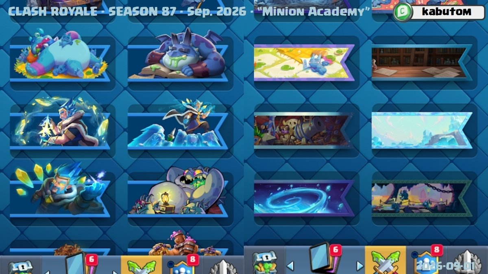

这些战旗主要围绕亡灵学院、精英冰法、亡灵巨人和冰雪地下场景来做。部分来源已经能看到，比如免费皇室令牌、皇冠争夺战、挑战、阶梯活动、皇室 TV。还有不少获取方式暂未确定，可能会在本赛季后半段或者后续赛季陆续放出来。

## 强化卡牌

本赛季强化卡牌是四张。

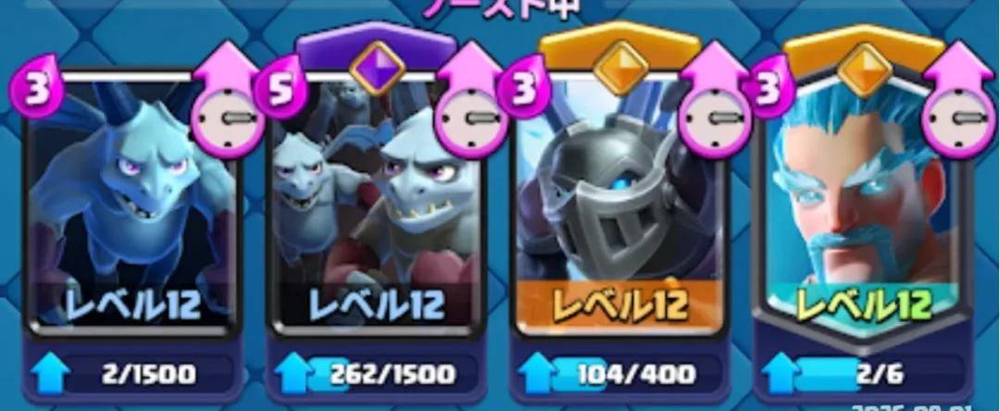

- 亡灵
- 亡灵大军
- 重甲亡灵
- 寒冰法师

基本都是围绕着新卡和冰法来的。

## 皇室令牌

9 月钻石皇室令牌的最大看点就是精英冰法。

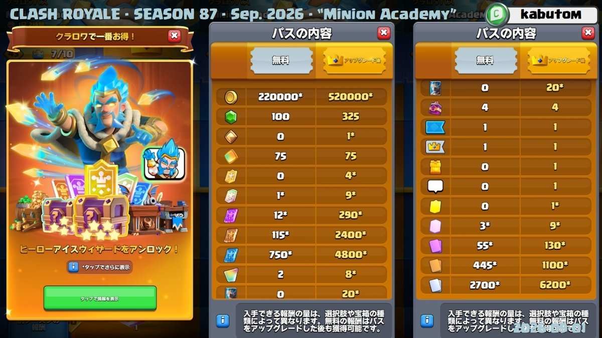

它会出现在高级皇室令牌第一个里程碑。玩家也可以不走令牌，直接用 200 精英币解锁。

如果你只想体验新卡，亡灵巨人走相册活动就行。如果你想第一时间玩精英冰法，钻石令牌或者精英币就是主要入口。至于选精英冰法还是继续拿觉醒万能碎片，就看你账号现在缺什么。控制卡组玩家可以优先考虑冰法，普通玩家可以等赛季第一周实战环境稳定以后再决定。

## 赛季活动日历

9 月主要活动日历如下。

| 时间 | 内容 | 类型 |
|---|---|---|
| 9 月 1 日到 12 月 1 日 | 合合奇兵赛季 11 | 合合奇兵 |
| 9 月 7 日到 10 月 5 日 | 赛季87亡灵学院 | 主题季 |
| 9 月 7 日到 10 月 5 日 | 学院恶作剧相册活动 | 相册活动 |
| 9 月 7 日到 9 月 14 日 | 亡灵学院里程碑活动 | 里程碑活动 |
| 9 月 7 日到 9 月 21 日 | 竞技2v2联赛 | 竞技联赛 |
| 9 月 14 日到 9 月 21 日 | 胜利阶梯回归测试 | 限时活动 |
| 9 月 21 日到 9 月 26 日 | 公主对弈全球锦标赛 | 全球锦标赛 |
| 9 月 21 日到 10 月 5 日 | 皇室转盘 | 限时模式 |
| 9 月 22 日到 9 月 26 日 | Clashroom社区活动 | 社区活动 |
| 9 月 28 日到 10 月 5 日 | 皇室转盘挑战 | 挑战 |

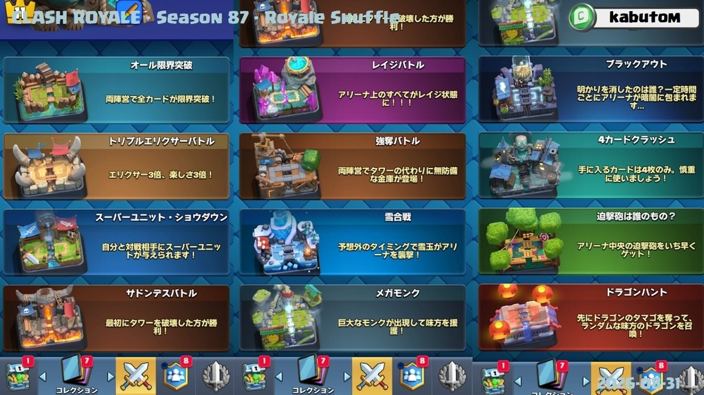

新赛季开服以后，建议先做三件事。

- 先看相册活动怎么拿亡灵巨人
- 再确认精英冰法要不要用令牌或精英币解锁
- 最后留意 2v2 联赛和公主对弈的徽章奖励

## 总结

9 月亡灵学院赛季，重点其实很清楚。

精英冰法负责控制，亡灵巨人负责空中主攻。一个会让慢速卡组更恶心，一个会逼大家重新检查建筑和对空。再加上竞技 2v2 回归、公主对弈全球锦标赛、皇室转盘和相册活动，这个月至少不会缺事情做。

我比较在意的是两张新卡上线后的环境变化。精英冰法如果太强，墓园和自闭弩玩家可能笑得很大声。亡灵巨人如果开发顺利，很多不带建筑的卡组会开始难受。

等 9 月 7 日正式开季以后，第一周可以重点看卡组开发。哪几套卡组先把精英冰法和亡灵巨人用顺，哪几套卡组就会先吃到版本红利。

参考来源

[皇室战争官方 9 月亡灵学院公告](https://supercell.com/en/games/clashroyale/blog/release-notes/new-season-minion-academy/)
