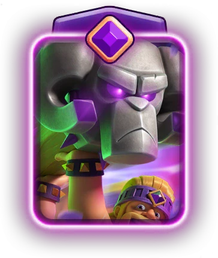
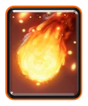
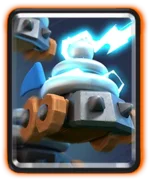
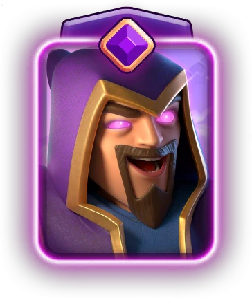
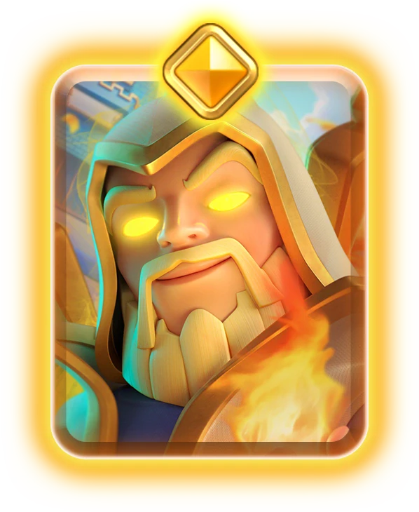
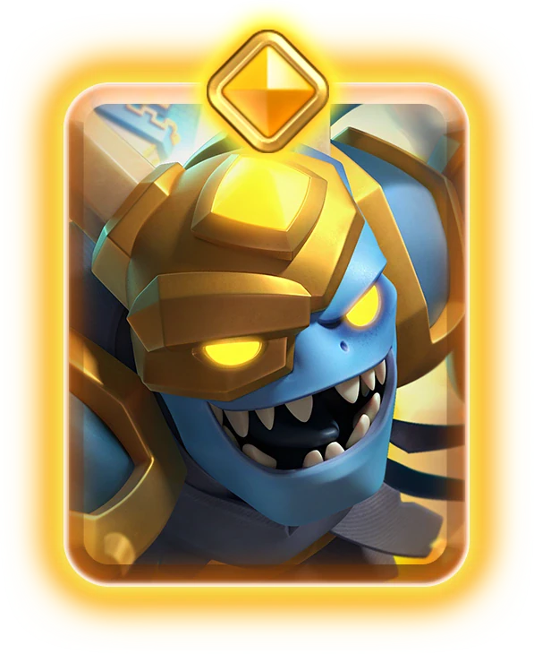

皇室战争 9 月最终平衡来了。

这次一共动了 **18 张卡牌**，数量不算少。削弱部分基本都砍在近期比较烦人的东西上（譬如大头锤），觉醒野蛮人精锐继续削弱，攻城槌更容易被建筑拉走，火球和冰冻也一起挨刀。

加强的部分比较少。浪人、哥布林牢笼、精灵女皇都只是小幅补强。

重做部分也值得一看，炸弹兵、法师、精英法师、精英重甲亡灵这些卡，改动方向会影响卡组选择（部分卡牌实际只是数值的调整，但是官方把他们归在重做，我这里也就忠实于官方的归类吧）。

## 削弱卡牌

### 觉醒野蛮人精锐

| 改动项目 | 调整前 | 调整后 | 幅度 |
|---|---|---|---|
| 长矛最小射程 | 3.5 格 | 3.0 格 | -14% |
| 长矛最大射程 | 5.0 格 | 4.5 格 | -10% |
| 狂暴持续时间 | 2.5 秒 | 2.0 秒 | -20% |

觉醒野蛮人精锐又被砍了。

8 月季中平衡已经砍过一次长矛伤害和狂暴时间，这次继续砍射程和狂暴时间。也就是说，它以后还是能冲、能贴脸、能靠觉醒轮次打爆发，但那种隔着一段距离先扔长矛、再靠狂暴追上来的压迫感会小很多。

这张卡之前最烦的地方，是对面一个失误就可能陷入亏费局面。现在长矛距离短了，狂暴时间短了，防守方有更多机会把它拉开，或者用小费单位拖住。

### 攻城槌

| 改动项目 | 调整前 | 调整后 | 幅度 |
|---|---|---|---|
| 视野范围 | 5.5 格 | 6.5 格 | +18% |

攻城槌这里看起来是数值增加，但实际是削弱。

视野范围变大以后，它更容易被建筑吸引。以前有些距离刚好能绕过去，现在可能会更早转向。对玩槌子的玩家来说，这会影响过河位置和预判建筑的位置。

桥头压力仍然在，只是进攻会更怕建筑。地狱塔、加农炮、炸弹塔这类建筑的拉扯空间都会更舒服一点。

### 觉醒攻城槌

| 改动项目 | 调整前 | 调整后 | 幅度 |
|---|---|---|---|
| 击退距离 | 2.5 格 | 2.0 格 | -20% |

觉醒攻城槌削的是击退距离。

这刀会影响它撞开防守单位之后的连续进攻。以前被撞开的单位更容易脱节，后排和桥头压力会接不上。现在击退短了，防守方更容易重新围上来。

### 精英气球

| 改动项目 | 调整前 | 调整后 | 幅度 |
|---|---|---|---|
| 骷髅兵落地伤害 | 263 | 230 | -13% |

精英气球削的是骷髅兵落地伤害。

这会让它处理杂毛和补伤害的能力下降一点。精英气球的主体威胁还在，落地之后顺手清场的价值会低一些。

对于气球体系来说，这刀不算致命。精英气球的附带收益会低一些，对面防住第一波以后，也不太容易再被落地效果白白多吃一段伤害。

### 寒冰戈仑

| 改动项目 | 调整前 | 调整后 | 幅度 |
|---|---|---|---|
| 生命值 | 1315 | 1228 | -7% |
| 减速持续时间 | 2.0 秒 | 2.5 秒 | +25% |

寒冰戈仑这次是削血，顺手把减速时间补了一点。

7% 血量看起来不夸张，但对 2 费肉盾来说，血量就是它最大的价值。少扛一下，就可能影响猪、气球、弩、墓园这些卡组的过牌和拉扯节奏。

减速时间增加会让死亡效果更烦一点，可它先得活到该活的时候。整体看，防守拖延能力被削，死亡减速变得稍微更有存在感。

### 冰冻

| 改动项目 | 调整前 | 调整后 | 幅度 |
|---|---|---|---|
| 持续时间 | 4.0 秒 | 3.5 秒 | -13% |

冰冻少了 0.5 秒。

半秒在平时听起来不多，但冰冻这种牌吃的就是那一点窗口。气球能不能多砸一下，墓园能不能多蹭几刀，地狱飞龙能不能多锁一会儿，都可能差在这半秒。

9 月有精英冰法这种强控制卡上线，冰冻提前降一点也不奇怪。控制太多的话，比赛会很容易变成谁先被冻住谁难受。

### 火球

| 改动项目 | 调整前 | 调整后 | 幅度 |
|---|---|---|---|
| 对塔伤害 | 172 | 159 | -8% |

火球削的是对塔伤害。

这刀主要影响后期斩杀和法术循环。火球还是火球，清后排、解飞行器、打三枪、配合小法术处理单位的功能都还在。变弱的是最后那种一边防守一边火球蹭塔的收益。

对火球循环、皇家猪、矿工控制、墓园火球这类卡组来说，斩杀线要重新算。以前两发火球够的局，现在可能要多补一下小法术或者多蹭一刀。

### 电击车小队

| 改动项目 | 调整前 | 调整后 | 幅度 |
|---|---|---|---|
| 攻击间隔 | 2.2 秒 | 2.3 秒 | -4% |
| 每秒攻击次数 | 0.45 | 0.43 | -4% |

电击车小队削的是攻击频率。

这张卡强在控制节奏。它不靠单次伤害吓人，靠的是不断打断、减速推进、让大单位走不动。攻速慢一点以后，连续控制会少一拍。

这刀属于小削。电车依然能防很多大单位，只是以前那种把对面卡得非常难受的稳定感会松一点。

### 戈仑石人

| 改动项目 | 调整前 | 调整后 | 幅度 |
|---|---|---|---|
| 视野范围 | 7.0 格 | 7.5 格 | +7% |

戈仑石人也被调大了视野范围。

这和攻城槌类似，数值增加反而是削弱。它更容易被建筑拉走，推进路线会更容易被防守方掌控。

戈仑玩家最怕的就是主坦被拉偏。视野变大以后，建筑下得好一点，就能多争取很多时间。

## 加强卡牌

### 浪人

| 改动项目 | 调整前 | 调整后 | 幅度 |
|---|---|---|---|
| 攻击间隔 | 1.4 秒 | 1.3 秒 | +8% |
| 每秒攻击次数 | 0.71 | 0.77 | +8% |

浪人加的是攻击速度。

这张卡有设计感，但过桥后压力不够大。攻速提高以后，清小单位、补刀和持续输出都会顺一点。

8% 不会让浪人突然变成万金油，但会让他在中速卡组里更像一张能主动制造压力的牌。尤其遇到需要持续砍前排的局，这个增强能感觉出来。

### 哥布林牢笼

| 改动项目 | 调整前 | 调整后 | 幅度 |
|---|---|---|---|
| 哥布林壮汉生命值 | 1080 | 1121 | +4% |

哥布林牢笼加的是壮汉生命值。基本来说这是给觉醒牢笼调整到 2 轮觉醒的一些补偿。

### 精灵女皇

| 改动项目 | 调整前 | 调整后 | 幅度 |
|---|---|---|---|
| 对空伤害 | 309 | 320 | +4% |
| 对地伤害 | 309 | 320 | +4% |

精灵女皇小幅加伤害。

4% 不夸张，但对这种本来就靠单次打击和站场价值吃饭的卡来说，很多对局会变得舒服一点。尤其 9 月新卡亡灵巨人上线，环境里可能会有更多空中单位和控制体系，精灵女皇有机会多露面。

她之前还受费用、站位和技能收益限制。这次属于给她一点机会，强不强还得看新环境。

## 重做卡牌

### 炸弹兵

| 改动项目 | 调整前 | 调整后 | 幅度 |
|---|---|---|---|
| 伤害 | 225 | 212 | -6% |

普通炸弹兵伤害下调。

这会影响它清杂毛和防守换费的手感。炸弹兵本来费用低、范围伤害稳定，很多时候一张小牌能解出很大价值。现在单次伤害少一点，部分单位可能需要多炸一下。

### 觉醒炸弹兵

| 改动项目 | 调整前 | 调整后 | 幅度 |
|---|---|---|---|
| 弹跳距离 | 2.5 格 | 3.0 格 | +20% |

觉醒炸弹兵的弹跳距离变远。

这就是典型的本体削一点，觉醒形态给一点特殊性。普通伤害低了，觉醒炸弹的弹跳范围更大，打到后排和蹭塔的机会会增加。

所以它不算纯削弱。普通形态上海变低，觉醒后威力更强。对会算觉醒节奏的玩家来说，这张卡还是值得试。

### 法师

| 改动项目 | 调整前 | 调整后 | 幅度 |
|---|---|---|---|
| 伤害 | 281 | 304 | +8% |
| 首次攻击时间 | 0.4 秒 | 0.5 秒 | +25% |

普通法师这次是伤害更高，第一下更慢。

伤害加 8% 很实在，清场能力更强。第一下慢 0.1 秒，影响的是落地瞬间的反应速度。遇到桥头快攻或者残血单位时，这一点延迟可能会让他少赚一些节奏。

整体看，法师更偏向稳定后排输出，少一点刚落地秒反应的味道。

### 觉醒法师

| 改动项目 | 调整前 | 调整后 | 幅度 |
|---|---|---|---|
| 护盾生命值 | 192 | 176 | -8% |

觉醒法师削的是护盾血量。

觉醒法师麻烦的地方，一直是他很难被干净处理。护盾少一点以后，法术加小单位的组合更容易把他拆掉。

不过普通法师伤害提高了，觉醒法师本体输出也跟着吃到好处。最后强度会不会降，要看护盾变薄和伤害提高哪个更关键。

### 精英法师

| 改动项目 | 调整前 | 调整后 | 幅度 |
|---|---|---|---|
| 技能持续时间 | 5.0 秒 | 3.5 秒 | -30% |

精英法师这刀很重，技能持续时间从 5 秒砍到 3.5 秒。

30% 的持续时间削弱，基本就是让技能窗口大幅缩短。以前能靠技能撑完整一波，现在很可能只够打关键几下。

这类改动会让玩家更重视释放时机。技能不能随便按，按早了浪费，按晚了可能来不及。基本来说，精英法师登场机会估计会大幅降低。

### 精英重甲亡灵

| 改动项目 | 调整前 | 调整后 | 幅度 |
|---|---|---|---|
| 瞬移对塔伤害倍率 | 0.25 倍 | 1.0 倍 | +300% |
| 技能伤害 | 399 | 422 | +6% |
| 技能机制 | 无返回 | 会回到原位置 | 新机制 |

精英重甲亡灵这次很有意思。

它的技能对塔伤害倍率从 0.25 倍变成 1 倍，等于对塔不再打折。同时技能伤害也提高了。单看这两项，是很明显的加强。

但它现在会瞬移回原位置。这个机制会改变它的用途。以前更像是冲过去打一下，现在更像远程点名，打完还回到本来的站位。它的进攻偷塔能力更明确，防守后反打的路径也要重新适应。

这张卡是本轮最值得测试的重做之一。数值给得很大，机制又变了，实战里可能会有一些新套路。

## 总结

这轮平衡最直接的受影响对象，是觉醒野蛮人精锐和桥头冲锋体系。

觉醒精锐连续两次被砍，射程、狂暴、长矛伤害都已经被压过一轮。它大概率还不会完全消失，但强度大幅下降，应该是官方想要的结果。

攻城槌和戈仑石人都被调大视野范围，建筑会更好拉。再加上哥布林牢笼加强，9 月的建筑防守价值可能会上来。用推进卡组的玩家要重新适应走位，特别是桥头下牌和对方建筑距离。

法术这边，火球削对塔伤害，冰冻削持续时间。一个压低循环斩杀，一个压低爆发窗口。后期靠火球磨塔的卡组会更难收尾，气球冰冻、墓园冰冻这种体系也会少一点强行打开局面的能力。

加强里最值得观察的是精英重甲亡灵和精灵女皇。9 月新卡亡灵巨人会把空军环境带热一点，能稳定处理空中单位的卡牌自然会更有价值。

新赛季还有精英冰法和亡灵巨人。等这些东西一起进环境，9 月天梯大概率会重新洗一次牌。火球玩家要重新计算斩杀线，加强的空军估计也会进入环境了。

各位挑战者，你，怎么看？

## 参考来源

- [RoyaleAPI Final Balance Changes for September 2026 Season 87](https://royaleapi.com/blog/season-87-balance-final-september-2026)
- [皇室战争9月赛季亡灵学院抢先看](/posts/clashroyale/2026/09/season-87-minion-academy-guide/)
- [皇室战争精英冰法介绍](/posts/clashroyale/2026/08/hero-ice-wizard-guide/)
- [皇室战争新卡亡灵巨人评测](/posts/clashroyale/2026/08/minion-giant-guide/)
