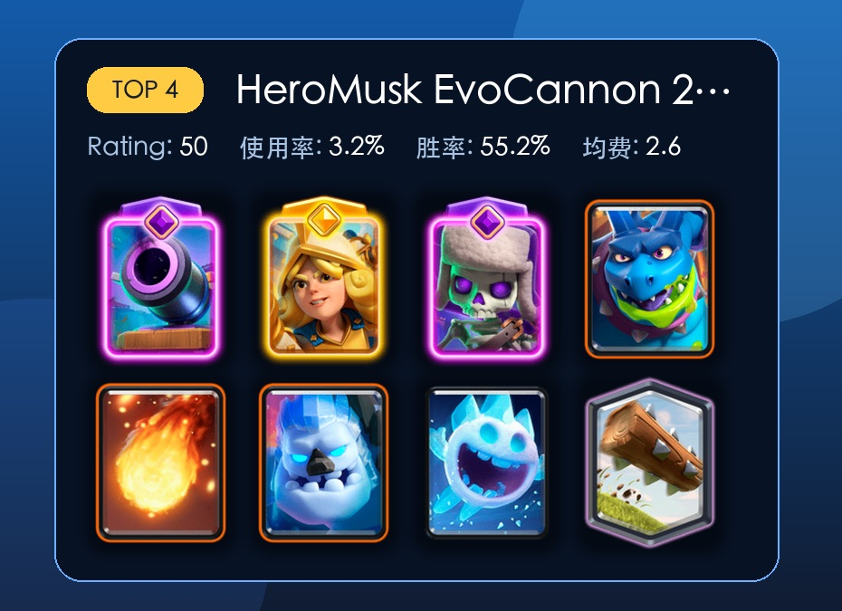
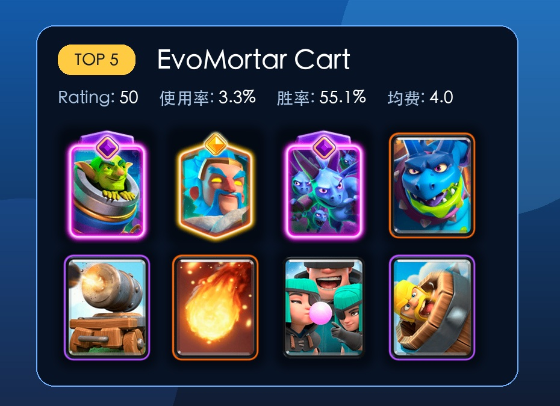
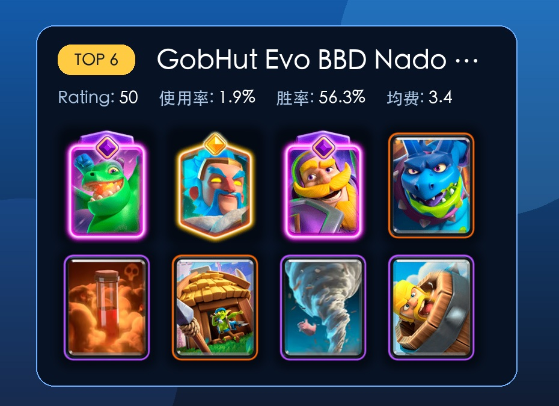
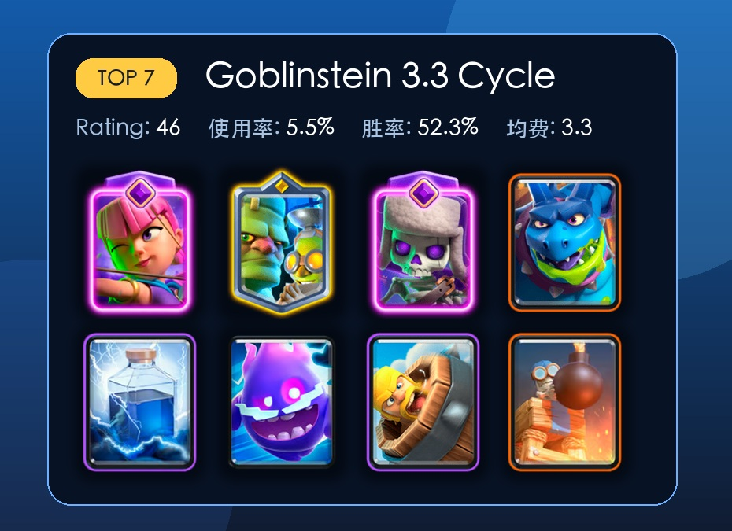
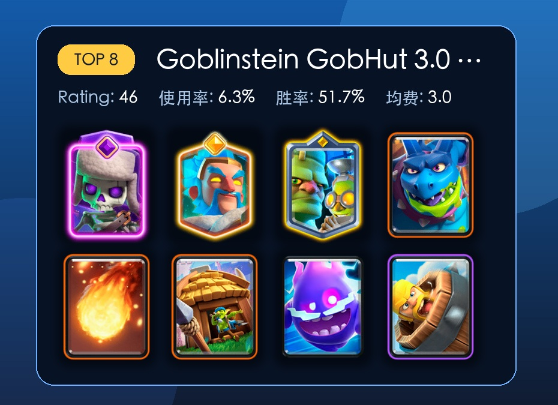
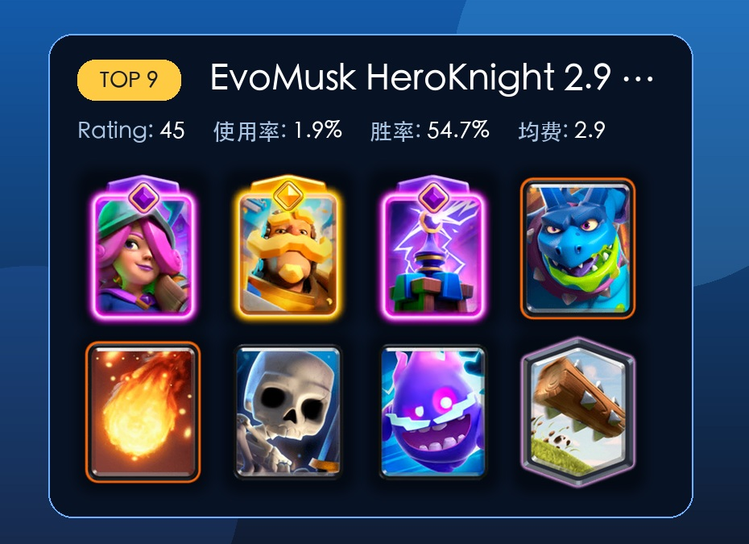
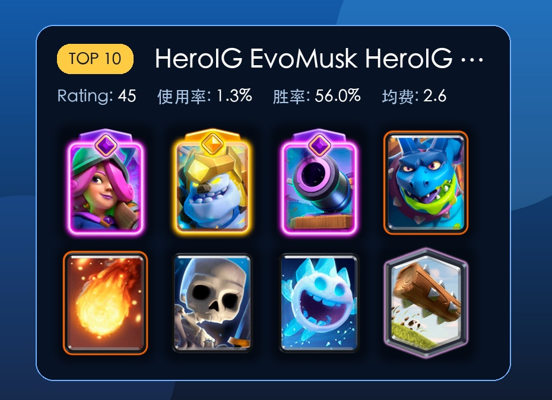

# 亡灵巨人卡组怎么选？7 天前十里，这几套最值得先试

亡灵巨人这张新卡，没上线前，大家都觉得强度一般；上线之后，却让很多人大跌眼镜。

这张卡看起来像空中肉盾，费用又只有 4 费，第一眼很容易让人往小天狗、气球辅助那边想。但真玩起来会发现，花样还真是不少。

它只打建筑，有远程伤害，血量比气球还高一点。对手如果没有建筑，亡灵巨人摸塔会很疼；对手有建筑，它又很容易被拉走。所以这张卡现在更像一个低费飞行进攻点，适合不停给压力，逼对手交防守，再用别的牌补伤害。

这里结合 RoyaleAPI 最近 7 天、终极冠军分段、按 Rating 排序的数据给大家推荐一些大胃袋的卡组。

不过要注意，第一，排名看的是 Rating，不单看使用率。第二，小样本胜率会很亮眼，但不能直接当成环境答案。比如第一套只有 135 场，胜率很高，但稳定性肯定不如第二套、第五套、第八套这种上千场或接近上千场的卡组。

现在开始。

## 1 亡灵巨人迫击炮

这套是前十里 Rating 最高的一套，胜率 63.7%，不过样本只有 135 场。

这套是双核心卡组。迫击炮在地面架炮，亡灵巨人在空中逼建筑，对手只要建筑交得不舒服，很容易被其中一边蹭到。精英冰法和加农炮战车负责把防守节奏拖住，觉醒亡灵大军则提供一波很强的反打能力。

缺点也很明显，没有大法术，解后排和收残血建筑主要靠节奏。如果你不熟迫击炮，刚上手可能会觉得进攻点很多，但每一路都差一点伤害。

这套更适合会玩迫击炮的试试。

## 2 哥布林斯坦大胃袋

这套是目前最大众答案的一套。使用率 9.5%，样本 1938 场，胜率 54.6%，整体都比较亮眼。

卡组是觉醒蝙蝠、精英冰法、哥布林斯坦、亡灵巨人、火球、哥布林小屋、骷髅兵、野蛮人滚筒。

它的思路很清楚。哥布林小屋磨血，哥布林斯坦稳防守，精英冰法拖节奏，亡灵巨人负责补一个空中建筑压力。对手如果只顾清小屋，亡灵巨人会找机会摸塔；对手把防空交给亡灵巨人，小屋和哥布林斯坦又会慢慢把场面拉回来。

这套卡组没有特别极端的操作要求，防守也比较不错，比较适合普通玩家。

## 3 矿工地狱飞龙亡灵巨人

这套胜率 59.6%，场次 203，样本不多，但思路很有参考价值。

卡组是觉醒地狱飞龙、精英重甲亡灵、觉醒小电、亡灵巨人、掘地矿工、火球、哥布林牢笼、冰人。

这里的亡灵巨人不是唯一核心。矿工作为一个副核，可以补塔伤，也可以配合亡灵巨人解决对手后排。觉醒地狱飞龙和精英重甲亡灵让这套的空中防守很硬，哥布林牢笼则解决地面推进。

这套卡组比较克制大单位推进。坏处是进攻需要耐心，你要会一点点磨血，不能心急。

## 4 2.6 速转大胃袋

这套是传统速猪的改版。均费 2.6，样本 647 场，胜率 55.2%。

卡组是觉醒加农炮、精英火枪手、觉醒骷髅兵、亡灵巨人、火球、冰人、冰雪精灵、滚木。

既然是速猪改版，这套更吃基本功、操作和防守。你要知道什么时候下亡灵巨人骗建筑，什么时候留火球处理防守牌。优势是环境适应性不错，劣势是容错率比较低。

如果你平时就喜欢野猪 2.6、矿工循环、迫击炮循环，这套可以试试。

## 5 亡灵巨人迫击炮火球版

这套和第一套很像，但把万箭齐发和骷髅兵换成火球和野蛮人滚筒。样本 668 场，胜率 55.1%。

卡组是觉醒迫击炮、精英冰法、觉醒亡灵大军、亡灵巨人、加农炮战车、火球、绿林团伙、野蛮人滚筒。

我个人更喜欢这个版本。它的爆发没第一套那么灵活，但火球能解决很多麻烦，比如火枪手、飞行器、电车、法师类后排。野蛮人滚筒也比骷髅兵更稳，面对桥头小单位压力会舒服一点。

如果只在两套迫击炮里选一套，我会先试这套。第一套上限高，这套我觉得更适合我这样的手残党。

## 6 茅房龙宝大胃袋

这套胜率 56.3%，样本 396 场。

卡组是觉醒飞龙宝宝、精英冰法、觉醒骑士、亡灵巨人、毒药、哥布林小屋、飓风、野蛮人滚筒。

这套更像是一套自闭卡组。精英冰法、飓风茅房铁三角，拖节奏防守的三件套。觉醒飞龙宝宝和觉醒骑士继续增强防守强度，毒药负责处理建筑和人海。

这套主要靠小屋和亡灵巨人慢慢磨。如果你是喜欢防守反击的玩家，可以试试这套。

## 7 哥布林斯坦大胃袋

这套使用率 5.5%，样本 1133 场，胜率 52.3%。

卡组是觉醒弓箭手、哥布林斯坦、觉醒骷髅兵、亡灵巨人、雷电法术、雷电精灵、野蛮人滚筒、炸弹塔。

它和小屋体系不一样，更多靠哥布林斯坦、炸弹塔、觉醒弓箭手先守住，然后用雷电处理对手关键防守牌。亡灵巨人怕被建筑拉，雷电正好能打建筑和后排，遇到对面的非推进卡组，打起来都很舒服。当然还有一套类似的带觉醒电塔的弓箭手斯坦卡组，用起来也不错。

但是这套玩起来节奏要把握好。大闪 6 费，亡灵巨人 4 费，要在合适的时机交大闪，总是手痒痒的玩家要千万注意。

## 8 哥布林斯坦茅房大胃袋

这套使用率 6.3%，样本 1295 场，是前十里另一个很值得看的大众版本。

卡组是觉醒骷髅兵、精英冰法、哥布林斯坦、亡灵巨人、火球、哥布林小屋、雷电精灵、野蛮人滚筒。

它和第二套很接近，区别在于觉醒位和循环方式。第二套有觉醒蝙蝠，反打起来压力更大；这套有觉醒骷髅兵，循环更快，防守更舒服一些。

如果你觉得第二套有时候蝙蝠容易被法术解，可以试试这套，相比起来更稳一些。

## 9 觉醒火枪手骑士大胃袋

这套胜率 54.7%，样本 386 场。

卡组是觉醒火枪手、精英骑士、觉醒电塔、亡灵巨人、火球、骷髅兵、雷电精灵、滚木。

它和速猪变体有点类似，速转，但防守强度更高。精英骑士比冰人更能抗，觉醒电塔比觉醒加农炮更偏综合防守，觉醒火枪手负责远程输出。

这套转的慢一点，但防守更稳固。

## 10 2.6 速转大胃袋

这套均费同样是 2.6，样本 257 场，胜率 56.0%。

卡组是觉醒火枪手、精英冰人、觉醒加农炮、亡灵巨人、火球、骷髅兵、冰雪精灵、滚木。

又是一套速猪的魔改版本，只是把精英火枪手换成觉醒火枪手，把普通冰人换成精英冰人。这样一来，进攻和防守的手感会更偏小费循环本身，精英冰人可以提供更多功能性。

这套要看你精英卡牌养成情况。如果精英冰人等级够，可以试试；如果没有，换上面的第四套可能更好一些。

## 现在更推荐先抄哪几套

如果只想找一套马上上手，我推荐选第二套哥布林斯坦小屋蝙蝠或者后面的斯坦茅房小骷髅版本。样本最大，胜率也不错，防守和进攻都比较均衡。

如果是玩迫击炮玩家，推荐第五套亡灵巨人迫击炮火球版。

如果喜欢速猪类速转，第四套和第十套都值得一试。

当然，亡灵巨人现在还有冰法墓园的卡组、以及天狗卡组都值得一玩，真的如发布前我预测的，这张卡牌一定会改变环境，趁着还没削弱，抓紧上分吧！

最后，你有哪些趁手卡组可以推荐呢？

## 参考来源

[RoyaleAPI 7 天亡灵巨人卡组排名](https://royaleapi.com/decks/popular?time=7d&sort=rating&size=20&players=PvP&min_ranked_trophies=0&max_ranked_trophies=4400&min_elixir=1&max_elixir=9&evo=None&min_cycle_elixir=4&max_cycle_elixir=28&mode=detail&type=TopRanked&inc=minion-giant&&global_exclude=false)

[RoyaleAPI 亡灵巨人机制介绍](https://royaleapi.com/blog/minion-giant-september-2026)
