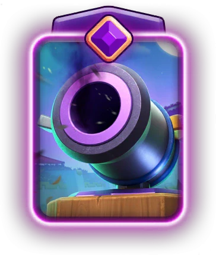
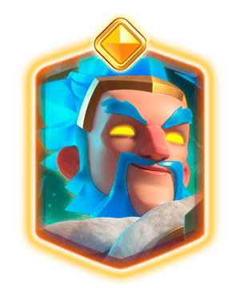

皇室战争 10 月平衡性调整的预案来了。

这次一共改了 **11 张卡牌**，包括 4 张削弱、6 张加强和 1 张重做。

目前公布的是 **WIP 策划版本**，正式上线前仍可能根据测试和玩家反馈修改。

## 削弱卡牌

### 野蛮人滚筒

| 调整项目 | 调整前 | 调整后 | 幅度 |
|---|---:|---:|---:|
| 伤害 | 232 | 215 | -8% |

野蛮人滚筒的伤害降低 17 点。

滚筒的功能没有变化，依然能清理杂毛、击退地面单位，再留下一个野蛮人参与防守。

### 骷髅兵

| 调整项目 | 调整前 | 调整后 |
|---|---|---|
| 出生间距 | 当前间距 | 更紧密 |

骷髅兵没有改伤害和生命值，削弱落在出生位置上。

3只骷髅靠得更近以后，是否还能围住单体单位、是否还能极限拉扯可能就要打一个问号了，这点恐怕就要实战检验了。骷髅兵的价值一直来自 1 费能做很多工作，出生间距收紧以后，一些原来卡得很极限的防守可能需要重新适应。

### 觉醒加农炮

| 调整项目 | 调整前 | 调整后 | 幅度 |
|---|---:|---:|---:|
| 弹幕伤害 | 281 | 261 | -7% |

### 精英冰法

| 调整项目 | 调整前 | 调整后 | 幅度 |
|---|---:|---:|---:|
| 冻结伤害 | 89 | 46 | -49% |

精英冰法是这版预案里挨刀最重的一张卡。

冻结伤害从 89 降到 46，几乎直接砍半。以后开启能力，核心价值会更偏向冻结和控场，不能再指望顺手打出太多范围伤害。用它清理低血量杂毛，或者配合其他伤害完成斩杀，都会比现在困难。

目前预案没有提到冻结持续时间，也没有调整普通攻击。只要控制效果还在，精英冰法就不会失去自己的位置，不过能力的伤害收益确实被压了很多。

## 加强卡牌

### 蛮羊骑士

| 调整项目 | 调整前 | 调整后 | 幅度 |
|---|---:|---:|---:|
| 伤害 | 250 | 266 | +6% |

蛮羊骑士的单次伤害增加 16 点。

6% 算不上夸张，不太可能让蛮羊骑士立刻统治环境。对于桥头施压和控制体系来说，这次加强至少给了她一个重新进卡组的理由。

### 哥布林飞桶

| 调整项目 | 调整前 | 调整后 | 幅度 |
|---|---:|---:|---:|
| 首次攻击时间 | 0.4 秒 | 0.3 秒 | -25% |

哥布林落地后的第一刀会更快。

0.1 秒看起来很短，对飞桶却相当实用。对手的法术慢一点，哥布林就更有机会先摸到公主塔。比赛进入后期，飞桶反复施压时，这些多蹭出来的伤害会逐渐累积。

滚木、滚筒等常规解法依然能处理飞桶，这次调整主要惩罚反应慢和法术时机不准。飞桶体系的进攻容错会稍微高一点。

### 熔岩猎犬

| 调整项目 | 调整前 | 调整后 | 幅度 |
|---|---:|---:|---:|
| 伤害 | 53 | 61 | +14% |

熔岩猎犬本体伤害提高 8 点，百分比看着很大，原因也很简单，它原来的单次伤害就不高。

猎犬的主要任务依然是扛伤和掩护后排，不会因为这次调整变成输出核心。不过对手完全无视它的代价会稍微高一点，尤其猎犬贴塔时间较长时，多次攻击累积起来也有一些伤害。

真正决定天狗体系强度的，仍然是后排单位能否存活，以及爆开后的熔岩幼犬能不能形成持续压力。这次更像一份本体补偿。

### X连弩

| 调整项目 | 调整前 | 调整后 | 幅度 |
|---|---:|---:|---:|
| 伤害 | 58 | 61 | 官方标注 +4% |

X连弩每次攻击增加 3 点伤害。

单发只多 3 点，放在连弩身上却不能完全忽略。它的攻速快，只要成功锁塔一段时间，额外伤害就会不断累积。防守时处理高血量单位，也会稍微轻松一点。

### 攻城炸弹人

| 调整项目 | 调整前 | 调整后 | 幅度 |
|---|---:|---:|---:|
| 伤害 | 281 | 302 | +7% |

攻城炸弹人的伤害增加 21 点。

这张卡一旦碰到塔，本来就能打出很高的换费收益。加强以后，漏掉一只会更疼，两只同时撞上去的惩罚也会继续放大。

### 哥布林钻机

| 调整项目 | 调整前 | 调整后 | 幅度 |
|---|---:|---:|---:|
| 对皇家塔出生伤害 | 0 | 20 | 新增 20 点 |

哥布林钻机重新获得了落地塔伤，不过数值只有 20 点。

20 点单看不多，钻机却是一张会反复使用的进攻核心。只要落点能覆盖皇家塔，每次进攻都有一小段无法回避的保底伤害。僵持局里，这种伤害会让钻机玩家更容易掌握最后的斩杀节奏。

它还不至于回到过去靠落地伤害硬磨塔的状态。真正的输出仍然来自钻出的哥布林，以及对手解牌时被迫交出的费用。

## 重做卡牌

### 黄金骑士

| 调整项目 | 调整前 | 调整后 | 幅度 |
|---|---:|---:|---:|
| 伤害 | 161 | 168 | +5% |
| 冲刺距离 | 5.5 格 | 5.0 格 | -9% |

黄金骑士增加了普通伤害，同时缩短冲刺距离。

伤害提高以后，他近身对砍和清理中小型单位会更舒服。冲刺距离少了半格，则会直接影响技能能否接上远处目标。以前刚好可以连过去的位置，改动后可能会停在中间。

整体看，这次调整把一部分强度从技能链式冲刺挪回本体。黄金骑士平时站场会更稳，技能制造离谱连跳的机会少一些。究竟算加强还是削弱，很看卡组依赖他的哪一部分能力。

那么，各位挑战者，你，怎么看？
