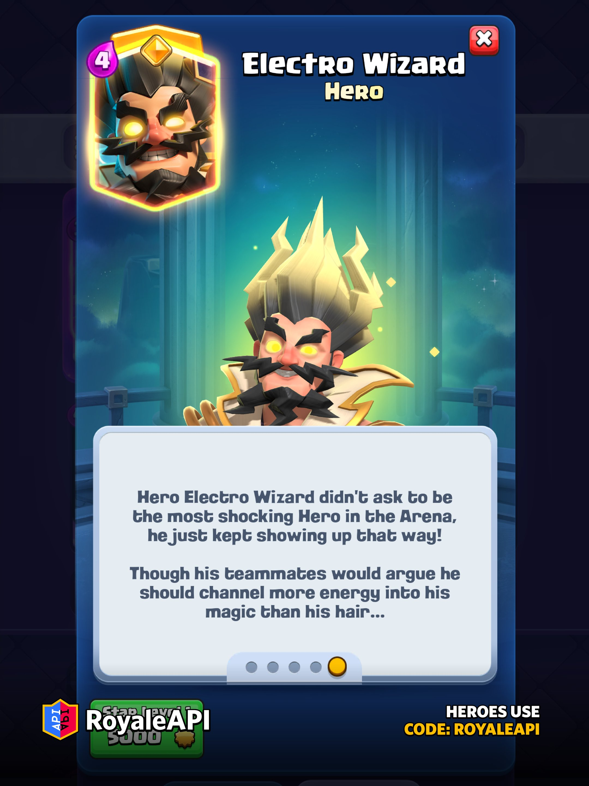
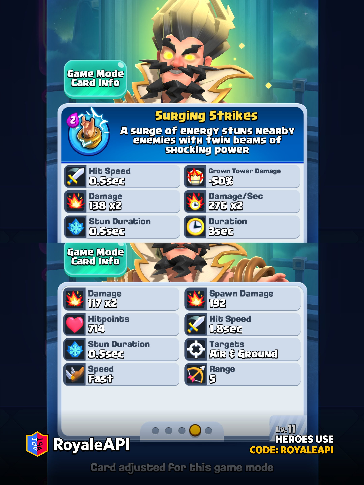

雷电法师终于也有精英形态了。

10 月第 88 赛季，皇室战争会推出 **精英电法**。他的本体费用和普通雷电法师一样，还是 4 圣水，登场伤害、双目标攻击和眩晕能力也都和原始状态一样。

使用精英技能后，精英电法会用两道电流连续锁住附近目标，持续三秒，只要电法没死，对面的卡牌就得站在原地挨电。

### 基础信息

精英电法的本体属性没有额外加强，和普通雷电法师的生命、伤害保持一致。

按照 11 级锦标赛标准，本体属性如下。

| 项目 | 数值 |
|---|---|
| 本体费用 | 4 圣水 |
| 稀有度 | 传奇 |
| 目标 | 空中和地面 |
| 生命值 | 714 |
| 单次伤害 | 117 × 2 |
| 登场伤害 | 192 |
| 攻击间隔 | 1.8 秒 |
| 眩晕时间 | 0.5 秒 |
| 移动速度 | 快 |
| 攻击距离 | 5 格 |

普通电法本来就是一张功能性很强的控制卡牌。落地可以打断地狱塔、电磁炮和冲锋单位，之后每次攻击还能同时电两个目标。精英形态没有改这些东西，只是在原有控制上再加了一次更集中的爆发控制。

### 2费技能，电涌连击

精英电法的技能叫 **Surging Strikes**，这里暂时翻成“电涌连击”。技能消耗 2 圣水，开启后会用两道电流攻击附近敌人。

| 技能项目 | 11 级数值 |
|---|---|
| 技能费用 | 2 圣水 |
| 持续时间 | 3 秒 |
| 攻击间隔 | 0.5 秒 |
| 每次眩晕 | 0.5 秒 |
| 前两次单束伤害 | 138 |
| 第三次起单束伤害 | 153 |
| 对塔伤害 | 降低 50% |
| 攻击距离 | 5 格 |

技能持续期间，精英电法一共会打出 5 次有效电击。每次电击都会附带 0.5 秒眩晕，下一次攻击又刚好在 0.5 秒后到来，所以实际看起来很像冰冻。

伤害之外，连续打断才是这个技能最实用的部分。

气球、野猪骑士、冲锋单位和高攻速部队被锁住以后，几秒内很难完成正常攻击。地狱龙和地狱塔的伤害也会反复重置。

### 一个目标会吃两道电

精英电法平时可以同时攻击两个目标，技能也沿用了这套机制。

范围里有两个敌人时，两道电流各找一个目标。只有一个敌人时，两道电流都会打到它身上，伤害直接合并。按照 开发服数据，5 次电击总共可以造成 **1464 点伤害**，用时约 3.25 秒。

同样的时间里，普通攻击大约只能造成 425 点伤害。技能期间的输出接近平时的 3 倍，攻击频率也从 1.8 秒一次压到 0.5 秒一次。

这就让精英电法出现了两种完全不同的用法。

面对一整波推进时，他可以同时锁住两个重要目标，给后排和防御塔争取输出时间。面对一张大单位时，他又能把两道电全部集中起来，短时间内补出一段很可观的伤害。

不过，技能打皇家塔时只有一半伤害。想把它当成 2 费斩杀技能并不现实，控制防守单位、保护己方推进才是更合适的用法。

### 技能要讲究时机

这个技能有一个很容易踩的坑。

有些精英技能会等到找到目标以后才开始计时，精英电法却会立刻倒数。玩家按下技能按钮，3 秒倒计时就已经开始，不管附近有没有敌人。

也就是说，不能提前太久开技能。对面还没走进 5 格射程，或者刚好用法术、击退把电法的位置打乱，技能时间照样往下走。等目标真正靠近，可能只剩一两次电击。

比较稳的做法，是等对方关键单位已经进入射程，或者确认精英电法下一次攻击能锁到目标，再按技能。

技能还有一个 4 格的次级判定范围。它会帮助第一下更快触发，不过实战里不用死记这个数字。看见电法已经贴近目标再开，通常不会错。

### 防守怎么用

精英电法最舒服的位置，还是防守中场。

普通电法落地先打一段伤害并重置目标，精英技能接着连续眩晕，己方公主塔和其他单位可以安稳输出。对面如果是气球、野猪、攻城锤、地狱龙这类很怕打断的单位，控制效果会格外明显。

防墓园也很实用。0.5 秒一次的双目标电击可以快速清理骷髅，电法自己还能持续控住附近单位。只是这套操作总费用达到 6 圣水，单独来解效果不一定好。

还有一点需要注意，精英电法还是只有 714 点生命。火球加小法术、重型法术或者高伤单位都能较快处理他。

所以，开技能的时机很重要。

### 进攻怎么用

进攻端比较适合跟在坦克或桥头部队后面。

普通雷电法师本来就常见于皮卡锤和一些推进体系。换成精英电法以后，他可以在接近河道或公主塔时开技能，压住对面的防守核心。地狱塔、地狱龙、猎人和高伤单体单位一旦被连续打断，前排就能多活几秒。

不过他不会穿透，也不会无限连接。目标超过两个，技能还是只能先处理距离合适的两个。对面用便宜单位挡在前面，也可能让电流打错人。

进攻时最好先看清对面的防守顺序，等需要控制的单位出现，再交技能。

### 更适合哪些卡组

第一批会尝试精英电法的，大概率还是原本就带电法的体系。

皮卡锤显然会是第一个想到的卡组。电法负责重置和防空，技能还能给皮卡争取贴近目标的时间。

气球卡组同样有机会。电法先守住对面一波，反打时再用技能锁住防空。不过本体加技能一共 6 费，卡组不能堆得太重，否则每次开技能都会让后续跟牌很难受。

从机制上看，他和精英冰法有点像，都是花 2 费换一段强控制。精英冰法偏范围冻结，能影响一片单位；精英电法只盯一到两个目标，打单体时伤害更集中，还能持续重置蓄力和冲锋。两张卡各有擅长的局面，电法更适合处理少量高价值目标。

不过话说回来，精英电法和精英冰法的技能怎么控制效果都那么像冰冻呢？冰冻法术真的是情何以堪啊！

### 获取方式

精英电法是 10 月赛季的主打精英卡牌，会出现在高级皇室令牌第一个里程碑。玩家需要在以下奖励中选择一项。

* 精英电法
* 6 个觉醒万能碎片
* 1500 张稀有万能卡
* 150 张史诗万能卡

新精英上线后也会直接进入解锁池，可以花费 **200 精英币**解锁。

### 最后

精英电法的技能看着很暴力，难点还是技能释放时机。

按准了，他能让气球、野猪、地狱龙或者一张高费核心原地罚站，己方整套防守会轻松很多。按早了，电流还没找到人，倒计时已经走掉一半；按晚了，电法可能先被秒杀。

这张卡的上限不低，但是老实说，缺乏新意。

原本就会用雷电法师的玩家，应该很快能找到感觉。至于 2 费连续控制会不会过强，等正式服实装以后过几天，大概率就有答案了。

那么，各位挑战者，你怎么看？
