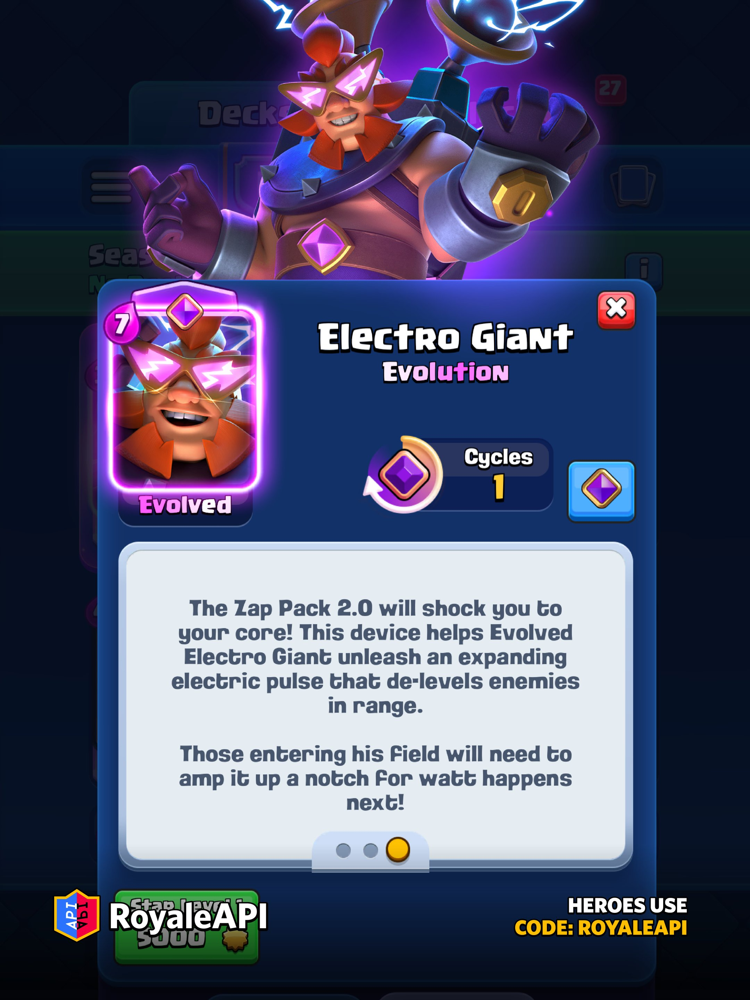
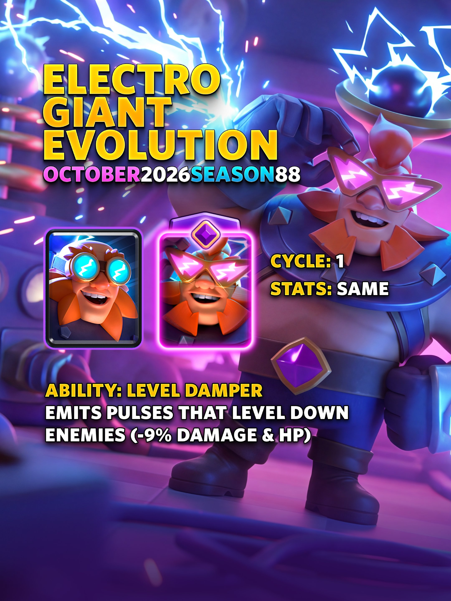
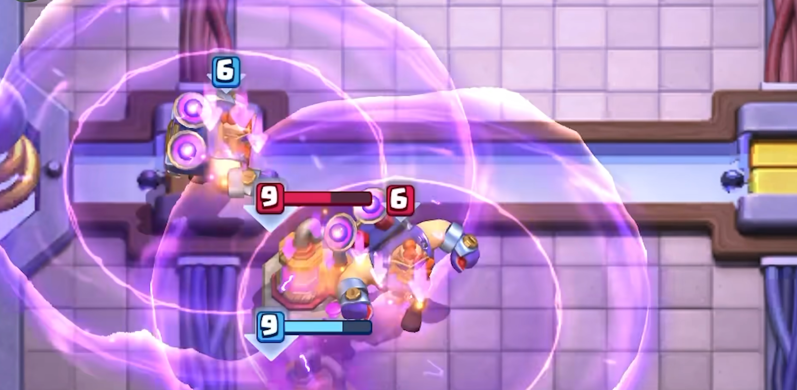
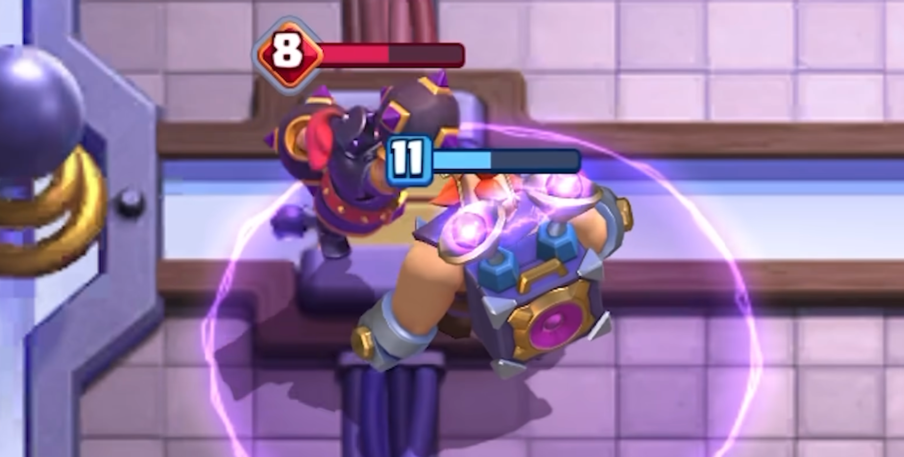
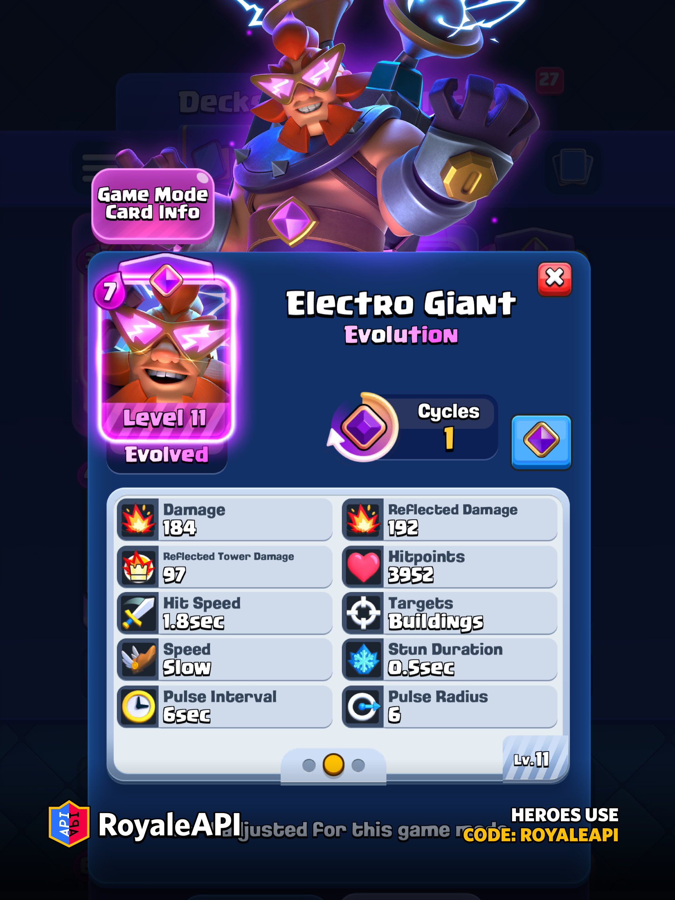
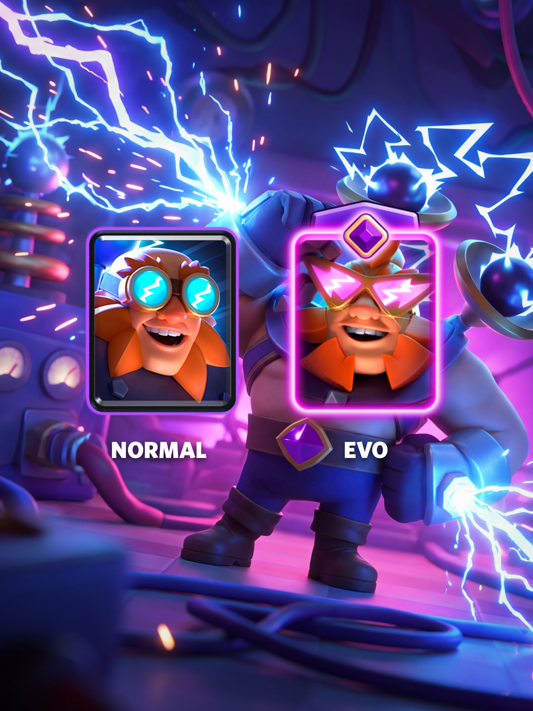
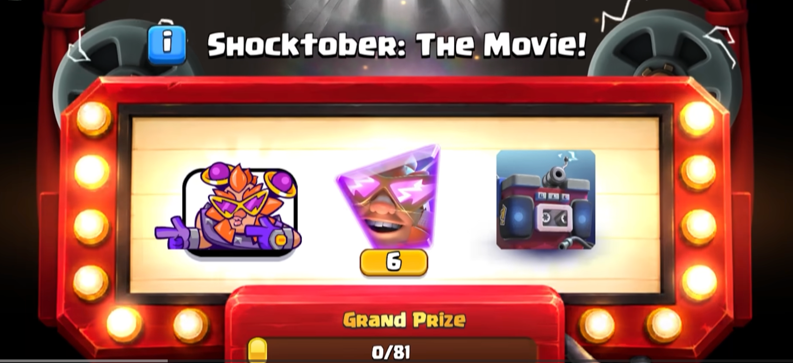

电胖最烦人的地方，本来就是你打他，自己还要挨电。

10 月第 88 赛季，电胖将迎来觉醒。**觉醒电胖**会背着升级版电击背包进场，每隔一段时间向四周放出脉冲。范围里的敌军会直接降低 1 级，血量和伤害一起往下掉。

一张 7 费推进核心，还能边走边给防守部队降级，想想都会是一件令人头疼的事情。

### 基础信息

觉醒电胖的本体属性和普通雷电巨人相同，没有额外获得生命值或伤害加成。

按照 11 级锦标赛标准，基础数值如下。

| 项目 | 数值 |
|---|---|
| 费用 | 7 圣水 |
| 稀有度 | 史诗 |
| 目标 | 建筑 |
| 生命值 | 3952 |
| 单次伤害 | 184 |
| 反击伤害 | 192 |
| 反击皇家塔伤害 | 97 |
| 攻击间隔 | 1.8 秒 |
| 反击眩晕 | 0.5 秒 |
| 移动速度 | 慢 |
| 觉醒周期 | 1 次循环 |

1 次循环意味着每部署两次电胖，就有一次是觉醒形态，这也符合游戏中现在高费用卡牌低循环轮次的设定。

### 觉醒技能：降级脉冲

觉醒技能英文名是 **Level Damper**，暂时翻译做“降级脉冲”，基本可以可以理解游戏内置的等压技能。

| 技能项目 | 数值 |
|---|---|
| 首次脉冲 | 登场约 3.5 秒后 |
| 后续间隔 | 每 6 秒一次 |
| 脉冲半径 | 6 格 |
| 等级变化 | 降低 1 级 |
| 最低等级 | 1 级 |
| 生命与伤害变化 | 约降低 9% |
| 皇家塔 | 不受降级影响 |

电胖登场时，脉冲计时器已经预先充了 2.5 秒，所以第一轮不用等满 6 秒，大约 3.5 秒后就会释放。之后只要电胖还活着，每隔 6 秒继续放一次。

脉冲半径有 6 格，比飓风法术的 5.5 格还大。电胖走到桥头时，对方放在塔前、河道两侧甚至稍微靠后的防守单位，都可能被扫进去。

每次命中会让敌军降低 1 级，最低可以降到 1 级。按照卡牌每升一级大约增加 10% 数值的规则，降低 1 级后，生命值和伤害会减少约 9%。

这个脉冲本身没有伤害。敌军只是头顶等级数字变低，模型也会缩小 20%。缩小只是视觉效果，不会改变碰撞体积、攻击距离或移动速度。

### 降级可以继续叠加

只要觉醒电胖活得够久，同一个单位可以连续吃到多轮脉冲。

第一轮降 1 级，6 秒后再降 1 级。一个高血量防守单位如果始终贴着电胖打，很可能在整场交手里掉两级。第二次降级的数值变化依然会反映到当前生命上，单位越耐打，后续受到的影响越明显。

大皮卡、超级骑士、猎人、迷你皮卡这类负责处理电胖的单位，往往需要在他身边停留一段时间。第一轮脉冲已经会降低解场效率，电胖如果再被治疗、飓风或后排保护拖到第二轮，防守方会越来越难受。

骷髅、蝙蝠、哥布林之类的杂毛部队通常会先被电胖反伤清掉，降级对它们意义有限。这个能力最克制的，还是能活着围住电胖的中高血量单位。

### 眩晕不会重置倒计时

降级脉冲属于范围效果，不是飞行道具，无法被反射或在途中拦下。

脉冲计时也不会被眩晕重置。电法、小电和雷龙可以打断电胖的普通攻击，却不能把已经走过的脉冲倒计时清零。该到时间时，脉冲照常放出。

这一点在防守中很关键。以往用连续控制拖住电胖，可以让己方单位多打几下。觉醒形态下，拖延时间也可能把下一轮降级等出来。控制依然有用，只是不能指望靠眩晕阻止技能。

### 皇家塔不会被降级

降级脉冲可以覆盖敌军以及建筑，但是不会降低公主塔、国王塔和其他皇家塔的等级。

所以觉醒电胖靠近塔以后，依旧要靠普通攻击和电击反伤输出。技能的作用主要是削弱守塔单位，让电胖和后排更容易活下来。

### 进攻时会发生什么

普通电胖已经很依赖飓风。防守部队被拉到身边后，它们会不断触发电胖反伤。觉醒形态再补一轮降级，飓风的性价比就更高了。

比较理想的场面，是电胖过桥以后用飓风把远程单位拉进 6 格范围。第一轮脉冲让它们掉 1 级，反伤再处理攻速快的小单位，后排则趁机输出。对方原本算好的伤害会少一截，电胖可能因此多走一步、多打一下。

大闪也会继续是常见搭档。建筑和高价值后排先被大闪秒杀，剩下的单位围住电胖以后再吃降级，防守压力会很大。

觉醒电胖依然有 7 费，沉底以后留给对手组织换路进攻的时间很长。降级能力再强，也要等他走到范围内才能生效。卡组如果为了保护电胖堆太多高费牌，碰到快速换路还是会难受。

### 防守时怎么处理

防守觉醒电胖，最稳的思路是缩短接触时间。

建筑尽量拉开距离，远程输出单位也别全部堆在电胖周围。能在第一轮脉冲前把他打残，后续就省事很多。大皮卡这类单位虽然能硬解，但长时间贴身会吃到降级，最好配合法术、建筑或远程火力尽快结束战斗。

塔楼不会，国王塔激活仍然很有价值。多一座塔持续输出，可以更快压低电胖血量，也能减少第二轮脉冲出现的机会。

对付普通电胖常用的办法仍然有效，只是容错变低了。防守单位围上去，刚好给 6 格脉冲一次等压的机会，往往是最亏的处理方式。

### 怎么免费获得

觉醒电胖会在 **10 月 5 日**随第 88 赛季上线，并作为雷电十月图鉴活动的大奖之一开放免费获取。

错过活动以后，觉醒碎片还可以通过后续现场活动、商店礼包、传奇幸运宝箱、觉醒宝箱和觉醒万能碎片获得。部分途径需要等未来赛季开放。

### 最后

觉醒电胖这次没有获得简单粗暴的血量加成，降级脉冲却和他的推进方式很搭。

以前大家都抱怨电胖缺数值难进塔，这次策划也算是简单粗暴——我们不给电胖加数值，给对面等压减数值不就行了？

无论如何，电胖这个独特的机制，下赛季实装后大部分玩家一定会拿来娱乐也好、上分也好，总之天梯一定会很热闹。
