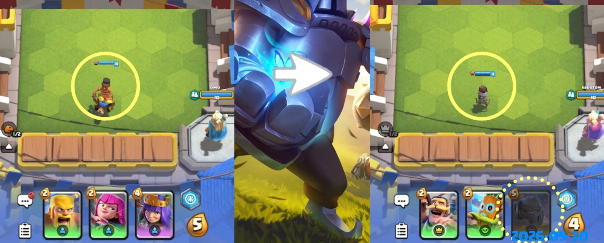
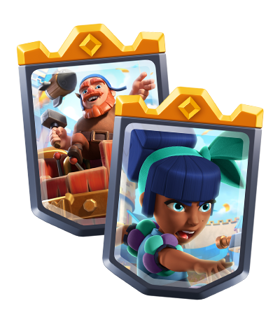
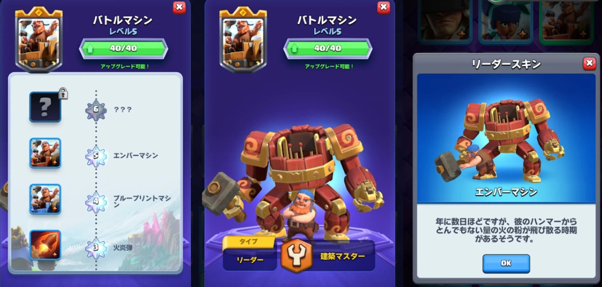
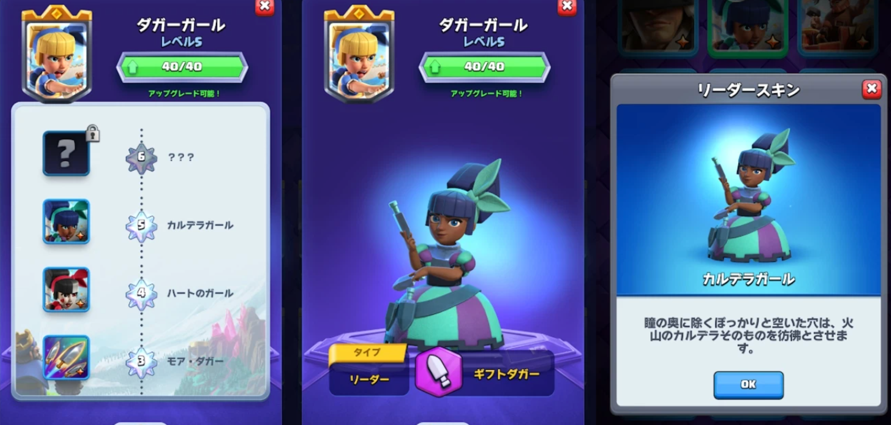
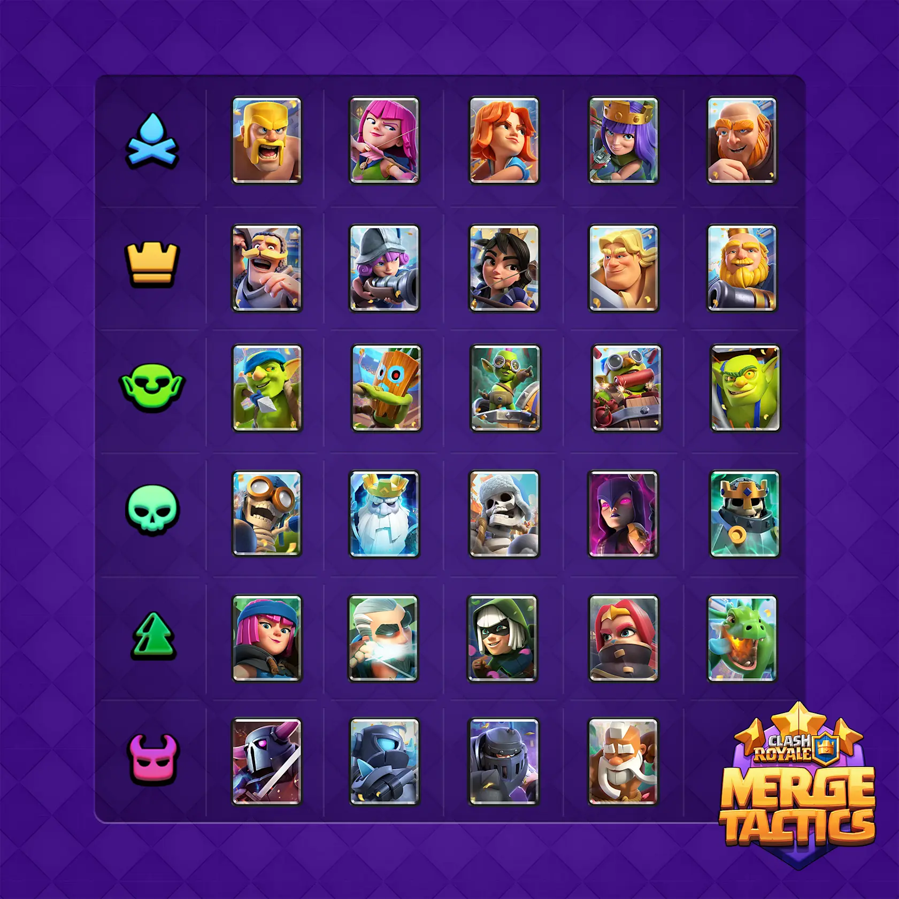
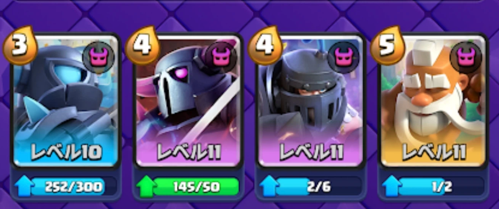

《皇室战争》合合奇兵第 11 赛季的 10 月更新已经于 10 月 1 日上线。

这次更新主要调整了月度超级部队的获取方式。超级部队不再作为开局单位随机分配，而是进入所有玩家共用的卡池。与此同时，迷你皮卡、皮卡、超级骑士和武僧加入 10 月轮换，准备阶段的每回合圣水也由 5 点降回 4 点。

## 超级部队进入共享卡池

第 11 赛季在 9 月加入了月度超级部队。官方在收集数据和玩家反馈后，认为原来的分配方式存在几个问题。

- 部分超级部队让特定阵容过于强势
- 同一合并等级下，高费与低费部队的差距较大
- 可用阵容受到限制
- 准备阶段的操作压力偏高
- 超级部队的获取方式过于受限

从 10 月开始，超级部队不再直接成为玩家的开局单位，而是进入共享卡池。所有玩家都可以在商店中找到并争夺这些部队。

开局规则也恢复为随机获得一张 2 圣水部队。官方还将继续调整超级部队与普通部队的强度，缩小同一合并等级下高费和低费部队之间的差距，但本次公告没有公开具体数值。

## 两款统帅皮肤

10 月没有新的统帅登场，战争机器和飞刀女爵各自获得了一款 5 级皮肤。

已经将对应统帅升至 5 级的玩家，会在更新上线后自动获得新皮肤，不需要再次解锁。

## 10月部队卡池

10 月的卡池仍然包含 29 张部队卡。改动只涉及四张月度超级部队，整体数量没有变化。

| 加入卡池 | 离开卡池 |
| --- | --- |
| 迷你皮卡 | 野猪骑士 |
| 皮卡 | 战羊骑士 |
| 超级骑士 | 王子 |
| 武僧 | 黑暗王子 |

## 10 月四位首领超级部队

10 月轮换的四张超级部队分别是迷你皮卡、皮卡、超级骑士和武僧。四者都拥有“首领”特性，并对原有能力进行了重做。

首领单位的生命值低于 50% 时会进入第二阶段，同时使周围敌人陷入 3 秒恐惧。首领特性上阵数量越多，生命值加成和恐惧范围越大。

| 首领数量 | 生命值加成 | 恐惧范围 |
| --- | --- | --- |
| 1 | 25% | 2 格 |
| 2 | 50% | 3 格 |
| 3 | 100% | 4 格 |
| 4 | 300% | 5 格 |

### 迷你皮卡

第一阶段中，迷你皮卡每攻击数次便会制作一份煎饼，随机提升一名友方单位的等级。进入第二阶段后，它用技能攻击敌人时可以吸收能量。

触发所需攻击次数随合并等级变化，分别为 6、5、4、3 次。

### 皮卡

第一阶段中，皮卡每攻击数次便会向前挥砍，对直线上的所有敌人造成伤害。进入第二阶段后，它会获得生命偷取和移动速度加成。

触发所需攻击次数随合并等级变化，分别为 4、3、2、1 次。

### 超级骑士

第一阶段中，超级骑士会定期跃向敌人，造成范围伤害和 2 秒眩晕。进入第二阶段后，每次攻击都会击退并眩晕目标。

技能冷却时间随合并等级变化，分别为 6、5、4、3 秒。跳跃距离分别为 2、2、3、4 格。

### 武僧

第一阶段中，武僧每攻击三次便会击退敌人。进入第二阶段后，它每攻击数次会获得护盾，并获得伤害反射和自我治疗效果。

触发所需攻击次数随合并等级变化，分别为 4、3、2、2 次。

## 26 个特殊规则轮换

合合奇兵会在玩家进入新联赛时解锁特殊规则。第 11 赛季延长后，特殊规则总数由原来的 18 个增加到 26 个，并按月进行轮换。

10 月的规则安排如下。

| 联赛 | 特殊规则 |
| --- | --- |
| 青铜 I | 合并训练、特性训练 |
| 青铜 II | 交易训练、装备训练 |
| 青铜 III | 地块训练、建筑训练 |
| 白银 I | 合并奖励、统治 |
| 白银 II | 星级优势、迷你合并 |
| 白银 III | 法球盛宴、三星幻想 |
| 白银 IV | 大逃杀、哥布林宝藏 |
| 黄金 I | 皇家河流、特性赠礼 |
| 黄金 II | 深渊地块、飞升 |
| 黄金 III | 四星、虫洞地块 |
| 黄金 IV | 特性假人、归我了 |
| 黄金 V | 首次免费、回声替补席 |
| 钻石 | 跳跃地块、诅咒地块 |

## 每回合圣水由 5 点降回 4 点

第 11 赛季扩大了阵容构筑和强化空间，也让准备阶段的买卖操作明显增加。为了减少反复购买和出售部队的情况，每回合获得的圣水由 5 点降回 4 点。

官方希望每一次购买和出售都更有分量，同时给阵容安排和站位调整留出更多时间。

## 徽章规则将在赛季结束后调整

合合奇兵第 11 赛季于 11 月 30 日结束后，徽章的发放条件将与《皇室战争》的其他徽章保持一致。

| 徽章 | 获取条件 |
| --- | --- |
| 银色徽章 | 达到钻石联赛 |
| 金色徽章 | 进入排行榜前 10000 名 |

玩家在后续赛季再次达成相同条件，可以继续升级徽章。这项改动不会在 10 月立即生效，而是从第 11 赛季结束后开始执行。

## 其他修复

飞刀女爵提供的装备不再自动装配，处理方式改为与其他装备一致。

官方表示，11 月的月度超级部队、卡池和特殊规则将在 10 月底公布。

## 参考资料

- [《皇室战争》官方更新公告](https://supercell.com/en/games/clashroyale/blog/release-notes/merge-tactics-season-11-october-changes/)

