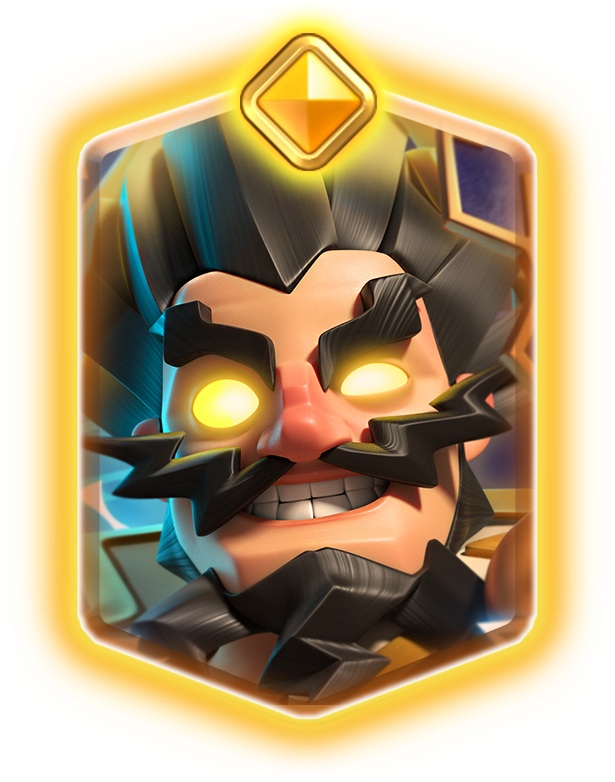
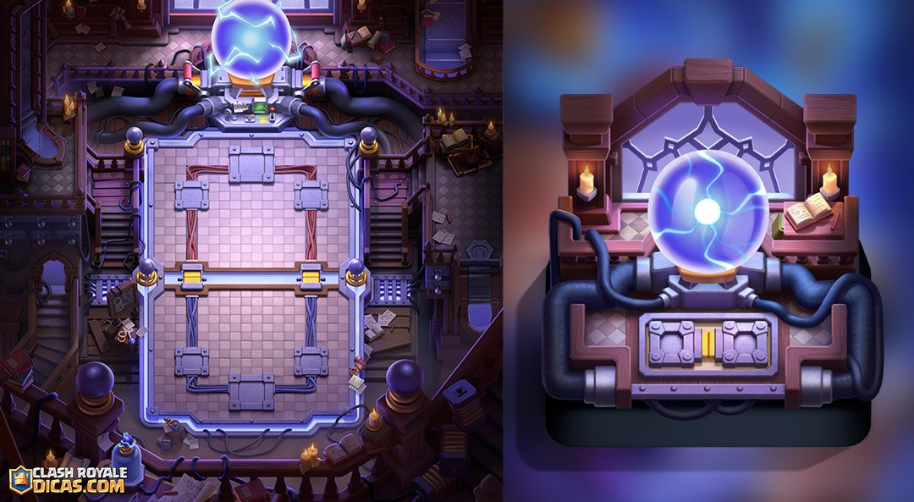
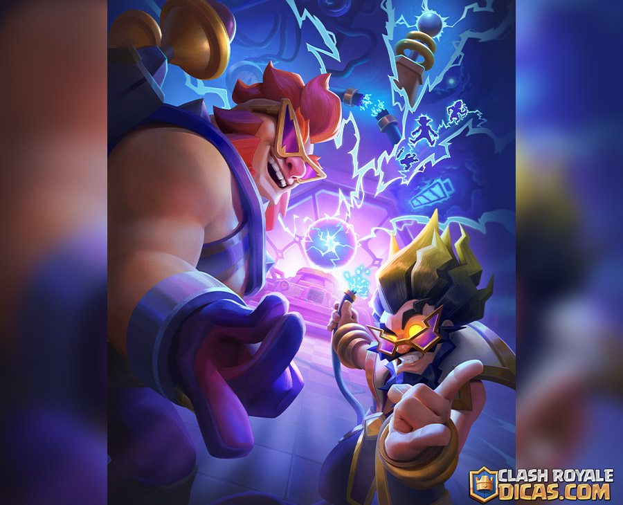
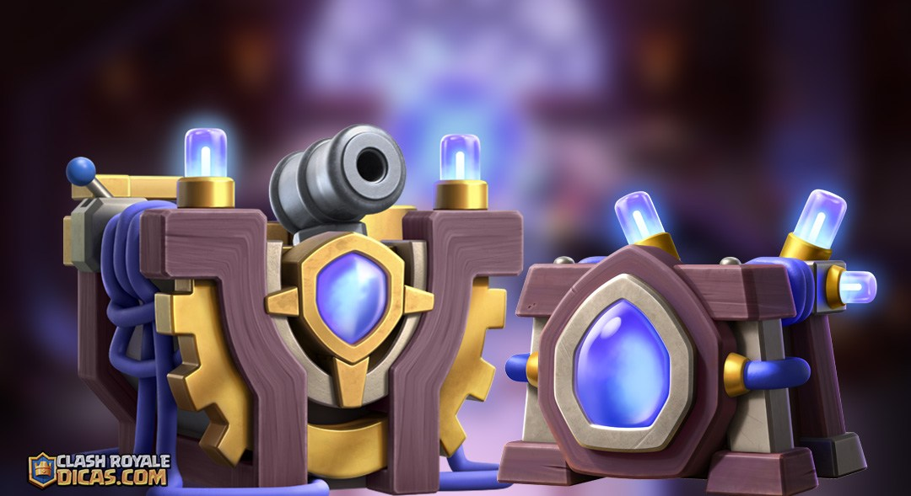
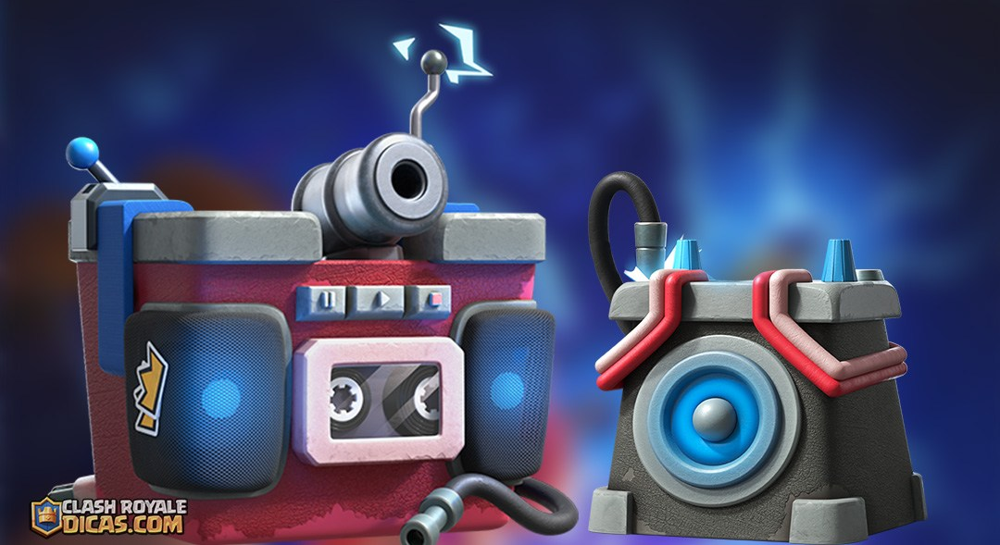
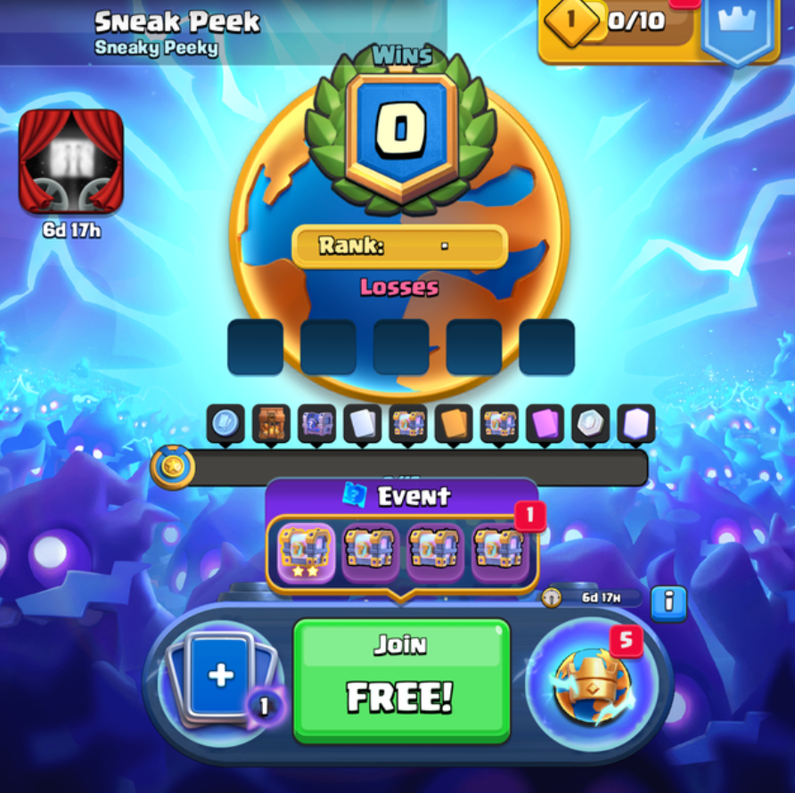
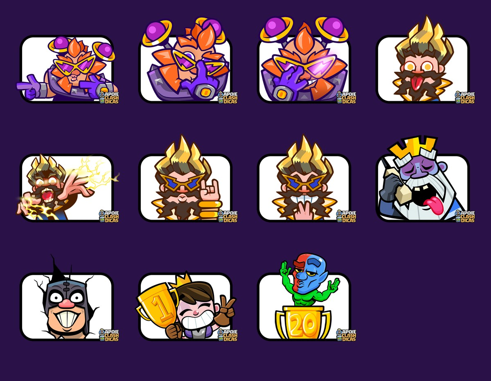
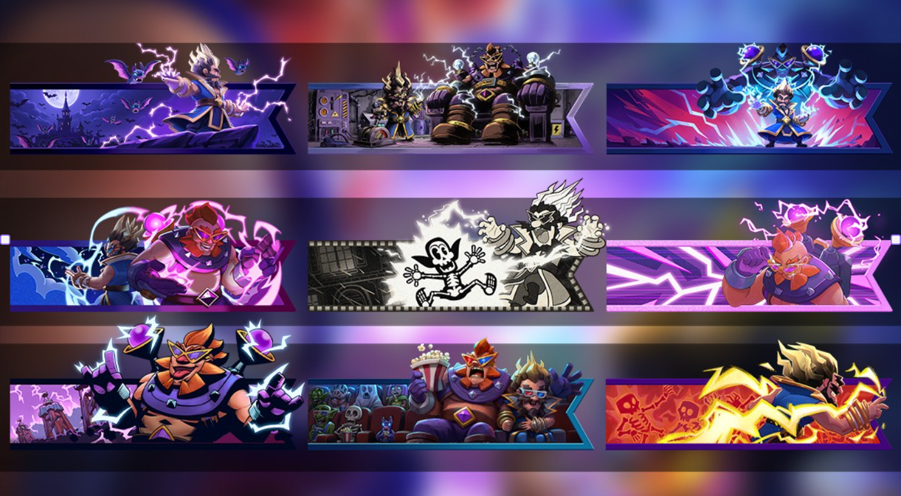
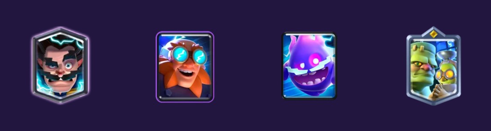

皇室战争 10 月新赛季已经公布，主题是 **雷电十月**。

第 88 赛季将从 **2026 年 10 月 5 日持续到 11 月 2 日**，一共 4 周。这个月的主角是精英电法和觉醒电胖，活动安排也比 9 月更偏竞技。恐怖棋局会进入竞技联赛，混沌模式迎来第三季，月底还有一年一度的 CRL 20 胜挑战。

## 精英电法

精英电法是 10 月高级皇室令牌的主打内容。

他的本体费用和普通雷电法师一样，仍然是 4 圣水。精英技能需要额外花费 2 圣水，开启后会在 3 秒内连续电击附近目标，每次攻击都附带眩晕。范围内只有一个敌人时，两道电流会一起落在同一个目标身上。

精英电法会出现在高级皇室令牌第一个里程碑中，也可以花费 200 精英币直接解锁。

具体数值、技能触发和实战用法可以看独立介绍。

[皇室战争精英电法登场，2费连续电击眩晕，罚站没商量](/posts/clashroyale/2026/09/hero-electro-wizard-guide/)

## 觉醒电胖

雷电巨人会在新赛季获得觉醒形态，觉醒周期为 1 次。

觉醒电胖每隔一段时间会向四周释放降级脉冲。6 格范围内的敌军和建筑降低 1 级，生命值和伤害随之下降，皇家塔不会受到影响。同一个单位可以连续吃到多轮脉冲，只要电胖还活着，降级效果就能继续叠加。

觉醒电胖是 10 月雷电十月相册活动的主要奖励。完成相册可以免费获得觉醒碎片，玩家也可以使用 6 个觉醒万能碎片解锁。

详细机制和应对方法在这篇文章里。

[皇室战争觉醒电胖登场，大范围全体降级，等压十级不再是梦想～](/posts/clashroyale/2026/10/electro-giant-evolution-guide/)

## 新竞技场和加载画面

10 月竞技场是一座充满高压设备的实验室。场地四周铺满电缆、线圈和大型电球，暗色实验室配上蓝紫色电光，万圣节气氛已经很明显了。

加载画面由觉醒电胖和精英电法占据主位。电胖正在给一颗电球充能，精英电法站在旁边记录实验，背景里还能看到特斯拉电磁塔和几道卡牌剪影。

## 两款塔楼皮肤

本赛季会加入两款塔楼皮肤。

第一款是雷电十月塔楼皮肤，造型像一座大型发电装置，周围接满电缆和真空管。它会出现在钻石皇室令牌中。

第二款是节拍大师塔楼皮肤，以老式收音机和磁带机为原型，国王塔是一台带炮管的大录音机。这款皮肤来自赛季活动。

## 雷电十月相册活动

新相册活动会贯穿整个赛季，开放时间是 **10 月 5 日到 11 月 2 日**。

玩法和此前相册一致。玩家可以从每日对战、商店和活动中获得碎片，重复碎片积累到一定数量后，会转换成尚未拥有的碎片。

这次相册采用恐怖电影主题，主要奖励包括觉醒电胖碎片、亡灵巨人卡牌、专属表情和战旗。想免费解锁觉醒电胖，开季后应该先确认相册各页的任务和碎片来源。

## 恐怖棋局联赛

10 月竞技路线采用 **恐怖棋局联赛**，活动时间是 **10 月 5 日到 10 月 19 日**。

棋局模式会用固定在场上的防御部队代替普通皇家塔，双方还会定期召唤黑暗王子。摧毁对方对应的防御塔后，该位置不会继续生成黑暗王子。

休闲路线共有 15 个阶段，奖励包括黄金宝箱和幸运宝箱。竞技路线另有排行榜，完成休闲路线可以获得普通徽章，进入前 10000 名则能获得带排名的徽章。

## 混沌模式第三季

混沌模式会在赛季后半段回归，这次新增了 20 张混沌卡牌，并安排了三种玩法。

| 时间 | 模式 | 规则 |
| --- | --- | --- |
| 10 月 19 日到 11 月 2 日 | 混沌选卡 | 普通选卡结合混沌卡牌规则 |
| 10 月 19 日到 10 月 26 日 | 混沌黑暗模式 | 在黑暗竞技场中进行混沌对战 |
| 10 月 26 日到 11 月 2 日 | 混沌能量激增 | 混沌卡牌结合周期落雷规则 |

本月没有单独开放普通混沌模式，三个活动都在原有规则上再叠一层玩法。官方还准备了新的隐藏徽章，具体解锁条件暂时没有公布。

## 能量激增全球锦标赛

10 月全球锦标赛采用能量激增规则，时间是 **10 月 20 日到 10 月 25 日**。

对战期间，闪电会定期劈向场上生命值最高的三个单位。锦标赛采用 5 败淘汰，15 胜拿完基础奖励，并设有全球排行榜和专属徽章。

这项比赛和月底的混沌能量激增是两场独立活动。全球锦标赛使用普通卡牌，月底的限时模式才会加入混沌卡牌。

## CRL 20 胜挑战

一年一度的 CRL 20 胜挑战将在 **10 月 26 日到 11 月 2 日**开放。

挑战采用 3 败淘汰，拿到 20 胜即可通关。奖励包括黄金宝箱、幸运宝箱、限定战旗和新的 20 胜哥布林表情，通关玩家还会获得专属徽章。

这也是本赛季竞技强度最高的活动。准备冲击 20 胜的玩家，可以利用赛季前三周适应 10 月平衡调整和新卡环境，月底再确定参赛卡组。

## 表情

10 月共有 11 个新表情，主要角色是精英电法和觉醒电胖。

| 表情                | 获取方式   |
| ----------------- | ------ |
| 觉醒电胖派对之王          | 赛季活动   |
| 觉醒电胖邪恶眼镜          | 排位联赛 2 |
| 精英电法无限力量          | 钻石皇室令牌 |
| 哥布林 CRL 2026      | 20 胜挑战 |
| 觉醒电胖偷看、精英电法疯狂科学家等 | 暂未确定   |

处刑人表情明显参考了恐怖电影闪灵中中破门的经典镜头，精英电法则换上了疯狂科学家和摇滚歌手造型，和本赛季的实验室主题很搭。

## 战旗

新赛季共有 10 套战旗，也就是 10 张战旗框和 10 张战旗装饰。

免费皇室令牌会提供一套雷电十月战旗，TV Royale 可以领取爆米花战旗，20 胜挑战也有一套电击组合战旗。其余战旗的获取方式暂未全部公布，部分可能会在后续活动或商店中开放。

## 强化卡牌

10 月强化卡牌一共四张。

- 雷电法师
- 雷电巨人
- 电击精灵
- 哥布林斯坦

四张卡都围绕电击和实验室主题展开。雷电法师和雷电巨人分别对应本月的新精英与新觉醒，哥布林斯坦也正好适合这套万圣节实验室背景。

## 合合奇兵 10 月更新

合合奇兵第 11 赛季会继续进行，并在 10 月更换月度超级部队和特殊规则。

超级部队不再作为开局单位随机分配，而是进入所有玩家共用的卡池。迷你皮卡、皮卡、超级骑士和武僧成为新的首领超级部队，每回合获得的圣水也由 5 点降回 4 点。

[合合奇兵 10 月更新详情，超级部队进入共享卡池，四位首领登场](/posts/clashroyale/2026/10/merge-tactics-season-11-october-update/)

## 10 月赛季活动日历

| 时间 | 内容 | 类型 |
| --- | --- | --- |
| 10 月 5 日到 11 月 2 日 | 第 88 赛季雷电十月 | 主题季 |
| 10 月 5 日到 11 月 2 日 | 雷电十月相册 | 相册活动 |
| 10 月 5 日到 10 月 19 日 | 雷电十月里程碑 | 里程碑活动 |
| 10 月 5 日到 10 月 19 日 | 恐怖棋局联赛 | 竞技联赛 |
| 10 月 19 日到 11 月 2 日 | 混沌选卡 | 限时模式 |
| 10 月 19 日到 10 月 26 日 | 混沌黑暗模式 | 限时模式 |
| 10 月 20 日到 10 月 25 日 | 能量激增全球锦标赛 | 全球锦标赛 |
| 10 月 21 日到 10 月 28 日 | 保持灯光社区活动 | 社区活动 |
| 10 月 26 日到 11 月 2 日 | 混沌能量激增 | 限时模式 |
| 10 月 26 日到 11 月 2 日 | CRL 20 胜挑战 | 挑战 |

10 月开季以后，先完成相册活动的前几页，确认觉醒电胖碎片的获取进度。准备参加竞技内容的玩家可以从恐怖棋局联赛开始练习，随后是能量激增全球锦标赛，月底再进入 20 胜挑战。

精英电法需要从皇室令牌或精英币中选择，觉醒电胖则有免费活动。两张新形态怎么拿，开季第一天就能安排清楚。