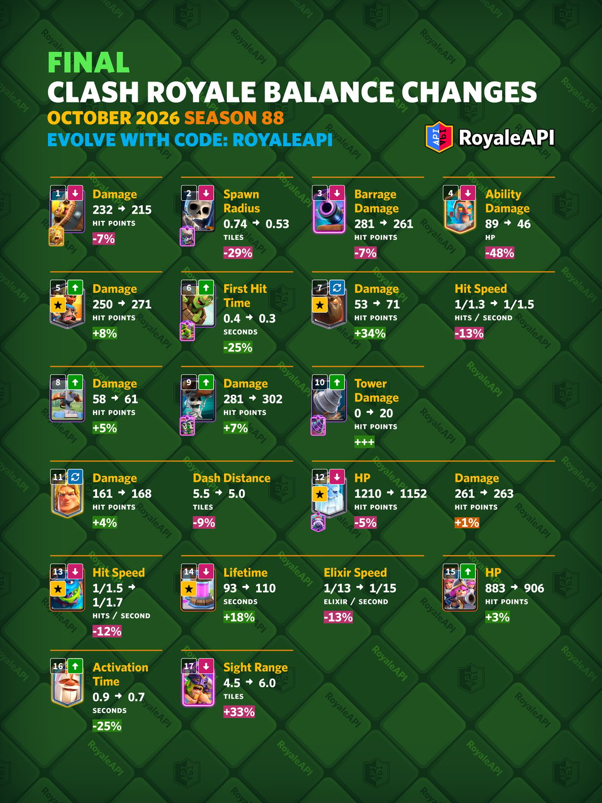

皇室战争第 88 赛季最终平衡已经公布，调整会在 **10 月 5 日新赛季开始后不久**上线。

最终版共有 **17 项调整**。此前预案里的大部分内容得到保留，蛮羊骑士和熔岩猎犬又追加了一轮加强。皇家幽灵、亡灵巨人、圣水收集器、三个火枪手和武僧进入最终名单，觉醒野蛮人精锐还有一项视野范围修复。

## 削弱卡牌

### 野蛮人滚筒

| 调整项目 | 调整前 | 调整后 | 幅度 |
|---|---|---|---|
| 伤害 | 232 | 215 | -7% |

近期野蛮人的多次加强也抬高了野蛮人滚筒的使用价值，它已经成为速转和控制卡组里很常见的小法术。伤害降低以后，滚筒将无法直接消灭攻城炸弹人，会给对手留下更多处理空间。

### 骷髅兵

| 调整项目 | 调整前 | 调整后 | 幅度 |
|---|---|---|---|
| 出生半径 | 0.74 格 | 0.53 格 | -29% |

骷髅兵只要 1 费，却同时拥有过牌、输出和拉扯能力。三只骷髅的出生位置收紧以后，范围攻击更容易一次打中全部骷髅，一些依靠分散站位完成的极限防守也会受到影响。

### 觉醒加农炮

| 调整项目 | 调整前 | 调整后 | 幅度 |
|---|---|---|---|
| 弹幕伤害 | 281 | 261 | -7% |

即使 9 月环境里有不少亡灵巨人卡组，觉醒加农炮依然是最稳定的防守建筑之一。调整后的弹幕仍能消灭吹箭哥布林，面对大型推进时的整体拦截能力会下降。

### 精英冰法

| 调整项目 | 调整前 | 调整后 | 幅度 |
|---|---|---|---|
| 技能伤害 | 89 | 46 | -48% |

精英冰法召唤的雪人同时拥有伤害和控制，这次几乎砍掉了一半技能伤害。调整以后，雪人的冻结效果无法再顺手消灭骷髅兵和蝙蝠，技能会更专注于冻结与控场。

### 皇家幽灵

| 调整项目 | 调整前 | 调整后 | 幅度 |
|---|---|---|---|
| 生命值 | 1210 | 1152 | -5% |
| 伤害 | 261 | 263 | +1% |

皇家幽灵已经从传统的控制和桥头施压卡组，扩展到不少诱饵和速转卡组。生命值降低会让对手更容易处理他。

同步增加的 1% 伤害用于修正 16 级皇家幽灵对雷电法师时不一致的交互，这次调整仍以削减生命值为主。

### 亡灵巨人

| 调整项目   | 调整前   | 调整后   | 幅度   |
| ------ | ----- | ----- | ---- |
| 攻击间隔   | 1.5 秒 | 1.7 秒 | +13% |

亡灵巨人作为空中进攻核心，当前输出效率有些过高。官方选择放慢攻击速度，保留每次攻击的重击感，同时降低持续输出。

### 圣水收集器

| 调整项目 | 调整前 | 调整后 | 幅度 |
|---|---|---|---|
| 持续时间 | 93 秒 | 110 秒 | +18% |
| 每秒产出圣水 | 0.08 | 0.07 | -13% |

官方希望三个火枪手不必过度依赖圣水收集器，所以一边加强三枪，一边延长收集器的回本过程。收集器的总产出没有直接消失，但玩家需要等得更久，对手也有更充分的时间施压。

## 加强卡牌

### 蛮羊骑士

| 调整项目 | 调整前 | 调整后 | 幅度 |
|---|---|---|---|
| 伤害 | 250 | 271 | +8% |

预案原本计划把伤害提高到 266，最终版继续上调到 271。官方希望补强近期表现偏弱的进攻核心，缩小它们与强势攻城卡之间的差距。

### 哥布林飞桶

| 调整项目 | 调整前 | 调整后 | 幅度 |
|---|---|---|---|
| 首次攻击时间 | 0.4 秒 | 0.3 秒 | -25% |

哥布林落地后的第一刀会更快。滚木和野蛮人滚筒等常规解法依然有效，防守法术慢了一点时，哥布林更容易先碰到皇家塔。

### 熔岩猎犬

| 调整项目   | 调整前   | 调整后   | 幅度   |
| ------ | ----- | ----- | ---- |
| 伤害     | 53    | 71    | +34% |
| 攻击间隔   | 1.3 秒 | 1.5 秒 | +15% |

熔岩猎犬在预案里只准备把伤害提高到 61，最终版改为提高到 71，同时放慢攻击速度。单次攻击会更疼，攻击次数减少以后，整体输出不会按照 34% 的幅度直接增长。

### X连弩

| 调整项目 | 调整前 | 调整后 | 幅度 |
|---|---|---|---|
| 伤害 | 58 | 61 | +5% |

X 连弩每次攻击增加 3 点伤害。单次变化不大，它的攻击频率很高，锁塔时间越长，增加的伤害就越明显。

### 攻城炸弹人

| 调整项目 | 调整前 | 调整后 | 幅度 |
|---|---|---|---|
| 伤害 | 281 | 302 | +7% |

攻城炸弹人碰到皇家塔后的伤害增加 21 点。漏掉一只会受到更多伤害，两只同时撞上去的惩罚也随之提高。

### 哥布林钻机

| 调整项目 | 调整前 | 调整后 | 幅度 |
|---|---|---|---|
| 对皇家塔出生伤害 | 0 | 20 | 新增 20 点 |

哥布林钻机重新获得落地塔伤，每次只有 20 点。主要输出依然来自钻出的哥布林，这 20 点会在反复进攻时提供一小段稳定伤害。

### 三个火枪手

| 调整项目 | 调整前 | 调整后 | 幅度 |
|---|---|---|---|
| 生命值 | 883 | 906 | +3% |

三个火枪手本身已经拥有很高的输出，这次增加生命值，是为了让她们有更多机会存活下来，把伤害真正打出去。圣水收集器同时放慢产出，也会减少三枪卡组对收集器的绑定。

### 武僧

| 调整项目 | 调整前 | 调整后 | 幅度 |
|---|---|---|---|
| 技能启动时间 | 0.9 秒 | 0.7 秒 | -25% |

武僧的冥想护体会更快生效。启动延迟缩短以后，玩家在面对远程攻击和飞行法术时，不必过早按下技能，反弹伤害的时机会宽松一些。

## 重做卡牌

### 黄金骑士

| 调整项目 | 调整前 | 调整后 | 幅度 |
|---|---|---|---|
| 伤害 | 161 | 168 | +4% |
| 冲刺距离 | 5.5 格 | 5.0 格 | -9% |

黄金骑士提高了普通攻击伤害，同时缩短冲刺距离。平时站场和近身输出会稍强一点，技能能够接上的远处目标则会减少。

## 错误修复

### 觉醒野蛮人精锐

| 调整项目 | 调整前 | 调整后 | 幅度 |
|---|---|---|---|
| 视野范围 | 4.5 格 | 6.0 格 | +33% |

这项改动修复了觉醒野蛮人精锐投掷长矛时的目标判断问题。此前它们可能无视正常视野范围之外的部队，修复后会按照 6 格视野寻找目标。

## 最终版和预案的区别

最终版保留了预案中的野蛮人滚筒、骷髅兵、觉醒加农炮、精英冰法、哥布林飞桶、X 连弩、攻城炸弹人、哥布林钻机和黄金骑士调整。

蛮羊骑士伤害从预案的 266 提高到 271。熔岩猎犬从单纯加伤害，改成单次伤害大幅提高并放慢攻速。皇家幽灵、亡灵巨人、圣水收集器、三个火枪手、武僧和觉醒野蛮人精锐则是最终版新增内容。

