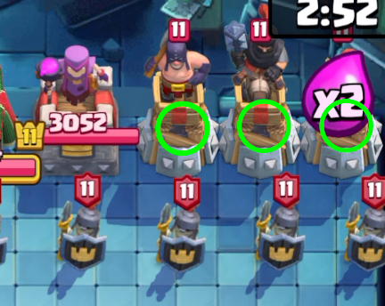
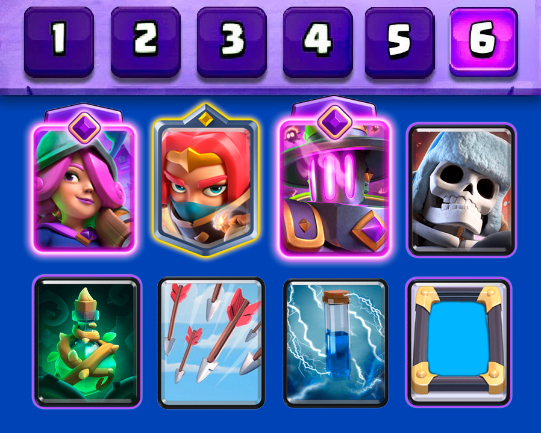
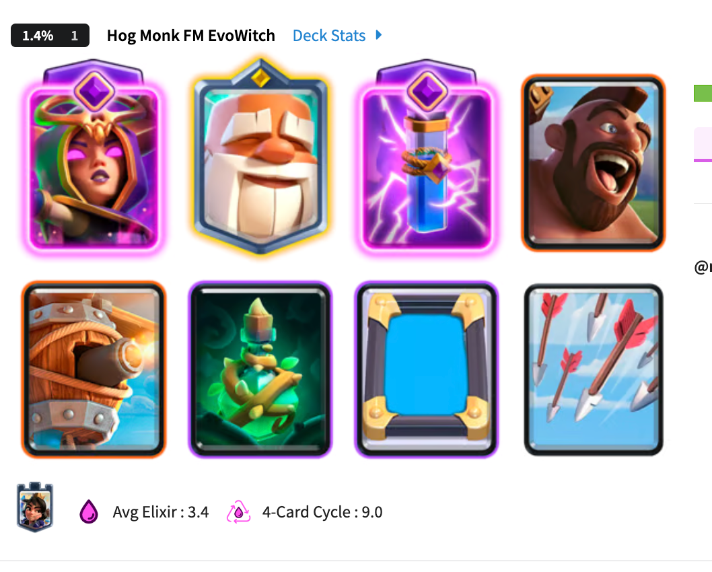
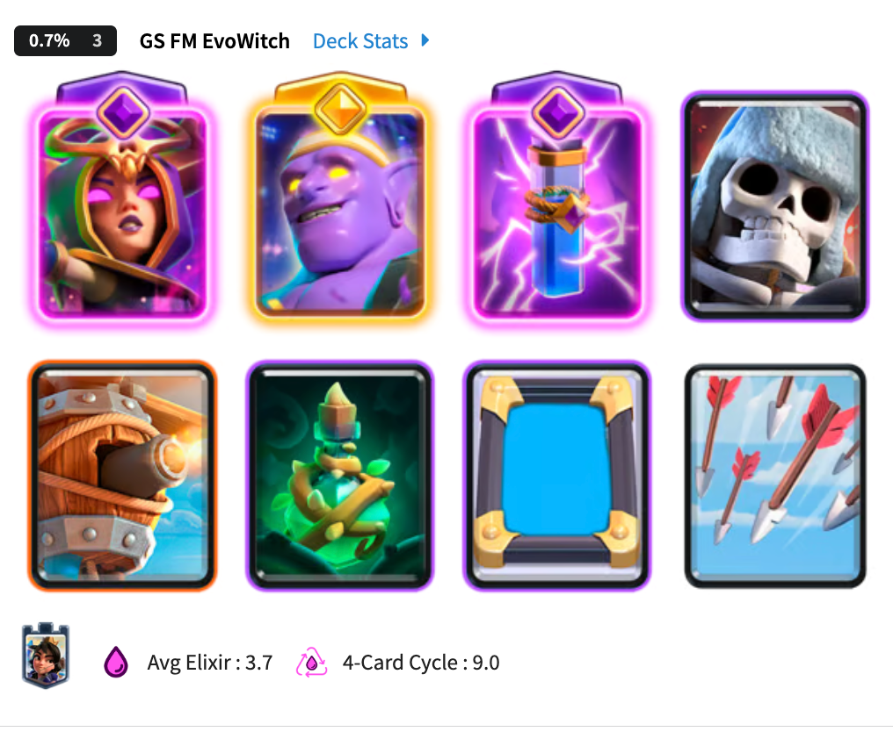
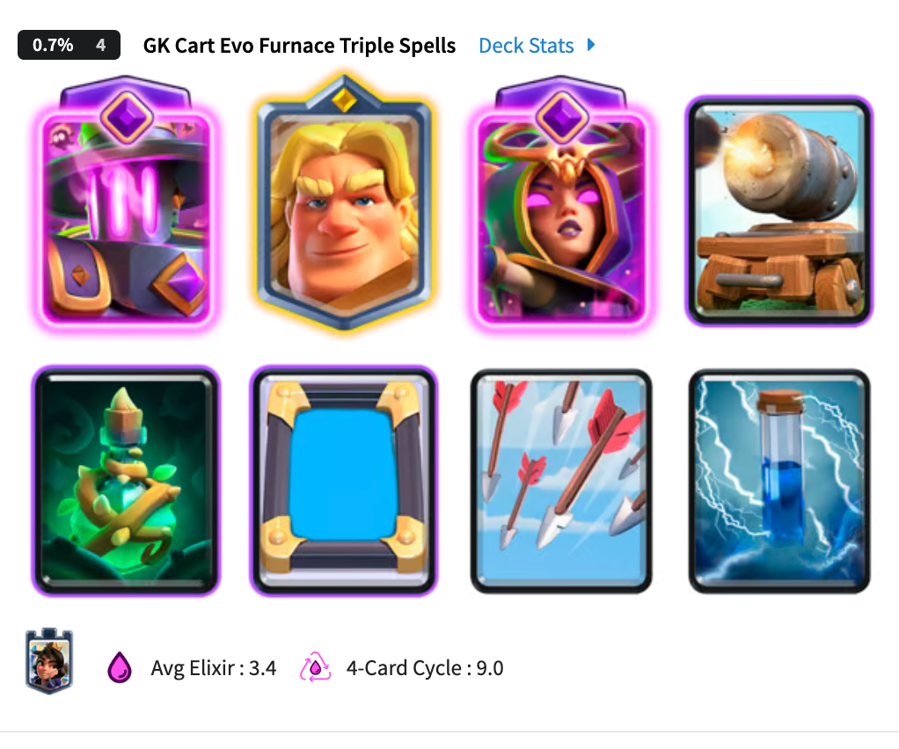
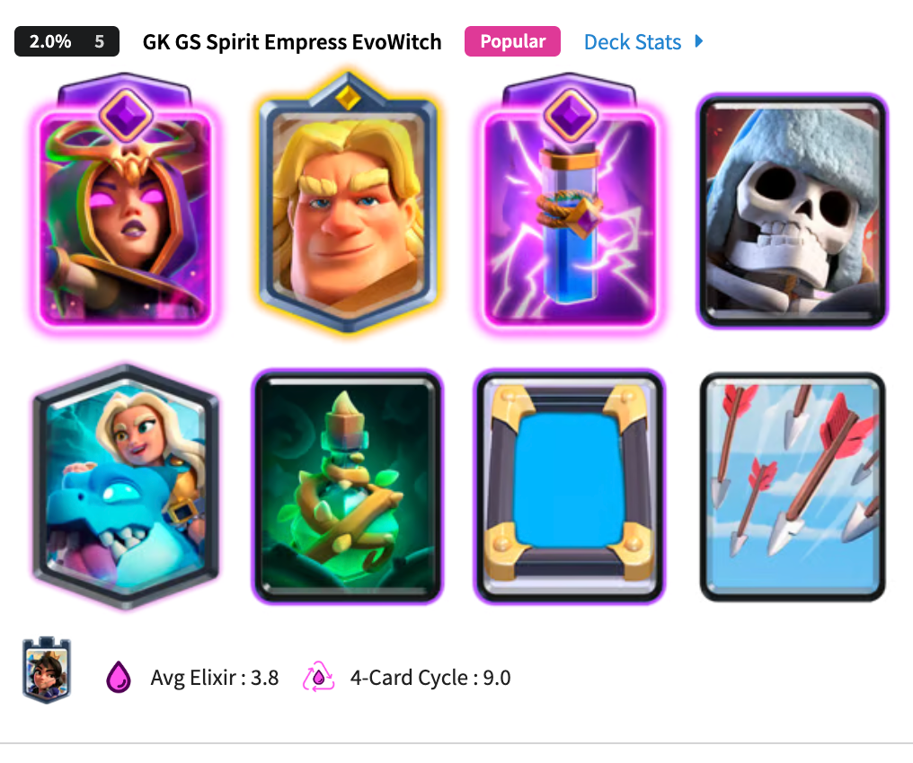

惊魂象棋模式又回来了。

这次不少能直接拆塔的法术和钻地单位都被禁用，但模式的基本打法没有发生太大变化。想稳定拿下对局，开局先处理会持续生成黑暗王子的防御塔，随后守住场面，憋出几波攻击一举拿下即可。

目前比较好用的卡组，大多都会带小电、万箭、藤蔓法术和镜像法术。它们能快速拆掉两侧防御塔，尤其是黑王塔，也给中后期防守留出了空间。

## 个人推荐的大刺客卡组

我个人推荐下面这套大刺客卡组。

<!-- 配图位置｜大刺客卡组八张卡牌，建议使用两行四列卡组图 -->

这套卡组的思路很清楚。四张法术负责开局拆塔和后期解场，觉醒熔炉持续给压力，觉醒火枪手提供远程输出。巨型骷髅用来顶住地面进攻，大刺客则负责快速切入和反打。

开局不需要急着铺兵。先看手牌里有没有电击法术、藤蔓法术和万箭齐发，尽快把法术循环起来。藤蔓配合小电和箭雨再加一个镜像箭雨，可以很快打掉一侧的黑王塔。

左右两边都用同样的方法处理。黑王塔消失以后，对面不会继续获得源源不断的黑暗王子，场面压力会小很多。

两座黑王塔处理掉以后，如果对面没拆掉己方的，那基本上很快战斗就结束了。

如果己方塔也被拆了，那就拼耐心拼卡强度了，慢慢攒后排火枪，锅炉负责压制，大骷髅顶前面，大刺客瞅准机会冲对面后排，慢慢积累优势，争取一波搞定。

## 另外几套胜率不错的卡组

如果更喜欢用召唤单位，可以换成这几套觉醒女巫卡组，效果也都不错。

## 几个细节

镜像法术优先复制万箭齐发，但不必每次都照着固定顺序出牌。对方把大量杂兵压上来时，镜像箭雨先用来活下来，下一轮再继续拆塔。

藤蔓法术既能打建筑，也能暂时限制附近单位。把它和小电、箭雨连在一起使用，伤害更集中，也能减少黑暗王子干扰施法的机会。

这个模式很容易打成两边互相折磨的对局，尤其是双方都会玩，而且在黑王塔都拆掉的情况下。残局更多拼的是耐心和卡牌的慢慢攒起来的优势。

所以，耐心点。

