皇室战争 10 月的相册活动叫 **Shocktober The Movie!**，中文可以理解成“雷电十月大电影”。玩家收集 81 个碎片，逐渐拼出 9 张由皇室角色主演的电影封面。全部完成以后，主要奖励就是本赛季的觉醒电胖。

这套图好玩的地方，在于它没有简单地给角色换一身万圣节衣服。片名、字体、人物站位和画面里的小道具，大多能在经典恐怖电影里找到出处。有些属于一眼就能认出的明牌，有些只借了一个名场面，还顺手掺进了皇室战争自己的梗。

官方没有公布九张图的标准答案。下面的对应关系来自电影海报、经典镜头和相册名称之间的对照，其中刽子手这张仍有一点解释空间。

## 两个电法与《化身博士》

**相册名称：Two Sides（双面）**

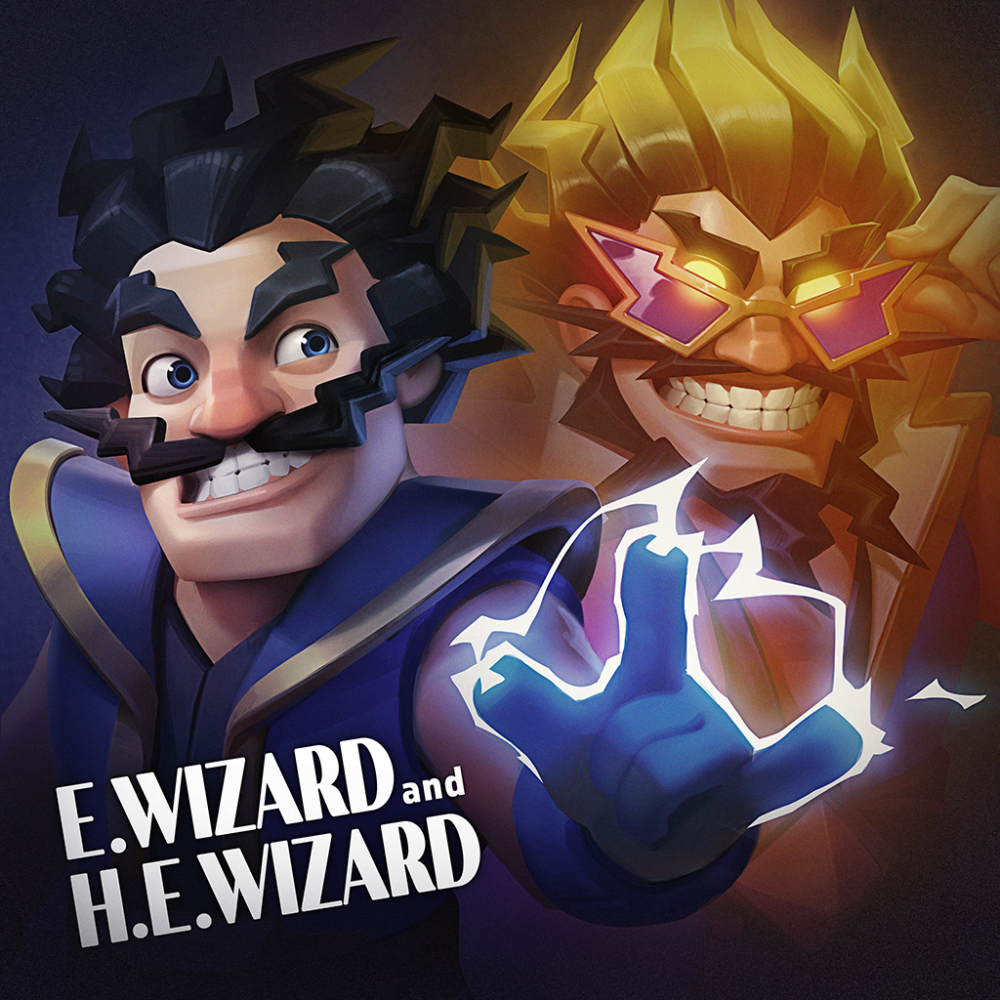

普通电法站在前面，精英电法从背后探出身子。一个神情紧张，一个笑得非常张扬。这种“同一个人的两副面孔”，正是《化身博士》的核心设定。标题 **E. Wizard and H. E. Wizard** 也直接套用了 **Dr. Jekyll and Mr. Hyde** 的句式。

《化身博士》源自罗伯特·路易斯·史蒂文森 1886 年的小说，后来被多次改编成电影。杰基尔博士调制药剂，释放出自己受到压抑的另一面海德先生。1931 年电影版是其中最著名的改编之一，也让“双重人格式变身”成为恐怖片常见的故事模型。

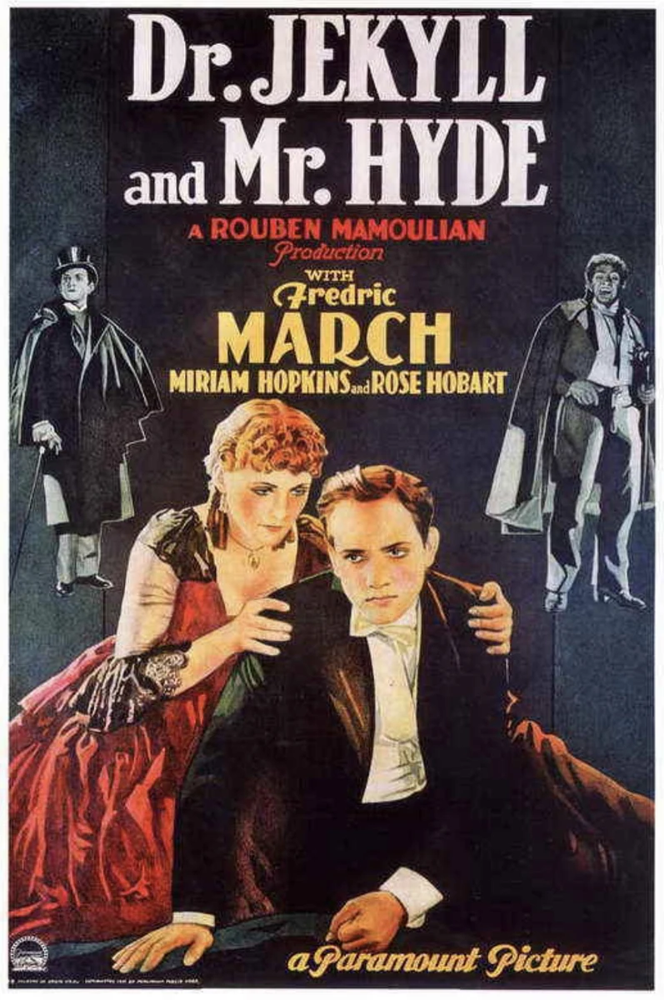

杰基尔博士与海德先生原本就是同一个人的两面。放在这张图里，普通电法像保持理智的杰基尔，精英电法则像力量更强、性格也更疯狂的海德。画面还用冷蓝与暖黄把两人分开，连“善面与恶面”的关系都交代了。

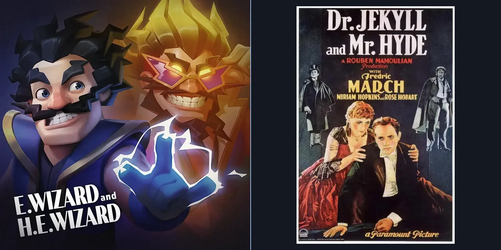

这里借用的是《化身博士》最核心的双重人格关系，没有锁定某一个电影镜头。普通电法与精英电法一前一后，脸部表情完全相反，和早期《化身博士》海报把杰基尔、海德并置的做法相同。标题里的 E. Wizard 和 H. E. Wizard 又完成了一次文字确认。

## Shockzilla 与《哥斯拉》

**相册名称：Shockzilla（雷电哥斯拉）**

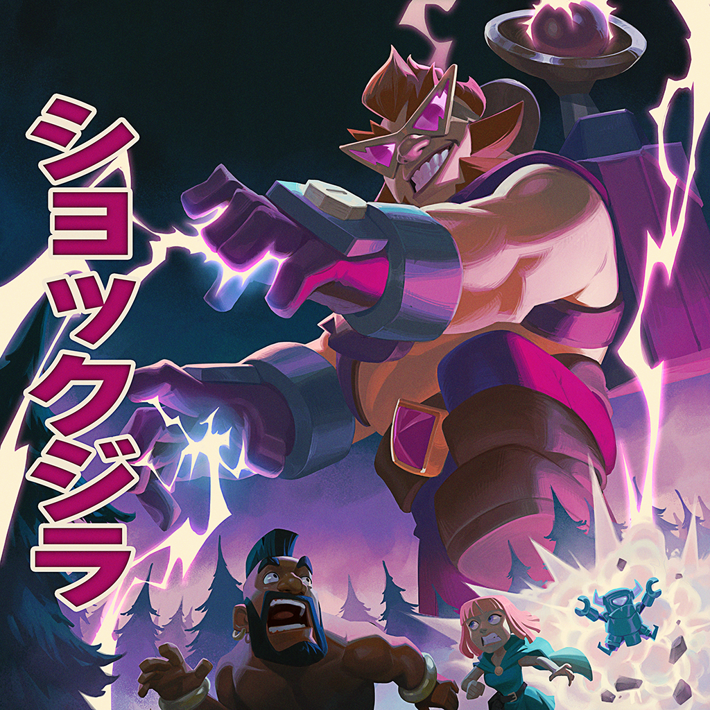

觉醒电胖变成顶天立地的巨兽，野猪骑士、公主和迷你皮卡在脚下逃跑，森林和电塔显得格外渺小。巨兽压城的构图已经很有《哥斯拉》的味道，片名 **Shockzilla** 更是把答案摆到了明面上。

1954 年的《哥斯拉》开启了日本最有影响力的怪兽电影系列。哥斯拉从海中出现，以巨大的身体和原子吐息摧毁城市。这个形象后来不断变化，有时是灾难本身，有时又会成为保护人类的怪兽。皇室战争没有锁定某一部续作，致敬对象更接近整个哥斯拉系列。

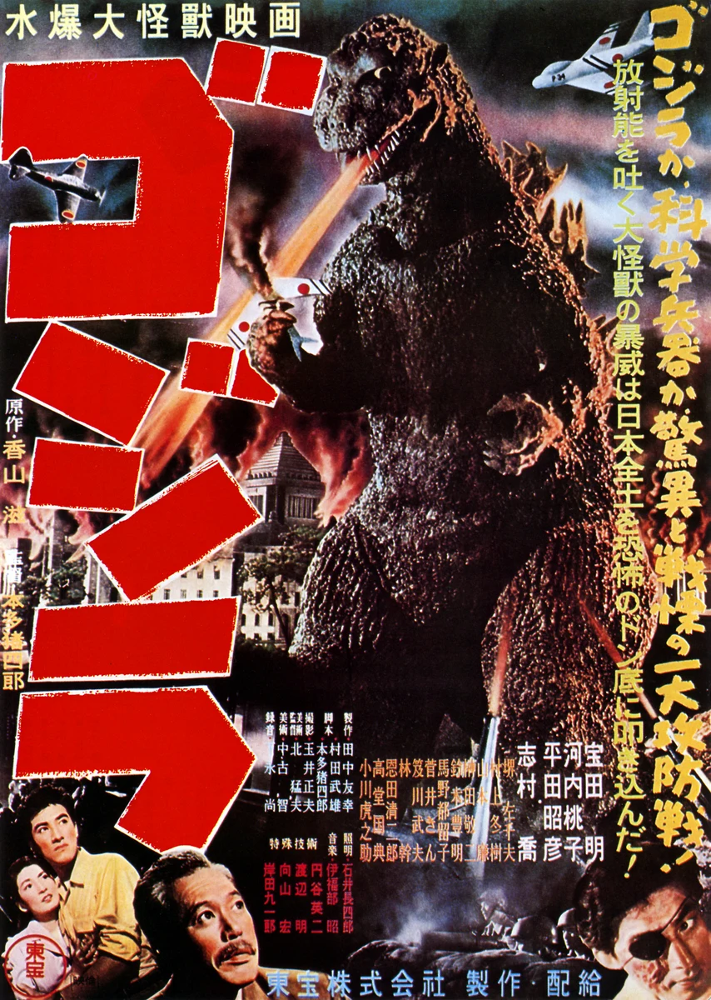

左侧日文写的是 **ショックジラ**，读作 Shockzilla。它把 Shock 和 Godzilla 拼在一起，也正好对应觉醒电胖的电击能力。低角度巨兽、逃跑人群和日文竖排片名，都是老式哥斯拉海报常见的构图。

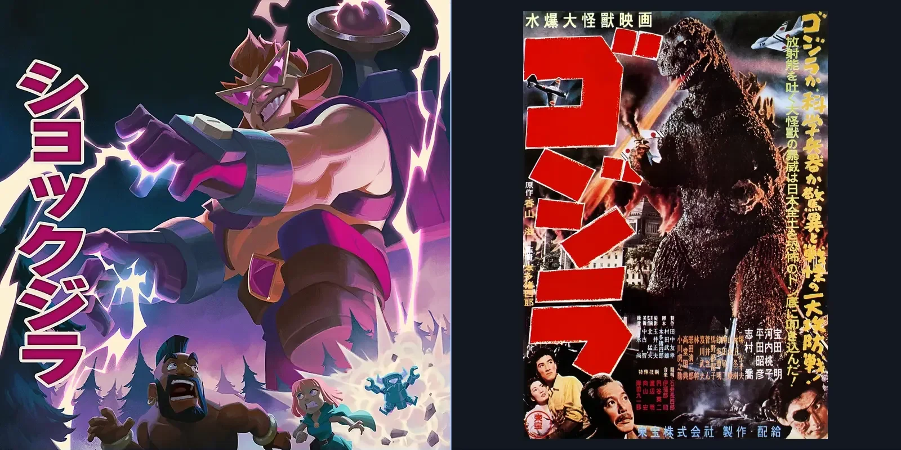

这张没有照搬 1954 年海报的每个位置，采用的是整套昭和怪兽电影熟悉的海报结构。巨兽占据画面上方，人类在脚下逃跑，城市换成了皇室战争的森林和电塔。竖排日文片名进一步把它拉回日本怪兽片的宣传画风格。

## 刽子手厨房与《美国精神病人》

**相册名称：Slice & Dice（切片剁块）**

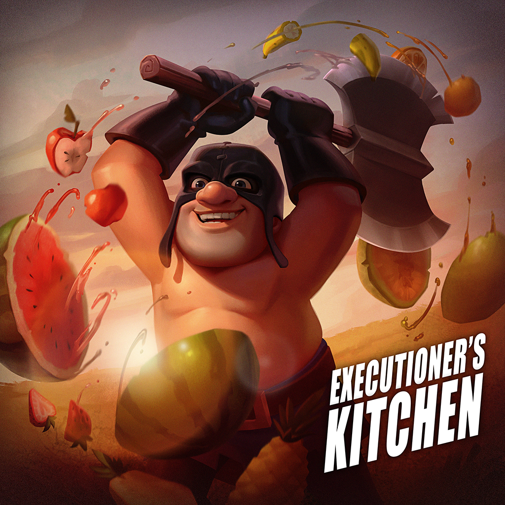

刽子手举起斧头，脸上挂着过分灿烂的笑容，周围的水果被劈得四处飞散。这个动作最容易让人想到《美国精神病人》里的帕特里克·贝特曼。他穿着透明雨衣举斧袭击保罗·艾伦，动手前也笑得兴奋而失控。

《美国精神病人》上映于 2000 年，主角帕特里克·贝特曼白天是衣着体面的华尔街精英，私下却逐渐显露出暴力与失控。电影最常被引用的形象，一个是他隔着刀刃照自己的脸，另一个就是雨衣加斧头的杀人场面。

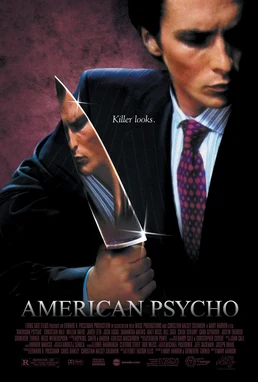

原片中的鲜血被换成了果汁，受害者也变成了西瓜、苹果和橙子。画面保留了斧头、笑容和挥砍瞬间，又把地点拉回皇室战争早已有过的“刽子手厨房”。

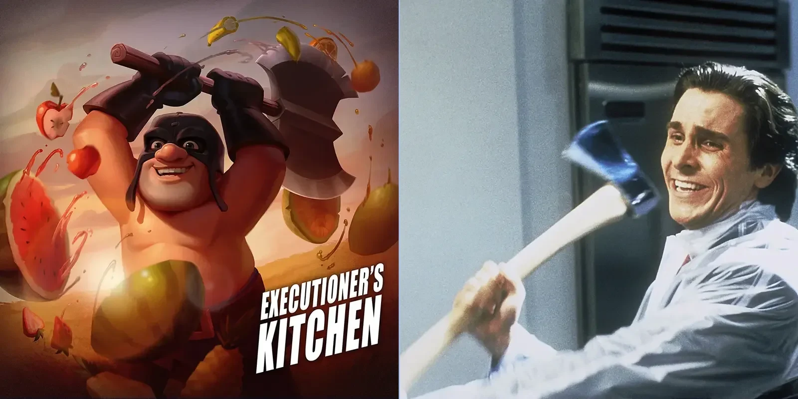

这张图没有直接照搬《美国精神病人》的电影海报，致敬的是帕特里克穿着透明雨衣、双手挥斧的电影场景。两边的人物都把武器举过头顶，身体向后蓄力，脸上还带着兴奋的笑。区别在于刽子手没有雨衣，飞溅的血也被水果和果汁代替了。

这一页也可能混入了《闪灵》里的挥斧元素。官方本赛季确实给刽子手做了“Here's Johnny”表情，不过单看这张相册封面的姿势，我更倾向于《美国精神病人》。

## Gobleratu 与《诺斯费拉图》

**相册名称：Count Orgob（奥戈布伯爵）**

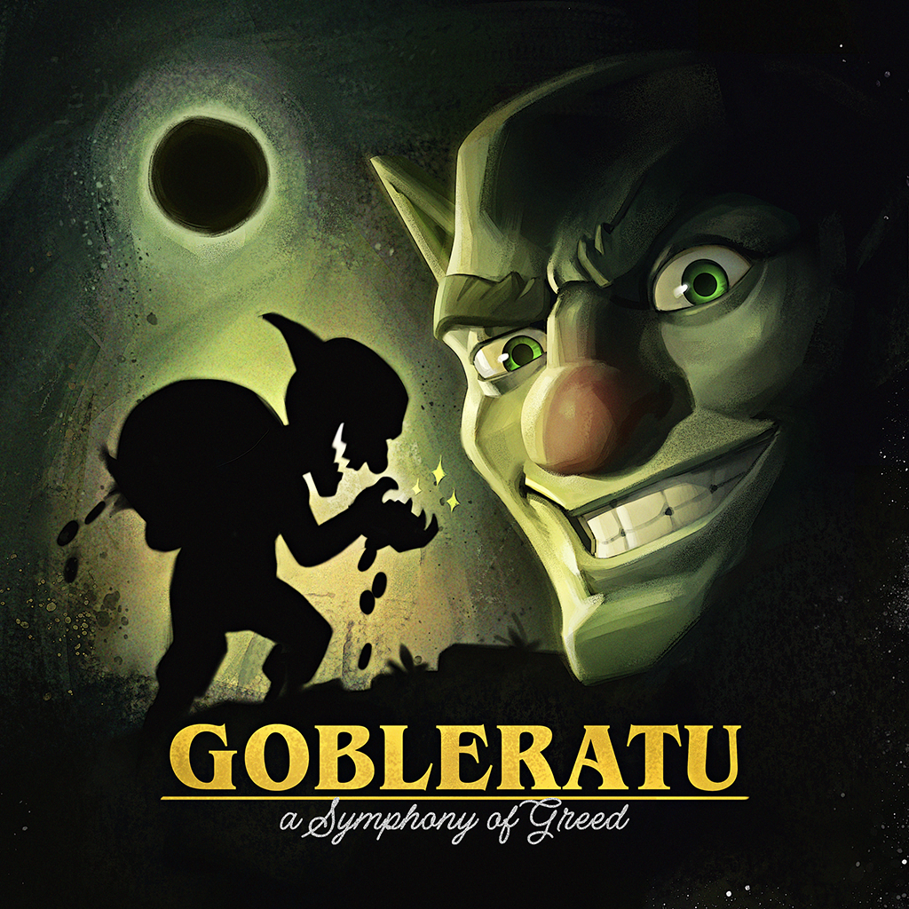

绿色怪脸占据右侧，左边的小哥布林捧着金币，背后还挂着一道巨大的黑色剪影。看到 **Gobleratu, A Symphony of Greed** 这行标题，出处便落到了 1922 年的《诺斯费拉图》上，连完整片名都被改写了一遍。

《诺斯费拉图》是现存最重要的默片恐怖电影之一。故事脱胎于《德古拉》，吸血鬼奥洛克伯爵有着苍白面孔、尖耳和细长手指。受版权问题影响，电影改掉了原著中的人物名字，却留下了后来吸血鬼电影最熟悉的一批视觉符号。

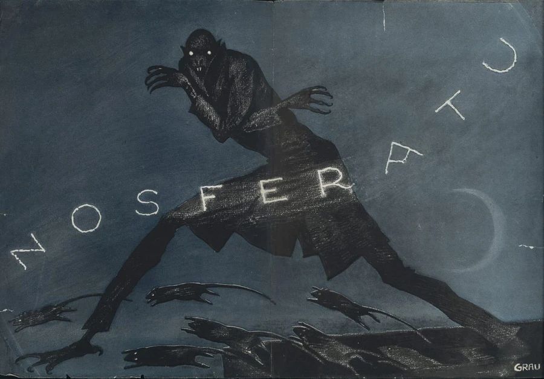

《诺斯费拉图》原名 **Nosferatu, A Symphony of Horror**。皇室版本把它写成 **Gobleratu, A Symphony of Greed**，从“恐怖交响曲”变成“贪婪交响曲”。Gobleratu 由 Goblin 和 Nosferatu 拼在一起，主角自然换成了哥布林。

日食、惨绿色脸庞、尖耳和墙上的巨大剪影，也保留了早期德国表现主义电影的味道。画面里的小哥布林正捧着金币，正好接上副标题中的 Greed。

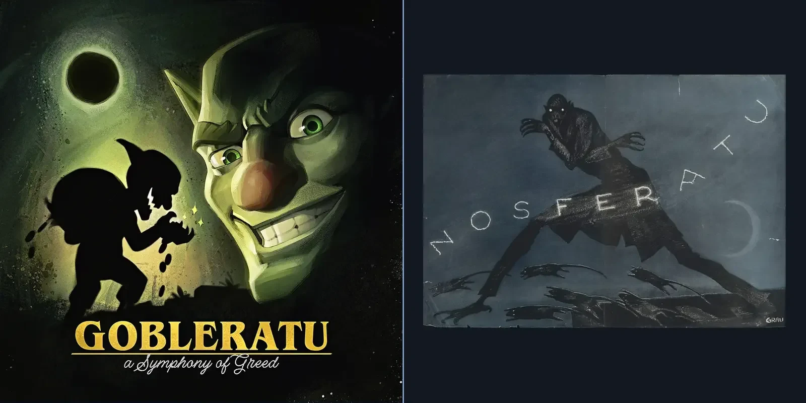

这一页没有复制《诺斯费拉图》某一张海报的具体排版，片名和美术风格才是主要证据。老海报里的奥洛克伯爵以尖耳、佝偻身形和夸张阴影示人，Gobleratu 也用了绿色怪脸、黑色剪影和不自然的长手指。副标题从 Horror 改成 Greed，指向最直接。

## 双胞胎公主与《闪灵》

**相册名称：Come Play（来玩吧）**

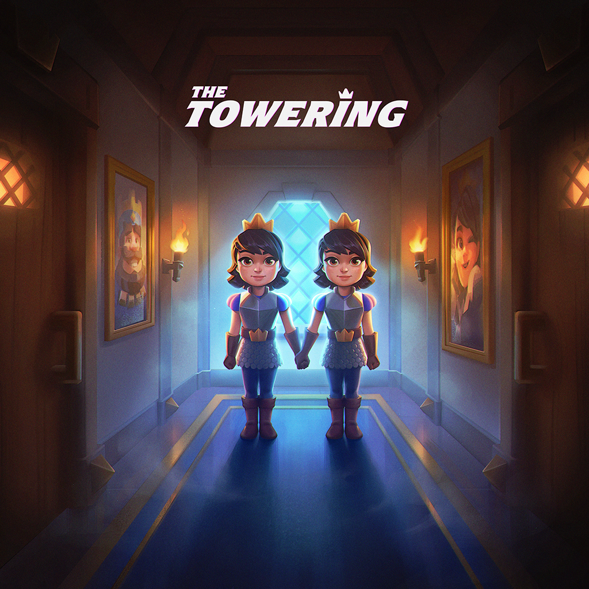

两位长得一模一样的公主牵着手，站在一条光线昏暗的长廊尽头。这张几乎没有猜谜难度，直接对应《闪灵》中的格雷迪双胞胎。

《闪灵》由斯坦利·库布里克执导，1980 年上映。作家杰克带着妻儿住进冬季封闭的瞭望酒店，随后受到酒店中神秘力量的影响。双胞胎、血水涌出的电梯、挥斧破门和雪地迷宫，都成了后来恐怖电影反复引用的画面。

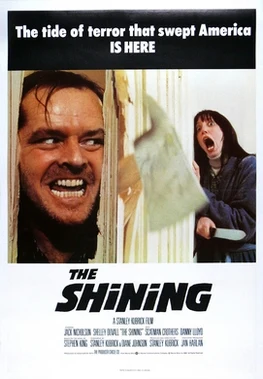

电影里，丹尼骑着三轮车穿过瞭望酒店，转过走廊后看见两名女孩并排站在前方。她们邀请丹尼“永远和我们一起玩”。皇室版本把酒店换成了城堡，把蓝裙女孩换成两位公主，连对称站位和走廊透视都保留了下来。

图上的 **The Towering** 也在模仿 **The Shining**。Tower 指向皇室战争的皇家塔，字标中间还藏进了一顶小皇冠。

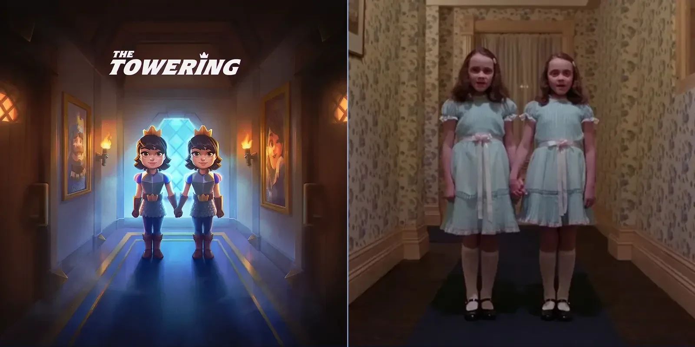

这是一张很直接的场景复刻。两边都采用中央对称构图，两个女孩牵手站在长廊尽头，人物、门框和地面线条都集中在画面中轴线上。皇室版本只改了服装、人物和酒店环境，原场景的压迫感基本保留下来。

## 迷你皮卡与《惊魂记》

**相册名称：Spatula Psycho（锅铲惊魂）**

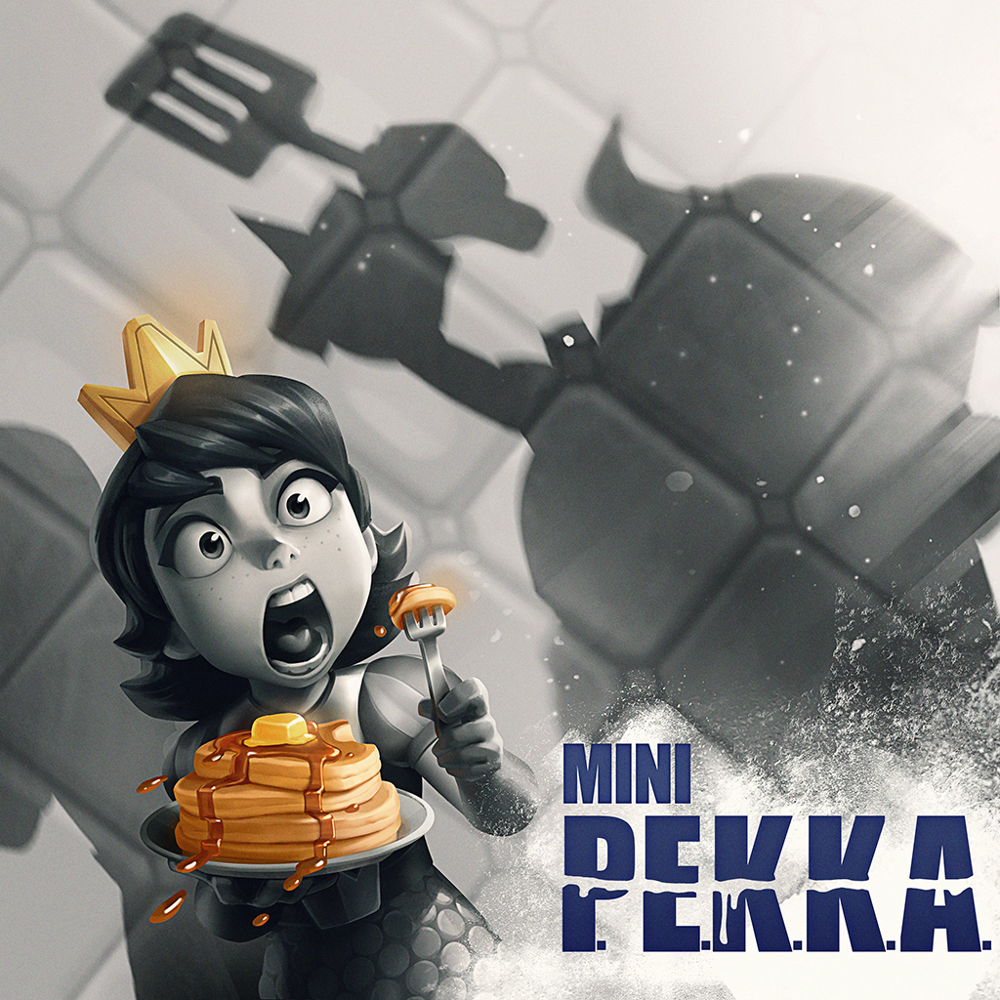

公主端着一盘松饼，背后的迷你皮卡却举起锅铲，巨大的影子压在她头顶。黑白画面、惊恐表情和高高举起的凶器，一眼就能认出《惊魂记》的浴室谋杀场景，只是尖刀换成了锅铲，浴室也搬进了厨房。

阿尔弗雷德·希区柯克执导的《惊魂记》上映于 1960 年。珍妮特·利饰演的玛丽昂入住贝茨汽车旅馆，随后在浴室遇害。凌厉的剪辑、尖锐的弦乐和隔着浴帘落下的刀影，让这场戏成了电影史上最出名的恐怖片段之一。

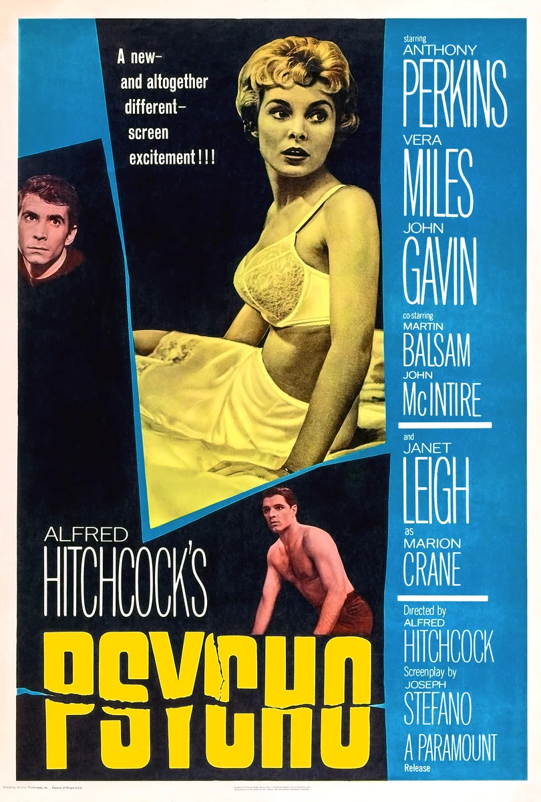

片名 **Mini P.E.K.K.A.** 的排版刻意做出断裂和错位，接近《惊魂记》经典字标的切割感。电影里的凶器被换成锅铲，浴室也变成厨房，松饼则是迷你皮卡从早年广告开始就没放下过的老梗。

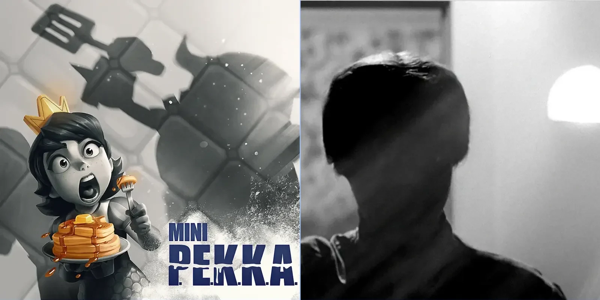

画面复刻的是《惊魂记》浴室谋杀的剪影。电影里的人影隔着水雾举起尖刀，皇室版本让迷你皮卡站在公主背后，把刀换成锅铲。黑白画面和受害者惊恐的表情也在帮助读者认出这个场景。

## 女巫婆婆与《修女》

**相册名称：Did You Hear That?（你听见了吗？）**

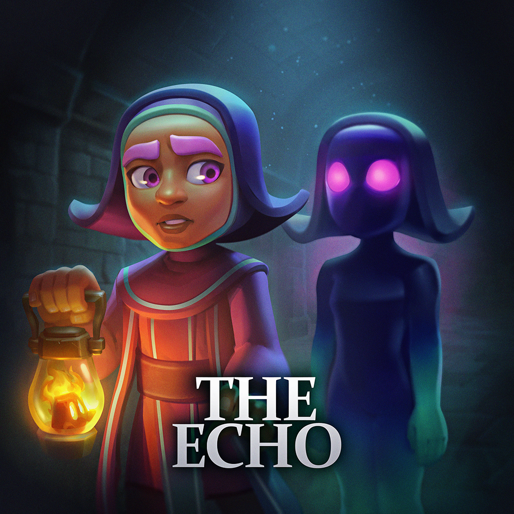

女巫婆婆提着油灯走在黑暗中，背后悄悄跟着一个拥有相同轮廓的黑色身影。这一幕对应《修女》中艾琳修女探索修道院的场景。她手里同样提着灯，恶魔修女瓦拉克则从走廊的黑暗中出现。

《修女》于 2018 年上映，属于《招魂》系列的衍生作品。故事发生在 1952 年的罗马尼亚，一名神父和见习修女前往偏僻修道院调查死亡事件，随后遇到以修女形象出现的恶魔瓦拉克。油灯、石墙和从背后逼近的黑色身影，都是影片反复使用的画面。

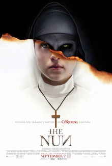

皇室版本把白色修女服换成了女巫婆婆的紫色兜帽，瓦拉克也变成泛着紫光的黑影。标题 **The Echo** 可以理解成“回声”，身后那个怪物就像她被黑暗复制出来的另一个自己。

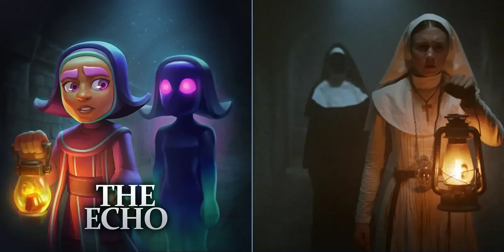

这也是对电影场景的直接改编。艾琳修女提灯走在前方，瓦拉克从她身后的黑暗中现身。皇室封面保留了一前一后的站位、冷暖光线对比和修女服轮廓，右侧黑影甚至连头巾外形都没有改得太远。

## 精英狂战士与《鬼娃回魂》

**相册名称：Go Berserk（狂暴起来）**

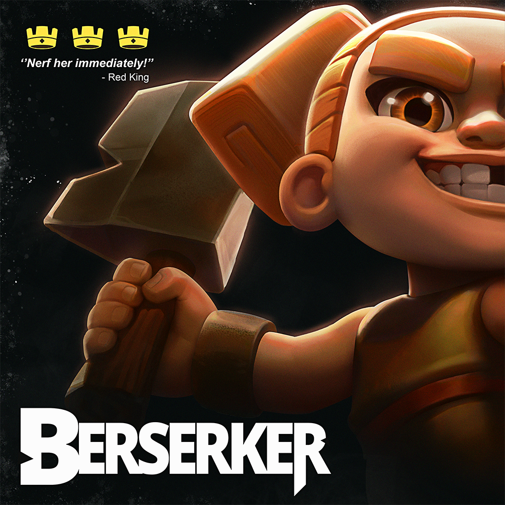

精英狂战士扛着斧头，脸几乎贴到镜头前，笑得非常开心。对照《鬼娃回魂》流传较广的 MGM DVD 封面，这张图的构图几乎可以逐项对应。

《鬼娃回魂》上映于 1988 年，故事围绕被连环杀手灵魂附身的“好家伙”玩偶展开。恰吉拥有儿童玩偶的外表，却会拿着刀追杀身边的人。这个“小身体、危险武器和恶意笑容”的形象，也正好适合由精英狂战士重新出演。

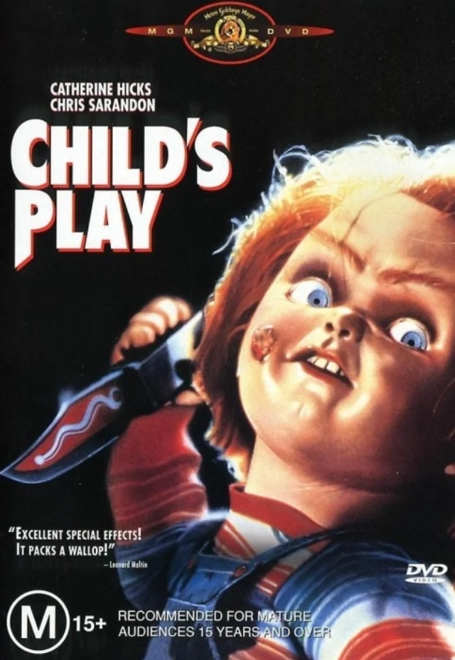

两边都使用纯黑背景，角色的大脸占据画面右侧，武器从左边搭在肩后，握住武器的手藏在头部后方。橙红色头发、咧开的笑容、向右倾斜的身体，以及左下角的白色粗体片名，也都保持了相近的位置关系。

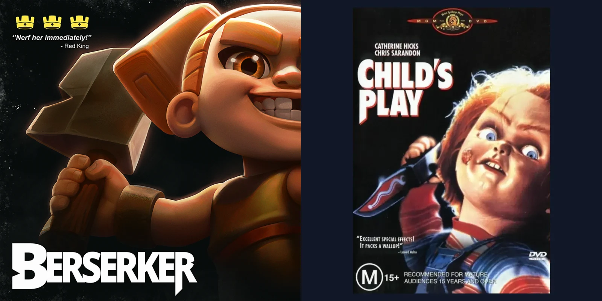

皇室战争只是把恰吉手里的刀换成精英狂战士的斧头，同时保留了“小个子角色拿着危险武器”的反差。相册名称 Go Berserk 则借用了 Berserker 本身的名字，可以理解成“进入狂暴状态”。

## 亡灵的利爪与《猛鬼街》

**相册名称：Night, Night…（晚安，晚安……）**

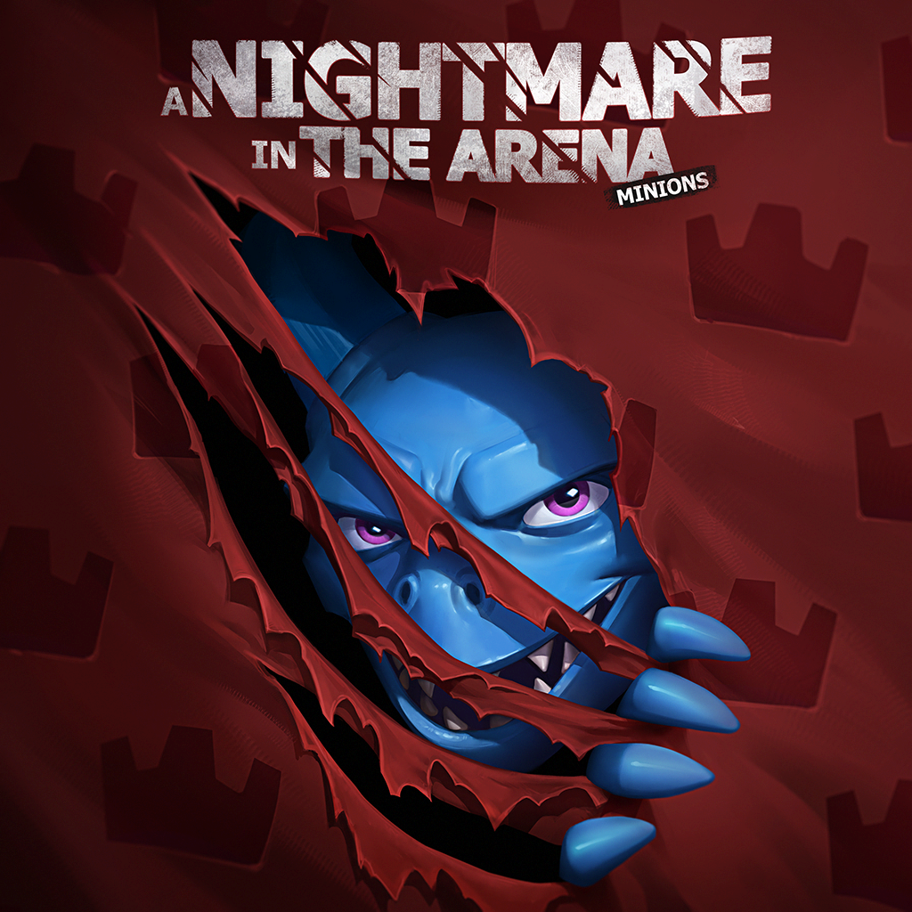

亡灵从撕裂的红色封面后探出脸和利爪。标题 **A Nightmare in the Arena** 仿照 **A Nightmare on Elm Street** 改写，已经把《猛鬼街》的名字藏在了“竞技场猛鬼”里。

《猛鬼街》于 1984 年上映。片中的弗莱迪会进入年轻人的梦境，在梦里造成的伤害也会带到现实。那只装着四把刀刃的手套成了角色最醒目的标志。皇室战争把刀刃换成亡灵的爪子，arena 也刚好可以替换片名里的 Elm Street。

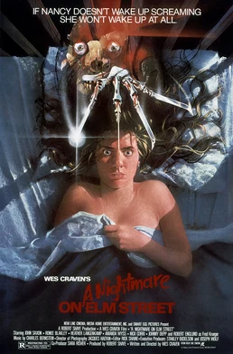

画面里的亡灵从红色表面后方探出脸和手，三根蓝色利爪撕开封面。利爪自然对应弗莱迪·克鲁格的刀刃手套，红黑配色和撕裂痕迹也延续了《猛鬼街》海报常用的视觉元素。

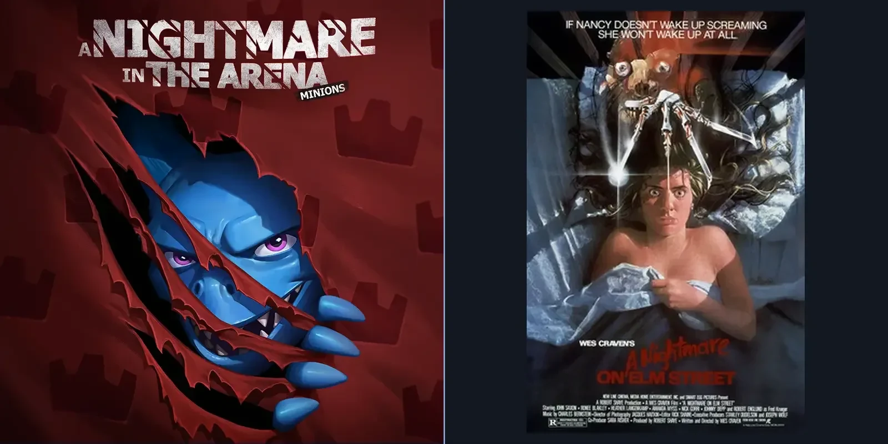

它没有复刻某一个电影镜头，主要致敬集中在海报语言上。皇室版本沿用了片名结构、梦魇般的红黑色调和伸向人物面部的利爪，再把弗莱迪换成亡灵。

## 相册里还藏着多少梗

九张图里，最明确的几张都在片名上留下了线索。Gobleratu 改写了《诺斯费拉图》的完整片名，A Nightmare in the Arena 直接套用《猛鬼街》，Shockzilla 连日文标题都准备好了。双胞胎公主、提灯的女巫婆婆和举着锅铲的迷你皮卡，则靠经典镜头让人认出来。

刽子手没有这么直白。Slice & Dice 解释了切水果和砍杀片的双关，却没有给出唯一的电影答案。它与《美国精神病人》的挥斧形象最接近，也可能混合了《闪灵》等电影的元素。

这次相册最终送出觉醒电胖，他自己也在第二张封面里出演了 Shockzilla。九张封面从双重人格、巨兽电影一路走到最后的竞技场梦魇，既把奖励角色放进了主角位，也给其他皇室角色安排了一轮恐怖片试镜。

## 参考资料

- [皇室战争雷电十月赛季公告](https://supercell.com/en/games/clashroyale/es/blog/release-notes/nueva-temporada-shocktober/)
- [雷电十月相册场景与碎片概率](https://supercell.com/en/games/clashroyale/fr/blog/news/clash-royale-infos-sur-les-coffres-2/)
- [《美国精神病人》资料与电影海报](https://en.wikipedia.org/wiki/American_Psycho_(film))
- [《闪灵》资料与电影海报](https://en.wikipedia.org/wiki/The_Shining_(film))
- [《猛鬼街》资料与电影海报](https://en.wikipedia.org/wiki/A_Nightmare_on_Elm_Street)
- [《诺斯费拉图》资料与电影海报](https://en.wikipedia.org/wiki/Nosferatu)
- [《鬼娃回魂》资料](https://en.wikipedia.org/wiki/Child%27s_Play_(1988_film))
- [《化身博士》1931 年电影版](https://en.wikipedia.org/wiki/Dr._Jekyll_and_Mr._Hyde_(1931_film))
- [《修女》资料与电影海报](https://en.wikipedia.org/wiki/The_Nun_(2018_film))
- [《惊魂记》资料与电影海报](https://en.wikipedia.org/wiki/Psycho_(1960_film))
- [1954 年《哥斯拉》资料与电影海报](https://en.wikipedia.org/wiki/Godzilla_(1954_film))
- [《美国精神病人》挥斧场景图片来源](https://represszine.wordpress.com/2020/04/24/american-psycho-review/)
- [《闪灵》双胞胎场景图片来源](https://znews.vn/10-nhan-vat-nho-tuoi-gay-am-anh-cho-nguoi-xem-post1147764.html)
- [《修女》提灯场景图片来源](https://www.denofgeek.com/movies/the-conjuring-timeline-explained/)
- [《惊魂记》浴室场景图片来源](https://www.longtake.it/it/news/psycho-hitchcock-norman-bates-motel-eros-thanatos-psyco)
