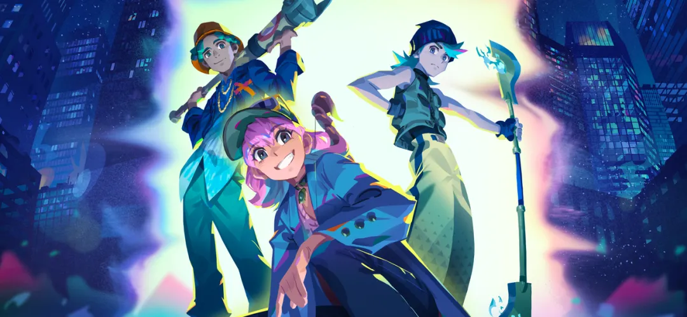
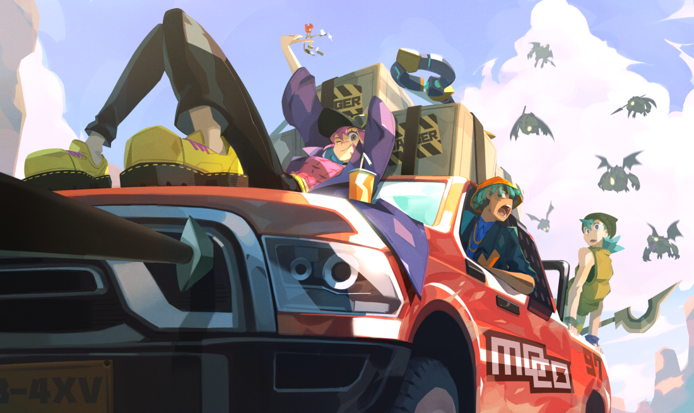
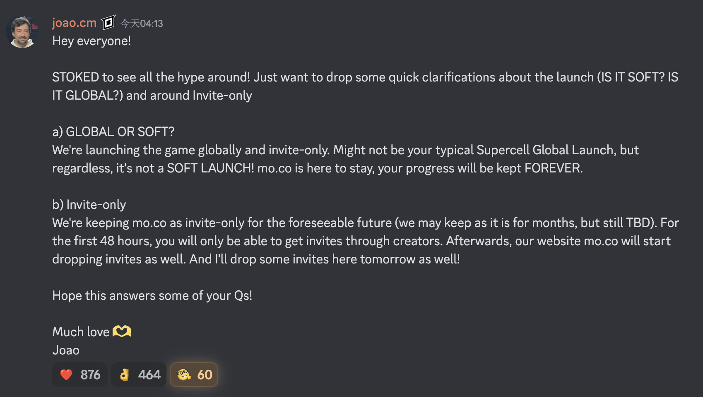

---
title: "Moco即将全球上线"
image: "/images/2025/moco_is_going_global.png"
description: "Supercell的全新手游Moco即将全球发布"
date: 2025-03-18 04:15:05
slug: /moco_is_going_global/
categories:
  - moco
tags:
  - 资讯
draft: false
---

Moco是什么？

Moco是超级细胞开发已久的一款轻度mmo手游，之前已经在小范围进行了多轮内部创作者测试，去年一年在社区也是相当活跃。

昨日，新的社区经理在Reddit上确认了，Moco将于3月18日正式全球上线。

> 
>大家好！
>
>我很高兴看到这么多炒作！我只是想对此次发布（是软发布吗？全球性的？）和邀请做一些简单的澄清。
>a) 全球性还是软性？我们将在全球范围内推出这款游戏，并且只接受邀请。这可能不是典型的 Supercell 全球发布，但无论如何，这都不是软发布！ mo.co 将继续存在，您的进度将永远保留。
>
>b) 仅限邀请 在可预见的未来，我们将保持 mo.co 仅限受邀者访问（我们可能会保持这种状态数月，但有待确定）。在前 48 小时内，您只能收到来自创作者的邀请。此后，我们的mo.co网站也将开始发送邀请。而且明天我还会在这里发出一些邀请函！ 
>
>希望这能回答您的一些问题！ 
>
>满满的爱🫶
>
>若昂

是的，Moco终于要来了~

期待已久的 Supercell 全新 MMO-RPG 怪物狩猎游戏终于在全球推出，但您需要获得邀请才能开始狩猎。别担心，有很多方法可以获得邀请：

* 在mo.co 申请以获得开始玩的机会。
* 一旦您的某个朋友在游戏中达到 5 级，他们就会获得有限数量的邀请，以便与更多人分享。
* 在每个社交媒体上搜索#joinmoco，因为官方内容创作者将会收到很多分享邀请。

#### 总结

今天google play和app store都会开放下载，时间未定。 开放下载后，官方大创作者能够生成二维码邀请链接，必须有邀请方可进入游戏。

3月18号，每个码有效期20分钟，cd一小时后创作者可以继续再生成，然后继续有效期20分钟，loop；

3月20号，每个码有效期24小时，量大管饱，只限时间不限人数。

之后，可以通过官网注册申请。

