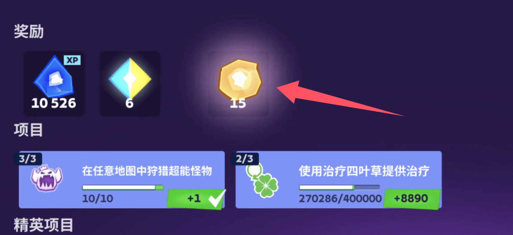

今天，mo.co 宣布了两项重大更新，旨在在其核心游戏模式中恢复竞争完整性和公平竞争。第一个解决了乌贼刃武器在多人副本匹配中的主导地位，第二个解决了允许过度混沌核心碎片刷取的漏洞。这两个改动都是为了确保技能和策略——而不是剥削机制——决定胜利。下面详细介绍了变化、开发人员做出这些决定的原因以及社区的反应。

## 乌贼刃难题

### 什么是乌贼刃？

作为游戏的第 10 种武器，乌贼刃是一对快速打击的匕首，可以在短时间不活动后隐身。一旦隐身，下一次攻击就会触发一个强大的冲刺，造成大量伤害并眩晕非 Boss 怪物。在 25 级时，玩家通过完成 SEWERS 中的“#smelly”任务来解锁这些刀片。它们的主要吸引力在于：

- **高攻击速度**：两次攻击之间仅 0.25 秒，第一击只需 0.1 秒。
- **隐身机制**：3 秒后无攻击状态隐身，开启突袭伏击。
- **冲刺攻击**：7 米冲刺，拉近距离并造成大量伤害。

从纸面上看，乌贼刃带来了令人兴奋的新游戏风格。但在实践中，它引发了严重的不平衡，严重影响了多人副本匹配系统。

### 问题：匹配中断

当整个团队都使用乌贼刃时，它们的表现最为强势。协调一致的小队可以在创纪录的时间内快速扫清多人副本波和 Boss，破坏了原本设定的节奏和挑战。主要问题有两点：

#### 有意匹配

没有完整乌贼刃阵容的队伍处于明显劣势。部分玩家甚至故意输掉比赛，以便重新匹配到有完整刀阵的队伍，或故意降段。这种行为扰乱了匹配队列，打击了单人或混合装备玩家的游戏体验。

#### 技能被削弱

Rifts 原本旨在考验玩家的反应、站位与团队配合。滥用隐身和冲刺眩晕循环，让玩家绕过大段挑战，降低了可玩性和重复体验。

## 开发者回应

在发布的声明中，mo.co 开发团队解释了他们的动机：

> “乌贼刃在多人副本模式中引发了匹配问题。只有当所有队员都配备乌贼刃时，它们才能发挥最大优势。这导致部分玩家在未匹配到刀阵时故意输掉比赛。”

他们的目标很明确：**恢复匹配公平性、保留武器特色，并促进构建多样性。**

## 乌贼刃重做：细节与时间线

### 1. 移除隐身机制

- **旧机制**：3 秒未攻击或未受伤后，玩家进入隐身状态。
- **新机制**：完全取消隐身功能。不再存在“潜行→冲刺→循环”漏洞。

此更改将在即将发布的补丁中生效。

### 2. 属性增强与调整

为了弥补隐身移除对武器性能的影响，开发者计划提升其他方面，并保留其打击感与特色。官方表示将密切观察武器数据，进行后续平衡调整。

## 混沌核心碎片 刷取问题：关闭经验循环漏洞

### 什么是混沌核心碎片？

混沌核心碎片是精英猎人通行证中的关键货币。通过击败怪物或解救 NPC 获得，其数量与地图和敌人等级有关。玩家可利用碎片解锁经验奖励，形成一个奖励循环。

### 漏洞利用方式

部分高活跃玩家发现，利用该机制可轻松刷取 XP，而无需进行实质战斗。他们会在通行证周期结束前有节奏地收集碎片，每间隔一次领取 4,000 XP。

正如一位 Reddit 用户所说：

> “他们并不真正战斗或升级，而是集中在最后一刻刷碎片，然后反复领取 4,000 XP。每刷 4,000 混沌核心碎片 就能得 10 倍经验。”

这种行为带来了排行榜上的不公平优势，违背了公平竞技的本意。

### 官方修正：奖励次数限制

- **新机制**：每位玩家在每个通行证周期内领取通行证经验奖励的次数将设定上限。
- **实际影响**：99% 的玩家每天只领一次，不受影响。只有极少数的高强度玩家会注意到变化。
- **上线时间**：此限制将在下一个活动通行证周期开始时生效，并与乌贼刃重做同步推出。

## 社区反馈与紧急问题

更新发布后，mo.co 社区迅速反应，部分玩家表达了担忧：

> “担心乌贼刃重做后，部分多人副本无法在 2-3 分钟内通关，尤其是在困难和噩梦模式下。”

这些反馈表明，需要从整体系统层面进行配套调整。

## 开发者跟进计划

### 1.多人副本难度重平衡

将重新审视敌人生命值、刷怪速度和目标机制。乌贼刃重做将伴随一次多人副本难度重调补丁。

### 2. 噩梦、困难多人副本难度调整

开发团队将分析不同层级的通关时间数据，确保非刀阵配置依然具备 2 分钟以内通关能力。

### 3. 补偿机制

因乌贼刃依赖导致错过多人副本任务的玩家，将获得一次性任务重置代币，用于重新尝试而不受惩罚。

## 后乌贼刃时代的构筑建议

随着乌贼刃回调，官方鼓励玩家探索更丰富的构筑与策略组合。

社区创作者已开始分享非刀阵打法，通过合理配装、协同与操作，依然可以打出 2 分钟内的通关成绩。

## 结语

本次双重更新——乌贼刃重做与混沌核心碎片索赔限制——标志着 mo.co 向更加公平、策略驱动玩法的坚定转型。虽然过程中仍需解决一些实际问题（如多人副本平衡、玩家心理落差），但这些调整为更健康、更可持续的游戏环境奠定了基础。

我们期待玩家在未来的多人副本挑战中，创造出更多多样、精彩的战术选择。