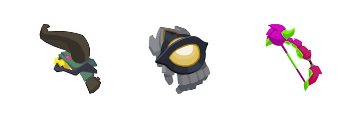
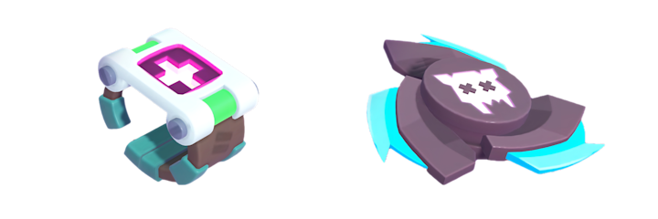

mo.co 第二章即将正式开始，准确来说是 6 月 16 日。

本次更新将推出海量全新内容，包括新武器、新工具、新地点、精英猎手内容，以及更多新要素。

## 新武器（6 月 16 日上线）

### 号角弓
- 普通攻击：发射 3 发能量弹，中距离造成伤害。
- 连续攻击：每第 3 次攻击变为强力射击，发射 5 发穿透性能量弹，对更大范围造成较高伤害。

### 奇异点
- 普通攻击：挥舞利爪，对前方近距离敌人造成范围伤害。
- 连续攻击：每第 6 次攻击对周围敌人造成伤害，并使所有冷却中工具的冷却时间缩短 1.5 秒。

### 淬毒弓
- 普通攻击：射出箭矢，远距离对单体敌人造成伤害。
- 连续攻击：每第 5 次攻击一次性射出 3 发爆炸毒箭，在小范围内造成持续伤害并减速非首领敌人。

## 新工具

### 治愈鲜花
生成一个图腾，持续治疗玩家与同伴。

### 小气坠饰
对范围内敌人造成伤害，并为玩家提供等值治疗。适合对付单体敌人。

### 咻咻 3000
部署一座射击炮塔，用于攻击单体敌人。

## 新被动技能

### 口袋气囊
每过 10 秒获得一次护盾，免疫所有伤害、击晕与击退效果。

### 工具电池
每次使用工具时，对最近的敌人造成电击效果。

### 记仇仙人掌
受到攻击时会自动反弹伤害给攻击者。

## 精英猎手内容

### 新精英模组
- 疗伤坐骑：探索世界时会持续恢复生命值。
- 越战越勇：玩家或其宠物击杀怪物后，获得短时间速度加成。

### 全新智慧戒指
新增多款专为精英猎手设计的智慧戒指。

## 新世界与地点

### 家园世界
地球老家出现猫猫入侵事件，猎手需前往处理问题。

### 龙族世界
- 仪式广场：萨满会治疗其他怪物，还有冰霜破坏兽和甦醒神像，需小心应对。
- 神圣花园：除了冰霜破坏兽与萨满，还有剧毒花丛与长鼻怪物，并有 mo.co 员工作为救援目标。

### 皇家虫子世界
- 城堡地下室：出现甲虫队长、豆豆怪与幼虫货车，密集布满敌人。
- 皇家营房：包含钻石甲壳虫与甦醒护卫，需要顶级装备挑战敌人。

### 猫咪世界
位于霜掌码头，出现众多猫主题怪物与新 NPC（渔夫），剧情中请玩家注意勿触摸怪物。

## 全新裂谷与武术馆
- 18 个全新裂谷
- 12 个全新武术馆  
这些内容适合玩家单独挑战或与队友一同协作完成。

## 地图事件与主线剧情
新增寻猫顾问等地图事件，将持续延展关于混沌能量与怪物的主线剧情。

## 新功能内容

### 组队系统重构
- 重制大厅功能，引入新组队系统。
- 队伍规模根据模式自动调整，队伍与好友页面整合。
- 邀请方式维持链接、QR 码与游戏内邀请。
- 裂谷与活动页面新增「组队」按钮，方便快速匹配队友。

### 猎手战（PvP）模式变更
- 新增单人、双人、4 人组队与大型团战模式，每种模式对应独立地图、排行榜与段位。
- 移除 PvP 专属装备系统，所有装备统一维持 15 级。
- 智慧戒指与精英模组将在 PvP 中被禁用。
- 段位仍维持 5 级设计，黑带后可继续累积星星提升排名。
- 地图中不再扣除积分。
- 段位升级所需星星数量减少。
- PvP 结算宝箱中将可获得更多混沌核心。

### 排行榜重制
- 移除主排行榜的全球和本地分页，新增好友与群组排行榜。
- 挑战活动与 PvP 保留本地与全球排行榜。
- 精英排行榜将精简整合为一，包括精英猎手与经验两个维度。
- 排名以精英代币为核心，经验等级作为同分比较条件。
- 好友与群组排行可在设置中存取。  
- 玩家经验条将从排行榜中移除。

### 经验值系统调整
- 日系统分为 Boosted XP 与 Normal XP。
- 每日最多累积 60,000 经验值，其中：
  - 前 20,000 点为 3 倍速度（Boosted XP）；
  - 剩余 40,000 点为正常速度（Normal XP）。
- 日固定限制移除，可最多累积 7 天经验值，玩家可一次性领取。
- 该系统仅适用于从怪物、mo.co 员工或友方单位获得的经验值。

## 游戏进度与质量优化

- 第一章重新调整，养成体验更顺畅，前 30 级地下城分布更均衡。
- 装备奖励将整合至专属任务中，解锁方式更直观。
- 新增更多小任务，由 mo.co 研究员分配。
- 完成日常事务经验值由 4000 提高至 5000，项目经验值有所减少。
- 武术馆与裂谷掉落的经验值、碎片、混沌核心提升 25%。
- 个人资料介面可查看收藏家等级进度。
- 装备套件与外观栏位增至最多 12 个，并可删除。
- 视觉效果优化，减少眼睛疲劳。
- 裂谷重生时间从 10 秒延长至 15 秒。
- 修复攻击后立即发送表情导致额外连击的漏洞。
- 修复 mo.co 员工及友方单位有时卡在墙内的问题。
- 调整冲刺方向为摇杆方向，并保持自动选敌功能。
- mo.co 友军与 NPC 的进度栏现在注记并持续更新。
- 护送任务中，若附近没有敌人，行进速度提升 50%。
- 武术馆可随时退出。
- 酷炫地带添加更多场景元素，如奇怪的生物与足球道具。

## 装备平衡性调整

为确保角色定位与装备效果更明确，对多件装备进行平衡调整：

- 推出专注特定职责（坦克、补师、输出、混合）的专属装备。
- 智慧戒指调整强化团队治疗反馈体验。
- 自我治疗类装备进行削弱。

### 装备调整一览：

- 治疗球：治疗量 +20%、最大生命值 -10%
- 治疗杖：治疗量 +45%、伤害 -30%
- 治疗水球：治疗量 +20%
- 活力喷雾：治疗量 -10%
- 维他命补剂：治疗量 -12%、攻速加成 45%→33%
- 嗜血尖牙：治疗量 -27%
- 嗡嗡大杀器（武器与宠物）：伤害 -20%
- 玉刃：重制后未攻击时连击条蓄能，补偿普通攻击伤害
- 热辣匕首：移除小幅回弹效果
- 速射弓：伤害 -10%
- 旋风镰刃：伤害 -10%
- 牙签与盾牌：伤害 +10%、触发连击所需攻击次数减少 25%
- CPU 炸弹：伤害 +10%、连击击退效果大幅提升
- 强力棒球棍：伤害 +5%、连击范围 +30%
- 恶狼利齿（武器与宠物）：伤害 +10%
- 扬声器：伤害 +10%
- 多重电击器：伤害 -15%
- 巨型雪球：伤害 -10%
- 怪物电击枪：冷却时间 +1 秒
- 辣椒喷雾：减速效果与持续时间下降 25%
- 六连爆炸包：伤害 +5%
- 臭袜子：伤害 +10%
- 不稳定闪电：伤害 -10%
- 健康小零食：治疗量 -20%
- 随身传送门：激活所需攻击数 +10%
- 宠物救生衣效果调整为计算为工具伤害

此次 6 月更新为 MO.CO 带来大量内容拓展与系统性优化，适合新玩家与老猎手共同体验。敬请期待 6 月 16 日第二章上线。
