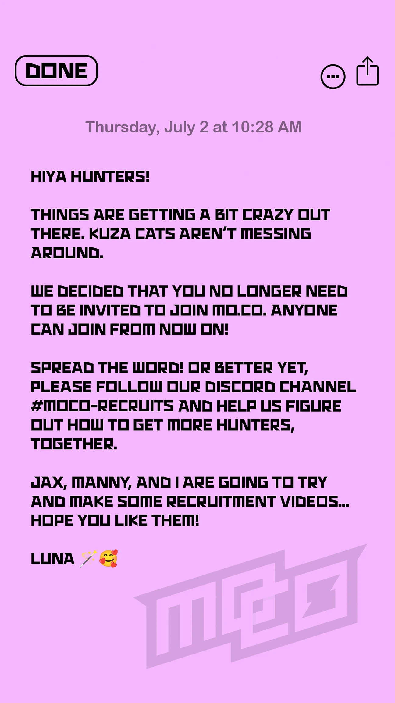

重磅消息！mo.co 已正式全球发布！

昨天，mo.co 团队在社媒上正式宣布，mo.co 结束了邀请制，正式全球发布！

  

> 嗨，猎人们！
> 
> 外面的情况有点疯狂，Kuza 猫可不是在闹着玩。
> 
> 我们决定，从现在开始，加入 mo.co 不再需要邀请了！任何人都可以加入！
> 
> 快把这个消息告诉大家！或者更好的是，一起帮我们想想怎么招募更多猎人吧！
> 
> 我、Jax 和 Manny 打算制作一些招募视频……希望你们喜欢！
>  
> ——Luna 🎤🥰

相比其他 Supercell 旗下的游戏，mo.co 的这次全球上线低调到简直悄无声息。至于为什么突然没有任何征兆的宣布全球正式上线？或许是上个月 18 万美金的营收让整个团队感受到了压力——是需要吸引来一波新鲜血液来继续收割了吗？

mo.co 现在已经发行到第二个章节，从这近三个月的表现来看，无论从玩法、玩家留存、营收上来看，都很难称得上是一款及格的游戏。正式发行后，随着大量 Supercell 圈外的玩家涌入（首批玩家基本都是从 supercell 创作者二维码以及玩家传火而来，Supercell 粉丝居多），游戏的表现究竟会如何呢？游戏团队会做出如何的更新和应对呢？游戏的口碑是会迎来翻身还是持续下滑呢？

无论如何，留给 mo.co 团队的时间不多了，希望 mo.co 不会成为 Supercell 第一个全球上线后香槟的游戏吧！

让我们拭目以待！