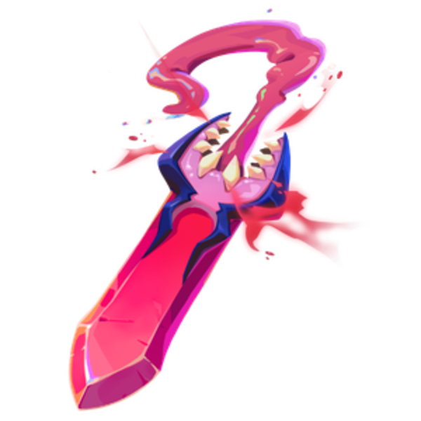
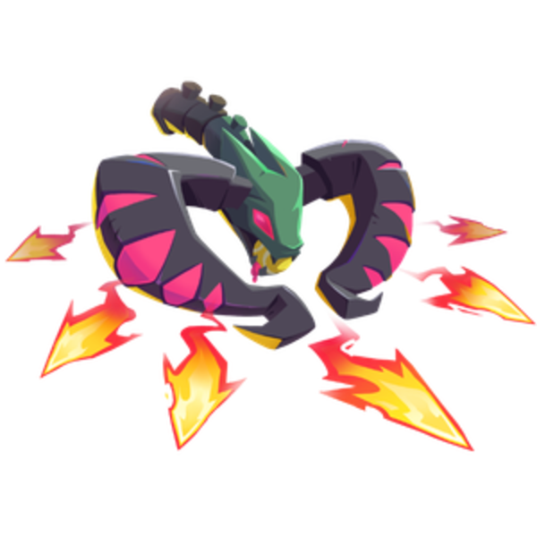

neo mo.co 第三赛季终于来了。

官方这次的公告标题很直接：**More monsters, more weapons!** 更多怪物，更多武器。听起来像是标准更新口号，但这次内容其实很明确：新赛季加入了猫系 Chaos Monsters，同时上线三把新武器。

如果你最近刚准备回坑 mo.co，或者还在观察 neo mo.co 这个赛季制版本到底怎么推进，这篇可以先帮你把第三赛季的重点捋一遍。

## 第三赛季核心内容

本次更新发布于 2026 年 7 月 16 日，属于 neo mo.co 新赛季内容更新。

官方公告里的重点可以拆成两部分：

- 新一批猫系 Chaos Monsters 出现
- Manny 准备了三把新武器

这三把武器分别是：

| 英文名 | 暂译 | 主要定位 |
|---|---|---|
| Blood Sucker | 嗜血者 | 近战范围输出，自伤换伤害，通过技能回血 |
| Fancy Wrench | 华丽扳手 | 单体能量攻击，召唤小炮台协助输出 |
| Hornbow | 号角弓 | 中距离输出，依靠命中为大招充能 |

这次没有大篇幅系统改动说明，更像是 neo mo.co 第三赛季的“武器主题更新”。但因为现在 mo.co 的赛季推进和 Weapon Sprints 绑定，新武器本身就会直接影响玩家的赛季路线选择。

## 嗜血者：自伤换爆发的近战武器

Blood Sucker 我这里先暂译为 **嗜血者**。

这把武器的核心特色非常鲜明：它会造成近距离范围伤害，但攻击和部分技能会消耗自己的生命值。普通攻击是向前方挥击，造成 1000 点近距离范围伤害，同时消耗 500 点生命。

官方列出的技能包括：

- Chomp：向前快速突进并攻击敌人，造成 1000 点伤害，同时消耗 700 点生命。
- Maw Mangle：旋转武器，对周围造成 3000 点范围伤害，同时消耗 2200 点生命。
- Thirst Quench：抛出武器造成范围伤害并减速敌人，命中敌人后为自己回血，强敌回复更多。
- Sanguine Swing：环绕挥舞武器造成范围伤害和减速，期间免疫眩晕、减速和击退，命中敌人后回血，强敌回复更多。

简单说，这是一把风险和收益都很高的近战武器。它不是那种无脑贴脸砍的类型，因为你打伤害的同时也在消耗自己的血量。如果回血时机、命中数量和走位没处理好，很容易出现“怪还没把你打死，你先把自己打残”的情况。

但反过来，如果你能把怪聚起来，利用范围伤害和回血技能循环，嗜血者应该会有不错的清场能力。喜欢近战、喜欢高压操作的玩家，可以优先关注这把。

## 华丽扳手：炮台流玩家的新玩具

Fancy Wrench 暂译为 **华丽扳手**。

它的普通攻击是向单个敌人发射能量冲击。命中 7 次之后，下一次攻击会朝角色面向方向召唤一个小型辅助炮台。炮台会在短时间内快速攻击单个敌人。

官方列出的技能包括：

- Dash：向前快速冲刺。
- Rush Job：短时间提高自己的攻击速度，同时影响附近的小炮台。
- Scheduled Maintenance：治疗自己和附近的小炮台。
- Big Helper：让每个小炮台发射能量球，命中敌人后造成伤害，并在敌人之间弹射和眩晕。

这把武器的关键词是“炮台”。它不像嗜血者那样强调贴脸换血，而是更偏部署、站位和持续输出。

从机制上看，华丽扳手很可能更适合 Boss、裂谷或者高生命值目标，因为炮台需要通过命中次数启动，完整输出也需要一点铺垫时间。社区讨论里也有玩家把它和过去的 Techno Fists 做类比，原因就是它同样有一种“打出节奏之后开始滚起来”的感觉。

不过它的缺点也很明显：如果场面太乱，或者 Boss 频繁移动，炮台位置和存活时间都会影响实际输出。喜欢稳扎稳打、研究站位和机制的玩家，可以把这把放在优先解锁列表里。

## 号角弓：中距离输出与充能大招

Hornbow 暂译为 **号角弓**。

这把武器并不是完全陌生的名字，老玩家应该对它有印象。不过在 neo mo.co 的新武器体系下，它现在更像一把围绕命中和技能充能运转的中距离武器。

官方描述中，号角弓会发射中距离弩箭，命中敌人后为 Unbridled Fury 充能。

技能包括：

- Strike：向前突进，对大范围敌人造成伤害，并为 Unbridled Fury 充能，命中强敌时充能更多。
- Dragon's Breath：喷出毒性龙息，多段造成范围伤害并减速敌人，命中后为自己回血。
- Serpentine Spirit：释放蛇形灵体，提升 5 秒攻击速度。
- Unbridled Fury：通过普通攻击和 Strike 充能，蓄满后发射多发穿透弩箭，对大范围敌人造成伤害和眩晕。

号角弓看起来会比华丽扳手更主动，也比嗜血者更安全。它有突进、有攻速提升、有回血，还有穿透和眩晕大招，整体更像一把中距离节奏型武器。

如果你不想一上来就玩自伤近战，也不想围绕炮台站位做太多规划，号角弓可能是三把里面最容易上手的一把。

## 三把武器先解锁哪一把？

因为 neo mo.co 现在的赛季内容和 Weapon Sprints 相关，三把武器的先后选择就变得很现实。

我的初步建议是：

| 玩家类型 | 优先考虑 |
|---|---|
| 喜欢近战、高爆发、能接受自伤风险 | 嗜血者 |
| 喜欢炮台、单体输出、Boss 和裂谷玩法 | 华丽扳手 |
| 想要中距离、操作更平衡、先稳一点体验新赛季 | 号角弓 |

如果只按“新赛季第一把武器”的稳妥程度来看，我会更建议普通玩家先看 **号角弓** 或 **华丽扳手**。嗜血者机制最有特色，但自伤机制也意味着容错率可能更低。

当然，如果你本来就是近战玩家，或者很喜欢 Zapsicle、Squid Blades 这类需要贴脸处理节奏的武器，那嗜血者的优先级可以直接拉高。

## 这次更新对 neo mo.co 意味着什么？

mo.co 在 neo mo.co 阶段已经把游戏推进方式调整成更明确的赛季循环：Weapon Sprints、P.E.R.K.s、轮换内容、排行榜和精英猎手路径共同构成了现在的长期目标。

所以第三赛季这次看似只是“三把新武器”，但本质上是在继续测试一个问题：

> mo.co 能不能靠每月新赛季和武器玩法，把玩家持续留在传送门里？

从内容角度看，三把武器的差异是有的。嗜血者强调风险收益，华丽扳手强调炮台机制，号角弓强调中距离充能节奏。至少它们不是简单换皮。

但从玩家留存角度看，真正要观察的还是后续几天：新武器解锁节奏是否舒服，武器强度是否有明显落差，裂谷和赛季活动能不能让玩家愿意反复刷。

如果只是几小时解锁完、体验完，然后又进入“等下次更新”的状态，那 neo mo.co 的赛季制还需要更强的中后期内容支撑。

## 一句话总结

neo mo.co 第三赛季的重点就是：猫系 Chaos Monsters 登场，三把新武器上线。

嗜血者适合喜欢高风险近战的玩家，华丽扳手适合想研究炮台输出的玩家，号角弓则更像比较稳的中距离选择。接下来这几天，真正值得观察的是三把武器在裂谷、Boss 和日常刷怪中的实际强度。

资料来源：

- [mo.co 官方公告：More monsters, more weapons!](https://rogue.inbox.supercell.com/#/en/news/4HFOTi3rp0syYRqvB0kOZ4/more-monsters-more-weapons)
- [mo.co 官方 YouTube：more monsters, more weapons](https://www.youtube.com/watch?v=XtvYPmNQjSg)
- [mo.co Wiki：neo mo.co 赛季、Weapon Sprints 与 P.E.R.K.s 机制整理](https://mo-co.fandom.com/wiki/Version_History)
- [MobileGamer.biz：Supercell reboots mo.co with seasons and free gacha pulls](https://mobilegamer.biz/supercell-reboots-its-lowkey-monster-hunting-game-mo-co-with-seasons-and-free-gacha-pulls/)
