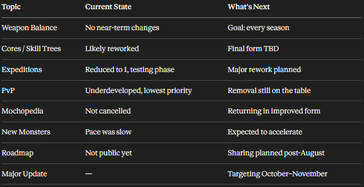
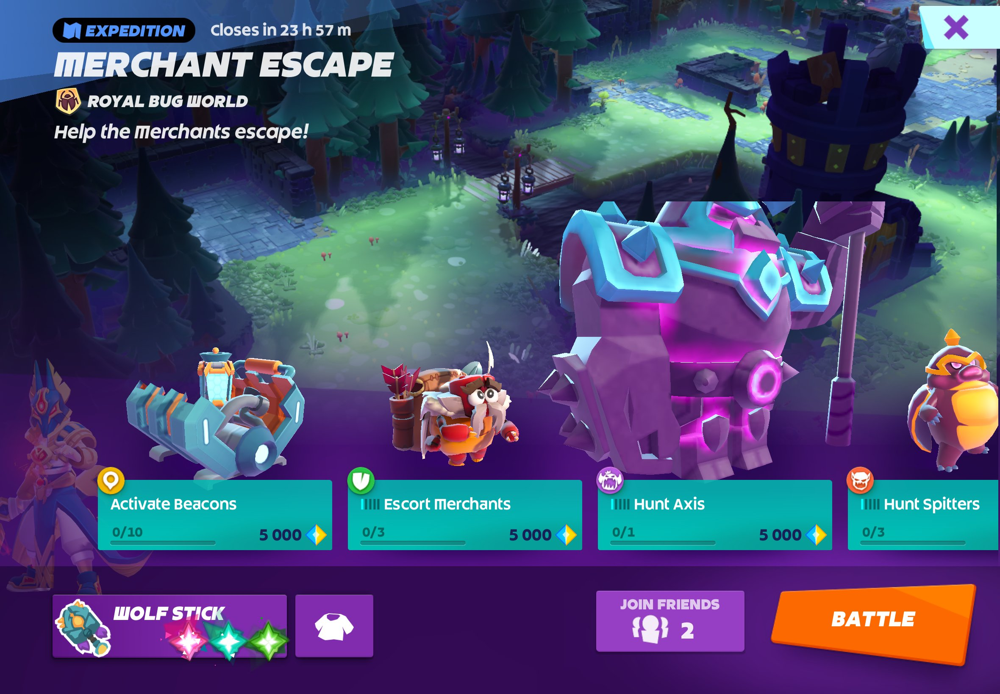
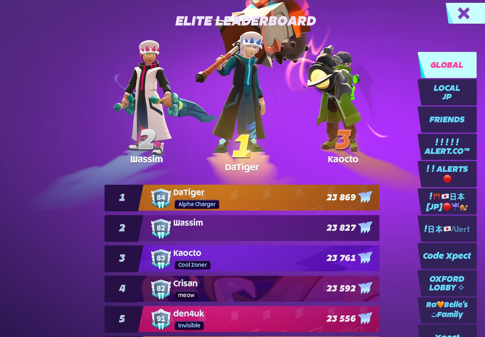
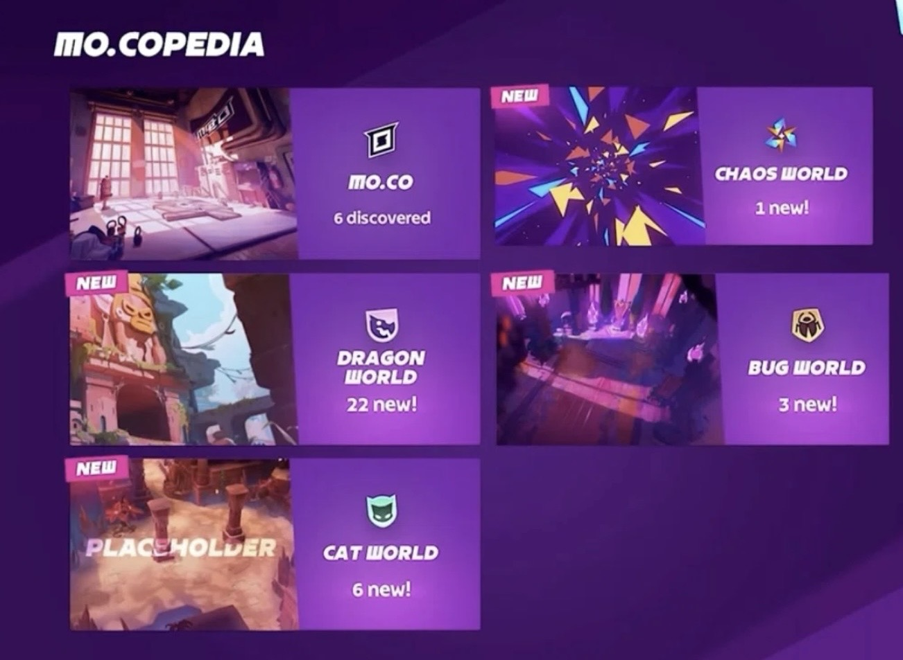

mo.co 第三赛季上线后，大家最先聊的肯定是三把新武器：嗜血者、酷炫扳手和兽角弓。

然而新鲜劲儿过去之后，玩家却又很疑惑：**现在这套赛季制缺乏新意，以后每赛季都是这样吗？**

最近 Reddit 的 mo.co 社区有一篇很长的建议帖，聊到了进度系统、武器天赋、核心槽、裂谷、角色自定义等内容。

另一边，社区也整理了一场 Joao 参与的 AMA / QA，里面提到武器平衡、核心系统、排行榜奖励、PvP、路线图和关服担忧。

这两份内容放在一起看，指向的是同一个担心：

> 大家喜欢 mo.co 的战斗，但担心战斗之外缺少足够长线的目标。

这不是一句空话。mo.co 现在已经不是单纯“上线一个新章节”的节奏，而是在尝试用赛季、武器冲刺、轮换内容和精英玩法维持活跃。如果长期进度撑不住，新武器再有趣，也很容易变成“玩几天，等下个月”的循环。

## QA 里官方其实说得很直白

这次 QA 里比较有价值的一点，是 Joao 没有把问题简单带到“以后会有更多内容”上。

他提到了几个比较直接的判断：

- mo.co 目前关服可能性接近于零。
- 以现有玩家规模来看，商业化表现比预期更好。
- 团队现在更头疼的不是收入，而是玩家留存。
- 团队有足够资源继续开发，也有很多未来想法。
- 现在重点不是大规模拉新，而是先把游戏本身做得足够让玩家愿意回来。

这几句话能解释不少社区里的焦虑。

从外部看，大家很容易盯着收入榜、下载量和热度曲线，然后担心 mo.co 会不会又变成 Supercell 项目坟场里的一个名字。但 Joao 的说法更像是在讲另一件事：先确认这家“餐厅”的菜能不能让老顾客持续回来，而不是急着把店开成连锁。

团队现在最在意的，应该不是“下一次大宣传什么时候来”。他们更想知道玩家下周还来不来。

这和玩家长帖里的担忧对上了：战斗好玩，但长期目标还不够。

## mo.co 的战斗底子其实很好

mo.co 最大的优势，还是战斗手感。

移动、攻击、技能释放、怪物密度、多人混战，这些东西组合在一起，mo.co 的即时战斗体验是有辨识度的。它不是传统 Supercell 那种三分钟一局的竞技结构，也不是纯放置刷数值，而是更接近轻量 MMO / 动作刷怪游戏。

这也是为什么即便玩家对活动、进度、赛季内容有意见，社区里仍然经常能看到一个共同判断：**战斗本身好玩。**

问题是，战斗好玩不等于游戏就能长期稳定。mo.co 这种游戏需要玩家反复刷怪、刷裂谷、刷赛季进度。如果后期目标不清楚，很容易出现两个情况：

- 普通玩家不知道为什么要继续刷。
- 深度玩家很快刷完，然后开始等下次更新。

所以 mo.co 接下来要解决的，不只是“有没有下一把新武器”，而是每一把武器、每一次刷图、每一个赛季，能不能变成长期成长的一部分。

## 赛季制不能只靠新武器续命

第三赛季的三把武器各有特点。

嗜血者是自伤换爆发，酷炫扳手是炮台流，兽角弓更偏中距离充能节奏。它们不是简单换皮，这点可以肯定。

但新武器有一个天然问题：新鲜感会衰减。

一把武器刚上线，玩家会研究它的技能、强度、适合什么地图、适合什么裂谷。几天之后，大致评价就会形成。再过一段时间，如果没有更深的构筑空间，它就会被归类成“强”“能玩”或“不推荐”，然后玩家继续等下一批武器。

这对赛季制来说不太妙。

赛季制不能只靠“每月三把新武器”往前推。新武器可以吸引玩家回来，构筑和目标才决定他们会不会留下。

mo.co 需要让玩家开始思考：

- 我这把武器要走什么路线？
- 我是不是可以用同一把武器玩出不同打法？
- 我刷到的核心、材料和外观，能不能转化成长期目标？
- 我今天打裂谷，不只是为了清任务，而是为了完善某个构筑？

如果这些问题没有答案，赛季制就会变成内容投喂。投喂速度一慢，玩家就会觉得空。

## 武器天赋为什么重要？

Reddit 玩家建议里很值得看的，是“武器专属天赋树”。Joao 的 QA 里，混沌核心和技能树也被反复提到。

Joao 的说法大致是：混沌核心系统很可能会重做，团队也在认真考虑类似技能树的方向，但现在不能承诺最终一定会怎么做。他听到的不只是玩家想要一个“技能树”按钮，而是玩家想要更多自定义、更强的构筑空间，以及能围绕武器做自定义的乐趣。

这个思路不难理解：每把武器不只是升级数值，而是有自己的分支路线。比如一把偏暴击、闪避、冷却的武器，可以分别走机动路线、爆发路线或技能循环路线。

重点不是简单加 10% 伤害，也不是堆生命值，而是让玩法发生变化。

比如：

- 某个技能冷却更短，但伤害降低。
- 某个大招范围更大，但充能更慢。
- 某个隐身类技能结束后获得爆发窗口。
- 某把近战武器可以牺牲生存，换更强的清怪能力。

这类天赋能让同一把武器在不同玩家手里变得不一样。

mo.co 的武器数量会越来越多。如果每把武器最后都只有一个“最优解”，玩家只会追版本答案；如果同一把武器能有两到三条路线，它的寿命会长很多。

## 核心槽和核心经济需要更多出口

社区反馈里另一个绕不开的是核心系统。

现在武器核心更像固定成长组件，玩家能选择的空间有限。如果某把武器的核心组合不理想，它在高压裂谷中的竞争力就会受限。

玩家提出的方向是增加一个自定义核心槽，让每把武器在默认核心之外，再多一点个性化调整空间。QA 里创作者也提到过类似方向：不一定所有槽位都固定死，而是允许玩家在部分核心槽上有更多选择。

当然，这里也有风险：如果开放自定义，玩家会不会最后还是全部塞同一个最强核心？

这可能是 mo.co 接下来最难的平衡题之一。太固定，玩家觉得没深度；太自由，版本答案可能更快收敛。

这个想法不一定要照搬，但问题是真实存在的：**长期刷出来的核心，需要更有意义的消耗出口。**

如果核心只是升级材料，那么迟早会出现两种状态：

- 普通玩家觉得核心不够，进度卡住。
- 深度玩家核心溢出，不知道还能干嘛。

更好的状态，是核心既能支撑战斗成长，也能成为长期收集和外观系统的一部分。

比如多余核心可以转换成某种外观货币，用来兑换旧赛季外观、通用装饰、武器特效，甚至低概率开出过往活动的外观装饰品。这类系统不能太逼氪，也不能破坏公平，但它能让“刷”这件事更有余味。

mo.co 如果想做长期在线游戏，就得有这种资源消耗循环。不然玩家越肝，越早进入无事可做的状态。

## 裂谷不该只剩 DPS 考试

Reddit 长帖里最值得认真看的部分之一，是裂谷和精英挑战的计时机制。

现在很多高难内容会自然走向一个结果：谁输出最高，谁最有价值。

只要 5 星评价强依赖时间，玩家就会自动排斥低输出武器。治疗、坦克、控制、机制型武器，即使设计上很有趣，也会因为“拖时间”被边缘化。

这不是 mo.co 独有的问题。很多带限时评价的 PvE 游戏都会这样：只要时间权重最高，大家最后都会向最高 DPS 靠拢。

QA 里 Joao 对 Techno Fists 的判断也能对上这个问题。他没有简单说“动感全套太强，马上削”，而是说问题不一定只在武器本身。当前副本类型和只有 boss 的副本增多，本来就更偏向高单体 DPS 武器。团队想先看看增加 Rift 多样性后，环境会不会自然变化，再决定是否直接平衡。

这个回应比较克制。玩法如果只奖励一种输出形态，削一把武器可能只是换下一把武器上位。

但 mo.co 的武器设计并不是只有输出。游戏里明明有治疗、坦度、控制、位移、生存和召唤等方向。如果裂谷永远只奖励最快通关，那么这些设计就很难真正站起来。

更合适的方向，可能是让一部分裂谷从“限时考试”变成“机制挑战”：

- 排行榜仍然可以保留速度排名。
- 普通奖励可以更看重击败 Boss、完成机制和生存。
- Boss 机制可以更难，但不要求玩家全程极限输出。
- 治疗、坦克、控制武器在某些裂谷中有明确价值。

这样玩家组队时就不只是在问“你带最高 DPS 了吗”，也会考虑队伍搭配。

如果每个赛季最后都收敛到几把输出武器，游戏的武器池再大，也会显得很窄。

## 排行榜奖励要先解决 RNG

QA 里还有一个和裂谷关系很近的问题：排行榜奖励。

很多玩家希望排行榜有更明确的奖励，这很正常。深度玩家花时间打高分、刷速度，如果最后只剩排名展示，动力会不足。

但 Joao 的顾虑也很现实：早期赛季还有 bug、漏洞、意外打法和 RNG 问题。如果过早把高价值奖励绑到排行榜上，奖励可能不是给最强玩家，而是给最会刷 RNG、最会利用环境漏洞的人。

暴击核心和 Boss 动画随机性，也会让速度榜看起来更像“技术 + 运气 + 肝度”的混合物。

更合理的方向，不一定是立刻做重奖排行榜，而是先做分层目标。

比如创作者提到过的里程系统就不错：2 分 30 秒内通关、2 分钟内通关、更高阶的阶段目标。这样玩家不一定要和全服第一卷到极限，也能获得明确成就。

对大多数玩家来说，“我比昨天更快，我解锁了下一档奖励”，会比“我永远排不到前 100”更有动力。

## mo.co 需要更强的组队目标

mo.co 的多人体验是亮点之一，但现在很多玩法仍然偏“大家一起刷”，还没到“我们需要分工协作”的程度。

社区里有人提到大型副本或者精英副本的想法，这个方向其实很适合 mo.co。

不是说 mo.co 必须变成硬核 MMO，也不是要让普通玩家被复杂机制劝退。游戏只是需要一些更高层级的团队目标，让深度玩家有东西研究。

比如：

- 多阶段 Boss。
- 需要分散站位或集中防守的机制。
- 不同武器职责更明确的团队挑战。
- 每周轮换词缀的高难裂谷。
- 小队竞速 PvE，类似两队刷同一张图比完成度和速度。

这些内容不一定要给所有玩家同等压力。普通玩家可以继续打轻松日常，深度玩家有更高目标就行。

如果所有内容都只服务轻度玩家，深度玩家会无聊；如果所有内容都变硬核，普通玩家会跑。mo.co 要找的是中间层。

## PvP 不是当前答案

QA 里 Joao 对 PvP 的态度也很直接。

他相当坦白地说，PvP 可能不应该以当前状态上线。mo.co 是 PvE 游戏，而 PvP 现在是团队最低优先级之一。甚至当被问到如果能从游戏里删掉一个东西会删什么时，Joao、HX 和 Xpectation 给出的答案都是 PvP。

这基本说明，mo.co 未来一段时间的重点不会是传统 PvP。

这也符合游戏本身的气质。mo.co 最强的地方不是玩家互殴，而是组队打怪、刷图、打裂谷、研究武器。把 PvE 的深度先补起来，会比强行推 PvP 更现实。

QA 里也提到 Joao 有做电竞生态的梦想，包括观战、电竞入口、公平竞技环境等。但那是更远的事。现在还是先把 PvE 循环做稳。

## 路线图为什么还不能太早给？

玩家想要路线图很正常。mo.co 还在快速试错，大家当然想知道八月、九月、十月到底会发生什么。

但 QA 里 Joao 解释了他们为什么谨慎：开发团队一旦公开某个未来功能，玩家很容易把它理解成承诺。如果后来方向变化，就会引发失望。

目前比较明确的节奏是：

- 第一、第二赛季主要用于收集数据和玩家反馈。
- 夏休之后，大约从八月开始，团队会基于反馈做更关键的方向决策。
- 八月到九月可能是较小更新。
- 十月到十一月目标是更大的更新。

mo.co 还在“定方向”。

所以这篇文章里提到的武器天赋、核心槽、裂谷机制、排行榜奖励，都不能理解成马上会来的功能。它们更像是团队和玩家都在摸索的方向：怎样让 mo.co 的长期循环更稳。

## 自定义和外观也不是小事

很多人聊长期进度时，第一反应是战力。但对 mo.co 来说，外观和角色自定义也不能少。

因为 mo.co 的世界观很适合“打工人猎手”这种轻松表达。玩家在游戏里不是传统勇者，而是一群穿着奇怪衣服、拿着夸张武器、跑去异世界处理怪物问题的猎手。

这种设定很适合外观系统。

如果角色只能换少量服装和头部装饰，自定义空间就会很快见底。更丰富的背部装饰、武器特效、击败动画、登场动作、光效、粒子效果，都会成为长期目标的一部分。

当然，这里也要小心：外观可以成为长期追求，但不要把所有好看的东西都塞进高价礼包。mo.co 现在更需要信任和留存，不适合太早把外观系统做成压力。

更好的做法，是让赛季、挑战、裂谷、长期成就和付费外观各自承担一部分内容。愿意花钱的玩家可以更快获得个性化体验，不花钱也能通过长期游玩拿到一些值得展示的东西。

QA 里也提到了一些相关方向。比如 Mo.copedia 不是被取消，而是想以更互动的形式回归；Career Level 未来可能加入外观类里程碑奖励；Rooftop HQ 没有达到最初社交中心的预期，团队也考虑过让个人空间回归。

这些内容看起来没有战斗系统那么“硬核”，但对长期游戏很有用。玩家不只需要战斗目标，也需要展示目标和一点生活感。

## 玩家到底在要什么？

这类社区建议帖里，具体方案未必都能照搬。

武器天赋树会不会太复杂？自定义核心槽会不会加剧平衡压力？取消裂谷计时会不会削弱竞技感？Raid 会不会增加开发成本？这些都是现实问题。

QA 里的官方回应也说明，团队不是没看到这些问题。混沌核心可能重做，副本多样性被重视，排行榜奖励要先处理 RNG，PvP 优先级降低，Mo.copedia 想以更主动的形式回归，奖杯系统也已经有过内部讨论。

玩家想表达的，不是“照我说的做”。

他们想说的是：

> mo.co 的战斗很好玩，但我希望自己玩得更久时，依然有新的目标、新的构筑、新的挑战和新的表达方式。

对 mo.co 来说，现在最怕的不是玩家骂某把武器弱，也不是玩家吐槽某个活动奖励一般。更麻烦的是玩家觉得“我已经懂了这个游戏接下来每个月会怎么循环”。

一旦玩家把赛季节奏看穿，就会开始变得只在更新日上线。更新日体验新武器，几天后刷完，接着等下个月。

这不是灾难，但会限制 mo.co 的上限。

## 我的看法

我对 mo.co 还是比较乐观。

它的问题不是没救，而是很典型：一个战斗底子不错的在线游戏，正在从“有趣的新游戏”过渡到“能长期运营的游戏”。这个阶段很容易遇到长期目标不足、系统深度不足、资源循环不完整、玩家内容消耗过快的问题。

而且从 QA 来看，团队没有把问题推给“玩家不懂游戏”。Joao 承认留存是当前最大挑战，赛季早期需要收集数据，很多系统还没定型。

好消息是，这些问题不代表方向错了，更像是系统层次还没补够。

mo.co 现在已经有：

- 不错的战斗手感
- 有辨识度的武器设计
- 适合持续扩展的怪物和世界观
- 轻松但有记忆点的品牌气质
- 足够做赛季内容的框架

现在缺的是：

- 更深的武器构筑
- 更有弹性的核心系统
- 更能容纳非 DPS 武器的高难玩法
- 更长期的资源消耗出口
- 更能表达玩家个性的外观和成就系统

如果这些补上，mo.co 的赛季制就不只是“每月上新”，而会更接近一个玩家愿意长期经营的传送门生活。

## 总结

mo.co 第三赛季的新武器当然重要。但新武器之后，玩家还要追什么？

从 Reddit 玩家反馈和 Joao QA 来看，社区关心的不只是单一武器强弱，而是长期进度、自定义深度和后期玩法能不能撑住赛季循环。团队关心的，也不是短期收入数字，而是玩家能不能持续回来。

武器天赋、核心槽、裂谷机制、Raid 型团队内容、外观自定义，这些方向未必会全部进入游戏，但都在回答同一个问题：

**mo.co 需要让玩家不只是回来试新武器，而是愿意留下来养成自己的猎手。**

资料来源：

- [Reddit 玩家建议帖：Thoughts on Progression, Weapon Talents, Core Slots, Rifts, and Customization](https://www.reddit.com/r/joinmoco/comments/1ul4buw/big_suggestions_post_thoughts_on_progression/)
- [Reddit QA 整理：neo mo.co Q&A - Future Plans from the Creator × Joao Interview](https://www.reddit.com/r/joinmoco/comments/1ujwx5x/neo_moco_qa_future_plans_from_the_creator_joao/)
- [X 用户 なな mo.co 整理的 Joao QA 长文与配图](https://x.com/na77na7na7/status/2071786638213255401)
- [mo.co 第三赛季官方公告：More monsters, more weapons!](https://rogue.inbox.supercell.com/#/en/news/4HFOTi3rp0syYRqvB0kOZ4/more-monsters-more-weapons)
- [MobileGamer.biz：Supercell reboots mo.co with seasons and free gacha pulls](https://mobilegamer.biz/supercell-reboots-its-lowkey-monster-hunting-game-mo-co-with-seasons-and-free-gacha-pulls/)
