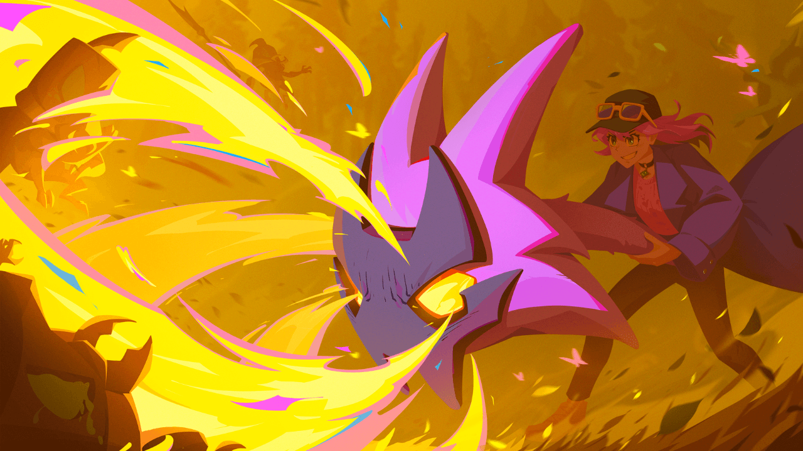
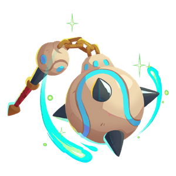
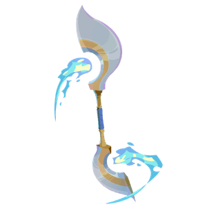
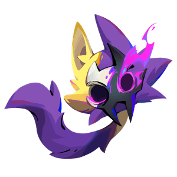
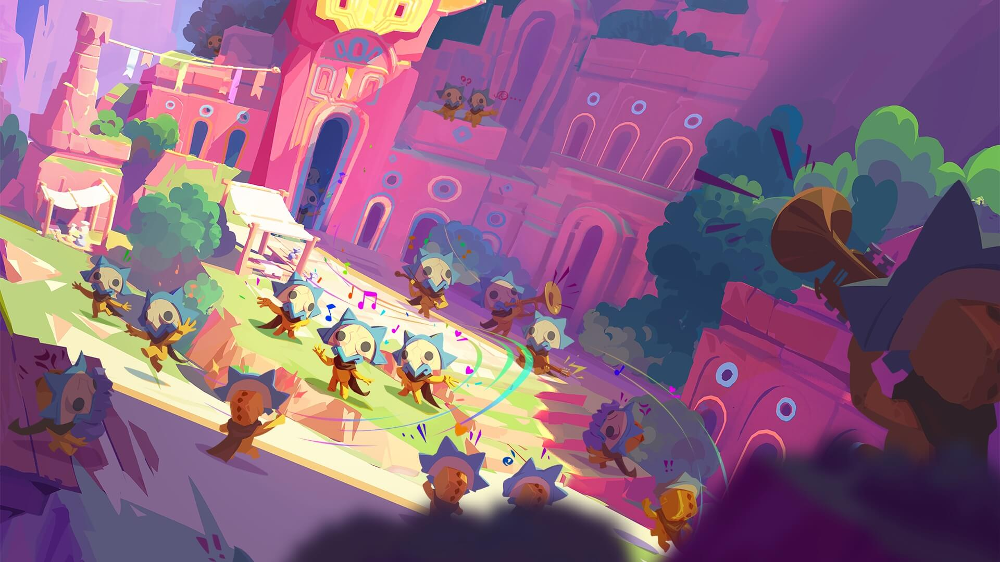
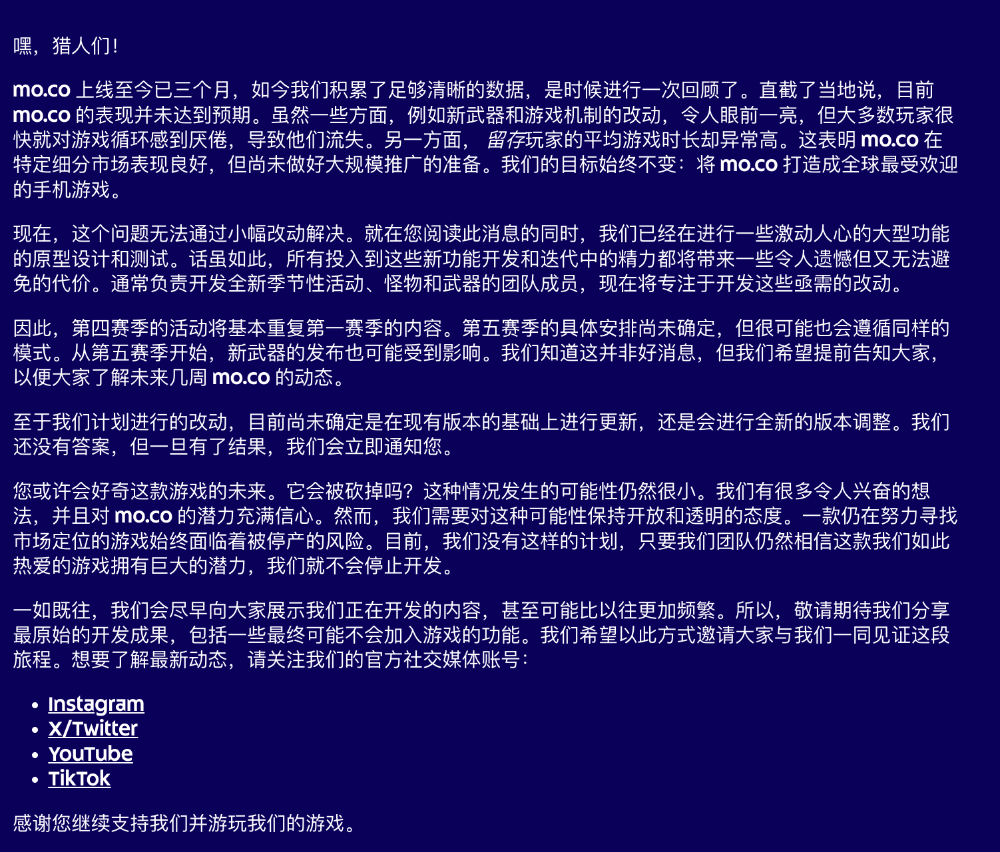
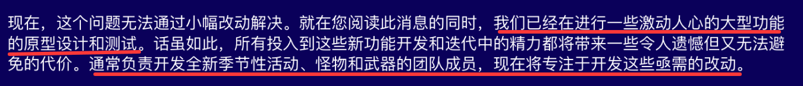
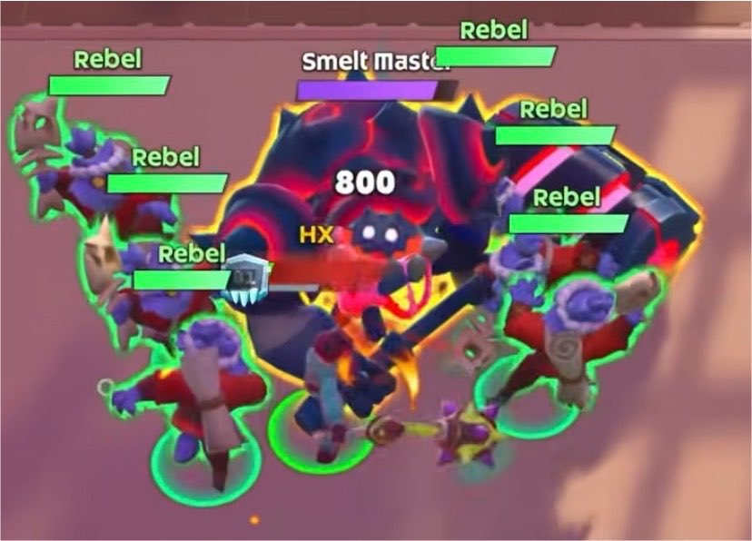

mo.co 新版本第 4 赛季已经开启。

官方在 8 月 13 日发了新赛季更新，三把新武器上架，裂谷继续。

## 新赛季先看三把武器

第 4 赛季新增治疗球、风暴编织者和火花。

| 英文名           | 中文    | 定位               |
| ------------- | ----- | ---------------- |
| Medicine Ball | 治疗球   | 近战范围伤害，带治疗和护盾    |
| Storm Weaver  | 风暴编织者 | 近战控场，旋风、雷电、聚怪    |
| Pyro          | 火花    | 中距离火焰输出，燃烧、过热、爆发 |

这三把武器有一个共同点，设计上有明显的职业分工（不过考虑到目前 moco 武器即职业，这句话似乎有点多余）。

### 治疗球

治疗球的普通攻击是热身重击，近距离挥球，打前方范围伤害。连续命中 2 次后，下一次攻击会治疗自己和附近队友。命中敌人时，它还会给技能充能。

它的技能也围绕前排辅助展开。猛冲直撞负责向前冲刺并撞击敌人，压力释放能挥球打范围伤害并眩晕，维他命U给自己持续回血，免疫系统给自己和附近队友短时间免伤。

问题在于目前 moco 的副本设计，输出效率是首位的，尤其是 Boss 型裂谷。以通关时间为导向的副本结算目标，治疗型武器是没有任何生存空间的。

鸡肋，只能和奶杖站一排，一起吃灰。
### 风暴编织者

风暴编织者是近战范围武器。普通攻击命中 5 次后，下一次攻击会释放穿透旋风，对敌人造成伤害并眩晕。

它的技能更主动。涌动可以冲刺斩击敌人，并且能存两层。飓风进入龙卷风状态，把敌人吸到身边并持续造成范围伤害。雷暴随机打雷并眩晕敌人。复苏之风则提供自己和附近队友的持续治疗。

这把武器比较吃环境。

怪物数量多、站位乱、需要聚怪和打断时，它会很好用。飓风如果手感稳定，应该能在清波次和控场内容里打出存在感。

但是，风暴编织者也会遇到和治疗球类似的问题。裂谷目标如果长期偏向最快击杀 Boss，风暴编织者就要和高单体输出武器抢位置。

控场武器刮痧的伤害，导致其很难有登场的机会。

## 火花

火花是三把新武器里最值得一用的一把。它在中距离喷火，对敌人造成伤害并挂燃烧。喷太久会过热爆炸，把敌人推开并眩晕，玩家自己也会被眩晕。

它的技能也都围绕这套节奏。冲刺用来位移，冷静一下给自己回血并重置过热条，烈焰风暴向周围喷火，可爱横扫立刻伤害所有燃烧敌人，附带眩晕和追加燃烧。

火花是一把附带 DOT（Damge Over Time，即持续伤害） 伤害的武器，从设计上和毒弓比较类似，机制几乎完全一样——持续打出 dot 伤害，然后用终结技爆发所有持续伤害。

实际使用中，它又和血刀比较像，附带反面 Debuff。如果你贪输出，过热条会教你做人，过热后自己会眩晕，时机不好可能会被怪物秒杀。反过来如果控得住节奏，就能打持续燃烧和范围爆发，最终伤害相当可观，甚至可以作为毒弓的上位替代来使用。

三把新武器里，它应该是可玩性和威力兼顾的一把武器。有风险，有反馈，也有操作空间。

## 官方三个月的回顾

另外，在第 4 赛季更新前一天，官方发了一篇公告，回顾了新版本 mo.co 上线三个月后的情况。这篇公告大概讲了几件事。

官方承认 mo.co 现在表现没有达到预期。新武器和玩法改动有一些不错的反馈，留下来的玩家平均游玩时间也很高（低情商的说法就是只剩下已经提纯的结晶了）。可对大多数玩家来说，游戏循环很快会变得重复，很多人因此流失。

这个说法基本把 mo.co 现在的状态讲明白了。它有一批很爱玩的核心玩家，这批人能玩很久。麻烦在于这批人还不够多，游戏没有把更大范围的玩家留下来。

官方接着提到开发安排。团队认为小改动解决不了问题，所以已经开始做更大的原型和测试。原本负责新赛季活动、怪物和武器的人，会转去做这些改动。第 4 赛季活动大多复用第 1 赛季内容，第 5 赛季还没定，但很可能也会类似。从第 5 赛季开始，新武器上线节奏也可能受到影响。

官方释放了一个什么样的信号呢？团队可能会把内容产能拿出来，去做更底层的改动。对玩家来说，这意味着接下来一两季可能会没那么新鲜。对游戏来说，这可能是必要的一步。但是对于现在线上的 moco 来说，就只能用短期内容顶着，玩法不停循环。

看起来是不是很眼熟？这不就是之前的 10 个月 mo.co 2.0上线前的节奏吗？停止更新 10 个月，等待憋个大的版本。这新版本才上线 3 个月，又打算回炉重造 3.0 了么？

### 策划团队QA

其实官方策划 Joao 早些时候有一次直播活动，回答了很多社区玩家的一些问题，现在回头看更像一次提前预告。里面信息很多，我觉得最值得看的有三块。

第一块是裂谷和武器环境。当时第一个赛季，拳套几乎都在用，它为什么强，不能只看武器面板。现在裂谷里 Boss 型内容多，目标又偏向速度，单体 DPS 武器自然会变成最优解。官方团队的意思是，想先看更多裂谷类型能不能改变环境，再去做大幅平衡。

这个思路是对的。

平衡不能只改数字，环境本身也决定了武器的强弱。

第二块是升级核心的改版和技能树。策划 Joao 提到升级核心很可能重做，团队也在认真考虑技能树。这个方向比单纯加新武器更重要。玩家想要的是自定义和研究构筑的快乐。老版本的 moco 里有一定的武器搭配可选性，新版本的 moco 几乎为 0。这一块也是玩家诟病最多的地方。

第三块是留存。Joao 当时说停服风险接近零，商业化表现对现有玩家规模来说甚至比预期更好。问题落在留存上，更多玩家没有持续回来的理由。这一点基本上就是三个月的回顾公告中提到的。

这些信息和现在的官方复盘拼在一起，结论就很清楚了。官方总算认识到 moco 的本质结构问题了——更多的武器、更多的活动解决不了任何问题，moco 缺一套能让玩家长期游玩的机制。

## 我更希望 mo.co 往哪里改

### 掉落要有惊喜

我最希望看到的是装备掉落和收集。

mo.co 现在的成长太清楚，也可以说是太框架了。玩家知道自己要刷什么，知道下一步升什么，也知道多少级拿到武器。清楚是好事，可刷装游戏如果一点意外一点惊喜都没有，时间久了就会像打卡上班，还有什么乐趣？

特殊词条、套装效果、稀有装备、武器专属组件，或者能改变武器技能的小掉落，都能让一次副本多一点期待。最好能让玩家刷到一个东西以后，能停下来想一想这东西能不能配另一把武器，能不能换一种玩法。

只要出现这种想法，游戏就多了一层寿命。

### 技能树、武器天赋、构筑

技能树和武器天赋也很重要。同一把武器只有一条升级线，很快就会被研究完。玩家把数值升满以后，剩下的讨论通常就会变成哪把武器最强。

可是，目前 moco 是以武器来划分职业，这种设定在现代的游戏里很常见。**但是，它不能等于限死自由。**

更理想的状态是，一把武器通过武器构筑、技能树、甚至人物天赋的搭配，内部也能分出几种路线。譬如，治疗球可以偏团队保护，也可以偏近战承伤；风暴编织者可以偏聚怪控制，也可以偏雷电爆发；火花可以偏持续燃烧，也可以偏过热引爆。

甚至，速射弓也可以走速射群伤流，也可以走单体爆伤爆发流。

这样一来，玩家的方向就会变，刷怪更有动力和目标，讨论的内容也会变化。大家不仅会问这把武器强不强，还会问怎么加点、打什么宝石、如何构筑、队友怎么搭配。武器有了分支，副本也更容易设计出不同答案。

### 职业划分

mo.co 用武器决定职业，这个方向没问题，现在很多游戏都有类似的设计。问题是很多武器最后都被拉回伤害效率。新武器上线时大家会尝鲜，过几天就开始算谁刷得快、谁打 Boss 更稳。

moco 一直主打一个多人共斗合作狩猎，如果是这样的游戏理念，武器以及副本的设计就应该往合作共赢的方向进行。

然而我们看武器技能设计本身，一技能基本都是冲刺技能，同时为了让每把武器能玩，又基本都要设计一个续航回血技能。这么算起来，四个技能基本都占掉了两个，留给武器自身特色的槽位不多了。这也就很好理解，同为 Dot 武器，为什么毒弓和火花感觉那么像。随着武器的增多，我相信武器同质化的问题也会越来越严重。

职业（武器）划分还是应该有，职业可以有缺陷，但是不能没特点；职业可以没有冲刺，可以不带续航，但是他一定得像一个职业，一定得和其他职业有鲜明的区别。

### 副本设计要给不同职业留位置

副本也要变。mo.co 不能长期让玩家觉得进图就是最快打死 Boss。只要目标一直偏向竞速，最后所有武器都会被拿去和单体 DPS 比效率。

治疗球需要队友真的会出危险，风暴编织者需要怪物真的值得被聚起来，火花需要燃烧和范围压制能处理特殊场景。守点、护送、分头处理机制、控怪、打断、生存和清波次，这些不同的副本设计都应该给不同武器留下位置。

真正理想的情况是：辅助要改变团队容错，控制要在特定副本里有不可替代的价值，近战和远程也要有更清楚的风险回报。然而现状却是，除了高 DPS 的武器，其他武器在副本冲记录时几乎没有出场机会。

这也是辅助武器能不能站住的关键。武器设计的再有意思，如果副本目标一直以竞速为主，玩家迟早还是会回到DPS最高效率的答案上。

## 写在最后

作为从内测就开始深度玩 moco 的老玩家，我还是觉得 moco 是有潜力的。

但是看 Moco 的现状， 想要取得成功，确实也需要做出重大改变。然而这样每次发现问题就停止更新，回炉重造，留给线上玩家一个不更新的半成品，也确实是太激进了。

逐步测试，分阶段发版，是不是更好一些呢？

所以，留给 moco 的时间真的不多了。如果能把装备、天赋、副本目标和长线游玩目标这些补起来，mo.co 还有机会把核心玩家之外的人留下来。游戏如果继续只靠每季几把新武器续命，哪怕武器再有趣，我想，moco 大概率还是会香槟。

## 参考来源

- [mo.co 官方更新公告](https://mo.co/en/news/news/new-weapons-new-chaos/)
- [mo.co 官方三个月回顾](https://mo.co/en/news/news/relaunch-retrospective/)
