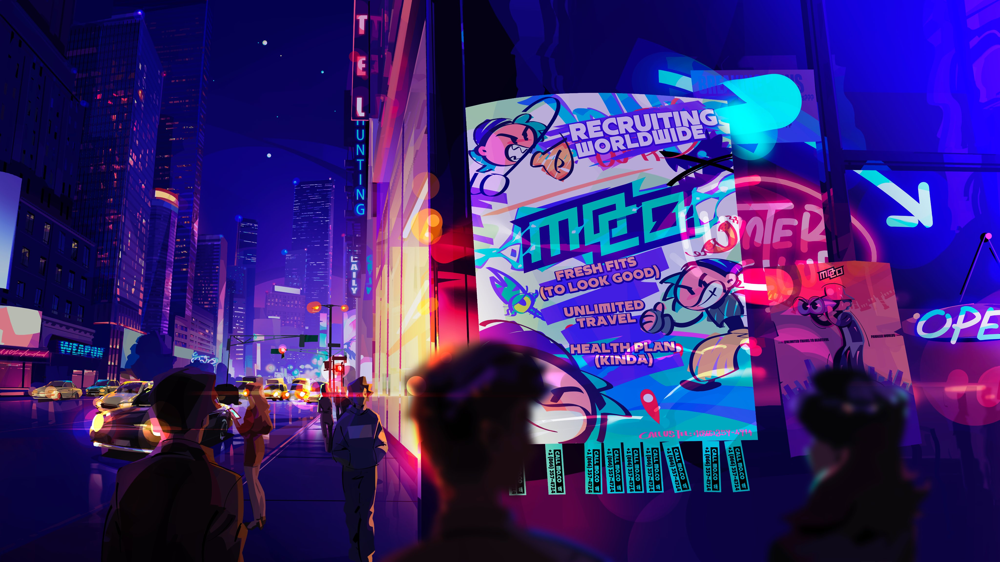

 

爆裂小队又又又跳票了。

昨日，在官方频道发布的视频中，《Squad Busters》的社区经理 Paula 和 Adrian 表示：

> 我们知道许多人一直在等待 4 月的更新，我们感谢社区的所有支持和耐心。不幸的是，为了确保一切准备就绪并具有游戏应有的质量，我们需要将更新推迟到 5 月。

这一决定虽然艰难，但团队认为这是为了更高的游戏品质、更加完善的系统体验。

官方也多次表示，这次的更新并不只是一个普通版本，而是 **“游戏新阶段的开启”**，包括：

- **全角色技能重做**：官方表示将重新设计所有角色的能力，使玩法更加有趣。
- **PvE 模式与新机制**：此前已有预告，更多 Solo / 合作玩法即将登场。
- **独家皮肤、系统优化**：包含新的视觉内容与 UI 改进。

这会意味着《爆裂小队》将在 5 月迎来一次 全面革新吗？我们不得而知，不过，虽然具体内容要等 5 月更新正式揭晓，但可以肯定的是：

> 这将不只是一个普通的版本更新，它将 **彻底改变你玩《爆裂小队》的方式**。

尽管主更新被推迟，官方也不会让 4 月显得空洞。Supercell 承诺将通过以下方式保持游戏热度：

### 复活节特别活动

- 特别皮肤上线
- 活动奖励丰富
- 持续到 4 月底

###  神秘“怪物活动”（👀）

- 预定 4 月底上线
- 包含新模式或特殊机制
- 暂未透露更多细节，敬请期待！

原本在去年年底的某次视频中，官方曾表示，今年4月份，游戏将迎来一次“重大”的更新，现在看来，再一次的跳票。

或许，这次的跳票是和新游戏 mo.co 有关？

3月18日，超级细胞的新游戏 mo.co 静悄悄了开启了邀请制的全球上线。

接近一个月的时间，mo.co 获得了接近300万的下载量和接近200万美元的营收，在没有大规模的宣发和采取邀请制的前提下，获得这样的成绩也算是可圈可点。虽然游戏后续的玩法略显枯燥和简化，但是仍需持续观望mo.co的后续潜力。

mo.co的上线，在超级细胞内部不可能是保密的事情。我倾向于相信，爆裂小队的延迟更新应该是和此时的资源倾斜有关——作为新进上线的新游戏，势必要保证其热度和用户黏度。至于爆裂小队的**重大更新**，确实是可以往后放一放，避免抢到了风头。

尽管如此，这里还是要进行灵魂的发问：

5月的大更新，**能拯救爆裂小队吗**？

爆裂小队会不会成为超级细胞**第一个上线后再开香槟的正式游戏**？

拭目以待~

