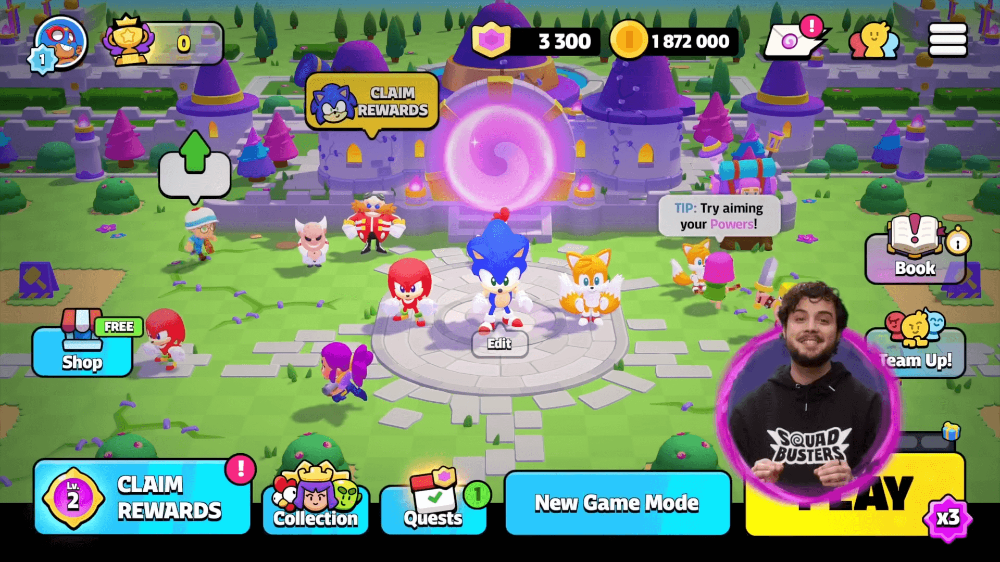
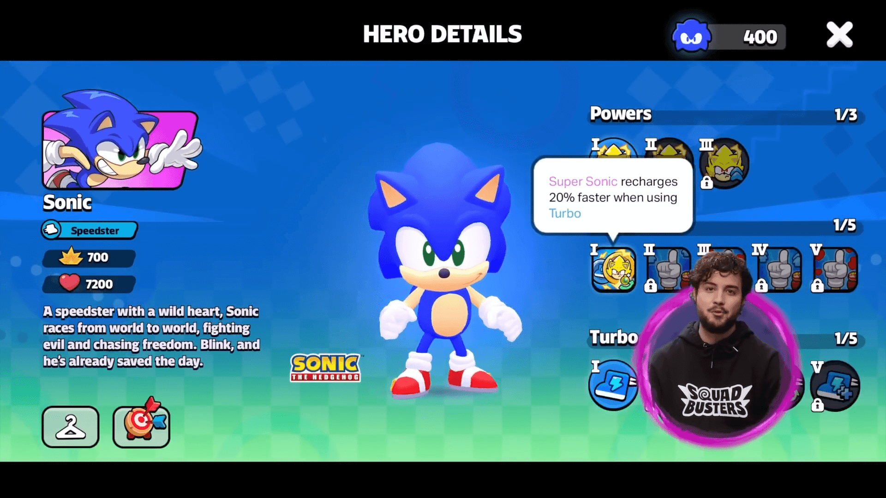
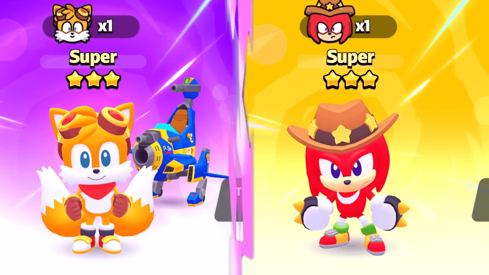
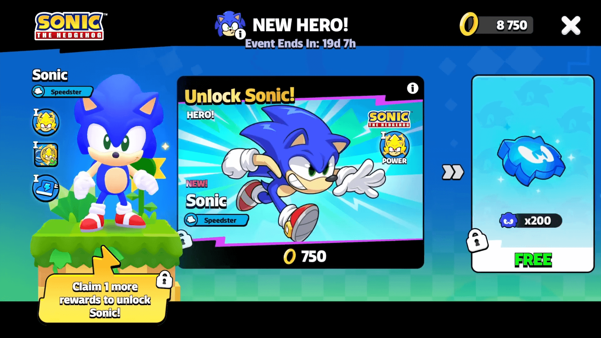
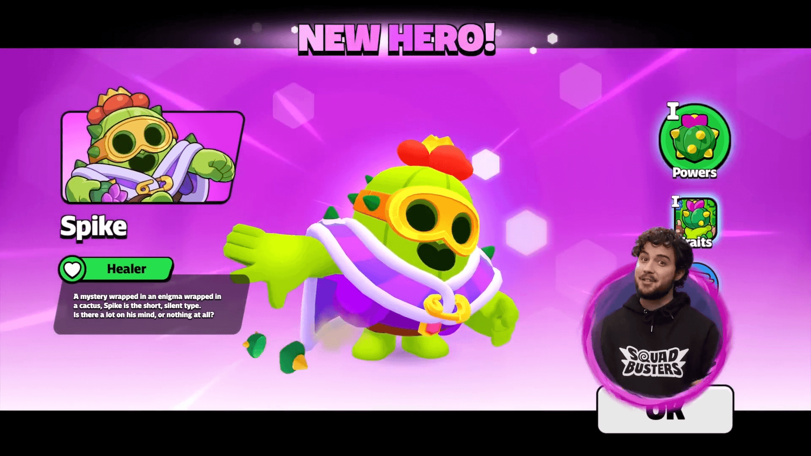
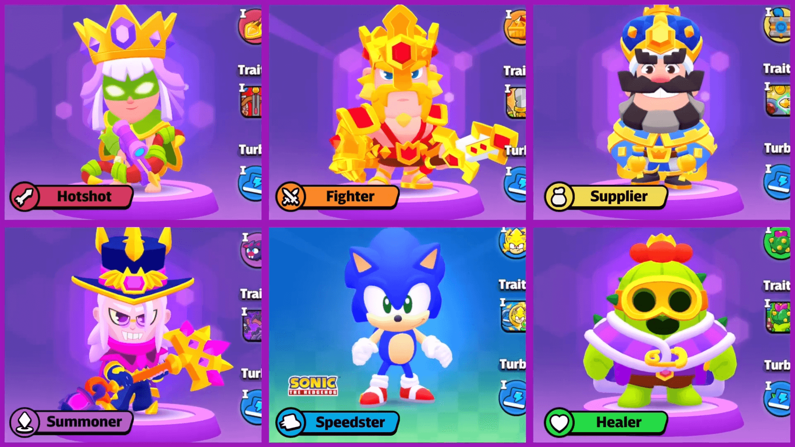

《爆裂小队》(Squad Busters)将于**6月17日**迎来重要内容更新。

本次更新聚焦经典游戏角色**索尼克**及其伙伴的加入，同步开启限时活动，并预告首位治疗英雄登场。

## 索尼克小队集结

**索尼克**作为全新**敏捷型英雄**加入阵容，其核心能力可变身为**超级索尼克**，获得短暂无敌状态。此形态下不仅提升全队移动速度，还能显著增强攻击速度。被动天赋在使用"疾速"时可加速超级形态充能，升级天赋后可为其他敏捷型队员提供生命值与攻击伤害加成。

索尼克的搭档**塔尔斯**以**召唤型队员**身份参战，操控标志性**旋风机甲**作战。其"旋风激光"能力可穿透敌人，被动天赋允许召唤机甲协同战斗。机甲被毁后，塔尔斯仍可继续作战并在短暂延迟后重新召唤。

力量型队员**纳克鲁斯**拥有掘地冲锋能力，地下期间免疫所有伤害，破土时造成范围伤害。天赋使挖掘时有几率发现战利品，觉醒至"高手"阶段将解锁强力"螺旋升龙拳"。

两位队员均有初级、经典、高手三个**觉醒等级**，能力随等级提升增强。

## 解锁方式

获取新角色的关键在于收集活动货币"**金环**"。更新当日开启为期**三周**的限时事件"**蛋头博士来袭**"：

- **金环获取途径**：通过常规对战、游戏商店及每日奖励任务收集
- **解锁索尼克**：推进活动进度，收集指定数量金环即可直接解锁
- **解锁伙伴角色**：获得索尼克后，金环可兑换"索尼克英雄积分"，在"索尼克的英雄征程"中解锁塔尔斯和纳克鲁斯
- **挑战蛋头博士**：事件中反派驾驶飞艇登场，需在其跳出飞艇后攻击。特别注意"死亡之蛋机器人"形态威胁大增，成功挑战可获得额外金环

## 首位治疗英雄斯派克

预告确认**斯派克 (Spike)** 将于**今年夏季**作为**首位治疗型英雄**上线，届时游戏将覆盖所有主要英雄类型。

官方表示斯派克将在夏天登场，并表示在临近上线时公布其技能设定、天赋树及解锁方式。

## 游戏优化与问题修复

本次更新包含多项体验改进：

- **功能回归**：玩家期待的广场缩放功能恢复使用
- **模式调整**："鸡仔快跑"模式平衡性更新，最后一轮将出现密集鸡仔群
- **英雄增强**：战斗天使角色获得"终极觉醒"能力
- **问题修复**：重点解决"弓箭女皇"偶发异常高额伤害问题

所有内容将于**6月17日**实装，详情请关注游戏内公告。
