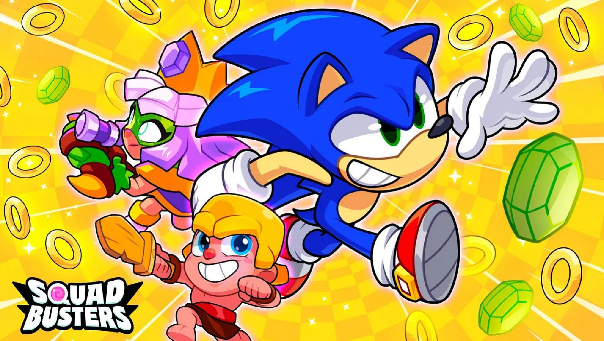
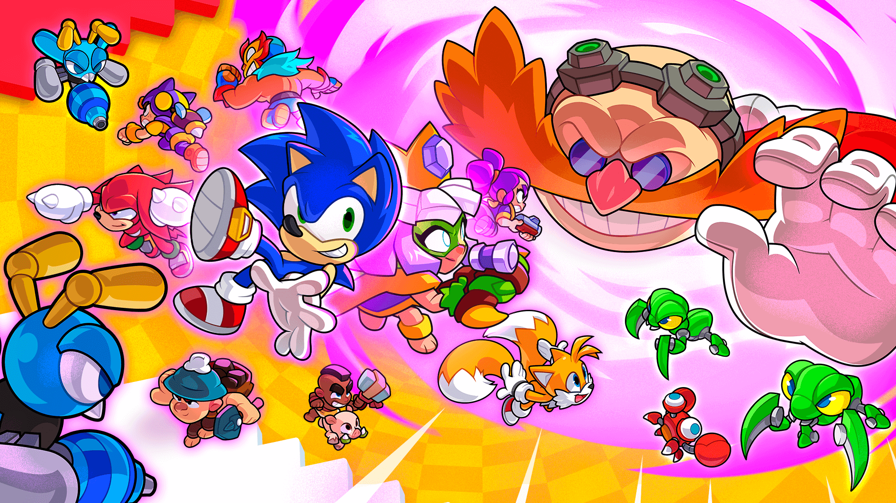
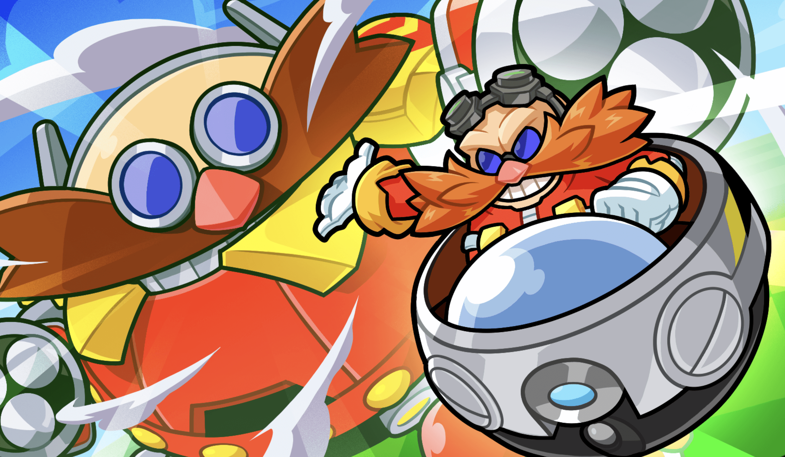
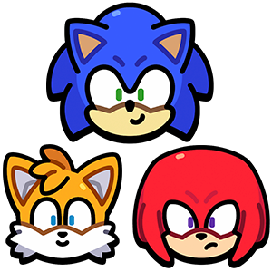

6 月 17 日，《爆裂小队》将正式联动《刺猬索尼克》。

这次活动不只是皮肤联动那么简单，索尼克、塔尔斯和纳克鲁斯三位角色全员参战，还带来了联动地图“碧绿丘陵”、Boss 飞艇事件，以及一套新的金环收集机制。

说实话，这波联动不管是情怀党还是纯粹图爽快的玩家，都会比较满意。

## 活动时间

- 开始：6 月 17 日 19:00
- 结束：7 月 7 日
- 整整三周的活动期，节奏适中

每天打两把，节奏基本跟得上。别错过，后期补进度还是挺累的。

## 联动玩法怎么打？

### 金环系统上线

游戏里现在可以捡金环了：

- 每一场战斗都有金环掉落，赢了会多给一点
- 每日首胜额外加成
- 拿到的金环可以用来兑换索尼克以及他的升级材料

不用氪也能拿，但得勤奋点，后期要解锁塔尔斯和纳克鲁斯也得靠这个。

### 英雄成长系统

索尼克解锁后，会自动开启专属成长线。投入金环升级，可以一步步解锁塔尔斯、纳克鲁斯。

如果你是比较佛系的玩家，那就慢慢打；想快点开全图，也可以考虑买礼包，里面有金环和材料直给。

### 飞艇 Boss 事件

活动期间，“蛋头博士”会不定时入侵地图：

- Boss 飞艇会干扰正常战斗
- 击破飞艇后能获得大量金环
- 周末掉率会更高，建议集火打掉

玩法节奏还挺刺激，注意别光顾着打人忘了清飞艇。

### 限时地图「碧绿丘陵」

对，就是索尼克老粉熟悉的那个“Green Hill”。这次游戏中也还原了：

- 弹簧机关、螺旋跑道全都有
- 加了一些索尼克系列的经典敌人
- 整体节奏偏快，不太适合站桩型打法

适合跑图快、手速快的玩家，视觉上也挺清爽的。

## 三位角色都能玩？

可以，但解锁顺序不一样：

### 索尼克：跑得快，还能控节奏

- 超高速移动，有短时间无敌状态
- 跑得越快，技能充得越快
- 带动全队节奏，很适合速推打法

适合那种“老子要飞起来”的玩家。

### 塔尔斯：放炮台，远程支援

- 会召唤一个小机器人打激光炮
- 掉了还能重建，续航挺强的
- 对团队攻速还有加成，算是个辅助型炮台哥

适合控场，或者喜欢摆阵型的玩家。

### 纳克鲁斯：偷袭、打断、翻后排

- 可以地底隐身穿越障碍
- 地面冲击带击飞和减防效果
- 技能升满后挺烦人的，一冲一片飞

适合灵活型玩家，玩得好能把对面后排打得心态爆炸。

## 奖励都有什么？

老实说还挺多的，稍微总结一下：

- 三位联动英雄（全解锁要靠成长系统）
- 限定皮肤、装扮、头像框、动作
- 金环、经验、装扮币、自选箱等杂项
- 还有一些特殊纪念物，活动后估计就绝版了

基本上只要活动期内认真上线，拿满问题不大。要是目标是“满星满装扮”，那就可能要打得稍微累一点点。

## 联动结束后还会返场吗？

角色可能会返场，但不是原样复刻：

- 金环和飞艇活动大概率不会留
- 角色可能出现在后续商店或者限时兑换池里
- 联动地图也会随活动关闭

说白了，现在体验是最完整的，后续就算有复刻，也可能是打折版。所以如果你是真喜欢，不如趁这波一次拿全。

## 总结一嘴

这次《爆裂小队》和索尼克的联动，不只是换个皮肤挂个名字，而是系统级别的整合。三位角色各有特色，地图机制也贴合原作，飞行 Boss 更是有点“整活”成分，玩起来节奏很爽。

如果你是老玩家，这波内容值得回来看看；如果你刚入坑，那就趁这波活动把资源拿一拿，起步会轻松很多。

赶紧上线吧。再晚点，金环都让别人捡完了。