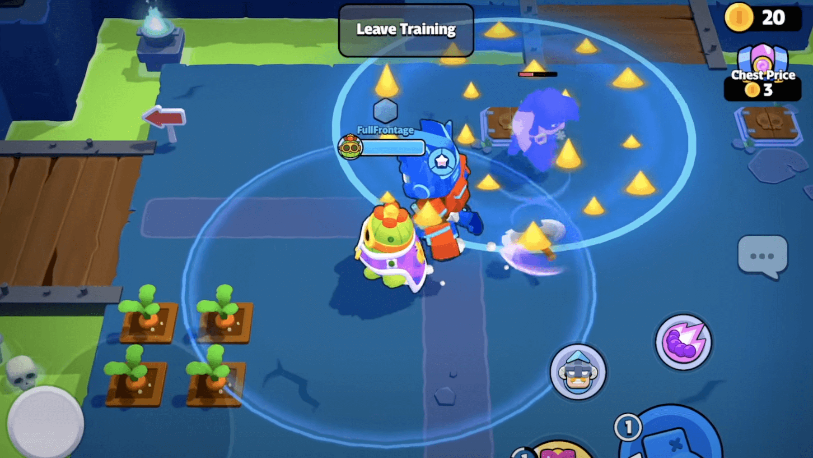
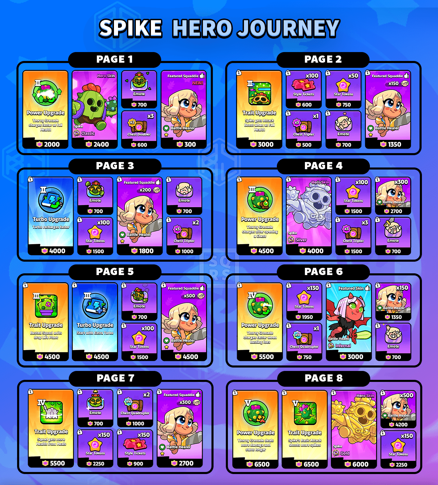

除了人气选手索尼克，本次更新我们也将迎来来自荒野乱斗的萌物——斯派克。

是的，新英雄 **斯派克** 即将正式加入《爆裂小队》，还带来了一大波平衡性调整。先不说谁喜谁悲，但这波动静，注定要在战场上掀起一阵绿意盎然的“荆棘风暴”。

## 斯派克正式加入英雄阵容

斯派克成为第六位可选英雄，同时也是目前唯一一位来自治疗师阵营的英雄。他不仅补齐了全阵营英雄的拼图，更用自己的方式告诉所有对手：“别看我小，我的刺儿比你想的还多。”

### 斯派克的作战方式

斯派克会向敌人方向扔出缓慢飞行的棘刺手榴弹，最多能堆叠两层。落地后震晕范围内敌人，散布尖刺造成持续伤害并减速。手榴弹之间可以叠加，效果翻倍。

保持满血状态下，他还能获得攻击速度加成与更快的手榴弹充能速度——这波啊，是续航流、猥琐流的老熟人。

### 斯派克英雄信息一览

- **类型**：治疗师  
- **射程**：远程（4,500）  
- **位置**：后卫  
- **IP 来源**：《荒野乱斗》

#### 基础数值

- **HP**：8,000  
- **每2秒回血**：5%  
- **每秒治疗量（HPS）**：230  

#### 伤害输出

- **单次伤害**：460  
- **命中时间**：1.2秒  
- **DPS**：383  

#### 能力

- **棘刺手榴弹**：震晕+范围持续伤害

#### 力量等级技能

- **力量 1**：投掷带刺手榴弹，覆盖一片带刺区域  
- **力量 2**：满血时，手榴弹充能加快 30%  
- **力量 3**：打开宝箱可补充1枚手榴弹  
- **力量 4**：击败单位为手榴弹充能 10%  
- **力量 5**：造成 20% 额外伤害，并延长眩晕时间  

#### 被动天赋

1. 治疗小队角色 +15% 生命值 / 攻速  
2. 满血时自身攻速 +35%  
3. 击杀敌人掉落治疗红心  
4. 小队整体治疗量 +15%，斯派克伤害 +15%  
5.斯派克基础攻击提升至峰值 8  

#### 涡轮系统

- **一级加速**：荆棘冲刺留影治疗+加速50%  
- **二级加速**：充能提速 +15%  
- **三级加速**：初始获得 1 点涡轮能量  

## 斯派克英雄征程上线！

沿用了其他四位英雄旅程的结构——从熟悉的路径打通全新战术理解，是时候把这个爆裂小仙人掌练起来了。

## 平衡性调整汇总

> 本次调整为开发版本预览数据，部分参数可能尚未最终确定。数据由社区自行提取与整理，实装可能会有变化。

### 英雄调整

#### 莫蒂斯

- 涡轮速度：100% ➜ 75%  
- 等级2蝙蝠伤害回血：50% ➜ 30%  
- 蝙蝠 DPS：200 ➜ 300  
- 蝙蝠 HP：600 ➜ 750  
- 冲锋蝙蝠数量：5 ➜ 3  
- 等级 4 最大蝙蝠数：7 ➜ 5  
- 默认蝙蝠上限：3（需等级 4解锁更多）

#### 弓箭女王

- 移动速度 +20%  
- 狙击伤害：1500 ➜ 1725  
- 狙击分裂射击伤害：900 ➜ 855  
- 基础攻击 DPS：840 ➜ 880  

#### 野蛮人之王

- 移动速度 +10%  
- HP：8300 ➜ 9100  
- 超级攻击伤害：500 ➜ 600  
- 超级拳击伤害：600 ➜ 630  

#### 皇家国王

- HP：6700 ➜ 6400  
- 皇家新兵 HP：3600 ➜ 3300  
- 精英新兵 HP：4800 ➜ 4500  

### 法术调整

- **箭雨（弓箭手）**：每次齐射伤害：400 ➜ 440  
- **愤怒的蜜蜂（比亚）**：伤害：155 ➜ 115  
- **炽烈之光（战斗天使）**：伤害：700 ➜ 600  
- **地雷陷阱（Bo）**：持续时间：12 ➜ 30 秒；昏迷效果新增；伤害：500 ➜ 650  
- **子弹风暴（柯尔特）**：每发伤害：200 ➜ 230；弹丸数量翻倍；击中减速 2 秒  
- **压制火力（重型机枪手）**：伤害：16 ➜ 20；弹数翻倍；射速翻倍  
- **冰冻（冰法师）**：持续时间：3.2 ➜ 4 秒；2级加成：40% ➜ 50%  
- **巨型炮塔（杰西）**：飞行速度翻倍；附带减速 25%；伤害：250 ➜ 330  
- **杀虫喷雾（梅维斯）**：眩晕频率提升；持续时间：3.5 ➜ 4.5  
- **速射能量球（麦克斯）**：冷却时间：6 ➜ 4 秒  
- **强力和弦（波克）**：伤害：225 ➜ 250  
- **散射激光（拉夫）**：跳出次数：2 ➜ 3；单发伤害：600 ➜ 550  
- **骷髅桶（女巫）**：储能次数：1 ➜ 2；骷髅 DPS：80 ➜ 90；生命值：1000 ➜ 1100  
- **火球术（法师）**：飞行时间 +20%；伤害：820 ➜ 660  

### 小队角色调整

- **坦克**：射击后退减少；更稳定跟随小队  
- **商人**：药水持续时间：5 ➜ 8 秒；取消伤害减免；移动加速：20% ➜ 35%  
- **法师**：DPS：135 ➜ 150  
- **弓箭手**：DPS：340 ➜ 400  
- **比亚**：盘旋蜜蜂伤害：144 ➜ 130  
- **战斗天使**：终极进化；HP：1500 ➜ 1700；进化后 +2100  
- **重型机枪手**：特质 HP 提升至 500/1000  
- **潘妮**：2级特质提供钥匙；金币增加；宝藏最低保底  
- **女巫**：精英骷髅 DPS 提升  
- **普利莫**：HP：2400 ➜ 3000；DPS：150 ➜ 200；自我治疗加强  
- **阿博**：特质伤害提升至 120% / 150%  
- **柯尔特（小马）**：DPS：260 ➜ 300  
- **梅维斯**：胡萝卜掉落金币+宝石提升；收集速度更快  
- **格雷格**：砍树收益提升，效率更快  

## 系统优化 & Bug 修复

- 解锁小队联赛所需角色从每种稀有度 5 ➜ 3  
- “厄运机制”启动条件缩短至50个宝箱  
- 小队已满时，征程道具会直接显示“已领取”  
- 修复部分操控和战斗相关卡顿、失效问题  
- 修复多个单位伤害异常和地形卡位问题  
- 修复女王秒杀全队、蜜蜂消失等特殊Bug  
- 删除旧版 Mortis 任务  
- 修正战斗天使技能描述错误  

官方表示斯派克将在夏天登场，其他并未透露更多。

Spike 的加入不仅是阵容上的补全，更意味着玩法思路的进一步演化。而本轮改动中不乏对老角色的“重塑”，也有对机制的“精修”。

*下一次出手，是荆棘风暴还是爆裂狂潮，就看你怎么打了。*
