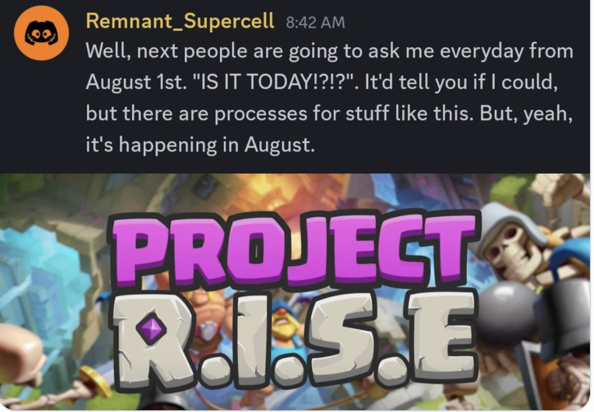
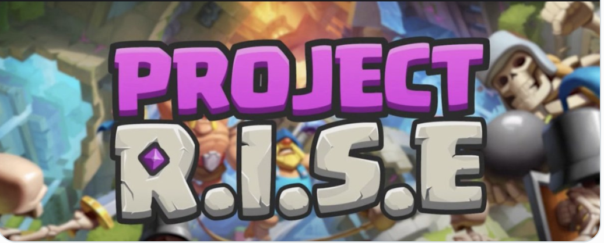
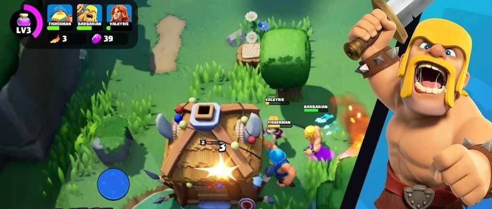
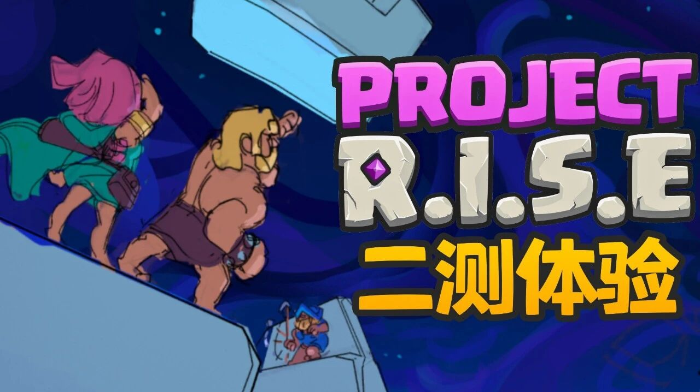
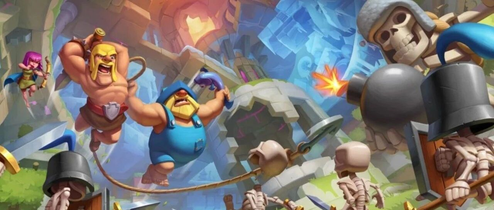
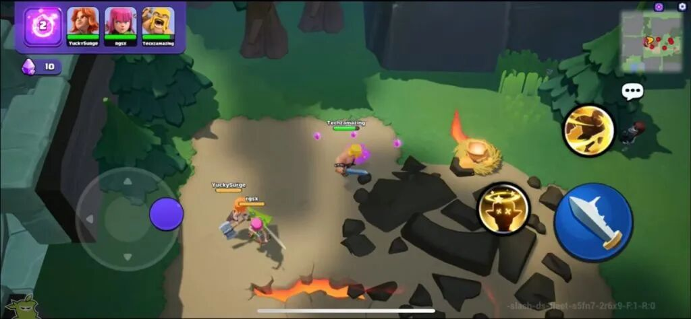
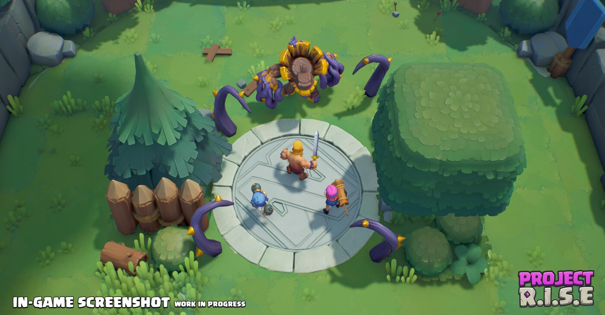
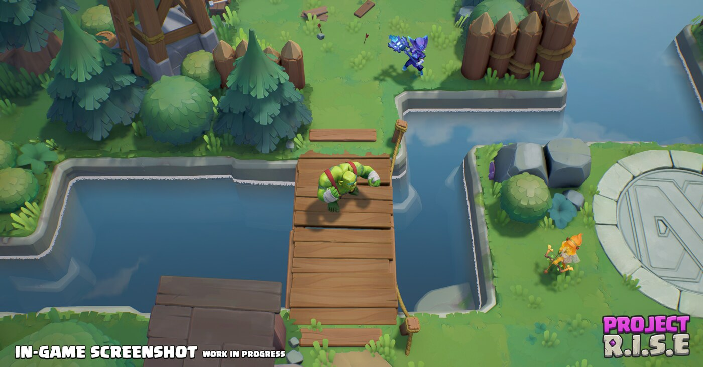
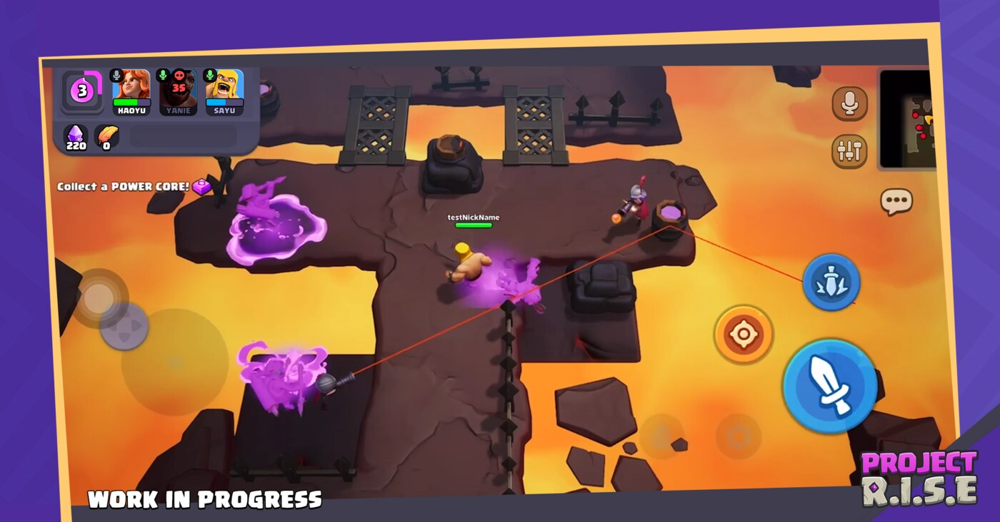
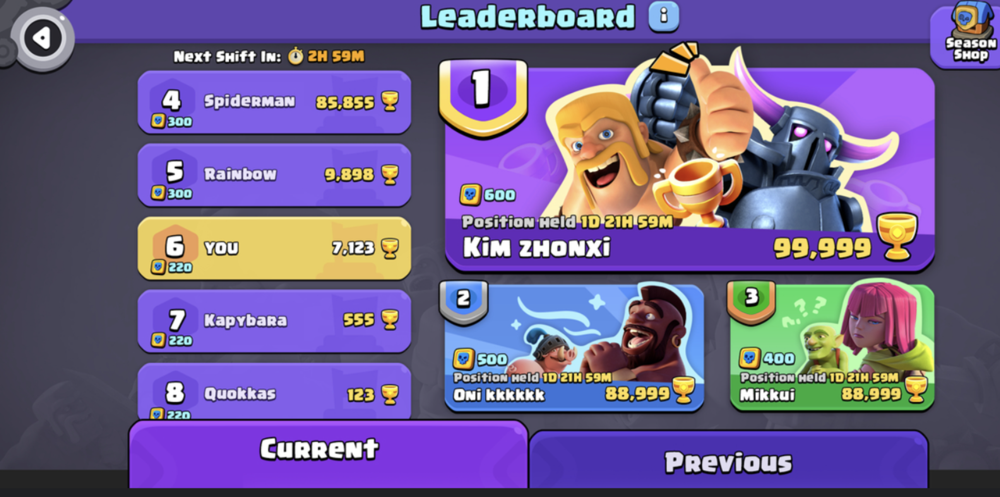

沉寂了很久之后，**Project R.I.S.E** 终于又有新消息了。

在 Project R.I.S.E 的 Discord 社区中，开发人员 Remnant_Supercell 回应玩家提问时表示：如果可以公布具体日期，他会说，但这类事情有对应流程；不过可以确认的是，测试会在 **8 月** 发生。

也就是说，Supercell 这款从 Clash Heroes 延续而来的合作动作新游，预计将在 **2026 年 8 月迎来一次 Beta 测试**。目前官方还没有公布具体日期、地区、平台和资格获取方式，但至少方向已经很明确：这一次，它真的要重新出塔了。

## 8 月 Beta 目前已知信息

先把目前能确认的内容放在最前面：

- Project R.I.S.E 团队成员已经在 Discord 中确认，测试会在 2026 年 8 月发生。
- 具体日期还没公布，官方仍需要走内部流程。
- 测试资格、测试地区、平台范围暂未公开。
- 结合去年开发者长文，这次 Beta 应该会基于重做后的高塔结构和英雄系统，而不是沿用去年取消前的旧版本。

所以这次消息就不是纯粹的猜测了，而是开发者明确给出的月份窗口。接下来需要等待的，就是资格怎么拿、哪些地区能进、安卓和 iOS 是否同步开放。

## Project R.I.S.E 是什么？

Project R.I.S.E 可以理解为 Clash Heroes 的重启版本。

当年 Supercell 曾经公布过 Clash Universe 计划，其中包括 Clash Quest、Clash Mini 和 Clash Heroes。后来这几款项目陆续经历了不同命运：Clash Quest 彻底停止开发，Clash Mini 被宣布整合进《皇室战争》，而 Clash Heroes 则在一段时间的沉寂后，以 **Project R.I.S.E** 的形式重新出现。

相比传统的 Clash 系列游戏，Project R.I.S.E 的定位更偏向多人合作动作冒险。玩家选择不同英雄，和队友一起进入高塔，一层层击败怪物、获取成长、挑战更高难度。

它的核心卖点并不是单局 PvP 对抗，而是：

- 和朋友一起组队爬塔
- 不同英雄拥有不同战斗方式
- 在单次挑战中不断获得强化
- 反复尝试更高难度、更好成绩

从早期测试来看，Project R.I.S.E 一直想做的，是一款更轻量、更适合移动端、更强调团队配合的 Supercell 版合作动作游戏。

## Project R.I.S.E 测试时间线

Project R.I.S.E 并不是第一次测试。过去几年内，它已经经历过多轮小范围测试，我也完整参加了它所有的3 次 Alpha测试。

目前可以整理出这样一条时间线：

| 时间 | 测试阶段 | 重点信息 |
|---|---|---|
| 2024 年 7 月初 | Pre-alpha / 首轮测试 | 验证基础框架，主要是选英雄、组队、爬塔、战斗循环 |
| 2024 年 11 月 | 第二次 Alpha | 继续测试合作爬塔体验，前两次测试主要面向 iOS 玩家 |
| 2025 年 1 月 17 日至 1 月 21 日 | 第三次 Alpha | 测试范围扩大，开始支持安卓设备 |
| 2025 年内开发者前瞻 | 大范围 Beta 计划 | 官方曾表示年内会有范围更大的 Beta，但最终没有如期推进 |
| 2026 年 8 月 | 新一轮 Beta | 开发者在 Discord 确认 8 月会有测试 |

## 前三次 Alpha 测试大概是什么情况？

我自己完整参加了之前的 3 次 Alpha 测试，所以对这款游戏的变化还是比较有体感的。

早期 Project R.I.S.E 的优点非常明显：美术风格、Clash 世界观角色、多人合作打怪，这些东西天然就有吸引力。尤其是第一次进入高塔，几个人一起清怪、捡强化、打 Boss 的时候，那种新鲜感还是有的。

但问题也同样明显。

### 首测：概念好玩，但内容还很粗

2024 年 7 月初的首轮测试，更像是在验证核心概念：这套“选英雄、组队、爬塔、升级、重开”的框架到底能不能成立。

答案是能成立。

但当时的完成度还比较早，英雄差异、关卡变化、成长选择都还不够丰富。游戏确实能让人玩进去，但玩久之后也会明显感觉到内容量不够，局内变化还撑不起长期反复刷，最搞笑的是，当时想和朋友一起冲层上排行榜来着，结果最后，他，竟然睡着了，睡着了！原因无他，刷的过程很机械很无聊。

### 二测：体验有进步，但仍然是早期框架

2024 年 11 月的第二次 Alpha，我当时也做过体验内容。相比首测，二测能看出游戏整体在进步，战斗反馈、多人配合、英雄体验都有更清晰的方向。

相关的体验报告可以参见：xxx

但它依然是非常早期的版本。说白了，当时的 Project R.I.S.E 已经有“游戏样子”，但还没完全解决 为什么要长期玩的问题。

后续测试中，团队开始尝试加入更多系统，让游戏不只是单纯爬塔。

比如大厅、营地、检查点、装备或局外成长等内容，都能看出开发团队想解决一个问题：多人合作游戏如果只靠随机匹配，很容易因为进度不一致而让玩家掉队。

这个方向本身是合理的，但实际体验中也带来了新的问题。系统变多之后，核心循环反而有点被拆散：你知道游戏想让你爬塔，但每次爬塔前后要处理的东西变多，节奏没有想象中顺。

### 三测：安卓加入，但内容深度仍是关键

2025 年 1 月的第三次 Alpha，是一个比较关键的节点。它从 1 月 17 日开始，到 1 月 21 日结束，并且相比前两次测试，开始支持安卓手机。

这一点很重要。因为前两次测试主要还是苹果设备玩家能参与，第三次支持安卓后，说明团队确实有扩大测试面、验证更多设备环境的意图。

到了第三次 Alpha，Project R.I.S.E 已经能看出比较完整的雏形：英雄、爬塔、强化、合作、排行榜、商店，这些模块都开始连起来。

不过，当时最核心的问题依然是长期玩什么。

单局爬塔有乐趣，但如果每次体验差异不够大，英雄成长不够深，组队和匹配又经常因为楼层差异把玩家拆开，那么游戏很容易陷入一个尴尬状态：第一次玩很惊喜，后面却不知道自己为什么要一直刷。

这也是为什么去年原本计划的 Beta 最终没有如期到来。

## 去年为什么没有 Beta？

根据开发团队最近在 Discord 发布的说明，去年原本计划的 Beta 被取消，并不是单纯因为“还差一点打磨”，而是因为团队认为当时的游戏在结构上还不够好。

开发人员的说法很直接：他们回头看 Beta 前的版本，觉得他的根本问题是结构上海不够好。

这其实和去年那套前瞻方向能对上。

当时开发团队曾经透露过一套更复杂的高塔与营地循环：高塔会不断变化，玩家通过寻路石临时保存进度；营地作为塔中的安全点和养成中心，可以升级熔炉、法术喷泉等功能；高塔还会按周期发生“转变”，重置路标、刷新环境和事件，并根据玩家爬到的高度进行结算。

从设想上看，这套系统很有野心。它试图把 Roguelike 随机性、合作爬塔、营地养成、周期结算和排行榜全都揉在一起。

但问题也在这里：系统越多，不代表体验越顺。

当时团队曾经设计大厅、营地、检查点等系统，目的其实是降低匹配压力，让玩家可以更自由地进入和退出高塔，也让一次爬塔可以被拆成更小段的体验。因为在 Alpha 测试里，只要玩家之间差一层，就可能匹配不到队友，这对合作游戏来说非常致命。

但这些系统最后没有真正解决问题，反而让核心循环变得割裂。

更糟糕的是，团队在尝试简化英雄成长、建立更快的英雄制作管线时，反而让前几次测试中已经打磨出的核心战斗体验倒退了。

简单说就是：

- 匹配和进度系统没有解决组队痛点
- 大厅、营地、检查点让爬塔节奏变得不连贯
- 英雄成长被简化后，角色本身的特色变弱
- 游戏看起来模块更多了，但核心循环反而更乱

所以 Supercell 最后选择取消 Beta，继续重做。

这个决定当然让玩家失望，尤其是后续沟通又长期沉默。但从现在公布的信息来看，他们过去这一年确实不是原地消失，而是在大幅调整底层结构。

## 这一年 Project R.I.S.E 改了什么？

这次开发团队重点提到的变化，主要集中在两个方面：**高塔结构** 和 **英雄套组**。

### 高塔不再是无限爬楼

过去 Project R.I.S.E 的高塔更像是一条很长、甚至有点无尽的爬升路线。这个设计听起来很有挑战感，但放到多人合作里会带来很多现实问题：一次玩多久不清楚，队友进度不一致，掉线或退出后很难衔接，高层失败后的挫败感也很强。

新版高塔会改成不同难度的“路线”。

比如：

- Brave：大约 5 层，偏短局
- Heroic：大约 15 层，更有挑战
- Legendary：更长、更硬核的挑战

玩家会先从 Brave 开始，完成后再逐步解锁更高难度。

这个变化其实很关键。它让玩家在开局前就知道自己要投入多少时间，也让整支队伍从一开始就绑定在同一个目标上。大家选了同一条路线，就一起打完整段，不会再因为楼层差异导致队友丢失。

无限塔并没有被彻底取消，但它会更像后期挑战，而不是新手和普通玩家一开始就要面对的核心模式。

### 英雄变得更深，但首发数量减少

另一个大改动是英雄系统。

开发团队承认，Alpha 阶段的英雄升级太静态了。你在开局前做好选择，进塔之后变化不够多。后来他们尝试把更多能力放到 Trinkets 和 Spells 这类局内装备上，但又发现这样会削弱英雄本身的灵魂。

现在新的方向是：每个英雄都有更完整的基础套组。

每个英雄会有：

- 轻攻击
- 重攻击，通过轻攻击充能
- 英雄技能
- 局内根据楼层类型解锁的关键强化

真正重要的是，局内升级不再只是加一点数值，而是会改变英雄玩法。

比如弓箭手可能在使用技能后获得强化轻攻击，打出追踪箭雨；女武神可能在旋风斩后把斧头砸进地面击倒敌人；野蛮人则可能召唤其他野蛮人一起冲锋。

这样一来，每次爬塔的构筑路线会更清晰，英雄的成长也更有存在感。

代价是，Beta 初期可玩英雄会比原计划少。开发团队目前提到的 Beta 可玩英雄包括：

- 野蛮人
- 弓箭手
- 女武神
- 烟花炮手
- 炸弹兵
- 哥布林硬汉

而之前测试中出现过的伯爵夫人、渔夫，以及已经公布过的皮卡超人、战争机器、野猪骑士、刺客、猎人等英雄仍在开发中。

这点其实也挺 Supercell：宁愿少一点，也不想把半成品英雄硬塞进测试里。只不过对于老玩家来说，少了伯爵夫人和渔夫，多少还是有点遗憾。

## 还有哪些内容会保留？

开发团队也确认，一些此前已经出现或规划过的内容仍然会保留。

包括：

- 排行榜
- 赛季商店
- 游戏内货币兑换内容
- 可解锁英雄皮肤
- 语音聊天

其中语音聊天不是简单一句“会有”而已。开发团队在 2025 年 10 月的公告中专门解释过，Beta 会加入语音聊天，玩家可以在大厅和楼层中使用语音。

另外，团队也提到他们在瞄准和操作手感上做了不少工作，希望即使在网络条件不太理想的情况下，也能让控制更顺、更紧、更稳定。

这对 Project R.I.S.E 来说很重要。因为它不是纯数值游戏，移动、走位、攻击方向、技能释放都直接影响体验。如果操作手感不稳定，多人合作再热闹也很难长期留下玩家。

## 这次 Beta 值得期待吗？

我的看法是：值得期待，但也不用无脑乐观。

值得期待的地方在于，Project R.I.S.E 的底子一直不差。Clash 世界观、合作动作、英雄成长、爬塔构筑，这几个关键词单看似乎都很有潜力，但揉到一起却不是那么回事。前三次 Alpha 里，抛开其他的问题，单从乐趣上来说，这款游戏还是缺失的。

而且风险也很现实。

Supercell 这些年被砍掉的项目太多了，Project R.I.S.E 这种还没正式上线就要经历过大幅重做的游戏，本身就处在一个很敏感的位置。它需要证明的不只是“能玩”，而是要证明自己有足够长线的内容深度，有清晰的留存目标，也能在移动端多人合作这条路上站稳。

去年 Beta 没来，说明团队自己也知道旧版本撑不住。那么 2026 年 8 月这次 Beta，基本就会成为 Project R.I.S.E 新方向的一次大考。

如果新的高塔结构真的能解决组队和节奏问题，新的英雄套组又能撑起局内构筑深度，那 R.I.S.E 可能会重新成为 Supercell 最值得关注的新项目之一。

如果还是只停留在“第一眼好玩”，但后续循环不够扎实，那它的前景依然会很危险。

## 接下来怎么获取测试资格？

截至目前，官方还没有公布 2026 年 8 月 Beta 的具体日期，也没有公布资格发放方式。

参考 Supercell 近几年的测试习惯，后续可能会通过以下几种方式放出信息：

- Project R.I.S.E 官方 Discord
- 官方社媒和开发者公告
- 小范围地区测试
- 创作者渠道或社区活动资格
- 游戏官网或预约页面

我会继续关注这次测试。如果后续公布具体时间、测试地区、下载安装方式、资格获取方法，或者出现新的开发者说明，我也会第一时间整理。

想第一时间知道 Project R.I.S.E 8 月 Beta 怎么参加，记得持续关注我有。

高塔见～
