等了这么久，**Project R.I.S.E 的 Beta 测试终于定档了**。

官方今天在 Discord 公布消息：这次 Beta 将从 **2026 年 8 月 19 日 7:00 UTC** 开始，一直持续到 **2026 年 9 月 2 日 7:00 UTC**。

换算成北京时间，就是 **8 月 19 日 15:00 开始，9 月 2 日 15:00 结束**。

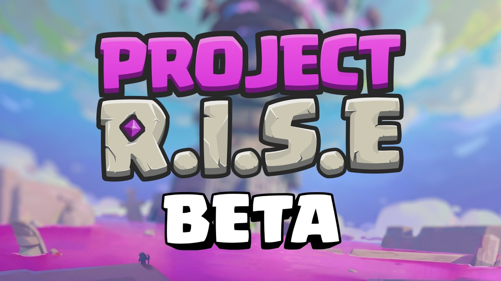

这也是 Project R.I.S.E 到目前为止时间最长的一次测试。前三次 Alpha 测试本人也都是全程参与，基本都持续 2,3 天，相关的测试体验大家也可以搜索一下往期文章。

## 这次 Beta 测试怎么参加？

官方报名入口已经开放：

[Project R.I.S.E Beta 报名页面](https://supr.cl/projectrisebeta)

这里有两个细节需要注意。

第一，**即使你参加过之前的 Alpha 测试，也需要重新报名 Beta**。之前的 Alpha 资格不等于这次 Beta 资格。

第二，如果你已经通过邮件链接或官方页面填过这次 Beta 的报名表，就不要重复提交。官方在 Discord 里也专门提醒了这一点。

如果被选中，玩家会在测试开始后的 12 小时内收到邀请。iOS 玩家会收到 TestFlight 邀请，Android 玩家则会通过 Google Play 下载测试版本。

## 平台和设备要求

这次测试同时支持 iOS 和 Android。

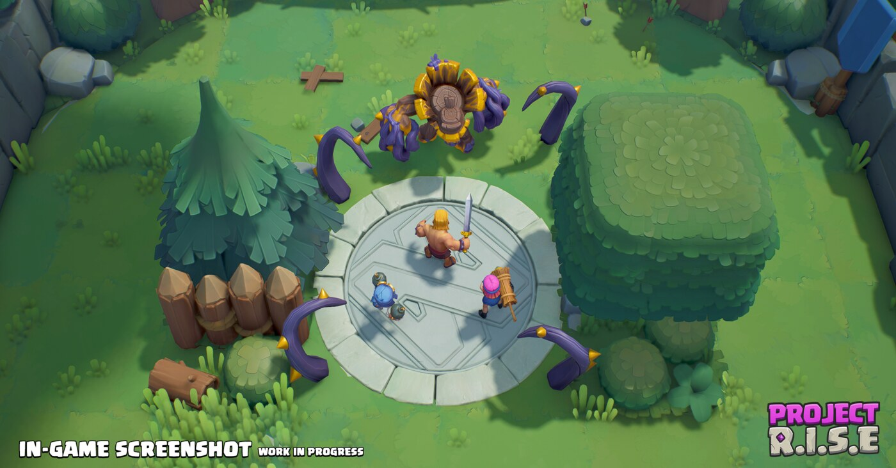

目前官方给出的设备要求如下：

| 平台 | 最低要求 | 推荐配置 |
|---|---|---|
| iOS | iOS 17 或更高；iPhone XS 或更新机型 | iPhone 11 或更新机型 |
| Android | Android 11 或更高；至少 4GB RAM | 官方暂未单独公布推荐配置 |

这个门槛不算特别低，尤其是 iOS 需要 iOS 17，Android 也至少要 4GB 内存。Project R.I.S.E 是多人合作动作游戏，画面里角色、怪物、技能和场景都比较密集，设备要求高一点也不意外。

但这也意味着，老设备玩家这次可能会被挡在门外。

## 官方创作者的提前爆料

除了官方公告，官方创作者也在 X 以及油管爆料了不少实战体验内容。

### 剧透一：Beta 测试有 6 名英雄

这次 Beta 测试一共有 6 名英雄。

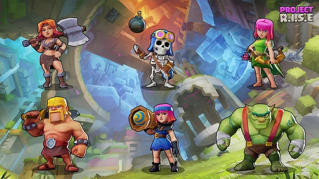

从图里可以看到，这 6 名英雄分别是：

- 弓箭手
- 野蛮人
- 女武神
- 烟花炮手
- 炸弹兵
- 哥布林硬汉

这个阵容和之前开发团队透露的方向基本一致。Project R.I.S.E 这次没有把早期测试里出现过的所有角色都塞回来，而是先拿一组比较明确的英雄做 Beta。

在 Alpha 测试中出现过的女伯爵、渔夫并未进入本次 beta 测试。

有趣的是，昨天 Project Rise 的官方账号更换了头像以及游戏的 logo。右侧的小图就是新的 logo，里能看到炸弹兵、弓箭手和野蛮人，应该是这次 Beta 宣传里用来突出首发英雄阵容的图。

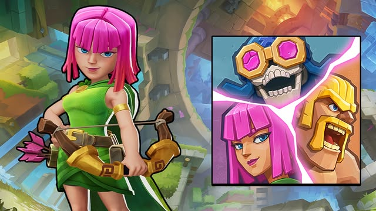

弓箭手在这张图里的造型比 Clash 系列传统印象更偏动作游戏角色。她不是站在卡牌图里摆姿势，而是拿着弓、背着箭袋，整个人更像可以直接进关卡操作的角色。

这也是 R.I.S.E 和《皇室战争》《部落冲突》最大的区别之一。它不是把 Clash 角色搬到另一个策略玩法里，而是让这些角色真正变成你自己操作的人物。

### 剧透二：皮肤系统

这次相比 Alpha 测试，非常引人注目的就是引入了皮肤系统。

当前版本中， 每个英雄都有三款额外的皮肤 ，随着游戏进程的推进，你可以收集更多装饰品。

有些奖励与游戏进度里程碑挂钩，而另一些奖励则可以通过游戏进度系统的不同部分获得。 

说实话，其中一些看起来确实很不错。

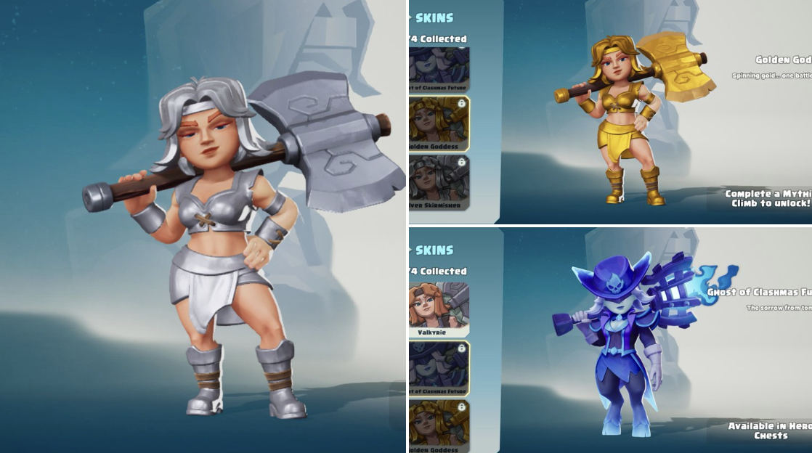

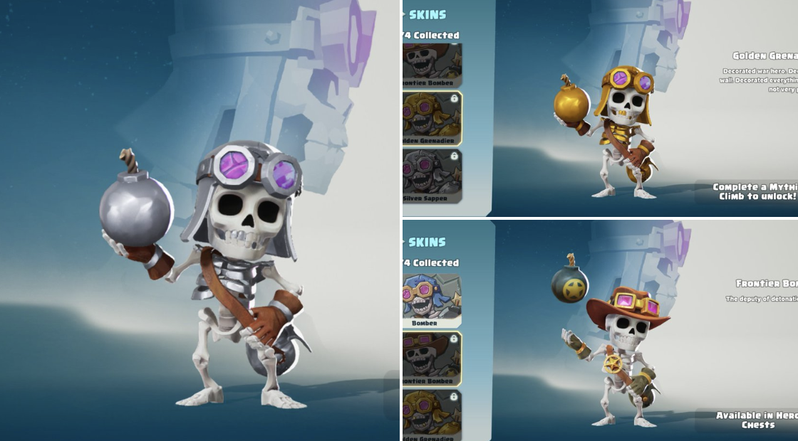

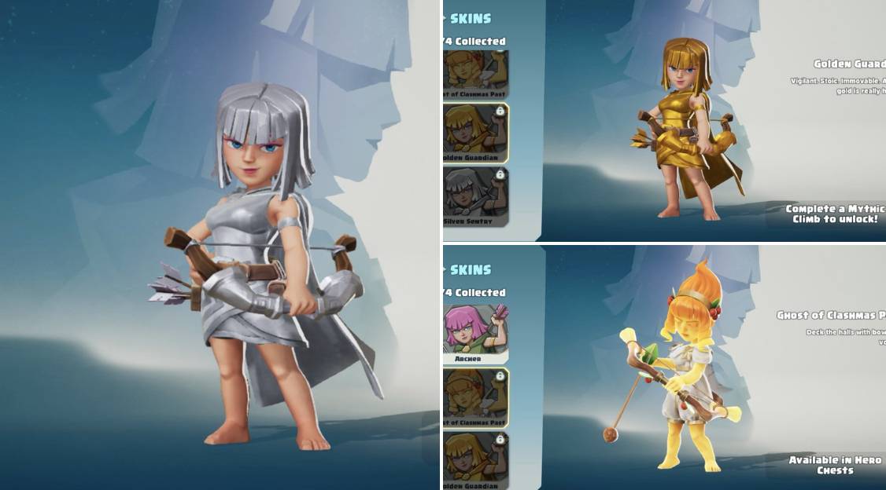

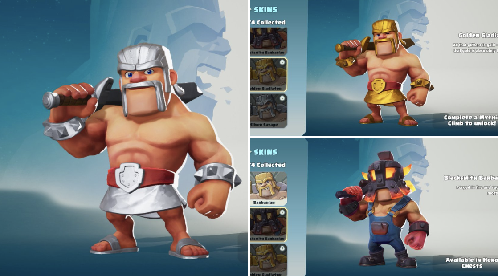

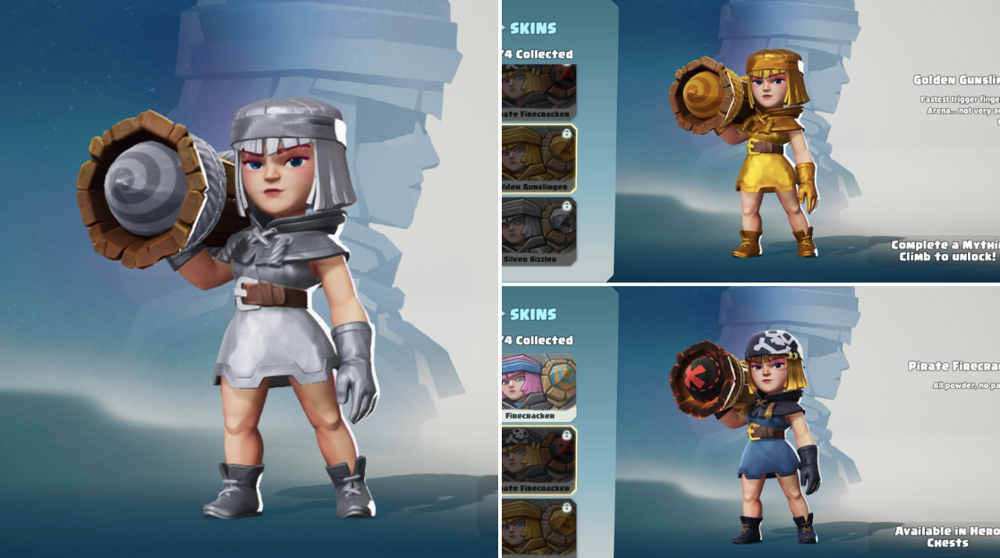

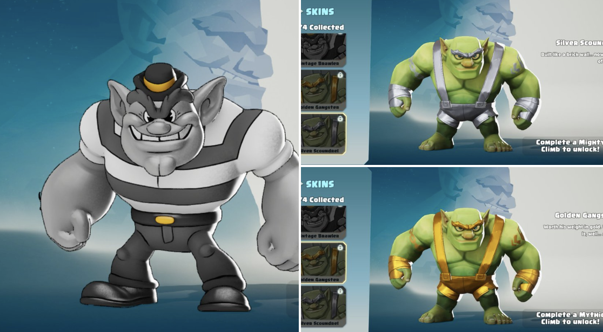

这说明 Project R.I.S.E 的外观系统已经在谋划中了。

当然，现在还不能急着把它理解成最终商业化。Beta 阶段出现皮肤和宝箱，更像是在测试角色外观、收集路径和奖励展示。真正的付费方式、掉率、保底和赛季获取，现在来谈还是太早了。

题外话，这些皮肤看着确实不错啊，更重要的是，都是动态效果，以后有没有机会引入到皇室战争中呢？

### 剧透三：试炼和宝箱

这是新版主界面的一部分。

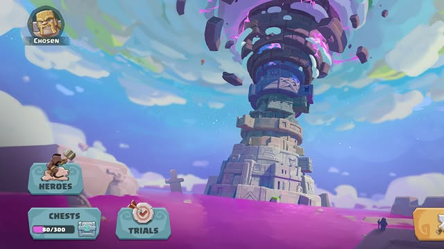

画面中央是高塔，左侧有几个入口：

- Heroes，英雄
- Chests，宝箱
- Trials，试炼

宝箱按钮下面还有一个进度条，显示 80/300。这个数字看起来像是宝箱积分、进度或某种开启条件。具体是什么，现在还不能确定。

试炼的按钮放在主界面非常显眼的位置，这点值得注意。

之前 Alpha 最容易遇到的问题是，玩家打几局之后会问：我接下来到底要干什么？继续爬塔？刷资源？练英雄？冲排行榜？如果目标太散，合作游戏很容易变成“玩是好玩，但不知道为什么要一直玩”。

试炼可能就是用来解决这个问题的。

它也许会是阶段挑战，也许是教学任务，也可能是类似每日/每周目标的玩法。名字本身还不够说明问题，但它被放在主界面一级入口，就说明团队想让它成为 Beta 的重要部分。

### 剧透四：实战画面更像动作游戏了

接下来是战斗截图。

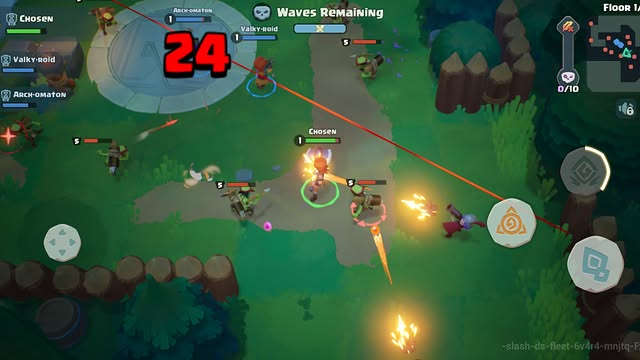

这张图能看到的信息很多。

左侧是三名玩家的队伍列表，分别能看到三位玩家的名字。画面上方写着 Waves Remaining，说明当前房间可能是波次战斗。右上角有小地图和 Floor 10，说明这局已经打到第 10 层。

操作层面也很清楚。左下角是移动摇杆，右下角是技能按钮。玩家正在操控角色边走位边攻击，敌人从不同方向围上来，场上还有投射物、范围提示和伤害数字。

这张图基本能解释为什么有些创作者会说它有点像荒野乱斗和 mo.co。

它像荒野乱斗的地方，是移动端双摇杆、走位、普攻、技能释放这些即时操作。它像 mo.co 的地方，是多人刷怪、房间推进、怪物波次和装备/成长感。

但 R.I.S.E 长线到底该怎么运营？这不仅很多创作者，包括我在内，也有这个疑问。

从剧透来看，Project RISE 相比我去年玩的 Alpha 版本有了很大的改进——用户界面看起来更好了，美术设计也更加精致，而且游戏进程的结构也明显更加清晰了。

但我仍然对目前剧透出来的实际的游戏玩法不太满意。

Project RISE 采用了 Clash 宇宙中的英雄，这目前是这款游戏最大的卖点之一。但就游戏机制而言，我最担心的还是游戏的核心玩法。游戏的大部分内容都围绕着攀爬展开 ，玩家需要逐层向上攀爬，与敌人战斗，并逐渐面对更艰难的挑战。

它们让我想起了什么？没错，moco 中的裂谷。

虽然一开始很有趣，但是很快就变得重复乏味了。

这或许是我对 RISE 项目最大的疑问：到底是什么让我想要连续几个月甚至几年都玩这款游戏？

当然，这仍然是测试版，所以应该还有很大的改进空间。

### 剧透五：语音聊天

这一点很有意思。

Supercell 以前的游戏里，队友沟通基本靠表情、快捷语、战队聊天，真正把语音放进游戏内并不常见。Project R.I.S.E 是合作动作游戏，技能释放、走位、集火、救场都比传统 Clash 游戏更吃即时配合。语音如果做得好，体验会完全不一样。

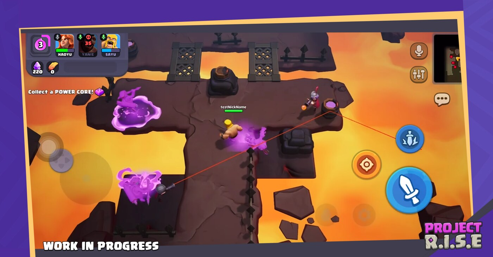

结合官方 Discord 公告来看，这次语音聊天确实会进 Beta，但不会全球开放。Beta 期间只有美国、加拿大、英国和爱尔兰能用，因为官方还在处理语音审核和安全问题。

这个限制有点遗憾，但也能理解。R.I.S.E 是 Supercell 第一次把内置语音放到这种多人合作游戏里，先小范围试水很正常。

## Project Rise 会有前景么？

其实不少创作者包括我自己都有这个疑问。

Beta 版本相比 Alpha 确实进步了，变化也不少。但是现在的 Project R.I.S.E 有点像荒野乱斗和 mo.co 的混合，接下来要看它能不能做出真正属于自己的特色。

因为 Project R.I.S.E 最尴尬的地方就在这里。它的操作会让人想到荒野乱斗，多人刷怪和装备成长又会让人想到 mo.co。缝合其实不是问题，这些都是 Supercell 自己旗下的游戏，互相借鉴和参考也很正常。但是真正的问题是，玩家玩了几天之后，会不会觉得“我为什么不直接去玩荒野或 mo.co”。

所以 Project Rise 的定位到底是什么？

是一个更轻量的合作动作游戏？

是部落世界观下的爬塔肉鸽？

还是一个看起来很热闹，但特色还不够清楚的测试版本？

8 月 19 日之后，答案应该会更明显。如果它的核心定位清晰，玩家也买账，那它可能会成为 Supercell 接下来最值得关注的新游；反过来，如果还是只停留在“看起来很热闹”，但几天之后就不知道刷什么，那压力依然很大。

## 最后整理一下关键信息

本次 Project R.I.S.E Beta 的重点信息如下：

| 项目 | 信息 |
|---|---|
| 测试时间 | 2026 年 8 月 19 日 7:00 UTC 至 9 月 2 日 7:00 UTC |
| 北京时间 | 2026 年 8 月 19 日 15:00 至 9 月 2 日 15:00 |
| 报名入口 | [supr.cl/projectrisebeta](https://supr.cl/projectrisebeta) |
| 平台 | iOS / Android |
| iOS 要求 | iOS 17 或更高；iPhone XS 或更新机型 |
| Android 要求 | Android 11 或更高；至少 4GB RAM |
| 邀请发放 | 被选中后，会在测试开始 12 小时内收到 TestFlight 或 Google Play 邀请 |
| 语音聊天 | Beta 期间仅限美国、加拿大、英国、爱尔兰 |

如果你对 Project R.I.S.E 感兴趣，现在可以先去报名。后续如果官方公布测试地区、资格发放细节、进度保留规则，或者创作者继续放出更多 Beta 画面，我也会继续整理。

高塔这次，是真的要开门了。

## 参考来源

- [Project R.I.S.E 官方 Beta 报名页面](https://supr.cl/projectrisebeta)
- [Project R.I.S.E Beta 官方视频](https://www.youtube.com/watch?v=caEjXdFkcvg)

