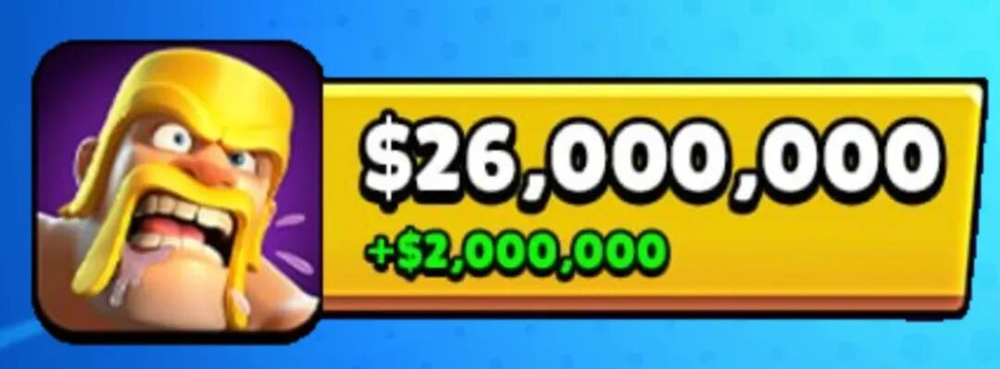
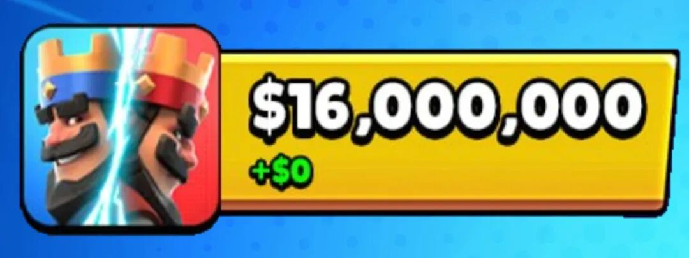
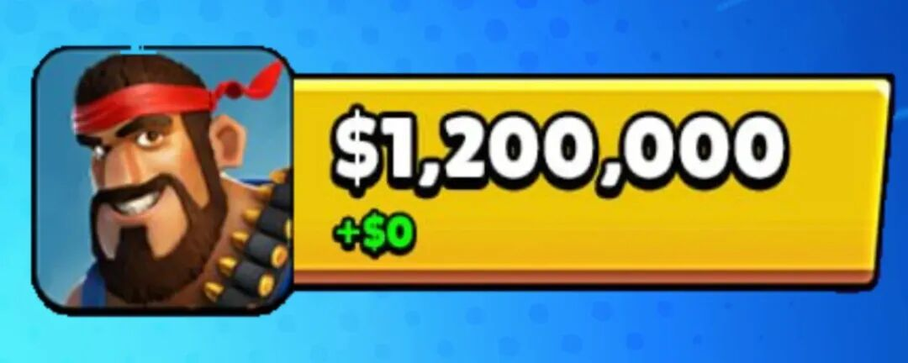
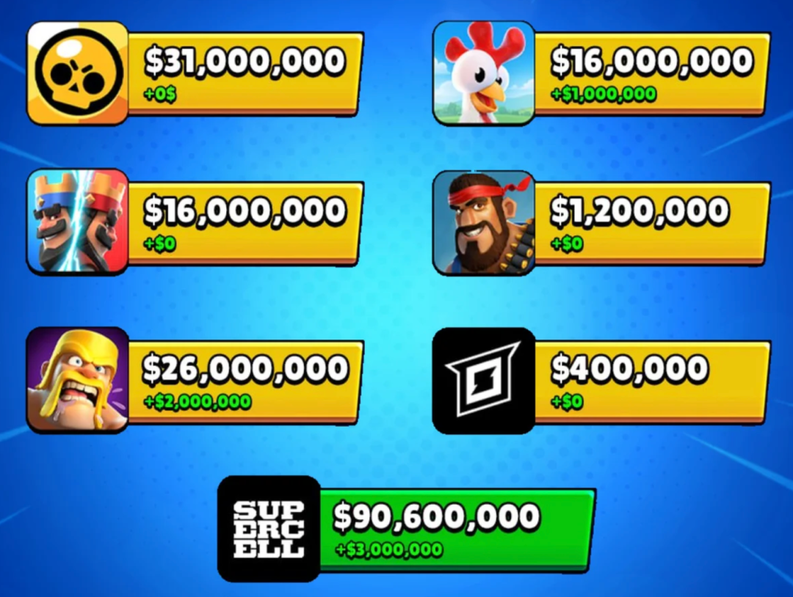

超级细胞旗下游戏在 8 月带来了 **9060 万美元**收入。

相比 7 月，总收入增加了 **300 万美元**。这部分增长几乎全部来自 **部落冲突** 和 **卡通农场**。

下面来看每款游戏的具体表现。

## 荒野乱斗

荒野乱斗依然是超级细胞目前收入最高的游戏。

8 月，荒野乱斗收入约 **3100 万美元**，和 7 月基本持平。虽然没有继续增长，但它仍然明显领先超级细胞其他项目，并贡献了公司移动端收入的三分之一以上。现在荒野乱斗仍然是 超级细胞旗下最赚钱的游戏，收入比第二名部落冲突多 500 万美元，也明显压过皇室战争和卡通农场。

过去两年荒野乱斗的商业化节奏一直很猛，新英雄、新皮肤、活动、联动、通行证，基本每个月都有东西可卖。8 月没有继续往上冲，可能说明短期热度进入稳定区间。对超级细胞来说，这仍然是当前最稳的现金牛。

## 部落冲突

8 月增长最明显的是部落冲突。

部落冲突当月收入约 **2600 万美元**，比 7 月增加了 **200 万美元**。它和荒野乱斗之间的差距也缩小到了 **500 万美元**。

这也是 8 月所有超级细胞游戏里最明显的增长。更关键的是，部落冲突和荒野乱斗的差距被拉到 500 万美元。放在以前，部落冲突一直是超级细胞的老大哥，现在虽然第一名换成荒野乱斗，但它的基本盘还在。

## 皇室战争

皇室战争 8 月收入约 **1600 万美元**，和 7 月相比没有变化。

在 2026 年初经历过一段明显下滑之后，皇室战争目前暂时稳定在这个收入水平附近。

这个结果对皇室战争来说有点微妙。好消息是，它没有继续下滑。坏消息是，8 月 K.H.A.O.S 赛季有精英狂战士、精英女武神、觉醒野蛮人精锐，还有一整套混沌玩法和赛季内容，收入最后还是停在 1600 万美元。

当然，这里仍然要考虑 Supercell Store。皇室战争现在很多玩家会通过商店买礼包，单看移动端收入，可能会低估实际流水。但趋势上看，它暂时还没有回到以前那种明显上升的状态。

最近，团队确实在修平衡、处理平局交易、重新做赛季内容，也开始更频繁地解释自己的想法。但收入端要真正回暖，光靠一两张新精英、一两个活动还不够。玩家愿意回来玩是一回事，愿意持续花钱又是另一回事。

## 卡通农场

卡通农场 8 月收入约 **1600 万美元**，比 7 月增加了 **100 万美元**。

这也让它在 8 月追平了皇室战争。放在超级细胞旗下游戏里，卡通农场一直算是比较稳定的项目，最近几个月基本都维持在 1500 万到 1600 万美元附近。

## 海岛奇兵

海岛奇兵 8 月收入约 **120 万美元**，和 7 月相比没有变化。

作为超级细胞目前仍在运营的老游戏之一，这个收入不算高，但整体比较稳定，8 月没有明显增长，也没有明显下滑。作为超级细胞仍在运营的老游戏，海岛奇兵现在更像是维持基本盘。它很难再回到主力位置，但只要成本可控，继续服务老玩家也有意义。

## mo.co

mo.co 8 月收入约 **40 万美元**，和 7 月持平。

这个数字就比较尴尬了。mo.co 重新上线之后，收入比早期月份好一些，但它仍然是超级细胞现有项目里最小的一个。收入体量之外，玩家长期留下来的理由也偏弱。赛季一开，大家刷一阵，新武器拿完，后面就直接 AFK 了。

如果 mo.co 后续不能把装备掉落、长期养成、副本目标、职业区分这些东西补起来，个人觉得它前途堪忧，距离香槟不远亦。

## 总结

Supercell 旗下游戏 8 月总收入约 **9060 万美元**，比 7 月多了 **300 万美元**。

需要注意的是，这组数据不包含 **Supercell Store** 的收入，所以超级细胞实际月收入会更高。

荒野乱斗是当前第一主力。部落冲突还是老牌支柱。皇室战争和卡通农场在第二梯队里，一个靠竞技和版本内容，一个靠长期经营和老玩家。海岛奇兵维持老用户，mo.co 还在找自己的长期玩法。

所以这 9060 万美元里，总数涨了 300 万美元。8 月往上走的是部落冲突和卡通农场，荒野乱斗守住高位，皇室战争还在等更明确的反弹，mo.co 暂时没有证明自己。

游戏好不好玩，玩家当然最有发言权。但一款游戏能不能继续被重视，收入永远是绕不开的东西。
