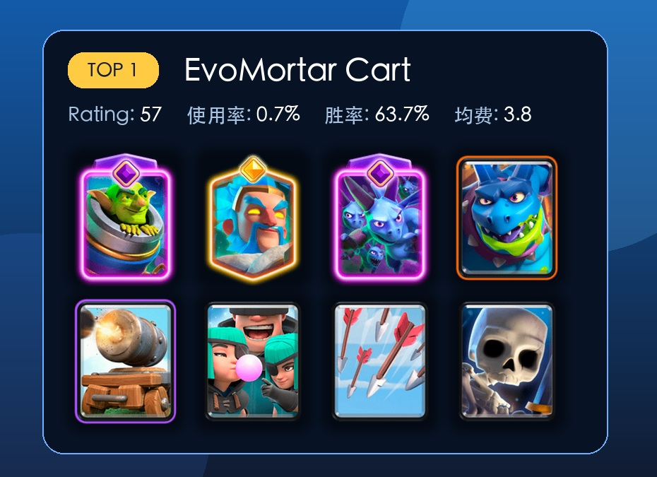
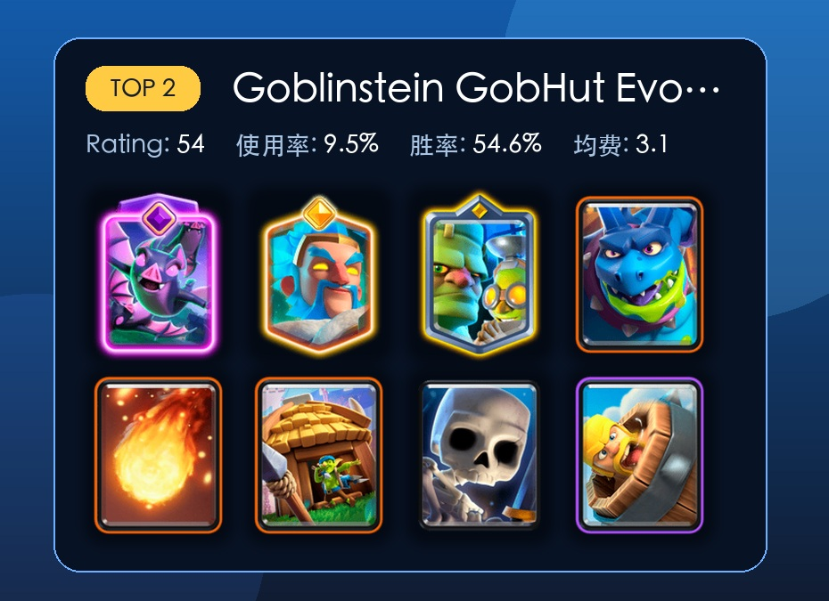
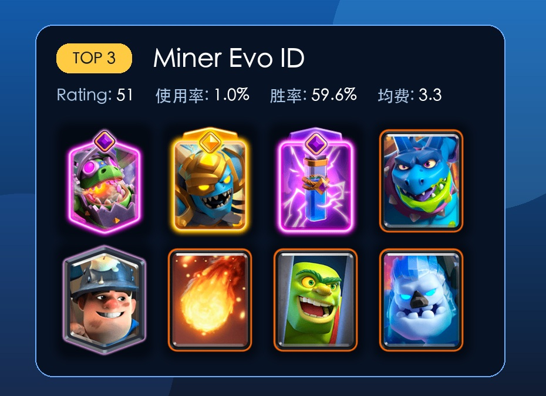

# 亡灵巨人卡组怎么选？7 天前十里，这几套最值得先试

亡灵巨人上线之后，最尴尬的一点其实很明显。

这张卡看起来像空中肉盾，费用又只有 4 费，第一眼很容易让人往小天狗、气球辅助、空军一波流那边想。但真打起来会发现，它最舒服的节奏往往没有那么重。

它只打建筑，有远程伤害，血量比气球还高一点。对手如果没有建筑，亡灵巨人摸塔会很疼；对手有建筑，它又很容易被拉走。所以这张卡现在更像一个低费飞行进攻点，适合不停给压力，逼对手交防守，再用别的牌补伤害。

我这次看的口径是 RoyaleAPI 最近 7 天、终极冠军分段、按 Rating 排序、卡组里必须包含亡灵巨人。这个口径有两个地方要注意。

第一，排名看的是 Rating，不单看使用率。第二，小样本胜率会很亮眼，但不能直接当成环境答案。比如第一套只有 135 场，胜率很高，但稳定性肯定不如第二套、第五套、第八套这种上千场或接近上千场的卡组。

所以这篇会按前十排名往下看，也顺便聊一下每套适合什么人。

## 1 亡灵巨人迫击炮车

这套是前十里 Rating 最高的一套，胜率 63.7%，不过样本只有 135 场。

卡组是觉醒迫击炮、精英冰法、觉醒亡灵大军、亡灵巨人、加农炮战车、绿林团伙、万箭齐发、骷髅兵。

这套最有意思的地方是双核心。迫击炮在地面架炮，亡灵巨人在空中逼建筑，对手只要建筑交得不舒服，很容易被其中一边蹭到。精英冰法和加农炮战车负责把防守节奏拖住，觉醒亡灵大军则提供一波很强的反打能力。

问题也很直接。它没有大法术，解后排和收残血建筑主要靠节奏。如果你不熟迫击炮，刚上手可能会觉得进攻点很多，但每一路都差一点伤害。

这套更适合会玩迫击炮的人先试。

## 2 哥布林斯坦小屋蝙蝠

这套是目前最像大众答案的一套。使用率 9.5%，样本 1938 场，胜率 54.6%。

卡组是觉醒蝙蝠、精英冰法、哥布林斯坦、亡灵巨人、火球、哥布林小屋、骷髅兵、野蛮人滚筒。

它的思路很清楚。哥布林小屋磨血，哥布林斯坦稳防守，精英冰法拖节奏，亡灵巨人负责补一个空中建筑压力。对手如果只顾清小屋，亡灵巨人会找机会摸塔；对手把防空交给亡灵巨人，小屋和哥布林斯坦又会慢慢把场面拉回来。

这套最适合普通玩家抄。它没有特别极端的操作要求，防守组件也比较完整。你想先知道亡灵巨人到底怎么融进控制卡组，就从这套开始。

## 3 矿工地狱飞龙亡灵巨人

这套胜率 59.6%，场次 203，不算大样本，但思路很有参考价值。

卡组是觉醒地狱飞龙、精英重甲亡灵、觉醒小电、亡灵巨人、掘地矿工、火球、哥布林牢笼、冰人。

这里的亡灵巨人不是唯一进攻点。矿工可以补塔伤，也可以配合亡灵巨人处理对手后排。觉醒地狱飞龙和精英重甲亡灵让这套的空中防守很硬，哥布林牢笼则解决地面推进。

它的好处是对大单位有答案。坏处是进攻需要耐心，矿工和亡灵巨人的伤害都不是一波带走的类型。你要会一点点磨，不能急。

## 4 精英火枪手 2.6 循环

这套看起来最像传统小费循环。均费 2.6，样本 647 场，胜率 55.2%。

卡组是觉醒加农炮、精英火枪手、觉醒骷髅兵、亡灵巨人、火球、冰人、冰雪精灵、滚木。

它的节奏就是快。冰人、骷髅兵、冰雪精灵、滚木把循环压得很低，亡灵巨人可以频繁试探。精英火枪手提供稳定远程输出，觉醒加农炮负责防守核心。

这套更吃基本功。你要知道什么时候下亡灵巨人骗建筑，什么时候留火球处理防守牌。优势是环境适应性不错，劣势是容错率不高。

如果你平时就喜欢野猪 2.6、矿工循环、迫击炮循环，这套可以试。

## 5 亡灵巨人迫击炮火球版

这套和第一套很像，但把万箭齐发和骷髅兵换成火球和野蛮人滚筒。样本 668 场，胜率 55.1%。

卡组是觉醒迫击炮、精英冰法、觉醒亡灵大军、亡灵巨人、加农炮战车、火球、绿林团伙、野蛮人滚筒。

我个人更喜欢这个版本。它的爆发没第一套那么灵活，但火球能解决很多麻烦，比如火枪手、飞行器、电车、法师类后排。野蛮人滚筒也比骷髅兵更稳，面对桥头小单位压力会舒服一点。

如果只在两套迫击炮里选一套，我会先试第五套。第一套上限高，第五套更像正常人能长期玩的版本。

## 6 小屋飞龙宝宝飓风控制

这套胜率 56.3%，样本 396 场。

卡组是觉醒飞龙宝宝、精英冰法、觉醒骑士、亡灵巨人、毒药、哥布林小屋、飓风、野蛮人滚筒。

这套的防守味道很重。精英冰法加飓风，本来就是拖节奏的老搭档。觉醒飞龙宝宝和觉醒骑士继续增强防守厚度，毒药负责处理建筑和人海。

它的进攻没有那么花，主要靠小屋和亡灵巨人慢慢压。遇到急性子玩家，这套可能打得有点磨；遇到喜欢防守反击的人，它会很舒服。

## 7 哥布林斯坦雷电循环

这套使用率 5.5%，样本 1133 场，胜率 52.3%。

卡组是觉醒弓箭手、哥布林斯坦、觉醒骷髅兵、亡灵巨人、雷电法术、雷电精灵、野蛮人滚筒、炸弹塔。

它和小屋体系不一样，更多靠哥布林斯坦、炸弹塔、觉醒弓箭手先守住，然后用雷电处理对手关键防守牌。亡灵巨人怕被建筑拉，雷电正好能打建筑和后排，这个思路是通的。

但这套的费用节奏有点微妙。雷电 6 费，亡灵巨人 4 费，你要是随便交，手牌会很重。适合对防守位置和法术价值比较敏感的玩家。

## 8 哥布林斯坦小屋 3.0

这套使用率 6.3%，样本 1295 场，是前十里另一个很值得看的大众版本。

卡组是觉醒骷髅兵、精英冰法、哥布林斯坦、亡灵巨人、火球、哥布林小屋、雷电精灵、野蛮人滚筒。

它和第二套很接近，区别在于觉醒位和循环方式。第二套有觉醒蝙蝠，反打更凶；这套有觉醒骷髅兵，循环更顺，防守小费更舒服。

如果你觉得第二套有时候蝙蝠容易被法术白解，可以试试这套。它没有那么爆，但更稳。

## 9 觉醒火枪手精英骑士 2.9

这套胜率 54.7%，样本 386 场。

卡组是觉醒火枪手、精英骑士、觉醒电塔、亡灵巨人、火球、骷髅兵、雷电精灵、滚木。

它和第四套一样走循环，但防守方式不太一样。精英骑士比冰人更能顶正面，觉醒电塔比觉醒加农炮更偏综合防守，觉醒火枪手负责远程输出。

这套比较适合不想玩太极限 2.6 的玩家。它慢一点，但防守更踏实。

## 10 精英冰人火枪手 2.6

这套均费同样是 2.6，样本 257 场，胜率 56.0%。

卡组是觉醒火枪手、精英冰人、觉醒加农炮、亡灵巨人、火球、骷髅兵、冰雪精灵、滚木。

它和第四套非常接近，只是把精英火枪手换成觉醒火枪手，把普通冰人换成精英冰人。这样一来，进攻和防守的手感会更偏小费循环本身，精英冰人可以提供更多功能性。

这套要看你精英卡牌养成情况。如果精英冰人等级够，确实可以试；如果没有，第四套会更现实。

## 现在更推荐先抄哪几套

如果只想找一套马上上手，我会先选第二套哥布林斯坦小屋蝙蝠。样本最大，胜率也不错，防守和进攻都比较完整。

如果想玩迫击炮，先试第五套亡灵巨人迫击炮火球版。第一套数据更漂亮，但第五套更稳，火球带来的容错很实在。

如果喜欢快循环，第四套和第十套都可以看。第四套更依赖精英火枪手，第十套更吃精英冰人。哪张养得起来，就先玩哪套。

如果想玩控制，六号和八号都不错。六号更肉、更磨，八号更轻、更容易循环亡灵巨人。

从前十排名看下来，亡灵巨人现在最稳定的搭档大概就三个方向。

小屋和哥布林斯坦负责把局面拖住，亡灵巨人补空中压力。

迫击炮负责地面建筑压力，亡灵巨人做第二个进攻点。

小费循环用亡灵巨人不断试探，靠火球、滚木和防守赚出来的小优势慢慢滚。

这张卡应该还会继续变。等更多玩家把亡灵巨人的拉扯、射程和防守节奏摸清楚之后，卡组肯定还会洗一轮。不过至少从这 7 天的数据看，它已经不是只能拿来娱乐的新卡了。

想上手的话，先别急着玩重型空军。先从小屋控制、迫击炮双核、2.6 循环这三类里挑一套，打几局之后你会更容易理解这张卡真正烦人的地方。

## 参考来源

[RoyaleAPI 7 天亡灵巨人卡组排名](https://royaleapi.com/decks/popular?time=7d&sort=rating&size=20&players=PvP&min_ranked_trophies=0&max_ranked_trophies=4400&min_elixir=1&max_elixir=9&evo=None&min_cycle_elixir=4&max_cycle_elixir=28&mode=detail&type=TopRanked&inc=minion-giant&&global_exclude=false)

[RoyaleAPI 亡灵巨人机制介绍](https://royaleapi.com/blog/minion-giant-september-2026)
